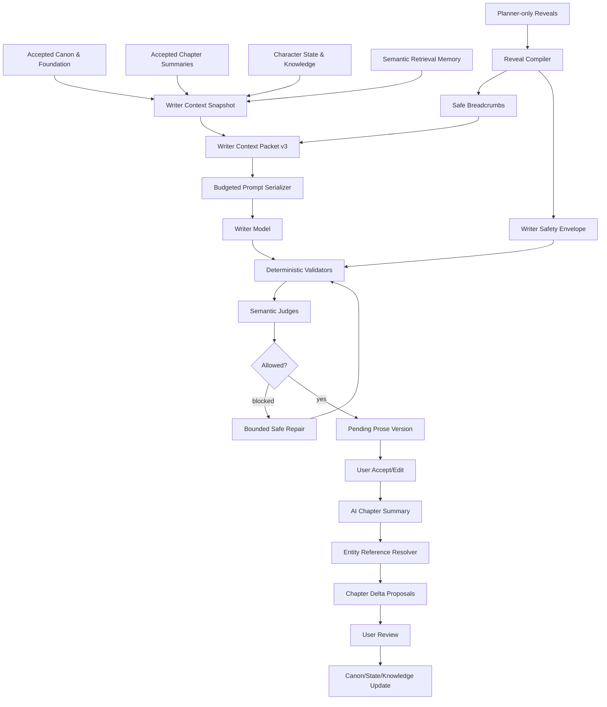

# Narraza Long-Fiction Reliability Hardening Implementation Plan

> **For agentic workers:** REQUIRED SUB-SKILL: Use `superpowers:subagent-driven-development` (recommended) or `superpowers:executing-plans` to implement this plan task-by-task. Steps use checkbox (`- [ ]`) syntax for tracking.

**Goal:** Menutup gap antara arsitektur Narraza yang sudah tersedia dan kemampuan nyata menghasilkan serial panjang yang konsisten, aman dari future leak, patuh beat, menjaga state/knowledge karakter, hemat konteks, serta dapat dibuktikan melalui acceptance run 30 bab.

**Architecture:** Pertahankan pipeline berlapis yang ada, tetapi pisahkan konteks yang aman untuk Writer dari data rahasia validator. Semua continuity data harus melewati kontrak terstruktur, serializer berbujet, validator bertingkat, proposal-first state update, dan release gate produksi. Perubahan dilakukan bertahap dengan compatibility untuk context packet lama dan tanpa silent fallback ke stub di live AI mode.

**Tech Stack:** TypeScript, Hono, React, Supabase/Postgres, pgvector, Cloudflare Worker dan Node runtime, OpenRouter, contract tests berbasis `tsx`, Playwright, PowerShell smoke scripts.

---

## 0. Status Dokumen dan Sumber Kebenaran

Dokumen ini adalah SSOT pelaksanaan perbaikan hasil audit terhadap:

- `docs/masalah-ai.md`
- `docs/09-validator-qa-and-auto-repair-system.md`
- `docs/25-problem-coverage-matrix.md`
- `docs/audit/13-live-e2e-test-and-ux-gap-report-2026-06-17.md`
- `docs/audit/16-narraza-recovery-final-report-2026-06-17.md`
- `docs/100-competitive-manuscript-teardown-and-gap-sprint-plan.md`
- source code dan database produksi yang diperiksa pada 20 Juni 2026.

Jika dokumen lama bertentangan dengan source code terkini, urutan sumber kebenaran adalah:

```text
1. Migration dan schema database yang benar-benar terpasang
2. Source code pada branch aktif
3. Contract/integration/live test terbaru
4. Dokumen audit terbaru
5. Dokumen visi atau sprint historis
```

Dokumen ini tidak menganggap keberadaan tabel atau interface sebagai bukti bahwa fitur sudah bekerja. Sebuah fitur dianggap selesai hanya jika:

```text
data dibuat dengan benar
→ dimuat oleh service yang benar
→ masuk ke consumer yang benar
→ ter-enforce
→ memiliki test negatif dan positif
→ lolos smoke runtime
```

---

## 1. Ringkasan Temuan yang Harus Ditutup

| Area | Kondisi saat ini | Risiko |
|---|---|---|
| Context Packet | Packet menyimpan canon, timeline, open loops, RAG, POV knowledge | Prompt prose tidak menyerialkan sebagian besar data tersebut |
| Reveal Gate | `planning_truth` dan future chapter disaring | Writer masih menerima label/phrase reveal terlarang melalui `forbiddenConcepts` |
| Character State | Tabel dan service tersedia | State tidak dimuat ke Writer Context |
| Character Knowledge | POV snapshot dan validator tersedia | Prompt tidak memberi knowledge aman; validator literal dan tidak memeriksa karakter non-POV |
| Chapter Delta | Proposal-first tersedia | AI summary menghasilkan nama, sementara delta membutuhkan stable entity ID |
| RAG | Embedding dan HNSW tersedia | Retrieval memilih chunk terbaru, bukan yang relevan secara semantic |
| Beat compliance | Beat contract tersedia | `mustInclude`, stop condition, dan scene boundary belum enforceable secara semantic |
| Style/Voice | Tone, tags, import metrics tersedia | Voice Lock, accepted-edit learning, dan Style Judge belum ada |
| Creator Mode | UI Advanced tersedia | Hanya jumlah bab yang memengaruhi request generator |
| Credit guard | Ledger/refund/estimate tersedia | Default daily cap 200 lebih kecil dari aksi v2 termurah yang memakai guard |
| Runtime produksi | Front half live | Prose pernah menembus Worker subrequest limit; Node/VPS belum menjadi jalur produksi utama |
| Acceptance | Contract tests banyak | Serial 20–30 bab belum pernah dibuktikan end-to-end |
| Marketing | Klaim ratusan/500+ bab | Belum didukung acceptance evidence |

---

## 2. Prinsip Desain Non-Negotiable

1. **AI bukan source of truth.** Output AI tetap proposal sampai diterima.
2. **Writer tidak menerima future truth.** Bukan hanya field `planning_truth`; label reveal eksplisit dan daftar forbidden truth juga tidak boleh dikirim.
3. **Validator boleh mengetahui lebih banyak daripada Writer.** Karena itu Writer Context dan Safety Envelope harus dipisah.
4. **Approved state dan current selected prose mengalahkan chat history.** Prompt dibangun dari state terstruktur dan versi prose aktif, bukan raw conversation panjang.
5. **RAG bukan canon.** Retrieval memory selalu `readOnly` dan `context_only`.
6. **User edit adalah data penting.** Edit tidak hanya menjadi versi teks baru; ia dapat menjadi feedback voice setelah persetujuan eksplisit atau acceptance signal.
7. **Simple by default.** Control surface penuh hanya muncul di Creator Advanced.
8. **No silent fallback.** Live AI failure menghasilkan error aman dan refund, bukan template cerita.
9. **Repair before regenerate.** Repair dibatasi jumlah retry dan token budget.
10. **Evidence before marketing.** Klaim skala hanya boleh dinaikkan setelah acceptance artifact tersedia.

---

## 3. Arsitektur Target



### 3.1 Dua artefak konteks

#### `WriterContextPacketV3`

Satu-satunya konteks yang boleh dikirim ke model Writer. Berisi:

- fondasi ringkas;
- canon facts terstruktur;
- karakter relevan dan state terakhir yang sudah diterima;
- knowledge aman per karakter relevan;
- approved prior summaries;
- past-only timeline;
- active open loops tanpa future payoff;
- safe breadcrumbs;
- semantic retrieval snippets;
- operational style rules;
- beat contract.

#### `WriterSafetyEnvelope`

Artefak server-only. Tidak boleh:

- dikirim ke model;
- dikembalikan ke browser;
- muncul dalam public preview;
- ditulis ke audit metadata mentah;
- masuk ke provider logs.

Berisi:

- future reveal fact IDs;
- forbidden truth phrases;
- reveal target chapter;
- unknown fact constraints per character;
- hard beat boundaries;
- validation policy/version.

---

## 4. Dependency Graph dan Urutan Eksekusi

```text
Phase 0  Baseline + Credit/Runtime Blocker
   ↓
Phase 1  Writer Context v3 + Safety Envelope
   ↓
Phase 2  Character State/Knowledge Lifecycle
   ↓
Phase 3  Semantic RAG
   ↓
Phase 4  Beat Compliance + Validator Pipeline
   ↓
Phase 5  Style Bible + Voice Lock
   ↓
Phase 6  Creator Advanced Control Surface
   ↓
Phase 7  Production Runtime + Observability
   ↓
Phase 8  30-Chapter Acceptance
   ↓
Phase 9  Marketing and Release Gate
```

Aturan:

- Jangan mulai Phase 5 sebelum Phase 1–4 lulus.
- Jangan mengklaim production ready sebelum Phase 7–8 lulus.
- Setiap task harus menjadi commit kecil yang bisa direvert.
- Agen tidak boleh merevert perubahan lokal milik agen/user lain.
- Saat eksekusi, gunakan worktree terisolasi melalui `superpowers:using-git-worktrees`.

### 4.1 Registry command test baru

Setiap task yang membuat test baru di `apps/api/scripts/` wajib:

1. menambahkan command yang sesuai ke `apps/api/package.json`;
2. menjalankan command tersebut sebelum commit;
3. memasukkan `apps/api/package.json` ke command `git add` pada task itu, walaupun file tersebut tidak diulang pada daftar **Files** atau contoh commit;
4. tidak mengganti nama command/path tanpa memperbarui tabel ini dan semua pemanggilnya.

Registry kanonik:

```json
{
  "test:long-fiction-baseline": "tsx scripts/long-fiction-hardening-baseline.test.mts",
  "test:ai-rate-limit-v2": "tsx scripts/ai-rate-limit-v2-contracts.test.mts",
  "test:prose-orchestration-budget": "tsx scripts/prose-orchestration-budget.test.mts",
  "test:writer-context-v3": "tsx scripts/writer-context-v3-contracts.test.mts",
  "test:writer-safety-envelope": "tsx scripts/writer-safety-envelope-contracts.test.mts",
  "test:writer-context-serializer": "tsx scripts/writer-context-serializer.test.mts",
  "test:preceding-prose-context": "tsx scripts/preceding-prose-context.test.mts",
  "test:character-state-packet": "tsx scripts/character-state-packet.test.mts",
  "test:character-knowledge-semantics": "tsx scripts/character-knowledge-semantics.test.mts",
  "test:continuity-entity-resolution": "tsx scripts/continuity-entity-resolution.test.mts",
  "test:character-state-promotion": "tsx scripts/character-state-promotion.test.mts",
  "test:semantic-retrieval": "tsx scripts/semantic-retrieval-contracts.test.mts",
  "test:retrieval-query": "tsx scripts/retrieval-query.test.mts",
  "test:output-validator-pipeline": "tsx scripts/output-validator-pipeline.test.mts",
  "test:semantic-output-judge": "tsx scripts/semantic-output-judge.test.mts",
  "test:model-routing-v2": "tsx scripts/model-routing-v2-contracts.test.mts",
  "test:story-safe-repair": "tsx scripts/story-safe-repair.test.mts",
  "test:style-profile": "tsx scripts/style-profile-contracts.test.mts",
  "test:import-style-profile": "tsx scripts/import-style-profile.test.mts",
  "test:style-feedback": "tsx scripts/style-feedback.test.mts",
  "test:voice-lock": "tsx scripts/voice-lock.test.mts",
  "test:advanced-outline-controls": "tsx scripts/advanced-outline-controls.test.mts",
  "test:continuity-routes": "tsx scripts/continuity-routes-contracts.test.mts",
  "test:generation-observability": "tsx scripts/generation-observability.test.mts",
  "test:long-serial-acceptance": "tsx scripts/long-serial-acceptance-contracts.test.mts",
  "test:marketing-claims": "tsx scripts/marketing-claims-contract.test.mts"
}
```

Command yang sudah ada seperti `test:credit-v2`, `test:character-knowledge-validator`, dan sprint regressions tidak boleh diduplikasi atau diubah hanya untuk plan ini.

---

# Phase 0 — Baseline, Credit Guard, dan Runtime Blocker

## Task 0.1 — Bekukan baseline temuan sebagai regression contracts

**Files:**

- Create: `apps/api/scripts/long-fiction-hardening-baseline.test.mts`
- Modify: `apps/api/package.json`
- Modify: `package.json`

### Kontrak yang harus dibuktikan test

- Prompt prose saat baseline belum menyertakan `recentTimeline`, `speechRules`, atau `povKnowledge`.
- Default daily cap baseline lebih kecil dari biaya prose termurah.
- Advanced control baseline hanya mengirim `targetChapterCount`.
- Retrieval baseline tidak melakukan similarity query.

Test ini sengaja memotret kondisi awal. Setelah task terkait diperbaiki, assertion harus diperbarui menjadi perilaku target, bukan dihapus.

- [ ] **Step 1: Tambahkan script test baseline**

Tambahkan script:

```json
{
  "test:long-fiction-baseline": "tsx scripts/long-fiction-hardening-baseline.test.mts"
}
```

- [ ] **Step 2: Tulis assertion source-contract**

Gunakan `readFileSync` untuk memastikan baseline terdeteksi tanpa memanggil provider atau database.

- [ ] **Step 3: Jalankan test**

Run:

```powershell
npm run test:long-fiction-baseline -w @vibenovel/api
```

Expected: PASS dan mencetak setiap gap baseline yang sedang dilindungi.

- [ ] **Step 4: Commit**

```powershell
git add apps/api/scripts/long-fiction-hardening-baseline.test.mts apps/api/package.json package.json
git commit -m "test: capture long fiction hardening baseline"
```

---

## Task 0.2 — Selaraskan AI daily cap dengan Credit System v2

**Files:**

- Modify: `apps/api/src/services/ai-credit-policy.ts`
- Modify: `apps/api/src/services/ai-rate-limit.ts`
- Create: `apps/api/scripts/ai-rate-limit-v2-contracts.test.mts`
- Modify: `apps/api/package.json`
- Modify: `docs/narraza-final-credit-system-agent-spec.md`

### Keputusan desain

`ai_usage_daily_caps` adalah explicit per-user/project override. Jika row tidak ada, gunakan cap v2 sebesar `100_000` kredit per project per UTC day.

Alasan:

- harus lebih besar dari single-action maksimum 7.500;
- tetap memberi abuse ceiling;
- sekitar 13 aksi `terbaik` atau 66 aksi `seimbang`;
- tidak memblokir aksi pertama user.

Tambahkan invariant:

```ts
export const DEFAULT_DAILY_DEBIT_CAP_V2 = 100_000;

export function getMaximumConfiguredCreditCost(): number {
  return Math.max(
    ...Object.values(CREDIT_COST_TABLE).flatMap((byMode) =>
      Object.values(byMode).filter((value): value is number => typeof value === "number"),
    ),
  );
}
```

`DEFAULT_DAILY_DEBIT_CAP_V2` wajib lebih besar atau sama dengan maksimum configured action cost.

- [ ] **Step 1: Tulis failing test**

Test:

```ts
assert.ok(
  DEFAULT_DAILY_DEBIT_CAP_V2 >= getMaximumConfiguredCreditCost(),
  "default daily cap must allow at least one highest-cost action",
);

assert.doesNotThrow(() =>
  assertAiGenerationAllowed({
    dailyDebitedCredits: 0,
    dailyDebitCap: DEFAULT_DAILY_DEBIT_CAP_V2,
    recentFailureCount: 0,
    cooldownFailureThreshold: 3,
    requestedCreditCost: 7_500,
  }),
);
```

- [ ] **Step 2: Jalankan dan pastikan gagal pada cap 200**

Run:

```powershell
npm run test:ai-rate-limit-v2 -w @vibenovel/api
```

Expected: FAIL karena default cap lama tidak memenuhi invariant.

- [ ] **Step 3: Implementasikan cap v2 dan export helper**

Jangan mengubah row override yang sudah ada. Row DB tetap menang atas default.

- [ ] **Step 4: Tambahkan guard pada seluruh paid generation**

Pastikan service berikut memanggil `assertAiGenerationAllowedForOwner` sebelum debit:

- `intake.ts`
- `concept.ts`
- `foundation-proposal.ts`
- `outline-generator.ts`
- `asisten-narra-foundation-patch.ts`
- service yang sudah memakai guard tetap dipertahankan.

- [ ] **Step 5: Jalankan tests**

```powershell
npm run test:ai-rate-limit-v2 -w @vibenovel/api
npm run test:credit-v2
npm run test:api:contracts
```

Expected: seluruh command PASS.

- [ ] **Step 6: Commit**

```powershell
git add apps/api/src/services/ai-credit-policy.ts apps/api/src/services/ai-rate-limit.ts apps/api/scripts/ai-rate-limit-v2-contracts.test.mts apps/api/package.json docs/narraza-final-credit-system-agent-spec.md
git commit -m "fix: align AI daily cap with credit v2"
```

---

## Task 0.3 — Kurangi duplicate reads pada prose orchestration

**Files:**

- Modify: `apps/api/src/services/context-packet-builder.ts`
- Modify: `apps/api/src/services/prose-beat-generation.ts`
- Modify: `apps/api/src/services/prose-rewrite-generation.ts`
- Create: `apps/api/scripts/prose-orchestration-budget.test.mts`

### Target interface

Tambahkan internal result:

```ts
export interface BuiltWriterContextArtifact {
  packetLogId: string;
  packet: WriterContextPacket;
  preview: WriterContextPacketPreview;
  safety: ContextPacketSafetyMeta;
}
```

Public route tetap menerima response aman tanpa `packet`.

Service prose menggunakan `packet` dari hasil build langsung dan tidak:

- membaca kembali `context_packet_logs`;
- memanggil `listFactsForOwner` kedua kali;
- membangun packet dua kali.

- [ ] **Step 1: Tulis source-contract test**

Test memastikan `prose-beat-generation.ts` tidak lagi memanggil `loadWriterPacketForLogForOwner`.

- [ ] **Step 2: Refactor builder menjadi internal/public mapper**

Pisahkan:

```ts
buildContextPacketArtifactForOwner(...)
toPublicContextPacketResult(artifact)
```

- [ ] **Step 3: Gunakan structured canon facts dari packet untuk validation**

Task 1.1 akan mengubah facts menjadi terstruktur. Sampai task tersebut selesai, pertahankan compatibility helper.

- [ ] **Step 4: Jalankan tests**

```powershell
npm run test:prose-orchestration-budget -w @vibenovel/api
npm run test:write-room-contracts -w @vibenovel/api
npm run test:api:contracts
```

- [ ] **Step 5: Commit**

```powershell
git add apps/api/src/services/context-packet-builder.ts apps/api/src/services/prose-beat-generation.ts apps/api/src/services/prose-rewrite-generation.ts apps/api/scripts/prose-orchestration-budget.test.mts
git commit -m "refactor: reuse built writer context in prose flows"
```

---

# Phase 1 — Writer Context Packet v3 dan Safety Envelope

## Task 1.1 — Definisikan kontrak packet v3

**Files:**

- Modify: `packages/shared/src/domain.ts`
- Modify: `packages/shared/src/enums.ts`
- Modify: `packages/shared/src/index.ts`
- Create: `apps/api/src/services/writer-context-normalizer.ts`
- Create: `apps/api/scripts/writer-context-v3-contracts.test.mts`

### Tipe target

```ts
export interface WriterCanonFactSummary {
  id: string;
  text: string;
  category: string;
  importance: string;
}

export interface WriterCharacterStateSummary {
  chapterNumber: number;
  emotionalState: string | null;
  physicalState: string | null;
  currentGoal: string | null;
  locationLabel: string | null;
}

export interface WriterCharacterSummaryV3 {
  id: string;
  name: string;
  roleLabel: string;
  descriptionSummary: string;
  state: WriterCharacterStateSummary | null;
}

export interface WriterKnowledgeSummary {
  characterId: string;
  characterName: string;
  knownFacts: PovKnowledgeFactSummary[];
  suspectedFacts: PovKnowledgeFactSummary[];
  partialFacts: PovKnowledgeFactSummary[];
  falseBeliefs: PovKnowledgeFactSummary[];
}

export interface WriterPrecedingProseTail {
  text: string;
  sourceChapterNumber: number;
  sourceBeatId: string;
  sourceVersionId: string;
  sourceType: "same_chapter_previous_beat" | "previous_chapter_last_beat";
}
```

`WriterContextPacketV3` harus menggunakan:

```ts
canon.facts: WriterCanonFactSummary[];
canon.characters: WriterCharacterSummaryV3[];
continuity.knowledgeByCharacter: WriterKnowledgeSummary[];
continuity.precedingProseTail: WriterPrecedingProseTail | null;
```

### Compatibility

Context log lama dapat berisi `canon.facts: string[]`. Normalizer harus mengubahnya menjadi:

```ts
{
  id: `legacy:${index}`,
  text,
  category: "legacy",
  importance: "unknown"
}
```

Packet v1/v2 yang belum mempunyai `continuity.precedingProseTail` harus
dinormalisasi menjadi `null`; jangan mencoba mengambil prose saat membaca log lama.

- [ ] **Step 1: Tulis failing contract tests untuk v2 dan v3**
- [ ] **Step 2: Tambahkan builder version `context_packet_v3`**
- [ ] **Step 3: Implementasikan normalizer**
- [ ] **Step 4: Jalankan shared build dan contracts**

```powershell
npm run build -w @vibenovel/shared
npm run test:writer-context-v3 -w @vibenovel/api
```

- [ ] **Step 5: Commit**

```powershell
git add packages/shared/src/domain.ts packages/shared/src/enums.ts packages/shared/src/index.ts apps/api/src/services/writer-context-normalizer.ts apps/api/scripts/writer-context-v3-contracts.test.mts
git commit -m "feat: define writer context packet v3"
```

---

## Task 1.2 — Pisahkan `WriterSafetyEnvelope`

**Files:**

- Create: `supabase/migrations/00022_writer_context_v3_safety_envelope.sql`
- Create: `apps/api/src/services/writer-safety-envelope.ts`
- Modify: `apps/api/src/services/context-packet-builder.ts`
- Modify: `apps/api/src/services/context-packet-safety.ts`
- Modify: `packages/shared/src/domain.ts`
- Create: `apps/api/scripts/writer-safety-envelope-contracts.test.mts`

### Migration

Tambahkan kolom:

```sql
ALTER TABLE public.context_packet_logs
  ADD COLUMN IF NOT EXISTS safety_envelope_json jsonb NOT NULL DEFAULT '{}'::jsonb,
  ADD COLUMN IF NOT EXISTS safety_version text NOT NULL DEFAULT 'writer_safety_v1';
```

Kolom ini tidak boleh dimasukkan oleh mapper response publik.

### Tipe server-only

```ts
export interface WriterSafetyEnvelope {
  version: "writer_safety_v1";
  projectId: string;
  chapterOutlineId: string;
  chapterNumber: number;
  beatId: string | null;
  futureRevealFactIds: string[];
  forbiddenRevealPhrases: string[];
  unknownFactConstraints: Array<{
    characterId: string;
    factId: string;
    factText: string;
  }>;
  hardBeatConstraints: {
    mustInclude: string[];
    mustNotInclude: string[];
    stopCondition: string | null;
  };
}
```

### Perubahan penting

- Hapus `forbiddenReveals` dan `forbiddenConcepts` dari payload yang dikirim ke Writer.
- Writer hanya menerima `allowedBreadcrumbs` dan `allowedReveals`.
- Public preview hanya menampilkan jumlah rahasia yang ditahan.
- Validator mengambil forbidden phrases dari Safety Envelope.
- Ubah pemeriksaan forbidden key menjadi recursive key walker. Jangan menjalankan
  regex `model`, `provider`, atau `token` terhadap seluruh JSON karena nilai prosa
  masa lalu dapat memakai kata-kata tersebut secara sah.

- [ ] **Step 1: Tulis failing tests**

Assertions:

```ts
assert.equal(JSON.stringify(writerPacket).includes("planningTruth"), false);
assert.equal(JSON.stringify(writerPacket).includes("forbiddenRevealPhrases"), false);
assert.equal(JSON.stringify(publicPreview).includes("forbiddenRevealPhrases"), false);
assert.ok(safetyEnvelope.forbiddenRevealPhrases.length > 0);
assert.doesNotThrow(() => assertWriterPacketSafe(packetWithNaturalWordModel));
assert.throws(() => assertWriterPacketSafe(packetWithForbiddenModelKey));
```

- [ ] **Step 2: Tambahkan migration**
- [ ] **Step 3: Implementasikan compiler envelope**
- [ ] **Step 4: Update packet persistence**
- [ ] **Step 5: Update API mapper agar envelope tidak bocor**
- [ ] **Step 6: Jalankan tests**

```powershell
npm run test:writer-safety-envelope -w @vibenovel/api
npm run test:sprint14-safety -w @vibenovel/api
npm run test:sprint16-character-continuity -w @vibenovel/api
```

- [ ] **Step 7: Commit**

```powershell
git add supabase/migrations/00022_writer_context_v3_safety_envelope.sql packages/shared/src/domain.ts apps/api/src/services/writer-safety-envelope.ts apps/api/src/services/context-packet-builder.ts apps/api/src/services/context-packet-safety.ts apps/api/scripts/writer-safety-envelope-contracts.test.mts
git commit -m "feat: separate writer context from safety envelope"
```

---

## Task 1.3 — Buat serializer konteks berbujet

**Files:**

- Create: `apps/api/src/services/writer-context-serializer.ts`
- Modify: `apps/api/src/services/prose-generation-prompt.ts`
- Modify: `apps/api/src/services/prose-rewrite-prompt.ts`
- Modify: `apps/api/src/env.ts`
- Modify: `.dev.vars.example`
- Modify: `.env.staging.example`
- Modify: `.env.production.example`
- Create: `apps/api/scripts/writer-context-serializer.test.mts`

### Budget

Gunakan character budgets deterministik dengan dua profil eksplisit. Angka adalah
batas karakter hasil section, bukan byte dan bukan token:

```ts
export const WRITER_CONTEXT_PROFILE_BUDGETS = {
  conservative: {
    foundation: 600,
    currentChapterAndBeat: 2_400,
    canonFacts: 3_000,
    charactersAndState: 3_000,
    knowledge: 2_500,
    speechRules: 1_000,
    priorSummaries: 1_200,
    precedingProseTail: 900,
    timeline: 500,
    openLoops: 800,
    breadcrumbs: 500,
    retrievalMemory: 600,
    styleRules: 800,
  },
  full: {
    foundation: 1_800,
    currentChapterAndBeat: 2_400,
    canonFacts: 4_000,
    charactersAndState: 4_000,
    knowledge: 3_500,
    speechRules: 2_000,
    priorSummaries: 5_000,
    precedingProseTail: 900,
    timeline: 2_500,
    openLoops: 2_500,
    breadcrumbs: 1_500,
    retrievalMemory: 3_000,
    styleRules: 2_000,
  },
} as const;

export const WRITER_CONTEXT_TOTAL_CHAR_CAP = {
  conservative: 17_800,
  full: 35_100,
} as const;
```

Nilai `.env.production` saat plan ini dibuat mengarahkan ketiga tier prose ke
`google/gemma-4-31b-it:free`. Karena itu:

- `WRITER_CONTEXT_BUDGET_PROFILE` default ke `conservative`;
- nilai valid hanya `conservative` atau `full`;
- unset, blank, atau invalid selalu fallback ke `conservative` dan mencatat warning
  tanpa mencetak nilai environment mentah;
- perubahan environment membutuhkan config rollout dan restart/redeploy runtime;
- `full` adalah explicit operator opt-in, bukan otomatis aktif hanya karena Node
  atau model `TERBAIK` tersedia;
- karena profile saat ini global, `full` hanya boleh aktif jika **setiap** prose
  quality mode yang dapat dipilih user (`hemat`, `seimbang`, `terbaik`) beserta
  fallback efektifnya telah lolos activation evidence; satu tier yang masih
  resolve ke model gratis menahan seluruh sistem pada `conservative`;
- aktivasi `full` baru boleh setelah Task 7.2 merekam telemetry dan Task 8.2
  membuktikan five-chapter smoke tanpa provider context-length error, timeout
  regression, atau p95 prompt yang melampaui budget;
- jika kapasitas context model yang benar-benar resolved tidak diketahui, tetap
  gunakan `conservative`.

Serializer wajib memotong per item secara deterministik lalu memastikan total
seluruh section tidak melampaui `WRITER_CONTEXT_TOTAL_CHAR_CAP[profile]`. Label
section ikut dihitung. System prompt, rewrite source prose, dan user instruction
dilaporkan terpisah sebagai `serializedPromptChars`; jangan menyamakan context
section chars dengan total provider input.

### Urutan prioritas

Jika perlu truncation:

```text
1. Current beat/chapter
2. Hard canon facts
3. Relevant character states
4. Knowledge constraints
5. Speech rules
6. Recent approved summaries
7. Preceding current prose tail
8. Active loops
9. Timeline
10. Breadcrumbs
11. Retrieval memory
12. General foundation prose
```

### Prompt sections wajib

```text
[CURRENT BEAT CONTRACT]
[CANON FACTS]
[RELEVANT CHARACTERS AND CURRENT STATE]
[CHARACTER KNOWLEDGE]
[SPEECH RULES]
[RECENT APPROVED CHAPTER HISTORY]
[PRECEDING CURRENT PROSE TAIL]
[PAST TIMELINE]
[ACTIVE OPEN LOOPS]
[ALLOWED BREADCRUMBS]
[RETRIEVED DRAFT MEMORY — CONTEXT ONLY]
[STYLE RULES]
```

- [ ] **Step 1: Tulis failing tests untuk kedua tabel budget**

Assertions minimum:

```ts
assert.equal(sumBudgets("conservative"), 17_800);
assert.equal(sumBudgets("full"), 35_100);
assert.ok(serializeContext(largePacket, "conservative").text.length <= 17_800);
assert.ok(serializeContext(largePacket, "full").text.length <= 35_100);
```

- [ ] **Step 2: Tulis failing tests untuk resolver profile**

`undefined`, blank, dan unknown value harus menghasilkan `conservative`; hanya
string `full` yang menghasilkan `full`.

- [ ] **Step 3: Implement serializer dan stable truncation**
- [ ] **Step 4: Implement env resolver dan perbarui seluruh example env**
- [ ] **Step 5: Ganti prompt generation agar memakai serializer**
- [ ] **Step 6: Pastikan prose rewrite memakai serializer yang sama**
- [ ] **Step 7: Jalankan tests**

```powershell
npm run test:writer-context-serializer -w @vibenovel/api
npm run test:prose-safe-repair-loop -w @vibenovel/api
npm run test:generation-contracts -w @vibenovel/api
```

- [ ] **Step 8: Commit**

```powershell
git add apps/api/src/services/writer-context-serializer.ts apps/api/src/services/prose-generation-prompt.ts apps/api/src/services/prose-rewrite-prompt.ts apps/api/src/env.ts .dev.vars.example .env.staging.example .env.production.example apps/api/scripts/writer-context-serializer.test.mts apps/api/package.json
git commit -m "feat: serialize writer context with calibrated budgets"
```

---

## Task 1.4 — Tambahkan preceding current prose context untuk Continue

Keluhan #5 di `docs/masalah-ai.md` menyatakan bahwa Continue sering tidak membaca
tulisan terakhir. Ringkasan bab tidak cukup untuk menyambungkan kalimat, ritme,
blocking, dan nada adegan.

**Files:**

- Create: `apps/api/src/services/preceding-prose-context.ts`
- Create: `apps/api/src/services/prose-text-safety.ts`
- Modify: `apps/api/src/services/write-snapshot.ts`
- Modify: `apps/api/src/services/context-packet-builder.ts`
- Modify: `apps/api/src/services/context-packet-safety.ts`
- Modify: `apps/api/src/services/prose-draft.ts`
- Modify: `apps/api/src/services/writer-context-serializer.ts`
- Create: `apps/api/scripts/preceding-prose-context.test.mts`
- Modify: `apps/api/package.json`

### Semantik sumber

Schema saat ini tidak memiliki status `accepted` atau `rejected` pada
`chapter_prose_versions`. Source of truth yang tersedia adalah versi pilihan aktif
dengan `is_current = true`. Karena itu plan ini menggunakan istilah **current
selected prose**, bukan accepted prose.

- Current version boleh berasal dari `user_edited`, `ai_generated`, atau
  `stub_deterministic`.
- Versi `is_current = false` tidak pernah masuk packet.
- Task ini tidak boleh mengklaim dapat membedakan accepted dan rejected draft.
- Jika produk kelak membutuhkan approval prose eksplisit, itu memerlukan migration
  dan workflow tersendiri di luar task ini.

### Boundary loader

Jangan mengimpor `prose-draft.ts` dari `write-snapshot.ts`. Saat ini
`prose-draft.ts` sudah mengimpor `write-snapshot.ts`, sehingga arah tersebut
membuat circular dependency.

`preceding-prose-context.ts` harus menjadi leaf data-loader yang hanya bergantung
pada `env`, Supabase client, mapper/type ringan, dan error helper.

Target API:

```ts
export interface LoadPrecedingProseTailInput {
  projectId: string;
  currentChapterOutlineId: string;
  previousChapterOutlineId: string | null;
  previousChapterNumber: number | null;
  currentBeatId: string | null;
  currentBeatNumber: number | null;
  currentChapterNumber: number;
}

export async function loadPrecedingCurrentProseTail(
  bindings: AppBindings,
  input: LoadPrecedingProseTailInput,
): Promise<WriterPrecedingProseTail | null>;
```

Gunakan satu PostgREST request terhadap `chapter_prose_versions` dengan embedded
`chapter_beats!inner(...)`, dibatasi `project_id`, `is_current=true`, serta chapter
current/previous yang relevan. Ini tetap menambah satu subrequest total; menaruhnya
di `Promise.all` hanya menghindari serial latency, bukan menghapus subrequest.
Loader hanya dipanggil setelah `loadWriteContextSnapshot` membuktikan ownership
project. `previousChapterOutlineId/Number` berasal dari chapter row dengan nomor
terbesar yang masih lebih kecil daripada current chapter.

Selection:

1. Jika current beat null, return null.
2. Jika `currentBeatNumber > 1`, pilih tepat beat `currentBeatNumber - 1` pada
   chapter yang sama. Jika beat tersebut belum mempunyai current version, return
   null; jangan melompati ke beat yang lebih lama.
3. Jika `currentBeatNumber === 1`, pilih beat bernomor terbesar pada previous
   chapter yang mempunyai current version.
4. Ambil 900 Unicode code points terakhir dengan `Array.from(text).slice(-900)`;
   jangan memotong UTF-16 surrogate pair.

### Packet, prompt, dan redaction

- Isi `snapshot.precedingProseTail`, lalu map ke
  `packet.continuity.precedingProseTail`.
- Serializer hanya merender bila non-null:

```text
[PRECEDING CURRENT PROSE TAIL]
Continue smoothly from this prior text. Preserve continuity, but do not repeat it verbatim:
"..."
```

- Pada rewrite, source prose yang sedang direvisi dan explicit user instruction
  tetap mempunyai prioritas lebih tinggi daripada preceding tail.
- `WriterContextPacketPreview`, API preview, admin aggregate, dan audit metadata
  tidak boleh mengandung raw tail.
- Packet log boleh menyimpan tail karena merupakan past prose, tetapi tetap tunduk
  pada `PACKET_MAX_BYTES` dan future-content checks.

### Safety correction

`context-packet-safety.ts` saat ini memeriksa beberapa regex pada seluruh serialized
JSON. Ubah menjadi recursive forbidden-key walker agar key `model`, `provider`,
`token`, `planning_truth`, dan sejenisnya tetap ditolak tanpa menolak nilai prosa
alami seperti “ia bekerja sebagai model”.

Di `prose-draft.ts`, pindahkan pemeriksaan prose ke `prose-text-safety.ts`:

- izinkan kata alami `model`, `provider`, dan `token`;
- tolak structured internal dump berdasarkan key/signature seperti
  `"planning_truth"`, `"packet_json"`, `"full_prompt"`, atau kombinasi key packet;
- jangan memakai blacklist kata umum terhadap seluruh isi prosa.

- [ ] **Step 1: Tulis failing selection tests**

Cover same-chapter predecessor, first beat previous-chapter fallback, missing
immediate predecessor, non-current exclusion, no previous chapter, dan Unicode
tail 900 code points.

- [ ] **Step 2: Tulis failing safety/redaction tests**

Pastikan natural prose yang mengandung “model”, “provider”, dan “token” lulus;
structured packet dump gagal; public preview dan safe metadata tidak memuat tail.

- [ ] **Step 3: Implement leaf loader tanpa circular dependency**
- [ ] **Step 4: Muat loader bersama snapshot queries dan attach ke packet**
- [ ] **Step 5: Render section melalui serializer**
- [ ] **Step 6: Perbaiki key-based packet/prose safety**
- [ ] **Step 7: Jalankan tests**

```powershell
npm run test:preceding-prose-context -w @vibenovel/api
npm run test:writer-context-serializer -w @vibenovel/api
npm run test:sprint14-safety -w @vibenovel/api
npm run test:generation-contracts -w @vibenovel/api
```

- [ ] **Step 8: Commit**

```powershell
git add apps/api/src/services/preceding-prose-context.ts apps/api/src/services/prose-text-safety.ts apps/api/src/services/write-snapshot.ts apps/api/src/services/context-packet-builder.ts apps/api/src/services/context-packet-safety.ts apps/api/src/services/prose-draft.ts apps/api/src/services/writer-context-serializer.ts apps/api/scripts/preceding-prose-context.test.mts apps/api/package.json
git commit -m "feat: continue from current preceding prose safely"
```

---

# Phase 2 — Character State dan Knowledge Lifecycle

## Task 2.1 — Muat character state snapshot ke Writer Context

**Files:**

- Modify: `apps/api/src/services/write-snapshot.ts`
- Modify: `apps/api/src/services/context-packet-builder.ts`
- Modify: `apps/api/src/services/character-state.ts`
- Create: `apps/api/src/services/relevant-character-selector.ts`
- Create: `apps/api/scripts/character-state-packet.test.mts`

### Selection policy

Maksimum 8 karakter:

1. POV character;
2. protagonist;
3. karakter yang namanya muncul di beat summary/direction/mustInclude;
4. karakter yang terhubung oleh speech rule dengan karakter terpilih;
5. remaining main characters sampai cap.

Untuk setiap karakter, ambil state terakhir dengan:

```sql
chapter_number <= current_chapter_number
ORDER BY chapter_number DESC
LIMIT 1
```

- [ ] **Step 1: Tulis pure tests untuk relevant character selection**
- [ ] **Step 2: Tambahkan batched state snapshot loader**

Jangan melakukan satu query per karakter. Gunakan satu query untuk selected IDs lalu pilih latest row per character di service.

- [ ] **Step 3: Attach state ke packet v3**
- [ ] **Step 4: Tambahkan prompt assertion**
- [ ] **Step 5: Jalankan tests**

```powershell
npm run test:character-state-packet -w @vibenovel/api
npm run test:sprint16-character-continuity -w @vibenovel/api
```

- [ ] **Step 6: Commit**

```powershell
git add apps/api/src/services/write-snapshot.ts apps/api/src/services/context-packet-builder.ts apps/api/src/services/character-state.ts apps/api/src/services/relevant-character-selector.ts apps/api/scripts/character-state-packet.test.mts
git commit -m "feat: include accepted character state in writer context"
```

---

## Task 2.2 — Perbaiki semantics knowledge

**Files:**

- Modify: `apps/api/src/services/character-knowledge.ts`
- Modify: `apps/api/src/services/character-knowledge-validator.ts`
- Modify: `apps/api/src/services/writer-safety-envelope.ts`
- Create: `apps/api/scripts/character-knowledge-semantics.test.mts`

### Aturan

- `knows`: boleh dinyatakan sebagai fakta.
- `partially_knows`: hanya boleh dinyatakan sebagai informasi parsial.
- `suspects`: tidak boleh dinyatakan sebagai kepastian.
- `misbelieves`: harus diperlakukan sebagai keyakinan salah karakter, bukan canon known fact.
- `unknown`: tidak masuk Writer Context sebagai text; masuk Safety Envelope.

Jangan lagi memasukkan `suspects`, `partial`, dan `falseBeliefs` ke set known IDs.

### Validator target

```ts
export interface CharacterKnowledgeConstraint {
  characterId: string;
  factId: string;
  factText: string;
  allowedMode: "certain" | "partial" | "suspicion" | "false_belief" | "forbidden";
}
```

- [ ] **Step 1: Tulis failing tests untuk lima status**
- [ ] **Step 2: Implementasikan constraint compiler**
- [ ] **Step 3: Update deterministic validator**
- [ ] **Step 4: Jalankan tests**

```powershell
npm run test:character-knowledge-semantics -w @vibenovel/api
npm run test:character-knowledge-validator -w @vibenovel/api
```

- [ ] **Step 5: Commit**

```powershell
git add apps/api/src/services/character-knowledge.ts apps/api/src/services/character-knowledge-validator.ts apps/api/src/services/writer-safety-envelope.ts apps/api/scripts/character-knowledge-semantics.test.mts
git commit -m "fix: enforce character knowledge semantics"
```

---

## Task 2.3 — Gunakan stable references pada AI summary

**Files:**

- Create: `apps/api/src/services/continuity-entity-registry.ts`
- Modify: `apps/api/src/services/chapter-summary-ai.ts`
- Modify: `apps/api/src/services/chapter-summary-schema.ts`
- Modify: `apps/api/src/services/chapter-delta-extractor.ts`
- Create: `apps/api/scripts/continuity-entity-resolution.test.mts`

### Registry

Jangan meminta model mengembalikan raw UUID. Buat reference stabil:

```ts
{
  characters: [
    { ref: "C1", id: "uuid", name: "Nadira" }
  ],
  facts: [
    { ref: "F1", id: "uuid", text: "..." }
  ],
  openLoops: [
    { ref: "L1", id: "uuid", question: "..." }
  ],
  reveals: [
    { ref: "R1", id: "uuid", title: "safe title" }
  ]
}
```

Schema output baru:

```ts
characterStateChanges: Array<{
  characterRef: string;
  emotionalState: string | null;
  physicalState: string | null;
  currentGoal: string | null;
  evidence: string;
}>;

characterKnowledgeChanges: Array<{
  characterRef: string;
  factRef: string;
  knowledgeStatus: CharacterKnowledgeStatus;
  evidence: string;
}>;
```

Unknown refs harus ditolak atau menjadi continuity warning, bukan ditebak berdasarkan nama.

- [ ] **Step 1: Tulis registry resolver tests**
- [ ] **Step 2: Update summary prompt**
- [ ] **Step 3: Update schema parser**
- [ ] **Step 4: Persist related IDs pada summary items**
- [ ] **Step 5: Update delta extractor agar proposal terstruktur**
- [ ] **Step 6: Jalankan tests**

```powershell
npm run test:continuity-entity-resolution -w @vibenovel/api
npm run test:sprint16-character-continuity -w @vibenovel/api
npm run test:sprint17-timeline-miniarc -w @vibenovel/api
```

- [ ] **Step 7: Commit**

```powershell
git add apps/api/src/services/continuity-entity-registry.ts apps/api/src/services/chapter-summary-ai.ts apps/api/src/services/chapter-summary-schema.ts apps/api/src/services/chapter-delta-extractor.ts apps/api/scripts/continuity-entity-resolution.test.mts
git commit -m "feat: resolve continuity updates with stable entity refs"
```

---

## Task 2.4 — Perbaiki proposal character state

**Files:**

- Modify: `apps/api/src/services/chapter-delta-extractor.ts`
- Modify: `apps/api/src/services/proposal-canon-promotion.ts`
- Modify: `apps/web/src/components/summary/SummaryProposalReviewPanel.tsx`
- Create: `apps/api/scripts/character-state-promotion.test.mts`

Hapus perilaku:

```ts
currentGoal: stateSummary
```

Proposal harus membawa field terpisah:

```ts
{
  characterId,
  chapterNumber,
  emotionalState,
  physicalState,
  currentGoal,
  evidence,
}
```

Review UI harus menampilkan before/after per field.

- [ ] **Step 1: Tulis failing promotion tests**
- [ ] **Step 2: Update proposal draft**
- [ ] **Step 3: Update preflight promotion**
- [ ] **Step 4: Update UI review labels**
- [ ] **Step 5: Jalankan tests dan typecheck**

```powershell
npm run test:character-state-promotion -w @vibenovel/api
npm run typecheck
```

- [ ] **Step 6: Commit**

```powershell
git add apps/api/src/services/chapter-delta-extractor.ts apps/api/src/services/proposal-canon-promotion.ts apps/web/src/components/summary/SummaryProposalReviewPanel.tsx apps/api/scripts/character-state-promotion.test.mts
git commit -m "fix: promote structured character state changes"
```

---

# Phase 3 — Semantic RAG

## Task 3.1 — Tambahkan similarity RPC

**Files:**

- Create: `supabase/migrations/00023_semantic_prose_retrieval.sql`
- Create: `apps/api/src/services/import/semantic-retrieval.ts`
- Create: `apps/api/scripts/semantic-retrieval-contracts.test.mts`

### SQL function

```sql
CREATE OR REPLACE FUNCTION public.match_prose_embeddings(
  p_owner_id uuid,
  p_project_id uuid,
  p_query_embedding vector(1536),
  p_match_count integer DEFAULT 5,
  p_min_similarity double precision DEFAULT 0.70
)
RETURNS TABLE (
  source_ref text,
  chunk_text text,
  similarity double precision,
  metadata jsonb
)
LANGUAGE sql
STABLE
SECURITY DEFINER
SET search_path = public, extensions
AS $$
  SELECT
    pe.source_ref,
    pe.chunk_text,
    1 - (pe.embedding <=> p_query_embedding) AS similarity,
    pe.metadata
  FROM public.prose_embeddings pe
  WHERE pe.owner_id = p_owner_id
    AND pe.project_id = p_project_id
    AND pe.embedding IS NOT NULL
    AND 1 - (pe.embedding <=> p_query_embedding) >= p_min_similarity
  ORDER BY pe.embedding <=> p_query_embedding
  LIMIT LEAST(GREATEST(p_match_count, 1), 8);
$$;
```

Function wajib memverifikasi caller/project ownership di SQL atau hanya dipanggil dengan service role setelah API ownership check.

- [ ] **Step 1: Tambahkan migration contract test**
- [ ] **Step 2: Implement service wrapper**
- [ ] **Step 3: Test sorting, cap, threshold, empty result**
- [ ] **Step 4: Jalankan tests**

```powershell
npm run test:semantic-retrieval -w @vibenovel/api
```

- [ ] **Step 5: Commit**

```powershell
git add supabase/migrations/00023_semantic_prose_retrieval.sql apps/api/src/services/import/semantic-retrieval.ts apps/api/scripts/semantic-retrieval-contracts.test.mts
git commit -m "feat: add semantic prose retrieval"
```

---

## Task 3.2 — Bangun query retrieval dari beat aktif

**Files:**

- Modify: `apps/api/src/services/context-packet-builder.ts`
- Modify: `apps/api/src/services/import/embedding.ts`
- Create: `apps/api/src/services/import/retrieval-query.ts`
- Create: `apps/api/scripts/retrieval-query.test.mts`

### Query text

```text
chapter title
chapter purpose
beat title
beat summary
beat direction
must include
relevant character names
active open-loop questions
```

Hitung query hash dan gunakan metadata untuk observability. Jangan masukkan forbidden future truth.

### Fallback

- Jika project tidak punya embeddings: return `[]`.
- Jika embedding provider gagal: generation tetap berjalan tanpa RAG dan simpan warning aman.
- Jangan fallback ke lima chunk terbaru.

- [ ] **Step 1: Tulis query builder tests**
- [ ] **Step 2: Embed query text**
- [ ] **Step 3: Panggil similarity RPC**
- [ ] **Step 4: Attach top 5 snippets**
- [ ] **Step 5: Pastikan serializer benar-benar mengirim snippets**
- [ ] **Step 6: Jalankan tests**

```powershell
npm run test:retrieval-query -w @vibenovel/api
npm run test:sprint18-import-rag -w @vibenovel/api
npm run test:writer-context-serializer -w @vibenovel/api
```

- [ ] **Step 7: Commit**

```powershell
git add apps/api/src/services/context-packet-builder.ts apps/api/src/services/import/embedding.ts apps/api/src/services/import/retrieval-query.ts apps/api/scripts/retrieval-query.test.mts
git commit -m "feat: retrieve draft memory by beat relevance"
```

---

# Phase 4 — Beat Compliance dan Validator Pipeline

## Task 4.1 — Pecah validator menjadi checks terfokus

**Files:**

- Create: `apps/api/src/services/validators/reveal-validator.ts`
- Create: `apps/api/src/services/validators/knowledge-validator.ts`
- Create: `apps/api/src/services/validators/beat-compliance-validator.ts`
- Create: `apps/api/src/services/validators/mobile-readability-validator.ts`
- Create: `apps/api/src/services/validators/retention-validator.ts`
- Create: `apps/api/src/services/validators/style-validator.ts`
- Modify: `apps/api/src/services/output-validator.ts`
- Create: `apps/api/scripts/output-validator-pipeline.test.mts`

`output-validator.ts` menjadi orchestrator, bukan tempat seluruh logic.

### Severity policy

| Check | Default |
|---|---|
| Empty/raw internal/provider leak | blocked |
| Future reveal leak | blocked |
| Unknown POV fact asserted as certain | blocked |
| Explicit must-not-include | blocked |
| Beat jumps beyond stop condition | blocked setelah semantic judge |
| Missing must-include | warning sebelum judge, blocked jika judge confidence ≥0.8 |
| Mobile paragraph issue | warning |
| Weak retention hook | warning |
| Style drift | warning pada rollout awal |

- [ ] **Step 1: Tulis tests per validator**
- [ ] **Step 2: Pindahkan logic tanpa mengubah behavior**
- [ ] **Step 3: Tambahkan orchestrator aggregation**
- [ ] **Step 4: Jalankan existing safety contracts**

```powershell
npm run test:output-validator-pipeline -w @vibenovel/api
npm run test:sprint14-safety -w @vibenovel/api
npm run test:character-knowledge-validator -w @vibenovel/api
```

- [ ] **Step 5: Commit**

```powershell
git add apps/api/src/services/validators apps/api/src/services/output-validator.ts apps/api/scripts/output-validator-pipeline.test.mts
git commit -m "refactor: split AI output validator pipeline"
```

---

## Task 4.2 — Tambahkan semantic compliance judge

**Files:**

- Create: `apps/api/src/services/semantic-output-judge.ts`
- Create: `apps/api/src/services/semantic-output-judge-schema.ts`
- Modify: `apps/api/src/services/prose-output-safe-repair.ts`
- Modify: `apps/api/src/services/model-routing-v2.ts`
- Modify: `apps/api/src/env.ts`
- Modify: `.dev.vars.example`
- Modify: `.env.staging.example`
- Modify: `.env.production.example`
- Create: `apps/api/scripts/semantic-output-judge.test.mts`
- Modify: `apps/api/package.json`

### Judge output

```ts
export interface SemanticOutputJudgeResult {
  instructionCompliance: {
    score: number;
    missingRequirements: string[];
  };
  sceneBoundary: {
    passed: boolean;
    jumpedAhead: boolean;
    reason: string;
  };
  continuity: {
    passed: boolean;
    contradictions: string[];
  };
  knowledge: {
    passed: boolean;
    violations: Array<{
      characterRef: string;
      factRef: string;
      reason: string;
    }>;
  };
  style: {
    score: number;
    driftReasons: string[];
  };
}
```

### Context policy

Judge menerima:

- generated prose;
- beat contract;
- Writer Context Packet;
- deterministic finding yang sudah teredaksi.

Judge tidak menerima raw `WriterSafetyEnvelope`, forbidden future truth, provider
secrets, atau raw unrelated project data. Future reveal phrase matching tetap
dijalankan deterministik di server. Secret-aware external judge berada di luar
scope sampai ada provider zero-retention/privacy approval eksplisit.

### Routing

Tambahkan generation type resmi jika belum ada:

```text
continuity_check_standalone
```

Gunakan fixed cheap model route dan token cap 1.500.

### Rollout, debit, dan failure policy

Tambahkan:

```text
SEMANTIC_JUDGE_MODE=off|shadow|enforce
```

- default `shadow`;
- `off`: tidak ada judge provider call;
- `shadow`: findings dicatat untuk calibration tetapi tidak memblokir, tidak
  memicu repair, dan judge-provider failure hanya menjadi safe warning;
- `enforce`: confidence-gated findings dapat memblokir/memicu repair;
- `enforce` baru boleh aktif setelah fixture calibration dan Task 8.2 smoke PASS;
- judge berada dalam generation attempt prose yang sama, tidak membuat debit user
  atau generation attempt kedua;
- seluruh token/cost subcall judge tetap dicatat terpisah dalam metadata attempt;
- pada mode `enforce`, judge unavailable/invalid setelah deterministic checks
  menyebabkan attempt gagal, output tidak disimpan, dan debit prose direfund;
- invalid env fallback ke `shadow`.

- [ ] **Step 1: Tulis parser and policy tests**
- [ ] **Step 2: Tulis rollout/debit/failure policy tests**
- [ ] **Step 3: Implement judge prompt tanpa Safety Envelope raw**
- [ ] **Step 4: Integrasikan setelah deterministic checks**
- [ ] **Step 5: Merge judge findings sesuai mode ke validation report**
- [ ] **Step 6: Tambahkan script test model-routing yang eksplisit**

Tambahkan ke `apps/api/package.json`:

```json
{
  "test:model-routing-v2": "tsx scripts/model-routing-v2-contracts.test.mts"
}
```

- [ ] **Step 7: Jalankan tests**

```powershell
npm run test:semantic-output-judge -w @vibenovel/api
npm run test:model-routing-v2 -w @vibenovel/api
```

- [ ] **Step 8: Commit**

```powershell
git add apps/api/src/services/semantic-output-judge.ts apps/api/src/services/semantic-output-judge-schema.ts apps/api/src/services/prose-output-safe-repair.ts apps/api/src/services/model-routing-v2.ts apps/api/src/env.ts .dev.vars.example .env.staging.example .env.production.example apps/api/scripts/semantic-output-judge.test.mts apps/api/package.json
git commit -m "feat: add semantic prose compliance judge"
```

---

## Task 4.3 — Repair semua hard story failures

**Files:**

- Modify: `apps/api/src/services/safe-repair.ts`
- Modify: `apps/api/src/services/prose-output-safe-repair.ts`
- Create: `apps/api/scripts/story-safe-repair.test.mts`

Repair instruction harus menyebut finding spesifik tanpa mengirim future truth lengkap:

```text
- Materi beat wajib yang belum muncul
- Batas adegan yang dilampaui
- Pernyataan pengetahuan karakter yang tidak sah
- Span dari output sendiri yang terdeteksi membocorkan reveal
- Fakta canon yang bertentangan
```

Untuk reveal leak, repair prompt hanya menerima offending span dari generated
output dan instruksi generik untuk menghapus/mengaburkannya. Jangan mengirim
forbidden truth, reveal title, atau raw Safety Envelope ke Writer/repair provider.

Repair tetap:

- maksimal 2 retry;
- maksimal 3× baseline token footprint;
- satu user debit;
- seluruh provider tokens dicatat;
- gagal final menghasilkan refund.

- [ ] **Step 1: Tulis repair-plan tests**
- [ ] **Step 2: Implement finding-aware instruction**
- [ ] **Step 3: Revalidate deterministic + semantic**
- [ ] **Step 4: Jalankan tests**

```powershell
npm run test:story-safe-repair -w @vibenovel/api
npm run test:prose-safe-repair-loop -w @vibenovel/api
```

- [ ] **Step 5: Commit**

```powershell
git add apps/api/src/services/safe-repair.ts apps/api/src/services/prose-output-safe-repair.ts apps/api/scripts/story-safe-repair.test.mts
git commit -m "feat: repair story constraint failures with targeted findings"
```

---

# Phase 5 — Style Bible dan Voice Lock

## Task 5.1 — Tambahkan schema style profile

**Files:**

- Create: `supabase/migrations/00024_style_profile_voice_feedback.sql`
- Modify: `packages/shared/src/domain.ts`
- Modify: `packages/shared/src/enums.ts`
- Create: `apps/api/src/services/style-profile.ts`
- Create: `apps/api/scripts/style-profile-contracts.test.mts`

### Tables

```sql
CREATE TABLE public.style_profiles (
  id uuid PRIMARY KEY DEFAULT gen_random_uuid(),
  project_id uuid NOT NULL UNIQUE REFERENCES public.projects(id) ON DELETE CASCADE,
  version integer NOT NULL DEFAULT 1,
  status text NOT NULL DEFAULT 'active',
  operational_rules jsonb NOT NULL DEFAULT '{}'::jsonb,
  metrics jsonb NOT NULL DEFAULT '{}'::jsonb,
  source text NOT NULL,
  source_prose_version_ids uuid[] NOT NULL DEFAULT '{}',
  created_at timestamptz NOT NULL DEFAULT now(),
  updated_at timestamptz NOT NULL DEFAULT now()
);

CREATE TABLE public.style_feedback_events (
  id uuid PRIMARY KEY DEFAULT gen_random_uuid(),
  project_id uuid NOT NULL REFERENCES public.projects(id) ON DELETE CASCADE,
  source_version_id uuid REFERENCES public.chapter_prose_versions(id) ON DELETE SET NULL,
  edited_version_id uuid REFERENCES public.chapter_prose_versions(id) ON DELETE SET NULL,
  feedback_type text NOT NULL,
  feedback_json jsonb NOT NULL DEFAULT '{}'::jsonb,
  applied_to_profile_version integer,
  created_at timestamptz NOT NULL DEFAULT now()
);
```

Tambahkan `parent_version_id` nullable ke `chapter_prose_versions`.

### Operational rules

```ts
export interface OperationalStyleRules {
  paragraphLength: "short" | "medium" | "long";
  averageSentenceWords: number | null;
  dialogueDensity: "low" | "medium" | "high";
  narrationStyle: string[];
  forbiddenStyle: string[];
  signatureMoves: string[];
  expositionTolerance: "low" | "medium" | "high";
  metaphorDensity: "low" | "medium" | "high";
  endingRhythm: string[];
}
```

- [ ] **Step 1: Tulis migration/type contracts**
- [ ] **Step 2: Implement CRUD owner-scoped service**
- [ ] **Step 3: Jalankan tests**

```powershell
npm run test:style-profile -w @vibenovel/api
npm run build -w @vibenovel/shared
```

- [ ] **Step 4: Commit**

```powershell
git add supabase/migrations/00024_style_profile_voice_feedback.sql packages/shared/src/domain.ts packages/shared/src/enums.ts apps/api/src/services/style-profile.ts apps/api/scripts/style-profile-contracts.test.mts
git commit -m "feat: add operational style profiles"
```

---

## Task 5.2 — Konversi import voice menjadi style profile

**Files:**

- Modify: `apps/api/src/services/import/style-extraction.ts`
- Modify: `apps/api/src/services/import/pipeline-runner.ts`
- Modify: `apps/api/src/services/foundation-lock.ts`
- Create: `apps/api/scripts/import-style-profile.test.mts`

`authorVoice` prose string bukan lagi output utama. Extractor harus menghasilkan `OperationalStyleRules`.

Style proposal yang diterima:

- membuat atau memperbarui `style_profiles`;
- tidak hanya mengisi foundation `tone/style_tags`;
- menyimpan source import ID dan metrics;
- tetap memerlukan review.

- [ ] **Step 1: Tulis extraction tests**
- [ ] **Step 2: Implement operational rule extraction**
- [ ] **Step 3: Update accepted proposal materialization**
- [ ] **Step 4: Jalankan tests**

```powershell
npm run test:import-style-profile -w @vibenovel/api
npm run test:sprint18-import-rag -w @vibenovel/api
```

- [ ] **Step 5: Commit**

```powershell
git add apps/api/src/services/import/style-extraction.ts apps/api/src/services/import/pipeline-runner.ts apps/api/src/services/foundation-lock.ts apps/api/scripts/import-style-profile.test.mts
git commit -m "feat: materialize imported author voice as style profile"
```

---

## Task 5.3 — Belajar dari accepted user edits

**Files:**

- Create: `apps/api/src/services/style-feedback.ts`
- Modify: `apps/api/src/services/prose-draft.ts`
- Modify: `apps/api/src/services/prose-beat-generation.ts`
- Modify: `apps/api/src/services/prose-rewrite-generation.ts`
- Modify: `apps/web/src/hooks/useWriteRoomData.ts`
- Create: `apps/api/scripts/style-feedback.test.mts`

### Trigger

Saat user menyimpan versi `user_edited` dari versi AI:

1. simpan `parent_version_id`;
2. hitung deterministic diff metrics;
3. buat `style_feedback_event`;
4. jangan langsung mengubah profile untuk satu edit kecil;
5. apply aggregate setelah minimum 3 accepted edit events.

### Metrics

- paragraph length delta;
- sentence length delta;
- dialogue density delta;
- deletion of exposition markers;
- repeated replacement patterns;
- ending compression/expansion.

Jangan menyimpan raw full prose di feedback JSON.

- [ ] **Step 1: Tulis feedback extraction tests**
- [ ] **Step 2: Persist parent version relation**
- [ ] **Step 3: Aggregate minimum three events**
- [ ] **Step 4: Update style profile version**
- [ ] **Step 5: Jalankan tests**

```powershell
npm run test:style-feedback -w @vibenovel/api
npm run test:prose-version-safe-response -w @vibenovel/api
npm run typecheck
```

- [ ] **Step 6: Commit**

```powershell
git add apps/api/src/services/style-feedback.ts apps/api/src/services/prose-draft.ts apps/api/src/services/prose-beat-generation.ts apps/api/src/services/prose-rewrite-generation.ts apps/web/src/hooks/useWriteRoomData.ts apps/api/scripts/style-feedback.test.mts
git commit -m "feat: learn style preferences from accepted edits"
```

---

## Task 5.4 — Masukkan Voice Lock ke Writer dan Style Judge

**Files:**

- Modify: `apps/api/src/services/context-packet-builder.ts`
- Modify: `apps/api/src/services/writer-context-serializer.ts`
- Modify: `apps/api/src/services/validators/style-validator.ts`
- Modify: `apps/api/src/services/semantic-output-judge.ts`
- Create: `apps/api/scripts/voice-lock.test.mts`

Writer menerima operational rules, bukan raw sample panjang.

Style Judge memeriksa:

- paragraph target;
- dialogue density;
- forbidden styles;
- exposition tolerance;
- signature moves;
- ending rhythm.

Rollout:

```text
Stage 1: report only
Stage 2: warning + optional repair
Stage 3: blocked hanya untuk explicit forbiddenStyle yang dipilih user
```

- [ ] **Step 1: Tulis voice serializer tests**
- [ ] **Step 2: Tulis style judge fixtures**
- [ ] **Step 3: Attach profile ke packet**
- [ ] **Step 4: Integrasikan judge**
- [ ] **Step 5: Jalankan tests**

```powershell
npm run test:voice-lock -w @vibenovel/api
npm run test:writer-context-serializer -w @vibenovel/api
```

- [ ] **Step 6: Commit**

```powershell
git add apps/api/src/services/context-packet-builder.ts apps/api/src/services/writer-context-serializer.ts apps/api/src/services/validators/style-validator.ts apps/api/src/services/semantic-output-judge.ts apps/api/scripts/voice-lock.test.mts
git commit -m "feat: enforce operational voice lock"
```

---

# Phase 6 — Creator Advanced Control Surface

## Task 6.1 — Hubungkan seluruh advanced planning controls

**Files:**

- Modify: `apps/web/src/hooks/useOutlineData.ts`
- Modify: `apps/web/src/services/outline.ts`
- Modify: `apps/api/src/services/outline.ts`
- Modify: `apps/api/src/services/outline-generator.ts`
- Create: `apps/api/scripts/advanced-outline-controls.test.mts`
- Modify: `apps/web/e2e/sprint16-creator-mode.spec.ts`

Request:

```ts
{
  targetChapterCount,
  revealDensity,
  retentionIntensity,
  proseStyleTarget
}
```

Semantics:

| Control | rendah/ringan | sedang/seimbang | padat/tinggi |
|---|---|---|---|
| Reveal density | 1–2 reveal / 10 bab | 2–3 / 10 bab | 3–4 / 10 bab |
| Retention intensity | hook 70% bab, mini victory ≥1/5 | hook 90%, mini victory ≥2/10 | hook 100%, mini victory ≥3/10 |
| Prose style target | masuk style guidance | masuk style guidance | masuk style guidance |

Jangan sekadar menyimpan metadata; generator prompt dan output validation harus memakai nilai tersebut.

- [ ] **Step 1: Tulis API parse tests**
- [ ] **Step 2: Update web request**
- [ ] **Step 3: Update outline prompt semantics**
- [ ] **Step 4: Update retention/reveal output checks**
- [ ] **Step 5: Jalankan tests**

```powershell
npm run test:advanced-outline-controls -w @vibenovel/api
npm run test:creator-mode -w @vibenovel/api
npm run test:e2e:sprint16 -w @vibenovel/web
```

- [ ] **Step 6: Commit**

```powershell
git add apps/web/src/hooks/useOutlineData.ts apps/web/src/services/outline.ts apps/api/src/services/outline.ts apps/api/src/services/outline-generator.ts apps/api/scripts/advanced-outline-controls.test.mts apps/web/e2e/sprint16-creator-mode.spec.ts
git commit -m "feat: wire advanced creator controls into planning"
```

---

## Task 6.2 — Tambahkan Character State/Knowledge API

**Files:**

- Create: `apps/api/src/routes/continuity.ts`
- Modify: `apps/api/src/routes/index.ts`
- Modify: `apps/api/src/services/character-state.ts`
- Modify: `apps/api/src/services/character-knowledge.ts`
- Create: `apps/api/scripts/continuity-routes-contracts.test.mts`
- Modify: `packages/shared/src/enums.ts`

Routes:

```text
GET  /api/projects/:id/continuity/characters/:characterId/state
PUT  /api/projects/:id/continuity/characters/:characterId/state
GET  /api/projects/:id/continuity/characters/:characterId/knowledge
PUT  /api/projects/:id/continuity/characters/:characterId/knowledge/:factId
```

PUT body harus memakai explicit confirmation:

```json
{
  "confirmation": "UPDATE_CONTINUITY_STATE",
  "chapterNumber": 4,
  "emotionalState": "..."
}
```

Manual advanced edit wajib audit log dan tidak mengubah `facts`.

- [ ] **Step 1: Tulis route parser/ownership tests**
- [ ] **Step 2: Register routes**
- [ ] **Step 3: Add audit actions**
- [ ] **Step 4: Jalankan tests**

```powershell
npm run test:continuity-routes -w @vibenovel/api
npm run typecheck:api
```

- [ ] **Step 5: Commit**

```powershell
git add apps/api/src/routes/continuity.ts apps/api/src/routes/index.ts apps/api/src/services/character-state.ts apps/api/src/services/character-knowledge.ts apps/api/scripts/continuity-routes-contracts.test.mts packages/shared/src/enums.ts
git commit -m "feat: expose advanced continuity controls"
```

---

## Task 6.3 — Bangun Story Control Center

**Files:**

- Create: `apps/web/src/pages/StoryControlPage.tsx`
- Create: `apps/web/src/hooks/useStoryControlData.ts`
- Create: `apps/web/src/components/story-control/CanonFactsPanel.tsx`
- Create: `apps/web/src/components/story-control/RevealSchedulePanel.tsx`
- Create: `apps/web/src/components/story-control/OpenLoopsPanel.tsx`
- Create: `apps/web/src/components/story-control/CharacterContinuityPanel.tsx`
- Create: `apps/web/src/components/story-control/StyleProfilePanel.tsx`
- Modify: `apps/web/src/routes/paths.ts`
- Modify: `apps/web/src/routes/index.tsx`
- Modify: `apps/web/src/utils/navigation.ts`
- Create: `apps/web/e2e/story-control-center.spec.ts`

Hanya tampil jika `creatorMode === "advanced"`.

Gunakan API existing untuk facts/reveals/open loops dan API baru untuk continuity/style.

UI harus:

- menunjukkan sumber dan status;
- meminta konfirmasi pada mutation;
- tidak menampilkan `planning_truth` pada default collapsed view;
- menyediakan author-only reveal truth editor dengan warning eksplisit;
- menyimpan perubahan terarah, bukan seluruh object sekaligus.

- [ ] **Step 1: Tambahkan route shell dan mode gate**
- [ ] **Step 2: Implement read-only panels**
- [ ] **Step 3: Implement mutations dengan confirmation**
- [ ] **Step 4: Tambahkan E2E**
- [ ] **Step 5: Jalankan tests**

```powershell
npm run typecheck:web
npm run test:e2e -w @vibenovel/web -- --grep "Story Control Center"
```

- [ ] **Step 6: Commit**

```powershell
git add apps/web/src/pages/StoryControlPage.tsx apps/web/src/hooks/useStoryControlData.ts apps/web/src/components/story-control apps/web/src/routes/paths.ts apps/web/src/routes/index.tsx apps/web/src/utils/navigation.ts apps/web/e2e/story-control-center.spec.ts
git commit -m "feat: add advanced story control center"
```

---

# Phase 7 — Production Runtime dan Observability

## Task 7.1 — Jadikan Node runtime sebagai production heavy-flow target

**Files:**

- Modify: `docker-compose.production.yml`
- Modify: `deploy/ec2/deploy-app-production.sh`
- Modify: `deploy/caddy/Caddyfile.production.example`
- Modify: `scripts/operator-production-api-web-deploy.ps1`
- Modify: `docs/78-production-environment-foundation-plan.md`
- Create: `docs/115-node-production-cutover-runbook.md`

### Keputusan

Preferred target:

```text
api.narraza.web.id → Caddy/Node API
```

Cloudflare Worker tetap dapat digunakan untuk health/static-light routes hanya jika routing split teruji. Jangan mempertahankan split runtime yang membuat behavior berbeda tanpa integration test.

### Cutover requirements

- same env bindings;
- same Supabase production;
- health endpoint;
- rollback command;
- no secret printed;
- request timeout ≥120 detik untuk outline/prose;
- process restart policy;
- structured logs.

- [ ] **Step 1: Update compose healthcheck**
- [ ] **Step 2: Update Caddy reverse proxy**
- [ ] **Step 3: Update deploy operator**
- [ ] **Step 4: Tulis cutover dan rollback runbook**
- [ ] **Step 5: Dry run**

```powershell
npm run build:api:node
docker compose -f docker-compose.production.yml config
```

- [ ] **Step 6: Commit**

```powershell
git add docker-compose.production.yml deploy/ec2/deploy-app-production.sh deploy/caddy/Caddyfile.production.example scripts/operator-production-api-web-deploy.ps1 docs/78-production-environment-foundation-plan.md docs/115-node-production-cutover-runbook.md
git commit -m "ops: prepare Node production cutover for heavy AI flows"
```

---

## Task 7.2 — Tambahkan generation observability

**Files:**

- Modify: `apps/api/src/services/generation-attempt.ts`
- Modify: `apps/api/src/services/prose-beat-generation.ts`
- Modify: `apps/api/src/services/prose-output-safe-repair.ts`
- Modify: `apps/api/src/services/context-packet-builder.ts`
- Modify: `apps/api/src/services/admin-ops.ts`
- Create: `apps/api/scripts/generation-observability.test.mts`

Metadata aman:

```ts
{
  contextPacketVersion,
  safetyEnvelopeVersion,
  contextBudgetProfile: "conservative" | "full",
  packetBytes,
  serializedContextChars,
  serializedPromptChars,
  sectionChars: {
    currentChapterAndBeat,
    canonFacts,
    charactersAndState,
    knowledge,
    precedingProseTail,
    retrievalMemory,
    styleRules
  },
  truncatedSectionNames,
  precedingProseTailIncluded,
  precedingProseTailChars,
  canonFactCount,
  characterCount,
  timelineCount,
  retrievalSnippetCount,
  validationCheckCount,
  semanticJudgeMode: "off" | "shadow" | "enforce",
  semanticJudgeCalled,
  semanticJudgeInputTokens,
  semanticJudgeOutputTokens,
  semanticJudgeEstimatedCostUsd,
  repairAttempts,
  runtime: "worker" | "node",
  latencyBreakdownMs: {
    contextBuild,
    provider,
    validation,
    persistence
  }
}
```

Jangan menyimpan raw prompt/prose/preceding tail/secret. Admin aggregate harus
dapat menunjukkan p50/p95 `serializedPromptChars` per profile dan jumlah provider
context-length error. Data ini menjadi activation gate untuk profile `full`.

- [ ] **Step 1: Tulis safe metadata tests**
- [ ] **Step 2: Instrument phases**
- [ ] **Step 3: Expose admin aggregate**
- [ ] **Step 4: Jalankan tests**

```powershell
npm run test:generation-observability -w @vibenovel/api
npm run test:admin-guard -w @vibenovel/api
```

- [ ] **Step 5: Commit**

```powershell
git add apps/api/src/services/generation-attempt.ts apps/api/src/services/prose-beat-generation.ts apps/api/src/services/prose-output-safe-repair.ts apps/api/src/services/context-packet-builder.ts apps/api/src/services/admin-ops.ts apps/api/scripts/generation-observability.test.mts
git commit -m "feat: add safe generation observability"
```

---

# Phase 8 — Acceptance Serial 30 Bab

## Task 8.1 — Buat deterministic 30-chapter fixture suite

**Files:**

- Create: `apps/api/scripts/fixtures/long-serial-30-chapters.ts`
- Create: `apps/api/scripts/long-serial-acceptance-contracts.test.mts`
- Modify: `apps/api/package.json`

Fixture harus mempunyai:

- reveal utama di bab 25;
- breadcrumbs bab 1–24;
- minimal dua false beliefs;
- minimal empat character knowledge transitions;
- luka fisik yang bertahan beberapa bab;
- relationship improvement dan regression yang terjadwal;
- open loops dengan payoff;
- mini victories;
- character location changes.

Assertions:

- packet bab 1–24 tidak memiliki future truth;
- packet bab 25 memiliki reveal yang diizinkan;
- state snapshot memilih state terbaru `<= chapter`;
- beat lanjutan memakai current selected prose tepat dari beat sebelumnya;
- versi non-current tidak pernah menjadi preceding prose tail;
- first beat dapat memakai last current prose dari bab sebelumnya;
- unknown facts tidak masuk known facts;
- RAG snippets tetap context-only;
- setiap beat serializer berada di bawah budget profile yang dipilih.

- [ ] **Step 1: Buat fixture**
- [ ] **Step 2: Tulis 30-chapter traversal tests**
- [ ] **Step 3: Jalankan test**

```powershell
npm run test:long-serial-acceptance -w @vibenovel/api
```

Expected: PASS untuk seluruh 30 chapter fixture.

- [ ] **Step 4: Commit**

```powershell
git add apps/api/scripts/fixtures/long-serial-30-chapters.ts apps/api/scripts/long-serial-acceptance-contracts.test.mts apps/api/package.json
git commit -m "test: add 30 chapter continuity acceptance fixture"
```

---

## Task 8.2 — Buat live five-chapter smoke

**Files:**

- Create: `scripts/narraza-live-five-chapter-smoke.ps1`
- Create: `docs/audit/long-fiction-live-smoke-template.md`
- Modify: `package.json`

Flow:

```text
create throwaway project
intake
concept
foundation
outline
lock
for chapter 1..5:
  generate beats
  generate one representative prose beat
  validate
  accept/edit
  summary
  delta
  accept selected continuity proposals
verify chapter 5 packet
archive project
```

Script harus:

- meminta explicit `-AllowPaidAiSmoke`;
- memiliki credit budget maksimum;
- menerima `-ExpectedContextBudgetProfile conservative|full` dan gagal bila runtime
  resolve ke profile berbeda;
- berhenti jika budget terlampaui;
- menulis JSON artifact;
- tidak mencetak token/key;
- archive fixture pada success maupun failure best-effort.

- [ ] **Step 1: Implement script**
- [ ] **Step 2: Tambahkan npm command**

```json
{
  "smoke:live:five-chapter": "powershell -ExecutionPolicy Bypass -File scripts/narraza-live-five-chapter-smoke.ps1"
}
```

- [ ] **Step 3: Jalankan terhadap staging/production dengan approval owner**

Run default release-candidate smoke:

```powershell
npm run smoke:live:five-chapter -- -AllowPaidAiSmoke -MaxCredits 60000 -ExpectedContextBudgetProfile conservative
```

Expected: exit code `0`, JSON artifact lengkap, total debit ≤60.000, dan cleanup
project tercatat. Untuk activation profile `full`, operator harus mengubah config
secara terpisah lalu mengulang command dengan
`-ExpectedContextBudgetProfile full`; script tidak boleh mengubah environment.

- [ ] **Step 4: Simpan report audit**
- [ ] **Step 5: Commit script dan template**

```powershell
git add scripts/narraza-live-five-chapter-smoke.ps1 docs/audit/long-fiction-live-smoke-template.md package.json
git commit -m "test: add paid five chapter live smoke"
```

---

## Task 8.3 — Jalankan paid 30-chapter release acceptance

**Files:**

- Create: `scripts/narraza-paid-30-chapter-acceptance.ps1`
- Create: `docs/audit/2026-06-20-narraza-30-chapter-acceptance-report.md`
- Modify: `package.json`

Ini release-candidate gate, bukan test setiap commit.

### Pass criteria

```text
- 30 chapter outlines generated
- no explicit major reveal before chapter 25
- reveal explicit at chapter 25
- zero persisted/current prose with blocked validation
- semantic judge mode and every judge failure/refund are traceable
- zero POV certain-knowledge violations
- all accepted continuity updates resolvable to stable entity IDs
- at least 2 mini victories in chapters 1–10
- no 4-chapter stretch without agency gain after chapter 10
- all planned open loops have status and target/payoff decision
- mobile paragraph warning rate <10%
- style score average >=0.75 after profile exists
- every failed provider attempt refunded
- every chapter has summary and publish package
```

### Required artifacts

- generation attempt IDs;
- validation summary;
- credit debit/refund reconciliation;
- reveal timeline;
- knowledge transition report;
- context size distribution;
- provider/model routing summary;
- final GO/NO-GO verdict.

Task tidak selesai hanya karena script berjalan. Report harus menyatakan angka aktual.

- [ ] **Step 1: Implement script dengan explicit paid-run guard**

Script wajib meminta `-AllowPaid30ChapterAcceptance`, menerima batas credit maksimum, mencatat artifact JSON, dan melakukan best-effort archive untuk fixture project.

- [ ] **Step 2: Tambahkan npm command**

```json
{
  "acceptance:paid:thirty-chapter": "powershell -ExecutionPolicy Bypass -File scripts/narraza-paid-30-chapter-acceptance.ps1"
}
```

- [ ] **Step 3: Jalankan dry-run mode tanpa provider call**

Dry-run harus memvalidasi environment, owner authorization flag, credit budget, target runtime, migration readiness, report path, dan cleanup path.

- [ ] **Step 4: Jalankan paid acceptance dengan persetujuan owner**

```powershell
npm run acceptance:paid:thirty-chapter -- -AllowPaid30ChapterAcceptance -MaxCredits 100000
```

- [ ] **Step 5: Isi report dari artifact aktual**

Jangan menulis PASS berdasarkan exit code saja. Setiap pass criterion harus memiliki nilai, sumber artifact, dan generation attempt IDs pendukung.

- [ ] **Step 6: Verifikasi GO/NO-GO dan rekonsiliasi credit**

Jika satu hard criterion gagal, verdict wajib `NO-GO`. Failed provider attempts harus cocok dengan refund ledger.

- [ ] **Step 7: Commit script dan report**

```powershell
git add scripts/narraza-paid-30-chapter-acceptance.ps1 docs/audit/2026-06-20-narraza-30-chapter-acceptance-report.md package.json
git commit -m "test: add paid 30 chapter release acceptance"
```

---

# Phase 9 — Marketing dan Release Gate

## Task 9.1 — Turunkan klaim sebelum acceptance proof

**Files:**

- Modify: `apps/homepage/index.html`
- Modify: `docs/01-product-vision-and-positioning.md`
- Create: `apps/api/scripts/marketing-claims-contract.test.mts`

Sebelum Task 8.3 PASS, ganti klaim:

```text
"AI yang ingat seluruh cerita"
→ "Memori cerita terstruktur untuk membantu menjaga detail penting"

"Kanon berlaku konsisten hingga ratusan bab"
→ "Kanon dirancang untuk mendukung cerita bersambung"

"500+ Bab terjaga dalam satu kanon"
→ "Satu kanon terstruktur untuk seluruh proyek"

"deteksi otomatis saat tulisan bertentangan dengan kanon"
→ "pemeriksaan otomatis untuk sejumlah konflik canon dan continuity"
```

Setelah acceptance 30 bab PASS, klaim maksimum yang diizinkan:

```text
"Diuji pada alur serial 30 bab"
```

Jangan kembali mengklaim ratusan/500+ bab tanpa acceptance run pada skala tersebut.

- [ ] **Step 1: Tulis claim contract test**
- [ ] **Step 2: Update homepage**
- [ ] **Step 3: Jalankan test**

```powershell
npm run test:marketing-claims -w @vibenovel/api
```

- [ ] **Step 4: Commit**

```powershell
git add apps/homepage/index.html docs/01-product-vision-and-positioning.md apps/api/scripts/marketing-claims-contract.test.mts
git commit -m "docs: align Narraza claims with verified evidence"
```

---

## Task 9.2 — Final release gate

**Files:**

- Create: `scripts/narraza-long-fiction-release-gate.ps1`
- Create: `docs/116-long-fiction-release-checklist.md`
- Modify: `package.json`

Commands:

```powershell
npm run typecheck
npm run lint
npm run test:api:contracts
npm run test:credit-v2
npm run test:long-serial-acceptance -w @vibenovel/api
npm run smoke:no-prod-stubs
npm run check:docs-drift
npm run build:api:node
npm run build:web
```

Release gate juga memeriksa:

- production health;
- migrations `00022`–`00024` terpasang;
- daily cap default/override valid;
- `WRITER_CONTEXT_BUDGET_PROFILE` valid;
- jika profile `full`, Node runtime, seluruh user-selectable resolved prose
  routes/fallbacks non-free dan terverifikasi, telemetry context-size, serta
  five-chapter smoke activation evidence wajib tersedia;
- `SEMANTIC_JUDGE_MODE` valid; public launch dengan semantic enforcement
  memerlukan mode `enforce`, calibration evidence, dan smoke PASS;
- runtime heavy route adalah Node atau Worker paid yang sudah dibuktikan;
- live five-chapter smoke PASS;
- paid 30-chapter report PASS untuk public launch;
- homepage claim sesuai evidence.

Output:

```json
{
  "releaseReady": false,
  "blockingIssues": [],
  "warnings": [],
  "evidence": {}
}
```

- [ ] **Step 1: Implement release-gate script**

Script harus menjalankan command secara fail-fast, tetapi tetap menulis hasil setiap pemeriksaan ke artifact JSON. Jangan mengubah state produksi.

- [ ] **Step 2: Tambahkan root npm command**

```json
{
  "gate:long-fiction": "powershell -ExecutionPolicy Bypass -File scripts/narraza-long-fiction-release-gate.ps1"
}
```

- [ ] **Step 3: Tulis checklist operasional**

`docs/116-long-fiction-release-checklist.md` harus memuat owner tiap gate, lokasi evidence, rollback trigger, dan keputusan GO/NO-GO.

- [ ] **Step 4: Jalankan release gate**

```powershell
npm run gate:long-fiction
```

Expected: exit code `0` hanya saat `releaseReady=true`; selain itu exit code non-zero dan daftar blocker eksplisit.

- [ ] **Step 5: Commit**

```powershell
git add scripts/narraza-long-fiction-release-gate.ps1 docs/116-long-fiction-release-checklist.md package.json
git commit -m "chore: add long fiction release gate"
```

---

## 5. Test Matrix Wajib

| Layer | Positive test | Negative test |
|---|---|---|
| Context serializer | semua memory penting muncul | future truth/forbidden phrases tidak muncul |
| State | latest accepted state dipilih | future state tidak dipilih |
| Knowledge | knows dapat dipakai | unknown/suspect tidak menjadi certainty |
| Reveal | allowed breadcrumb muncul | reveal sebelum chapter target diblok |
| RAG | relevant chunk ranking tinggi | unrelated/latest chunk tidak dipilih |
| Beat compliance | seluruh requirement dipenuhi | scene jump/missing hard beat diblok |
| Semantic judge rollout | shadow tidak memblok dan tidak menambah debit; enforce memblok sesuai confidence | invalid env fallback shadow; enforce judge failure refund dan tidak menyimpan output |
| Repair | blocked output diperbaiki | repair menambah fakta besar ditolak |
| Voice | operational rules memengaruhi judge | raw long sample tidak masuk prompt |
| Continue/prose tail | beat lanjutan menerima current selected prose tepat dari beat sebelumnya | versi non-current tidak ikut; missing immediate predecessor tidak dilompati |
| Budget profile | conservative ≤17.800 dan full ≤35.100 chars | invalid env fallback conservative; full tanpa activation evidence diblok |
| Credit | aksi 7.500 bisa melewati default cap | debit melebihi 100.000 ditolak |
| Proposal | stable refs dipromosikan | unknown refs tidak ditebak |
| Runtime | prose selesai di target production | failure menghasilkan refund bersih |
| Marketing | claim sesuai report | klaim 500+/ratusan tanpa evidence gagal test |

---

## 6. Definition of Done Keseluruhan

Rencana ini selesai hanya jika:

- [ ] Default credit cap tidak memblokir aksi valid Credit v2.
- [ ] Writer prompt memakai canon, state, knowledge, speech rules, history, timeline, loops, RAG, dan style sesuai budget.
- [ ] Writer menerima ekor current selected prose tepat dari beat sebelumnya ("Continue" menyambung, F8 / masalah-ai #5).
- [ ] Profile `conservative` menjadi default; `full` hanya aktif dengan evidence runtime/model/telemetry/smoke.
- [ ] Writer tidak menerima forbidden reveal truth/labels.
- [ ] Safety Envelope hanya tersedia server-side.
- [ ] Character state masuk packet dan diperbarui melalui proposal terstruktur.
- [ ] Knowledge transition memakai stable entity refs.
- [ ] RAG memakai similarity, bukan recency.
- [ ] Beat compliance dan scene boundary diperiksa semantic.
- [ ] Semantic judge berjalan `enforce` pada release evidence tanpa debit kedua; unavailable judge menghasilkan refund.
- [ ] Safe repair menangani story failures, bukan hanya marker teknis.
- [ ] Voice Lock belajar dari import dan accepted edits.
- [ ] Semua Advanced controls memengaruhi generator.
- [ ] Advanced user dapat mengedit continuity melalui Story Control Center.
- [ ] Heavy prose flow berjalan pada runtime produksi yang memadai.
- [ ] Five-chapter live smoke PASS.
- [ ] 30-chapter paid acceptance PASS dengan report angka aktual.
- [ ] Marketing copy sesuai acceptance evidence.

---

## 7. Risiko dan Mitigasi

| Risiko | Mitigasi |
|---|---|
| Prompt membengkak | Exact per-profile/global char cap, serializer deterministik, dan observability p50/p95 |
| Profile `full` diaktifkan terlalu dini | Explicit operator opt-in; release gate memerlukan Node, seluruh selectable prose routes/fallbacks tervalidasi, telemetry, dan live smoke |
| Prose tail salah versi | Hanya `is_current=true`; immediate predecessor wajib, versi non-current ditolak |
| Circular dependency loader prose | Leaf loader `preceding-prose-context.ts`; `write-snapshot.ts` tidak mengimpor `prose-draft.ts` |
| Kata alami dianggap metadata internal | Recursive forbidden-key walker dan structured dump detection, bukan blacklist seluruh value |
| Safety Envelope bocor | Server-only type, response mapper test, audit scrubber |
| Semantic judge mahal | Fixed cheap route, token cap, hanya setelah deterministic pass |
| Judge membocorkan future truth | Judge eksternal hanya menerima safe packet + redacted deterministic findings; raw Safety Envelope tetap server-only |
| Judge gagal tetapi output tersimpan | Mode enforce fail-closed, prose tidak disimpan, debit direfund |
| False positive validator | Calibration fixtures, warning-first untuk style/mobile |
| State update salah karakter | Stable reference registry; unknown ref ditolak |
| User edit terlalu cepat mengubah voice | Minimum tiga feedback events dan profile versioning |
| RAG memasukkan fakta salah | Label `context_only`, tidak pernah auto-promote |
| Migration production lag | Release gate memeriksa table/column/function secara langsung |
| Worker limit muncul kembali | Node production target dan latency/subrequest observability |
| Agen mengubah terlalu banyak sekaligus | Satu task/commit, dependency gate, worktree terisolasi |

---

## 8. Out of Scope

Tidak termasuk dalam hardening ini:

- auto-post ke KBM/Wattpad/platform eksternal;
- collaboration/multi-user editing;
- first-class location/item/organization schema;
- analytics penjualan/unlock real dari platform eksternal;
- redesign total editor;
- BYOK;
- training/fine-tuning model sendiri;
- klaim market fit otomatis.

---

## 9. Handoff untuk Agen Pelaksana

Prompt pembuka yang direkomendasikan:

```text
Implement docs/114-narraza-long-fiction-reliability-hardening-plan.md.

Rules:
1. Start at the first unchecked task whose dependencies are complete.
2. Use an isolated git worktree.
3. Do not revert unrelated user or agent changes.
4. Use TDD: failing test, minimal implementation, passing test.
5. One task per commit.
6. Never expose WriterSafetyEnvelope, planning_truth, raw prompt, provider secrets, or raw validation truth to the client/model.
7. Do not skip production/runtime gates.
8. Update the checkbox and append command evidence after completing each task.
9. Stop and report if a required production migration or paid smoke needs owner authorization.
10. Do not claim serial reliability before the 30-chapter acceptance report passes.
11. Keep WRITER_CONTEXT_BUDGET_PROFILE=conservative unless the documented full-profile activation gate passes.
```

Execution recommendation:

```text
Phase 0–1: one senior backend agent
Phase 2: one continuity-focused backend agent
Phase 3: one database/RAG agent
Phase 4: one validation agent
Phase 5: one style/voice agent
Phase 6: backend + web agents with disjoint files
Phase 7: infrastructure agent
Phase 8–9: verification/release agent
```

Parallel work hanya aman setelah kontrak Phase 1 dikunci. Sebelum itu, `WriterContextPacket` adalah shared dependency dan tidak boleh diedit oleh beberapa agen sekaligus.
