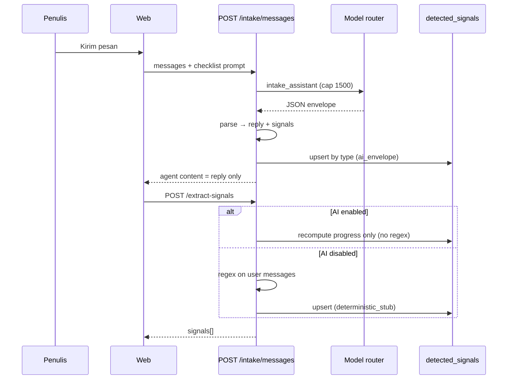

# Closure Report: Intake Foundation Quality (JSON Envelope + Anti-Clobber)

**Date:** 2026-06-20  
**Source plan:** `docs/superpowers/plans/2026-06-20-intake-foundation-quality-plan.md`  
**Related context:** `docs/masalah-ai.md` (conversational intake vs structured extraction), Sprint 10.31a (`docs/94-real-intake-assistant-concept-generator-report.md`)  
**Status:** Implemented and contract-verified; live smoke and full e2e remain operator-gated.

---

## 1. Problem statement (why this work existed)

Penulis melaporkan dua gejala di intake:

1. **Sinyal salah / generik** — misalnya genre tampil sebagai stub regex seperti "Fantasy Academy" padahal obrolan menunjukkan arah lain (mis. fantasi urban).
2. **Asisten terasa berputar-putar** — balasan panjang, mengulang pertanyaan, dan tidak memanfaatkan slot checklist yang sudah terisi.

Akar teknis yang teridentifikasi:

- Ekstraksi sinyal mengandalkan **regex heuristik** terpisah dari balasan chat LLM.
- Setelah envelope LLM diperkenalkan, **`POST /extract-signals` tetap menjalankan regex** setiap kali frontend memanggil endpoint itu setelah kirim pesan — menimpa sinyal `detected` yang benar dari AI (match-by-type memperparah dampak: overwrite in-place, bukan baris duplikat).
- **Token cap 800** untuk `intake_assistant` berisiko memotong JSON envelope di model produksi.
- **System prompt** belum menyuntik slot terisi + aturan anti-rambling.

---

## 2. Target behavior (acceptance intent)

| Area | Target |
|------|--------|
| Satu panggilan LLM | Balasan chat + `signals[]` + `readyForConcept` dalam satu respons JSON |
| UI message content | Hanya teks `reply` yang disimpan/ditampilkan, bukan raw JSON |
| Sinyal | `upsert` per **type**; hormati `confirmed` / `dismissed`; update `detected` in-place |
| Progress / fase | Tetap deterministik dari 7 `REQUIRED_SIGNAL_TYPES` (≥80% → concept phase) |
| `extract-signals` (AI on) | **Tidak** menjalankan regex; hanya recompute progress dari sinyal existing |
| Fallback | AI off → regex; envelope parse gagal → regex dari **teks user**, bukan teks agen |
| Model cap | `intake_assistant` max output tokens = **1500** |

---

## 3. What changed (files and behavior)

### 3.1 New module — one-way dependency

**`apps/api/src/services/intake-extraction.ts`**

- `REQUIRED_SIGNAL_TYPES` (7 tipe) — source of truth untuk checklist dan normalizer.
- `ExtractedSignalDraft`, `IntakeAiEnvelope`, `IntakeFilledSignalSummary`.
- `parseIntakeAiEnvelope` — strip fenced JSON, parse, regex recovery `{...}`, normalisasi sinyal.
- `normalizeExtractedSignalDraft` — hanya 7 tipe required (bukan seluruh enum DB).
- `buildIntakeExtractionInstructions(missingTypes, filledSignals)` — skema JSON + **perilaku** (~4 kalimat, satu pertanyaan, anti-plot spam, daftar terisi + slot kosong).

**Tidak** mengimpor dari `intake.ts` (menghindari circular ESM).

### 3.2 Intake service

**`apps/api/src/services/intake.ts`**

- `appendUserMessageForOwner`: prompt dengan `missingSignals` + `filledSignals`; parse envelope → simpan `reply`; apply `ai_envelope` signals; `readyForConcept` → `intake_sessions.metadata`; skip `extractSignalsAndProgressInternal` setelah AI path.
- `upsertDetectedSignal`: match `row.type === draft.type`; skip confirmed/dismissed; metadata `extractor`: `ai_envelope` | `deterministic_stub`.
- `extractDetectedSignalsForOwner`: jika `isAiGenerationEnabled` → `recomputeIntakeProgressFromExistingSignals` only; else → `extractSignalsAndProgressInternal` (regex).
- `computeProgressFromSignals` memakai `REQUIRED_SIGNAL_TYPES` dari modul ekstraksi.
- Stub non-AI drama rumah tangga diselaraskan dengan copy e2e mock.

### 3.3 Narra prompt

**`apps/api/src/services/story-agent-context.ts`**

- `NarraPromptContext`: `missingSignals`, `filledSignals`.
- Idea intake (bukan foundation refinement) menambahkan instruksi dari `buildIntakeExtractionInstructions`.

### 3.4 Model router

**`apps/api/src/services/model-router.ts`**

- `GENERATION_TYPE_TOKEN_CAP[intake_assistant]`: **800 → 1500**.

### 3.5 Mock provider

**`apps/api/src/services/mock-ai-provider.ts`**

- `intake_assistant` mengembalikan string JSON envelope (API tetap menyimpan `.reply` untuk UI).

### 3.6 Tests & scripts

| Artifact | Purpose |
|----------|---------|
| `apps/api/scripts/intake-extraction-contracts.test.mts` | Parser, steering prompt, anti-cycle import, extract-signals AI guard |
| `apps/api/package.json` | `test:intake-extraction` |
| `apps/api/scripts/sprint19-asisten-narra-contracts.test.mts` | Assert JSON / steering pada idea prompt |

### 3.7 Frontend (unchanged in this closure)

**`apps/web/src/hooks/useIntakeData.ts`** masih memanggil `extractIntakeSignals` setelah setiap kirim pesan. Perilaku aman setelah fix server (recompute-only saat AI enabled). Opsional later: hapus round-trip jika `POST /messages` sudah mengembalikan sinyal terbaru di bundle.

---

## 4. Architecture after change

---

## 5. Verification executed (automated)

Commands run on working tree **2026-06-20**:

| Command | Result |
|---------|--------|
| `npm run typecheck --workspace=apps/api` | **Pass** |
| `npm run test:intake-extraction --workspace=apps/api` | **Pass** (`PASS intake extraction contracts`) |
| `npm run test:sprint19-asisten-narra --workspace=apps/api` | **Pass** (`PASS Sprint 19 Asisten Narra contracts`) |

### Not run / blocked in this session

| Command | Reason |
|---------|--------|
| `npm run test:e2e --workspace=apps/web -- e2e/sprint10b-real-intake-concept-pipeline.spec.ts` | **ERR_CONNECTION_REFUSED** — dev server `localhost:5173` not running |
| `pwsh ./scripts/sprint9-smoke-api.ps1` | Requires live API + env (operator gate) |
| Live OpenRouter turn with long envelope | Requires staging/prod credentials and credits |

Mock-mode e2e **does not** exercise `mock-ai-provider`; Playwright fulfills `POST .../intake/messages*` with plain-text agent content — aligned with UI expectations.

---

## 6. Manual smoke checklist (remaining — ship gate)

Jalankan dengan **AI_GENERATION_ENABLED=true** dan model hemat nyata (bukan mock route). Gunakan proyek baru atau reset intake.

### 6.1 Anti-clobber (kritis — reproduksi bug asli)

- [ ] Kirim: *"Ceritaku fantasi urban, MC punya kekuatan tersembunyi."*
- [ ] Di panel sinyal / DB `detected_signals`, **genre** ≈ fantasi urban (bukan "Fantasy Academy").
- [ ] Kirim pesan kedua tanpa mengubah genre secara eksplisit.
- [ ] **Genre tidak berubah** menjadi stub regex setelah beberapa detik (setelah `extract-signals` dari frontend selesai).
- [ ] Konfirmasi sinyal genre (`confirmed`).
- [ ] Kirim pesan ketiga; genre **tetap** confirmed value (tidak tertimpa).

### 6.2 Koreksi in-place

- [ ] Mulai dengan pesan sekolah/sihir; pastikan satu baris `genre` **detected**.
- [ ] Kirim: *"Sebenarnya ini drama keluarga."*
- [ ] Hanya **satu** baris `genre`; value ter-update, tidak ada duplikat type.

### 6.3 Envelope & UI

- [ ] Bubble agen menampilkan **prosa**, bukan `{ "reply": ...`.
- [ ] `intake_messages.metadata` agent: `envelopeParsed: true` pada turn sukses (jika AI path).

### 6.4 Steering (subjektif, 3–5 giliran)

- [ ] Balasan ≤ ~4 kalimat; satu pertanyaan fokus.
- [ ] Tidak mengulang slot yang sudah terisi di sidebar checklist.
- [ ] Saat 7/7 terisi (progress ≥80%), UI menawarkan / mengizinkan **Lanjut ke Konsep** (fase `concept_generation`).

### 6.5 Regression — AI disabled

- [ ] `AI_GENERATION_ENABLED=false`: kirim pesan drama rumah tangga.
- [ ] Stub/plain reply + regex extract via `extract-signals` masih mengisi sinyal.

### 6.6 Token / parse failure (staging)

- [ ] Satu turn panjang (banyak detail dalam satu pesan user).
- [ ] Respons tidak terpotong mid-JSON; atau jika parse gagal, fallback regex dari **user text** tidak menimpa sinyal `confirmed`.

---

## 7. Known limitations (documented, not blockers for this closure)

| Item | Note |
|------|------|
| `secret_candidate` | Satu baris per type (match-by-type); multi-rahasia tidak didukung |
| Frontend double call | `messages` + `extract-signals` — redundant but safe post-fix |
| `readyForConcept` | Disimpan di metadata; **gating fase** tetap `progress_percent >= 80` |
| E2E AI contract | Bergantung `TEST_REAL_AI` + health + kredit |

---

## 8. Closure decision

| Criterion | State |
|-----------|--------|
| Plan items: envelope, parser, prompt, upsert, mock, tests | **Done** |
| Post-review fixes: extract-signals AI guard, token 1500, steering prompt, user-text fallback | **Done** |
| Automated API contracts | **Green** |
| Manual smoke + sprint9 + e2e with server | **Pending operator** |

**Recommendation:** Treat as **code-complete** for intake foundation quality. Promote to **staging-validated** after checklist §6 green on a real AI stack.

---

## 9. Quick reference — critical code anchors

| Concern | Location |
|---------|----------|
| Envelope parse + instructions | `apps/api/src/services/intake-extraction.ts` |
| Message flow + envelope apply | `apps/api/src/services/intake.ts` → `appendUserMessageForOwner` |
| Extract endpoint AI guard | `apps/api/src/services/intake.ts` → `extractDetectedSignalsForOwner` |
| Token cap | `apps/api/src/services/model-router.ts` → `GENERATION_TYPE_TOKEN_CAP` |
| Frontend post-send extract | `apps/web/src/hooks/useIntakeData.ts` (~L200) |