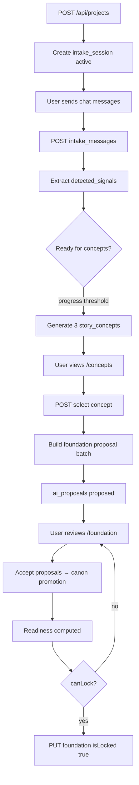

# 30 — Sprint 3 Story Foundation Flow Implementation Plan

**Status:** Planning document (Task 3.0)  
**Date:** 8 Juni 2026  
**Repo:** `vibenovel-unified-blueprint`  
**Prerequisite docs:** `docs/22`, `docs/27`, `docs/29`, `docs/17`, `docs/24`, `docs/25`, `docs/26`

Dokumen ini adalah **rencana implementasi detail** untuk Sprint 3. Bukan migration, bukan kode production. Agent dan developer manusia wajib membaca ini sebelum menulis schema, API, atau mengubah UI Sprint 1.

**Keputusan arsitektur Sprint 3 (user-approved):**

```txt
Jangan mulai OpenRouter / AI generation production dulu.
Selesaikan flow data nyata + proposal + readiness + lock terlebih dahulu.
Baru pasang AI generation ke slot backend yang sudah jelas.
```

---

## 1. Sprint 3 Goal

Mengubah **alur awal cerita** dari mock Sprint 1 menjadi **persistence nyata** yang aman untuk serial fiction panjang:

```txt
Start project
  → Chat intake (tersimpan)
  → Detected signals (tersimpan)
  → 3 concept options (tersimpan, bukan canon)
  → User memilih concept
  → Foundation proposal bundle (ai_proposals, bukan facts langsung)
  → Readiness score (server-computed)
  → User review + accept proposal per item
  → Lock foundation (batasi edit core)
```

### Hasil yang diharapkan di akhir Sprint 3

- User bisa menjalankan intake chat nyata per proyek (pesan persist).
- User bisa melihat **3 concept options** yang berasal dari intake (deterministic stub atau AI backend nanti).
- User bisa **memilih satu concept** tanpa otomatis mengunci fondasi.
- Sistem membuat **foundation proposal** (characters, facts, speech rules, foundation fields) lewat `ai_proposals`.
- **Readiness score** terlihat di UI fondasi — dihitung server-side.
- User bisa **lock foundation** hanya jika readiness memenuhi ambang minimum.
- **Canon guardrails** tetap: tidak ada AI output penting yang langsung masuk `facts` / `characters`.
- UI Sprint 1 **tidak di-redesign**; `VITE_USE_MOCKS` fallback tetap aman.

### Apa yang masih belum Sprint 3

- OpenRouter / model routing production
- Prose writer, beat writer, outline engine
- Reveal Gate penuh, validator penuh
- Credit deduction nyata
- Publish package production

---

## 2. Sprint 3 Scope

### In scope

| Area | Sprint 3 deliverable |
|---|---|
| **Database** | Migration baru: `intake_sessions`, `intake_messages`, `detected_signals`, `story_concepts` |
| **Intake API** | CRUD session + append messages + list signals |
| **Concept API** | Generate/list/select 3 concepts per project |
| **Foundation proposal** | Service membuat batch `ai_proposals` dari concept terpilih |
| **Readiness** | Server-side readiness calculator + missing items |
| **Lock workflow** | Explicit lock + guard edit core fields (extend Task 2.9) |
| **Canon promotion** | Accept proposal → promote ke canon tables (transaction) — lanjutan 2.11 |
| **Web integration** | `/intake`, `/concepts`, `/foundation` baca/tulis API + mock fallback |
| **Stub AI boundary** | Deterministic/mock generator di backend sampai task AI terpisah |
| **Verification** | Sprint 3 smoke + laporan penutupan (`docs/31` nanti) |

### Explicitly not in Sprint 3

Lihat bagian **10. Out of Scope Sprint 3**.

### Alignment dengan Sprint 2

| Sprint 2 asset | Sprint 3 treatment |
|---|---|
| `story_foundations`, `characters`, `facts`, `ai_proposals` | Dipakai; proposal accept mulai promosi canon |
| `apps/web/src/mocks/intake.ts`, `concepts.ts` | Tetap; fallback `VITE_USE_MOCKS=true` |
| `FoundationPage` partial API (2.13) | Diperluas: proposals + readiness + lock |
| Accept proposal status-only (2.11) | Diganti bertahap dengan promotion service di 3.4/3.5 |

---

## 3. Database Design Proposal

Migration disarankan: `supabase/migrations/00002_sprint3_intake_concepts.sql`  
**Tidak mengubah** `00001_sprint2_core.sql` — hanya additive.

### 3.1 `intake_sessions`

Satu sesi intake aktif per proyek (app-level constraint; partial unique optional).

| Column | Type | Notes |
|---|---|---|
| `id` | uuid PK | |
| `project_id` | uuid FK → projects | Owner via project |
| `status` | enum | `active`, `completed`, `archived` |
| `progress_percent` | int | 0–100, mirror UI progress card |
| `phase` | enum | `chat`, `signals_ready`, `concepts_ready`, `completed` |
| `source` | enum | `user_chat`, `system_seed`, `import_stub` |
| `completed_at` | timestamptz nullable | Saat user lanjut ke concepts |
| `created_at` / `updated_at` | timestamptz | |

**Kenapa dibutuhkan:** Sprint 1 intake adalah mock statis; Sprint 3 perlu jejak chat dan state progress yang survive refresh.

### 3.2 `intake_messages`

| Column | Type | Notes |
|---|---|---|
| `id` | uuid PK | |
| `session_id` | uuid FK → intake_sessions | |
| `project_id` | uuid FK → projects | Denormalized untuk RLS/query |
| `role` | enum | `user`, `agent`, `system` |
| `content` | text | Plain language; no raw prompts |
| `metadata` | jsonb nullable | e.g. suggested_action id, stub template ref — **no secrets** |
| `sort_order` | int | Urutan tampilan chat |
| `created_at` | timestamptz | |

**Kenapa:** Persistensi chat intake; fondasi untuk extraction/signals nanti.

### 3.3 `detected_signals`

| Column | Type | Notes |
|---|---|---|
| `id` | uuid PK | |
| `session_id` | uuid FK → intake_sessions | |
| `project_id` | uuid FK → projects | |
| `signal_key` | text | e.g. `genre`, `tone`, `target_reader`, `conflict` |
| `label` | text | User-facing: "Drama Rumah Tangga" |
| `icon` | text nullable | Material icon name |
| `status` | enum | `pending`, `confirmed`, `dismissed` |
| `confidence` | numeric nullable | 0–1 untuk AI nanti; null untuk rule-based |
| `source` | enum | `rule_extract`, `ai_chat`, `user_confirmed`, `system_seed` |
| `sort_order` | int | |
| `created_at` / `updated_at` | timestamptz | |

**Kenapa:** Panel "Sinyal Terdeteksi" di UI intake butuh data nyata; memisahkan dari messages agar bisa di-update tanpa rewrite chat.

**Alternatif ditolak:** JSONB array di `intake_sessions` — kurang audit-friendly dan sulit untuk confirm/dismiss per signal.

### 3.4 `story_concepts`

Tiga opsi konsep per sesi/proyek — **bukan canon**, bukan `ai_proposals` (konsep adalah pilihan arah, bukan fact).

| Column | Type | Notes |
|---|---|---|
| `id` | uuid PK | |
| `project_id` | uuid FK → projects | |
| `intake_session_id` | uuid FK nullable → intake_sessions | |
| `sort_order` | int | 1–3 |
| `title` | text | |
| `pitch_short` | text | |
| `badge_label` | text nullable | |
| `badge_icon` | text nullable | |
| `main_conflict` | text | |
| `reader_promise` | text | |
| `commercial_strength` | text nullable | |
| `decorative_accent` | text nullable | UI token |
| `featured` | boolean default false | Mirror ConceptCard featured |
| `status` | enum | `draft`, `presented`, `selected`, `rejected`, `archived` |
| `source` | enum | `deterministic_stub`, `ai_chat`, `user_manual` |
| `selected_at` | timestamptz nullable | |
| `foundation_seed_payload` | jsonb nullable | Structured seed untuk proposal service — not canon |
| `created_at` / `updated_at` | timestamptz | |

**Kenapa:** Concept options adalah artefak UX tersendiri; memilih concept tidak boleh langsung menulis `facts`.

### 3.5 Perubahan tabel existing (minimal)

| Table | Change | Notes |
|---|---|---|
| `projects` | `selected_concept_id` uuid FK nullable → `story_concepts` | Pointer concept aktif |
| `projects` | `workflow_phase` enum nullable | `intake`, `concepts`, `foundation`, `foundation_locked` — display/routing |

Enum baru di `@vibenovel/shared` sebelum migration.

### 3.6 RLS (ringkas)

Semua tabel baru:

```txt
USING (is_project_owner(project_id))
WITH CHECK (is_project_owner(project_id))
```

- Browser **tidak** menulis langsung — semua via `apps/api` + service role + filter `owner_id`.
- `detected_signals` / `story_concepts` tidak boleh di-insert dari frontend dengan source provider mentah.

### 3.7 Tabel yang **tidak** ditambah di Sprint 3

```txt
chapters, reveals, prose_versions, outline_nodes, beat_contracts,
intake_ai_jobs, generation_logs, credits_ledger
```

---

## 4. AI Boundary

### Prinsip

```txt
Sprint 3 ≠ sprint prose writer.
AI (jika ada) hanya di slot backend yang sudah punya pagar proposal.
Frontend tidak boleh memanggil provider AI langsung.
```

### Fase implementasi AI

| Fase | Sprint 3 task | Behavior |
|---|---|---|
| **A (default)** | 3.3, 3.4 | `DeterministicConceptService` + `DeterministicFoundationProposalService` — rule/template dari signals + messages |
| **B (optional later)** | Task terpisah 3.x+ | `AiIntakeService` backend-only, output → `ai_proposals` / `story_concepts` dengan `source=ai_chat` |
| **C (explicitly out)** | — | OpenRouter, model router, streaming chat production |

### Slot backend (packages/core atau apps/api/services)

```txt
apps/api/src/services/intake/
  intake-session.ts        # persistence
  signal-extractor.ts      # rule-based v1
  concept-generator.ts     # stub v1 → story_concepts
  foundation-proposal-builder.ts  # concept → ai_proposals batch

apps/api/src/services/ai/   # Sprint 3+ only when approved
  (empty / interface only in 3.0 plan)
```

### Canon rules (non-negotiable)

1. Concept suggestions → `story_concepts` only.
2. Foundation field / character / fact / speech suggestions → `ai_proposals` (`proposal_type` + `source=ai_foundation` atau `deterministic_stub` mapped to allowed source).
3. `facts` hanya dari: `user`, `system`, `accepted_proposal` setelah **promotion service** validasi.
4. Memilih concept **tidak** lock foundation.
5. Lock foundation **tidak** auto-accept semua proposal — user tetap accept/reject eksplisit (batch accept opsional di UI, tetap lewat API actions).

### Payload guardrails (reuse Sprint 2)

- No `full_prompt`, `prose`, `openrouter`, raw model IDs in `payload` or `metadata`.
- Audit log untuk: concept generated, concept selected, proposals created, foundation locked.

---

## 5. Flow Breakdown



### Step detail

| Step | Actor | Persistence | Canon? |
|---|---|---|---|
| Start project | User | `projects`, optional `intake_session` | No |
| Chat intake | User + agent stub | `intake_messages` | No |
| Extract signals | Backend stub | `detected_signals` | No |
| Generate 3 concepts | Backend stub | `story_concepts` status=presented | No |
| Select concept | User | `story_concepts.selected`, `projects.selected_concept_id` | No |
| Foundation proposal | Backend | Multiple `ai_proposals` proposed | No (queue) |
| Review readiness | User | `story_foundations.readiness_*` updated by service | No |
| Accept proposal | User | Promotion txn → facts/characters/rules | **Yes** (after accept) |
| Lock foundation | User | `story_foundations.is_locked=true` | Locks core edits |

### Agent stub behavior (v1)

- Agent replies dari template rules (keyword genre, conflict, protagonist) — **bukan LLM**.
- CTA "Lanjut ke Konsep" memicu concept generation jika `progress_percent >= 40` (configurable).
- Concept generator bisa memetakan mock Sprint 1 (`mockConcepts`) ke row DB untuk demo parity.

---

## 6. API Task Breakdown

Urutan implementasi disarankan (task kecil, sequential approve):

### Task 3.1 — Intake & concept data model migration

- Migration `00002_sprint3_intake_concepts.sql`
- Enums/types di `@vibenovel/shared`
- RLS policies + indexes
- Seed opsional: link demo project ke intake session minimal (tanpa GoTrue fix)
- **Acceptance:** `supabase db reset` PASS; row counts documented

### Task 3.2 — API intake sessions & messages

```txt
GET    /api/projects/:id/intake
POST   /api/projects/:id/intake                 # create/ensure active session
POST   /api/projects/:id/intake/messages      # append user message
POST   /api/projects/:id/intake/agent-reply   # stub agent response (backend only)
GET    /api/projects/:id/intake/messages
POST   /api/projects/:id/intake/extract-signals
GET    /api/projects/:id/intake/signals
```

- Auth: Bearer JWT, owner-only
- Agent reply **tidak** dari frontend LLM — endpoint memanggil stub service
- **Acceptance:** messages persist; signals extract; 401/404 guardrails

### Task 3.3 — Concept options API

```txt
POST   /api/projects/:id/concepts/generate    # 3 concepts from intake
GET    /api/projects/:id/concepts
POST   /api/projects/:id/concepts/:id/select
```

- Generate idempotent per session (replace presented set atau version)
- Select concept: marks selected, rejects/archive others, **does not** lock foundation
- **Acceptance:** 3 concepts stored; selection persisted; owner-only

### Task 3.4 — Foundation proposal + readiness service

```txt
POST   /api/projects/:id/foundation/generate-from-concept
GET    /api/projects/:id/foundation/readiness
POST   /api/projects/:id/proposals/:id/accept   # extend: promotion txn
```

- `generate-from-concept` creates `ai_proposals` batch (characters, facts, speech, foundation fields)
- `readiness` returns `{ percent, level, missingItems[], canLock }` — server computed
- Extend accept proposal: optional `?promote=true` or dedicated `accept-and-promote` — **promotion service** with validation
- Reuse `foundation.ts` lock guards for core fields
- **Acceptance:** proposals created; readiness visible; accept promotes fact/character when configured

### Task 3.5 — Lock foundation workflow

```txt
POST   /api/projects/:id/foundation/lock
POST   /api/projects/:id/foundation/unlock     # optional; audit-heavy
```

- Lock requires `canLock === true` from readiness service
- Sets `is_locked`, `locked_at`, `status=locked`, updates `projects.workflow_phase`
- Reject lock if unresolved high-risk proposals masih `proposed` (configurable strict mode)
- Audit: `foundation_locked`
- **Acceptance:** lock blocked when not ready; core field edit blocked after lock

### Task 3.6 — Web integration intake / concepts / foundation

- Hooks/services mirroring Task 2.13 pattern
- Pages: `IntakePage`, `ConceptsPage`, `FoundationPage` — API mode + mock fallback
- `VITE_USE_MOCKS` honored
- DevAuthPanel tetap untuk local test
- **No redesign** — wire data into existing components
- **Acceptance:** mock mode unchanged; API mode flows intake → concepts → foundation

### Task 3.7 — Sprint 3 verification report

- Output: `docs/31-sprint-3-verification-report.md`
- Extend `scripts/sprint2-smoke-api.ps1` or add `sprint3-smoke-api.ps1`
- typecheck/build/smoke PASS

### Task yang **sengaja tidak** masuk Sprint 3

| Item | Defer |
|---|---|
| Task 3.2 Model router (doc 26) | Sprint 8 / task AI khusus |
| OpenRouter integration | Setelah 3.4/3.5 stabil |
| Start page project create wiring | Bisa 3.6 atau task kecil paralel |

---

## 7. Web Scope

### Halaman disentuh

| Route | Component | Integration |
|---|---|---|
| `/projects/:id/intake` | `IntakePage` | Load session, messages, signals; send message; CTA → concepts |
| `/projects/:id/concepts` | `ConceptsPage` | Load 3 concepts; select → foundation route |
| `/projects/:id/foundation` | `FoundationPage` | Bundle + proposals queue + readiness + lock CTA |

### Tidak disentuh di Sprint 3

```txt
/start, /dashboard (except links), /outline, /write, /summary, /publish, /settings (minimal touch)
```

### Fallback & safety (reuse 2.13)

| Condition | Behavior |
|---|---|
| `VITE_USE_MOCKS=true` | `mockIntakeSession`, `mockConcepts`, `mockStoryFoundation` |
| API error / no auth | Mock + `IntegrationNotice` |
| Partial API data | Merge with mock for non-integrated sections (e.g. secret schedule until Sprint 4) |

### ID routing

- `demo-project-001` route → resolve ke active API project UUID (pattern dari 2.13)
- `conceptsRoute` / `foundationRoute` dari API project id

---

## 8. Canon Guardrails

| Rule | Enforcement |
|---|---|
| Facts confirmed only | DB enum + API reject `ai_direct` (Sprint 2) — tetap |
| Concept ≠ canon | `story_concepts` table terpisah; no insert ke `facts` on select |
| Foundation proposal ≠ canon | `ai_proposals` status `proposed` until accept |
| Accept ≠ blind promotion | `canonPromotionService` validates type, risk, ownership, project lock state |
| Foundation lock jelas | `is_locked` + API 400 on core field edit (existing `foundation.ts`) |
| Locked foundation limits edit | `premise`, `mainConflict`, `readerPromise`, `storySecretsPreview`, `genre`, `tone`, `targetReader`, `styleTags` — require unlock |
| High-risk facts | Tetap `risk_level=high`; explicit accept |
| Audit trail | `audit_logs` for select concept, generate proposals, promote, lock |

### Proposal acceptance boundary (Sprint 3 vs 2)

```txt
Sprint 2: accept → status accepted only
Sprint 3: accept → status accepted + optional promotion to canon tables
         reject/merge → unchanged
         lock foundation → does not auto-accept all proposals (default)
```

---

## 9. Problem Coverage

| Problem (docs/25) | Sprint 3 response |
|---|---|
| **2.8** AI bagus brainstorming, lemah produksi panjang | Intake + concepts + foundation lock membentuk **production OS entry**, bukan sekadar ide |
| **2.10** Workflow terlalu teknis | Chat-first intake, plain language signals, 3 concept cards — no raw model UI |
| **2.12** Writer kehilangan kontrol kreatif | Proposal queue + select concept + explicit accept + lock |
| **3.10** Pemula tidak tahu mulai dari mana | Chat Story Agent + 3 concepts + readiness hints |
| Foundation kurang siap sebelum outline | Readiness score + `canLock` gate + missing items list |

Legacy audit (docs/23): Co-Author Chat / Story Agent UX **validated** — Sprint 3 makes it real without copying legacy architecture.

Feature migration map (docs/24): Story Compass → Fondasi Cerita via **rewrite** with proposal queue.

---

## 10. Out of Scope Sprint 3

| Item | Defer to |
|---|---|
| Outline engine / 10-chapter plan | Sprint 4 |
| Beat writer / prose generation | Sprint 5 |
| OpenRouter / model routing production | Task AI khusus / Sprint 8 |
| Credit deduction / ledger | Sprint 8 |
| Publish package production | Sprint 7 |
| Validator suite production | Sprint 6 |
| Reveal Gate / breadcrumbs | Sprint 4–5 |
| Character knowledge states | Sprint 5 |
| Draft import | Sprint 10 |
| Advanced voice learning | Sprint 11 |
| UI Sprint 1 redesign | Never |
| Remote deploy / remote migration push | Manual approval |
| Global route protection / auth UI besar | Later |

---

## 11. Acceptance Criteria Sprint 3

Sprint 3 dianggap **selesai** jika:

### Data & intake

- [ ] User dapat membuat/melanjutkan `intake_session` per proyek
- [ ] Chat messages persist (user + agent stub)
- [ ] `detected_signals` tampil dan dapat di-update (confirm/dismiss)
- [ ] Owner-only RLS + API enforced

### Concepts

- [ ] Backend dapat generate **3 concept options** (stub OK)
- [ ] User dapat memilih satu concept
- [ ] Concept terpilih **tidak** auto-lock foundation

### Foundation & canon

- [ ] Foundation proposal batch dibuat sebagai `ai_proposals`
- [ ] Readiness score + missing items dari server
- [ ] User dapat accept proposal → canon promotion (minimal fact + character)
- [ ] User dapat lock foundation saat `canLock`
- [ ] Locked foundation membatasi edit core fields

### Web

- [ ] `/intake`, `/concepts`, `/foundation` API mode works
- [ ] `VITE_USE_MOCKS=true` tetap render mock — no crash
- [ ] UI layout Sprint 1 tidak di-redesign

### Engineering

- [ ] `npm run typecheck` PASS
- [ ] `npm run build:shared|web|api` PASS
- [ ] Sprint 3 smoke script PASS (local)
- [ ] No OpenRouter keys in repo; no frontend provider calls

---

## 12. Risks & Guardrails

| Risk | Mitigation |
|---|---|
| AI output langsung canon | Proposal queue only; promotion service; API tests reject direct AI sources |
| Concept/foundation terlalu bebas | Structured payload schemas; max lengths; enum validation |
| Frontend refactor berlebihan | Hooks layer only; reuse components; mock fallback |
| Migration terlalu kompleks | 4 tabel baru + 2 kolom `projects`; satu migration file |
| OpenRouter masuk terlalu cepat | Stub services default; AI interface behind feature flag / later task |
| Proposal lifecycle tidak jelas | Document state machine; immutable resolved proposals (409) |
| Readiness dipercaya dari client | Server-only calculator; lock endpoint re-validates |
| Seed user GoTrue login | Continue signup test users; optional auth trigger fix parallel |
| Scope creep ke outline | Hard out-of-scope list; task approval per 3.x |

---

## 13. Recommended First Coding Task

**Task 3.1 — Intake & Concept Data Model Migration**

Alasan:

1. Semua API task (3.2–3.5) bergantung pada schema.
2. Risiko rendah jika additive-only + RLS mirror Sprint 2.
3. Memungkinkan parallel review shared types sebelum service code.

Deliverables Task 3.1:

```txt
supabase/migrations/00002_sprint3_intake_concepts.sql
packages/shared/src/enums.ts + domain.ts (intake, concept types)
docs/28 update atau docs/30 appendix RLS (optional short addendum)
supabase db reset PASS
```

**Jangan mulai Task 3.2** sampai Task 3.1 di-approve.

---

## Related documents

- [`docs/27-sprint-2-data-model-implementation-plan.md`](27-sprint-2-data-model-implementation-plan.md)
- [`docs/29-sprint-2-verification-report.md`](29-sprint-2-verification-report.md)
- [`docs/26-current-sprint-plan.md`](26-current-sprint-plan.md) — Sprint 3 overview (note: task numbering aligned to this doc)
- [`apps/api/README.md`](../apps/api/README.md)
- `.agent-logs/sprint-2/` — implementation truth Sprint 2