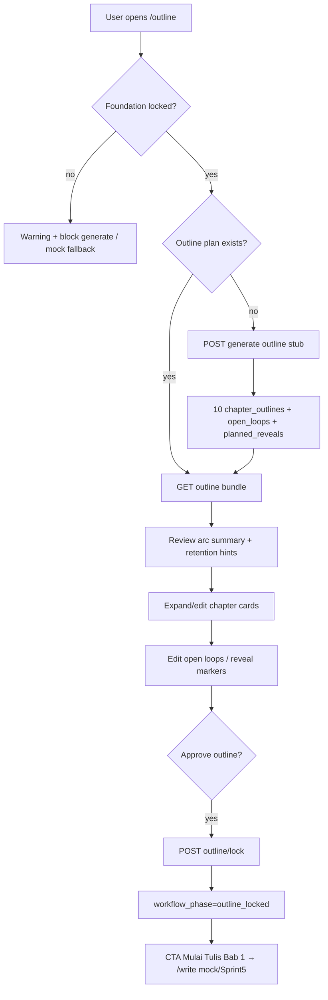

# 32 — Sprint 4 Outline Planning Engine Implementation Plan

**Status:** Planning document (Task 4.0)  
**Date:** 8 Juni 2026  
**Repo:** `vibenovel-unified-blueprint`  
**Prerequisite docs:** `docs/17`, `docs/25`, `docs/30`, `docs/31`, `docs/06`, `docs/07`, `docs/10`

Dokumen ini adalah **rencana implementasi detail** untuk Sprint 4. Bukan migration, bukan kode production. Agent dan developer manusia wajib membaca ini sebelum menulis schema, API, atau mengubah UI Sprint 1.

**Keputusan arsitektur Sprint 4 (user-approved direction):**

```txt
Selesaikan outline persistence + planning engine deterministic/stub dulu.
Belum prose writing, belum beat writer, belum OpenRouter production.
Planner boleh tahu masa depan; Writer nanti hanya menerima context aman per bab.
```

---

## 1. Sprint 4 Goal

Mengubah **halaman Outline** dari mock Sprint 1 menjadi **outline persistence nyata** yang aman untuk serial fiction KBM/mobile — tanpa prose generation.

### Hasil yang diharapkan di akhir Sprint 4

- User dengan **foundation locked** bisa membuat rencana 10 bab awal yang tersimpan di database.
- Setiap bab punya **purpose/function**, **emotional direction**, **ending hook**, dan marker retention (mini victory, open loop, reveal hint, conflict, cliffhanger).
- **Season/arc summary** minimal tersimpan dan bisa ditinjau.
- **Open loops** dan **reveal schedule** dilacak sebagai data perencanaan — bukan canon prose.
- User bisa **edit manual**, **approve**, dan **lock outline** sebelum lanjut ke ruang tulis (Sprint 5+).
- **Stub/deterministic planner** di backend — bukan OpenRouter, bukan AI production.
- UI Sprint 1 **tidak di-redesign**; `VITE_USE_MOCKS` fallback tetap aman.

### Apa yang masih belum Sprint 4

- Prose generation / beat writer / chapter editor persistence
- Context Packet final untuk AI Writer
- Reveal Gate resolver production (breadcrumb compiler penuh)
- Validator suite production
- OpenRouter / model routing
- Credit deduction
- Publish package production

---

## 2. Sprint 4 Scope

### In scope

| Area | Sprint 4 deliverable |
|---|---|
| **Database** | Migration baru: outline plan, chapters (outline-only), open loops, reveal schedule |
| **Shared types** | Domain interfaces + enums untuk planning artifacts |
| **Outline stub API** | Generate 10-chapter plan dari locked foundation + canon snapshot |
| **Chapter outline CRUD** | Manual edit title, summary, goal, emotion, hook, markers |
| **Open loop / reveal tracking** | CRUD + link ke chapter numbers |
| **Retention hints** | Server-computed summary (mirror `mockOutline.retentionHints`) |
| **Outline lock** | Approve/lock workflow + guard edit setelah lock |
| **Web integration** | `/projects/:id/outline` baca/tulis API + mock fallback |
| **Verification** | Sprint 4 smoke + laporan penutupan (`docs/33` nanti) |

### Wajib bahas (functional scope)

| Capability | Sprint 4 treatment |
|---|---|
| **Season/arc planning minimal** | Satu `outline_plan` aktif per project untuk **Bab 1–10** (season label + arc summary) |
| **Chapter outline 10 bab awal** | 10 rows `chapter_outlines` dengan `chapter_number` 1–10 |
| **Chapter purpose/function** | Field `purpose` (alias UI `goal`) |
| **Hook per bab** | Field `ending_hook` |
| **Emotional direction** | Field `emotional_direction` |
| **Mini victory** | Marker `mini_victory` per chapter (+ optional `mini_victory_note`) |
| **Open loop** | Tabel `open_loops` + optional chapter link; status tracked |
| **Reveal schedule** | Tabel `planned_reveals` — planning truth, forbidden-before chapter |
| **Reader retention/unlockability hints** | Computed `retention_summary` (open loop count, mini victory cadence, secret held, unlock potential) |
| **Outline lock/review status** | `outline_plans.status`: `draft` → `in_review` → `approved` → `locked` |

### Alignment dengan Sprint 3

| Sprint 3 asset | Sprint 4 treatment |
|---|---|
| `story_foundations.is_locked` | **Gate wajib** sebelum generate outline |
| `projects.workflow_phase=foundation_locked` | Prasyarat UI/API; setelah outline lock → `outline_locked` |
| `facts`, `characters` | **Read-only input** planner; tidak ditimpa oleh outline |
| `ai_proposals` | New canon facts dari outline → proposal queue (bukan direct facts) |
| `mockOutline` (`apps/web/src/mocks/outline.ts`) | Parity target untuk stub generator + seed |

---

## 3. Database Design Proposal

Migration disarankan: `supabase/migrations/00003_sprint4_outline_planning.sql`  
**Tidak mengubah** `00001` / `00002` — hanya additive.

### 3.1 `outline_plans` (MVP — pengganti `story_arcs`/`seasons` v1)

Satu rencana outline aktif per project untuk batch 10 bab awal. Season/arc disimpan di level plan (bukan tabel season terpisah di MVP).

| Column | Type | Notes |
|---|---|---|
| `id` | uuid PK | |
| `project_id` | uuid FK → projects | Owner via project |
| `label` | text | e.g. "Bab 1–10: Awal Konflik" — mirror `seasonLabel` |
| `description` | text | User-facing intro |
| `arc_summary` | text | Ringkasan arc 10 bab |
| `chapter_start` | int | Default 1 |
| `chapter_end` | int | Default 10 (MVP fixed batch) |
| `status` | enum | `draft`, `in_review`, `approved`, `locked` |
| `source` | enum | `deterministic_stub`, `user_manual`, `ai_planner` (reserved) |
| `readiness_percent` | int nullable | Optional planning completeness 0–100 |
| `retention_summary` | jsonb nullable | Cached hints (open loop count, mini victory count, …) |
| `locked_at` | timestamptz nullable | |
| `created_at` / `updated_at` | timestamptz | |

**Partial unique (app-level):** satu plan `locked` atau satu plan `draft/in_review` aktif per project — implementasi via partial index atau service rule.

**Kenapa tidak `story_arcs` terpisah di MVP:** UI Sprint 1 hanya menampilkan satu season label + arc summary. Tabel arc/season penuh ditunda ke Full Version.

### 3.2 `chapter_outlines` (MVP — bukan prose `chapters`)

Outline row per bab. **Bukan** tabel prose/chapter delta (Sprint 5+).

| Column | Type | Notes |
|---|---|---|
| `id` | uuid PK | |
| `project_id` | uuid FK | Denormalized RLS |
| `outline_plan_id` | uuid FK → outline_plans | |
| `chapter_number` | int | 1–10 dalam batch MVP |
| `title` | text | |
| `summary` | text | Ringkasan singkat |
| `purpose` | text | Fungsi bab (UI: `goal`) |
| `emotional_direction` | text | Arah emosi |
| `ending_hook` | text | Hook penutup bab |
| `markers` | jsonb | Array badge types: `reveal`, `mini_victory`, `conflict`, `emotion`, `cliffhanger` |
| `mini_victory_note` | text nullable | Deskripsi kemenangan kecil |
| `open_loop_ids` | uuid[] nullable | FK array ke `open_loops` (optional denorm) |
| `filler_risk` | enum nullable | `low`, `medium`, `high` — stub/heuristic |
| `status` | enum | `proposed`, `approved`, `locked` |
| `sort_order` | int | Mirror `chapter_number` |
| `created_at` / `updated_at` | timestamptz | |

**Unique:** `(outline_plan_id, chapter_number)`.

**Full version backlog:** tabel `chapters` terpisah untuk prose state (`draft`, `writing`, `accepted`) — Sprint 5+.

### 3.3 `open_loops` (MVP)

| Column | Type | Notes |
|---|---|---|
| `id` | uuid PK | |
| `project_id` | uuid FK | |
| `outline_plan_id` | uuid FK nullable | |
| `label` | text | Pertanyaan/hook pembaca |
| `description` | text nullable | |
| `opened_at_chapter` | int | Bab pembuka |
| `payoff_target_chapter` | int nullable | Bab target payoff |
| `urgency` | enum | `low`, `medium`, `high` |
| `status` | enum | `open`, `teased`, `paid_off`, `stale`, `cancelled` |
| `linked_reveal_id` | uuid FK nullable → planned_reveals | |
| `created_at` / `updated_at` | timestamptz | |

**Kenapa tabel terpisah:** doc 10 + doc 25 §3.5 — open loop harus dilacak agar tidak lupa dibayar.

### 3.4 `planned_reveals` (MVP — reveal schedule)

Planning data. **Bukan** reader-facing prose. **Bukan** canon `facts` langsung.

| Column | Type | Notes |
|---|---|---|
| `id` | uuid PK | |
| `project_id` | uuid FK | |
| `outline_plan_id` | uuid FK nullable | |
| `label` | text | User-facing: "Rahasia Siska" |
| `planning_truth` | text | **Planner-only** — raw truth for scheduling |
| `reveal_chapter` | int | Target reveal |
| `forbidden_before_chapter` | int | Default `reveal_chapter` |
| `reveal_mode` | enum | `explicit`, `partial`, `misdirection`, `emotional`, `visual` |
| `allowed_breadcrumb_chapters` | int[] | Bab yang boleh breadcrumb |
| `breadcrumb_notes` | text nullable | Petunjuk aman untuk writer nanti |
| `characters_who_know` | uuid[] nullable | Character IDs |
| `status` | enum | `planned`, `teased`, `revealed`, `cancelled` |
| `linked_fact_id` | uuid FK nullable → facts | Optional link ke canon secret fact (read-only ref) |
| `created_at` / `updated_at` | timestamptz | |

**Security note:** `planning_truth` tidak boleh masuk response writer/frontend production nanti tanpa gate; untuk Sprint 4 UI boleh tampilkan **label + chapter target** saja (mirror foundation secret preview).

### 3.5 Tabel yang **tidak** ditambah di Sprint 4 MVP

| Table | Defer | Sprint target |
|---|---|---|
| `chapter_beats` / `beat_contracts` | Beat-level planning | Sprint 5 |
| `prose_versions` | Writer output | Sprint 5 |
| `chapter_deltas` | Post-chapter canon update | Sprint 6 |
| `retention_scores` (persisted) | Unlockability score automation | Sprint 6+ |
| `story_arcs` / `seasons` (multi-season) | Season architect penuh | Full Phase 2 |
| `outline_beats` | Sub-chapter beats | Sprint 5 |

### 3.6 Perubahan tabel existing (minimal)

| Table | Change | Notes |
|---|---|---|
| `projects` | extend `workflow_phase` enum | Tambah `outline`, `outline_locked` |
| `projects` | optional `current_chapter` sync | Tetap 0 sampai Sprint 5 menulis prose |
| `story_foundations` | no schema change | Tetap gate `is_locked` |

### 3.7 RLS (ringkas)

Semua tabel baru:

```txt
USING (is_project_owner(project_id))
WITH CHECK (is_project_owner(project_id))
```

- Browser tidak menulis langsung — semua via `apps/api` + service role + filter `owner_id`.
- `planned_reveals.planning_truth` — API boleh redact di response list; detail endpoint owner-only dengan warning.

### 3.8 Seed update (Task 4.1 acceptance)

- Extend `supabase/seed.sql`: link demo project ke `outline_plan` + 10 `chapter_outlines` parity `mockOutline`
- Optional: 2–3 `open_loops`, 1–2 `planned_reveals` selaras foundation secret preview
- `workflow_phase` demo: `foundation_locked` atau `outline` setelah seed (documented)

---

## 4. Planner vs Writer Boundary

Prinsip dari `docs/06` dan `docs/07`:

```txt
Planner boleh tahu masa depan.
Writer nanti hanya boleh menerima safe current chapter context.
```

### Planner (Sprint 4 scope)

**Boleh menyimpan dan memproses:**

- Full 10-chapter outline
- Arc summary dan emotional direction semua bab
- `planned_reveals.planning_truth` dan reveal chapter targets
- Open loop payoff schedule
- Future antagonist moves (dalam outline text / planning fields)

### Writer (Sprint 5+ — explicitly out of Sprint 4)

**Tidak boleh menerima mentah:**

- Future chapters outline penuh
- Ending / full reveal schedule
- `planning_truth` hidden secrets
- Antagonist master plan mentah

**Boleh menerima nanti (via Context Packet):**

- Current chapter outline slice (purpose, emotion, hook untuk bab aktif saja)
- Known facts + POV knowledge
- Safe breadcrumbs (compiled dari `planned_reveals`)
- Forbidden reveal list untuk bab aktif
- Must include / must not include dari beat contract (Sprint 5)

### Reveal schedule vs prose

| Artifact | Role |
|---|---|
| `planned_reveals` | **Planning data** — jadwal kapan truth boleh muncul |
| `facts` (canon) | **Truth after acceptance** — post-reveal canon state |
| Breadcrumb | **Writer-safe hint** — diterjemahkan dari planning truth |

### Open loops

Open loops harus **tracked** di DB agar:

- Planner tidak lupa payoff
- Writer nanti tahu unresolved threads untuk bab aktif
- Chapter Delta (Sprint 6) bisa menandai `paid_off`

---

## 5. Canon Guardrails

| Rule | Enforcement |
|---|---|
| Outline tidak mengubah `facts` sembarangan | No direct INSERT/UPDATE ke `facts` dari outline services |
| New fact dari outline | `POST ai_proposals` type `fact` / `reveal` — status `proposed` |
| Reveal/high-risk → proposal + reveal schedule | `planned_reveals` + optional `ai_proposals`; tidak langsung ke `facts` |
| Foundation locked = input utama | `story_foundations.is_locked=true` required untuk generate |
| Foundation belum locked | `409 CONFLICT` atau `400` dengan message jelas; web warning + mock fallback |
| Lock outline ≠ lock foundation | Outline lock hanya guard `chapter_outlines` / `outline_plans` |
| High-risk fact categories | Tetap lewat proposal accept flow Sprint 3 |
| Payload guardrails | No `openrouter`, raw prompts, prose in planning payload |

### Proposal path untuk outline discoveries

Jika stub planner atau user menambah fakta baru saat edit outline:

```txt
outline edit → POST /api/projects/:id/proposals (manual)
              atau batch dari generate dengan flag new_fact_candidates
              → user accept → canon (reuse Sprint 3 promotion patterns)
```

Tidak ada auto-promote dari outline generation.

---

## 6. Reader Retention Requirements

Kebutuhan KBM dari `docs/10` dan `docs/25` §3:

| Requirement | Sprint 4 implementation |
|---|---|
| Pembaca betah unlock | Setiap bab wajib `ending_hook`; plan summary hitung hook coverage |
| Tidak filler | Field `purpose` wajib; optional `filler_risk` heuristic di stub |
| Tidak tokoh ditindas terus tanpa reward | Marker `mini_victory` + `mini_victory_note`; retention summary counts |
| Mini victory berkala | Stub planner jadwalkan ~3 mini victory dalam 10 bab (mirror mock) |
| Konflik berlapis | Arc summary + conflict markers; eskalasi chapter 1→10 |
| Hook akhir bab | `ending_hook` required per chapter |
| Open loop dilacak | `open_loops` table dengan `opened_at` + `payoff_target` |
| Secret/reveal tidak bocor cepat | `planned_reveals.forbidden_before_chapter`; breadcrumb only before target |
| Format mobile serial | Planning notes field `mobile_format_hint` optional di chapter (backlog) atau defer ke Sprint 6 validator |

### Retention summary (computed, mirror UI)

Server menghitung object seperti `mockOutline.retentionHints`:

```ts
RetentionSummaryHint {
  openLoopCoverage: string    // "7 dari 10 bab punya hook penutup..."
  miniVictoryCadence: string  // "3 momen bangkit kecil..."
  secretHeld: string          // "Rahasia belum terbuka penuh..."
  unlockPotential: string     // "Bab 10 cliffhanger kuat..."
}
```

MVP: heuristic dari chapter rows — bukan ML, bukan OpenRouter.

---

## 7. Flow Breakdown



### Step detail

| Step | Actor | Persistence | Canon? |
|---|---|---|---|
| Check foundation locked | API | Read `story_foundations` | No |
| Generate outline plan | Backend stub | `outline_plans`, `chapter_outlines`, loops, reveals | No |
| Review arc summary | User | Read-only | No |
| Edit chapter outline | User | PATCH `chapter_outlines` | No |
| Mark open loops/reveals | User/Stub | `open_loops`, `planned_reveals` | No |
| New fact candidate | User | `ai_proposals` proposed | No (queue) |
| Approve/lock outline | User | `outline_plans.status=locked` | No |
| Continue to write room | User | Route only | N/A (Sprint 5) |

---

## 8. API Task Breakdown

Urutan implementasi disarankan (task kecil, sequential approve):

### Task 4.1 — Outline planning data model + shared types

- Migration `00003_sprint4_outline_planning.sql`
- Enums/types di `@vibenovel/shared` (`OutlinePlan`, `ChapterOutline`, `OpenLoop`, `PlannedReveal`, …)
- Extend `WORKFLOW_PHASES`: `outline`, `outline_locked`
- RLS + indexes + seed parity `mockOutline`
- **Acceptance:** `supabase db reset` PASS; row counts documented

### Task 4.2 — Outline generation stub API

```txt
GET    /api/projects/:id/outline                    # bundle: plan + chapters + loops + reveals + retention
POST   /api/projects/:id/outline/generate           # stub 10-chapter batch (requires foundation locked)
GET    /api/projects/:id/outline/readiness            # planning completeness score (optional)
```

- Service: `outline-planner.ts` — deterministic dari foundation + characters + facts + selected concept
- Parity target: `apps/web/src/mocks/outline.ts`
- `regenerate=false` returns existing draft plan; `regenerate=true` archives old draft
- **Gate:** `is_locked=false` → `409` + `details.missing: ["foundation_locked"]`

### Task 4.3 — Chapter outline CRUD API

```txt
GET    /api/projects/:id/outline/chapters
GET    /api/projects/:id/outline/chapters/:chapterId
PATCH  /api/projects/:id/outline/chapters/:chapterId  # edit title, summary, purpose, emotion, hook, markers
```

- Reject PATCH jika `outline_plans.status=locked` (kecuali unlock task future)
- Validate `chapter_number` 1–10 dalam batch MVP

### Task 4.4 — Reveal & open loop tracking API

```txt
GET    /api/projects/:id/outline/open-loops
POST   /api/projects/:id/outline/open-loops
PATCH  /api/projects/:id/outline/open-loops/:loopId
GET    /api/projects/:id/outline/reveals
POST   /api/projects/:id/outline/reveals
PATCH  /api/projects/:id/outline/reveals/:revealId
```

- List responses **redact** `planning_truth` di summary; detail owner-only
- Reveal create tidak insert ke `facts`

### Task 4.5 — Outline lock workflow API

```txt
POST   /api/projects/:id/outline/approve             # draft → approved (optional step)
POST   /api/projects/:id/outline/lock                # approved/draft → locked + workflow_phase
```

- Preconditions: 10 chapters exist, each has `purpose` + `ending_hook`, foundation locked
- Idempotent: already locked → `409`
- Sets `projects.workflow_phase=outline_locked`

### Task 4.6 — Web OutlinePage integration

- `apps/web/src/services/outline.ts`
- `apps/web/src/hooks/useOutlineData.ts`
- Wire `OutlinePage.tsx` — API mode + mock fallback + `IntegrationNotice`
- `resolveProjectIdForRoute` reuse
- Block/warn generate CTA jika foundation not locked (API mode)
- **No redesign** — data into existing outline components

### Task 4.7 — Sprint 4 verification report

- Output: `docs/33-sprint-4-verification-report.md`
- Extend `smoke:api` atau add `sprint4-smoke-api.ps1`
- Extend `smoke:web` untuk outline page
- typecheck/build/smoke PASS

### Task yang **sengaja tidak** masuk Sprint 4

| Item | Defer |
|---|---|
| Beat contracts / beat writer | Sprint 5 |
| Prose writer + Context Packet | Sprint 5 |
| Reveal Gate resolver production | Sprint 5–6 |
| Validator suite | Sprint 6 |
| OpenRouter | Sprint 8+ |
| Multi-season arc tables | Full Phase 2 |
| Write room integration | Sprint 5 |

---

## 9. Web Scope

### Halaman disentuh

| Route | Component | Integration |
|---|---|---|
| `/projects/:id/outline` | `OutlinePage` | Load outline bundle; edit expand; lock CTA; retention hints |

### Komponen existing (reuse, no redesign)

```txt
OutlinePageHeader, OutlineProgressCard, OutlineRetentionHint,
OutlineChapterCard, OutlineChapterBadge, OutlineLoadMoreButton
```

### Tidak disentuh di Sprint 4

```txt
/write, /summary, /publish, /intake, /concepts, /foundation (except nav links)
```

### Fallback & safety (reuse 3.6 pattern)

| Condition | Behavior |
|---|---|
| `VITE_USE_MOCKS=true` | `mockOutline` penuh |
| API error / no auth | Mock + `IntegrationNotice` |
| Foundation not locked | Mock atau empty state + notice "Kunci fondasi dulu" |
| Partial API data | Merge retention/chapters from API; don't blank UI |

### Load More button

- MVP: disabled state + hint "Bab 11+ setelah menulis" (unchanged mock behavior)
- Persistence Bab 11+ = backlog (generate next batch task future)

---

## 10. Out of Scope Sprint 4

Tegaskan — **tidak** dikerjakan di Sprint 4:

- Prose generation
- Beat writer / beat contracts persistence
- Chapter editor persistence (`prose_versions`)
- OpenRouter production / AI planning production
- Credit deduction / ledger
- Publish package production
- Full validator (spoiler, filler, suffering fatigue automated)
- Writer Context Packet final
- Reveal Gate breadcrumb compiler production
- UI redesign total
- Remote deploy
- CI web E2E in GitHub Actions (optional extend local smoke only)

---

## 11. Acceptance Criteria Sprint 4

| Kriteria | Verifiable by |
|---|---|
| Locked foundation required untuk generate | API 409 + web notice |
| Outline plan bisa dibuat (stub) | POST generate → 201 |
| 10 chapter outline tersimpan | DB count + GET bundle |
| Tiap bab punya purpose, emotion, hook | PATCH validation + seed parity |
| Mini victory / open loop / reveal marker tersimpan | markers JSON + tables |
| Outline bisa diedit manual | PATCH chapter PASS |
| Outline bisa dilock/approve | POST lock → `status=locked` |
| Owner-only access | Cross-user 404 |
| Mock fallback tetap aman | `VITE_USE_MOCKS=true` smoke:web PASS |
| Canon tidak berubah dari generate | facts count unchanged pre/post generate |
| typecheck/build/smoke PASS | CI local scripts |

---

## 12. Risks & Guardrails

| Risk | Guardrail |
|---|---|
| **Future leak ke writer** | `planned_reveals.planning_truth` tidak masuk writer API; Context Packet slice-only di Sprint 5 |
| **Outline terlalu rigid** | Manual PATCH semua chapter fields; regenerate optional dengan archive |
| **Filler chapters** | Wajib `purpose`; stub heuristic `filler_risk`; retention summary warning |
| **Reveal terlalu cepat** | `forbidden_before_chapter` + reveal markers tanpa fact promotion |
| **Protagonist suffering fatigue** | Mini victory cadence rule di stub (~3 per 10 bab); marker required check sebelum lock |
| **Migration terlalu kompleks** | MVP 4 tabel + enum extend; no beat/prose tables |
| **AI planning tanpa gate** | Stub only; `source=deterministic_stub`; no OpenRouter |
| **Outline mengubah canon** | Read-only canon read; new facts → `ai_proposals` only |
| **Lock outline tanpa review** | Optional approve step; lock preconditions checklist |
| **Seed/mock drift** | Stub maps `mockOutline` chapter titles/hooks for demo parity |

---

## 13. Recommended First Coding Task

### **Task 4.1 — Outline Planning Data Model + Shared Types**

Alasan:

1. Semua API tasks (4.2–4.5) bergantung pada schema dan `@vibenovel/shared` contracts.
2. Enum `workflow_phase` extend harus ada sebelum lock workflow.
3. Seed parity `mockOutline` memvalidasi desain sebelum stub planner ditulis.
4. Pola Sprint 3 Task 3.1 terbukti aman: migration-only task dengan `supabase db reset` gate.

**Deliverables Task 4.1:**

- `supabase/migrations/00003_sprint4_outline_planning.sql`
- `packages/shared` — outline domain types + enums
- `supabase/seed.sql` — demo outline 10 bab
- `supabase/README.md` — section migration 00003
- Work log: `.agent-logs/sprint-4/task-4.1-outline-planning-data-model.md`

**Jangan mulai Task 4.2** sampai Task 4.1 di-approve.

---

## Related documents

- [`docs/17-roadmap-sprint-plan-mvp-to-full.md`](17-roadmap-sprint-plan-mvp-to-full.md)
- [`docs/25-problem-coverage-matrix.md`](25-problem-coverage-matrix.md)
- [`docs/30-sprint-3-story-foundation-flow-implementation-plan.md`](30-sprint-3-story-foundation-flow-implementation-plan.md)
- [`docs/31-sprint-3-verification-report.md`](31-sprint-3-verification-report.md)
- [`docs/06-reveal-gate-and-future-leak-prevention.md`](06-reveal-gate-and-future-leak-prevention.md)
- [`docs/07-context-packet-and-ai-writing-workflow.md`](07-context-packet-and-ai-writing-workflow.md)
- [`docs/10-reader-retention-and-unlockability-system.md`](10-reader-retention-and-unlockability-system.md)
- [`apps/web/src/mocks/outline.ts`](../apps/web/src/mocks/outline.ts)
- `.agent-logs/sprint-3/`