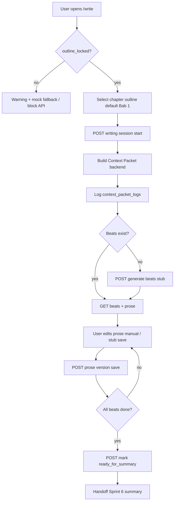

# 34 — Sprint 5 Safe Write Room & Context Packet Implementation Plan

**Status:** Implemented — closed per [`docs/35-sprint-5-verification-report.md`](35-sprint-5-verification-report.md) (Task 5.7)  
**Date:** 8 Juni 2026
**Repo:** `vibenovel-unified-blueprint`  
**Prerequisite docs:** `docs/17`, `docs/25`, `docs/32`, `docs/33`, `docs/06`, `docs/07`, `docs/31`

Dokumen ini adalah **rencana implementasi detail** untuk Sprint 5. Bukan migration, bukan kode production. Agent dan developer manusia wajib membaca ini sebelum menulis schema, API, atau mengubah UI Sprint 1.

**Keputusan arsitektur Sprint 5 (user-approved direction):**

```txt
Context Packet adalah pagar paling penting sejauh ini.
Writer hanya menerima slice aman bab aktif — bukan dump outline penuh, bukan planningTruth mentah.
Belum OpenRouter / prose AI production kecuali task eksplisit disetujui nanti.
Default boleh deterministic/stub untuk beats dan prose placeholder.
Jangan bangun prose writer AI sebelum Context Packet punya safety tests (Task 5.6).
```

**Catatan penjajaran roadmap:** `docs/26-current-sprint-plan.md` memakai penomoran task berbeda (Beat Contract → Word Budget → Context Packet → Beat Writer). Sprint 5 di repo ini **diprioritaskan persistence + Context Packet safety dulu**; Beat Writer AI production dan validator penuh ditunda ke task eksplisit atau Sprint 6.

---

## 1. Sprint 5 Goal

Mengubah **halaman Write Room** (`/projects/:id/write`) dari mock Sprint 1 menjadi **workflow persistence nyata** dengan **Context Packet aman** untuk bab aktif.

### Hasil yang diharapkan di akhir Sprint 5

- User dengan **`workflow_phase = outline_locked`** bisa membuka Write Room untuk bab tertentu (default Bab 1).
- Backend membangun **Context Packet** server-side — satu-satunya jalur konteks ke writer (AI nanti atau stub sekarang).
- Context Packet **tidak** berisi: full outline dump, future chapter summaries, `planning_truth` mentah, payoff masa depan, proposal unresolved.
- **Writing session**, **chapter beats**, dan **prose draft** tersimpan di database.
- User bisa **menyimpan draft prose manual** (atau stub deterministic); draft **bukan canon**.
- Bab siap ditandai **ready for summary** → handoff Sprint 6 (Chapter Delta / summary canon).
- UI Sprint 1 **tidak di-redesign**; `VITE_USE_MOCKS` fallback tetap aman.
- **Belum** OpenRouter, **belum** prose AI production, **belum** validator penuh, **belum** chapter summary canon update.

### Apa yang masih belum Sprint 5

- OpenRouter / model routing / AI generation production
- Full prose AI writer (beat-level generation dengan repair loop)
- Instruction Compliance Validator production
- Chapter Delta / summary canon promotion (Sprint 6)
- Publish package (Sprint 7)
- Credit deduction / ledger
- Advanced style learning / voice mimicry
- Full Reveal Gate breadcrumb compiler (MVP stub dari `reader_facing_hint` saja)
- Character Knowledge Gate penuh (MVP: canon facts only, tanpa `suspects`/`misbelieves` state machine)
- UI redesign total Write Room

---

## 2. Sprint 5 Scope

### In scope

| Area | Sprint 5 deliverable |
|---|---|
| **Database** | Migration `00004`: writing sessions, chapter beats, prose versions, context packet logs |
| **Shared types** | `WritingSession`, `ChapterBeat`, `ChapterProseVersion`, `WriterContextPacket`, enums status |
| **Context Packet Builder** | Server-side builder dari locked canon + safe outline slice + reveal gate MVP |
| **Writing session API** | Start/resume session per `chapter_outline_id`; gate `outline_locked` |
| **Chapter beats API** | Generate/load/update beat list (deterministic stub dari chapter outline) |
| **Prose draft API** | Save/load prose per beat; version numbering; manual + stub source |
| **Write Room web** | `WritePage` + `useWriteData` + mock fallback (pola Task 4.6) |
| **Safety tests** | API smoke: no future leak, no `planningTruth`, forbidden list integrity |
| **Verification** | Sprint 5 smoke + laporan penutupan (`docs/35` nanti) |

### Wajib bahas (functional scope)

| Capability | Sprint 5 treatment |
|---|---|
| **Writing sessions** | Satu session aktif per `(project_id, chapter_outline_id)`; status `active` / `paused` / `completed` |
| **Chapter drafts** | Row metadata per bab (`chapter_writing_states`) + prose di `chapter_prose_versions` |
| **Scene/beat list** | `chapter_beats` — parity `mockChapterDraft.beats` (5 adegan Bab 1 demo) |
| **Context packet builder** | `buildWriterContextPacket(projectId, chapterOutlineId, beatId?)` — backend only |
| **Safe outline slice** | Hanya bab aktif: title, summary, purpose, emotion, hook, mini victory |
| **Forbidden reveal list** | Reveals dengan `forbidden_before_chapter > currentChapter` → label + forbidden concepts, **bukan** `planning_truth` |
| **Current chapter constraints** | `mustInclude` / `mustNotInclude` dari beat + chapter outline markers |
| **Prose draft storage** | Append version per beat; `is_current` flag; word count computed |
| **Chapter summary handoff** | Mark session `ready_for_summary` — Sprint 6 consumes; **tidak** menulis `chapter_deltas` di Sprint 5 |
| **Write room web integration** | Load session + beats + prose; save draft; tampilkan arahan adegan (direction dari beat); AI CTA tetap disabled |

### Alignment dengan Sprint 4

| Sprint 4 asset | Sprint 5 treatment |
|---|---|
| `outline_plans.status = locked` | **Gate wajib** sebelum Write Room API |
| `projects.workflow_phase = outline_locked` | **Gate wajib** — 409 jika belum locked |
| `chapter_outlines` | **Read-only input** writer — slice satu bab; tidak PATCH dari Write Room |
| `planned_reveals.planning_truth` | **Tidak pernah** masuk Context Packet; breadcrumb MVP dari `reader_facing_hint` saja |
| `open_loops` | Hanya loop yang `opened_at <= currentChapter` dan belum `paid_off` |
| `facts`, `characters`, `speech_rules` | **Read-only** — hanya accepted canon (`facts.canon_status = confirmed`) |
| `ai_proposals` | **Tidak** masuk packet kecuali `status = accepted` dan sudah dipromosikan ke facts/characters |
| `mockChapterDraft` | Parity target beat stub + web mock fallback |

---

## 3. Database Design Proposal

Migration disarankan: `supabase/migrations/00004_sprint5_write_room.sql`  
**Tidak mengubah** `00001`–`00003` — hanya additive.

### 3.1 `writing_sessions` (MVP)

Satu baris per attempt menulis satu bab. Session mengikat `chapter_outline_id` (bukan prose `chapters` terpisah di MVP).

| Column | Type | Notes |
|---|---|---|
| `id` | uuid PK | |
| `project_id` | uuid FK → projects | Denormalized RLS |
| `chapter_outline_id` | uuid FK → chapter_outlines | Bab yang sedang ditulis |
| `status` | enum | `active`, `paused`, `ready_for_summary`, `completed`, `abandoned` |
| `active_beat_id` | uuid FK nullable → chapter_beats | Pointer UX |
| `started_at` | timestamptz | |
| `last_activity_at` | timestamptz | |
| `ready_for_summary_at` | timestamptz nullable | Handoff Sprint 6 |
| `metadata` | jsonb | e.g. last context packet hash |
| `created_at` / `updated_at` | timestamptz | |

**Partial unique (app-level):** satu session `active` per `(project_id, chapter_outline_id)`.

**Relasi:** `chapter_outline_id` → `chapter_outlines.id` (planning row Bab N). Writer **tidak** membuat row `chapter_outlines` baru.

### 3.2 `chapter_writing_states` (MVP — metadata bab prose)

Metadata tingkat bab — memisahkan planning (`chapter_outlines`) dari state menulis.

| Column | Type | Notes |
|---|---|---|
| `id` | uuid PK | |
| `project_id` | uuid FK | |
| `chapter_outline_id` | uuid FK UNIQUE | 1:1 dengan outline row |
| `writing_session_id` | uuid FK nullable → writing_sessions | Session terakhir |
| `status` | enum | `not_started`, `drafting`, `ready_for_summary`, `summarized` (summarized = Sprint 6) |
| `word_count` | int | Aggregated dari prose versions |
| `last_saved_at` | timestamptz nullable | |
| `metadata` | jsonb | |
| `created_at` / `updated_at` | timestamptz | |

**Kenapa terpisah dari `chapter_outlines`:** Outline row adalah planning artifact (Sprint 4); prose state punya lifecycle sendiri dan tidak boleh mengubah planning fields.

### 3.3 `chapter_beats` (MVP)

Beat/adegan per bab — parity `mockChapterDraft.beats`.

| Column | Type | Notes |
|---|---|---|
| `id` | uuid PK | |
| `project_id` | uuid FK | |
| `chapter_outline_id` | uuid FK → chapter_outlines | |
| `writing_session_id` | uuid FK nullable → writing_sessions | |
| `beat_number` | int | 1..N |
| `title` | text | |
| `summary` | text | Ringkasan adegan |
| `direction` | text | Arahan penulis (UI: Arahan Adegan) |
| `status` | enum | `empty`, `draft`, `done` |
| `emotional_shift` | text nullable | MVP optional |
| `must_include` | text[] | Beat contract lite |
| `must_not_include` | text[] | Beat contract lite |
| `word_target` | int nullable | Default 500–900 KBM |
| `stop_condition` | text nullable | Defer enforcement ke Sprint 6 validator |
| `sort_order` | int | |
| `metadata` | jsonb | |
| `created_at` / `updated_at` | timestamptz | |

**Unique:** `(chapter_outline_id, beat_number)`.

**Full version backlog:** `beat_contracts` terpisah dengan versioning penuh + compliance scores.

### 3.4 `chapter_prose_versions` (MVP)

Prose per beat — versioning manual/stub.

| Column | Type | Notes |
|---|---|---|
| `id` | uuid PK | |
| `project_id` | uuid FK | |
| `chapter_beat_id` | uuid FK → chapter_beats | |
| `version_number` | int | Monotonic per beat |
| `prose_text` | text | Isi naskah |
| `word_count` | int | Computed server-side |
| `source` | enum | `user_edited`, `stub_deterministic`, `ai_generated` (reserved) |
| `is_current` | boolean | Satu current per beat |
| `context_packet_log_id` | uuid FK nullable → context_packet_logs | Audit trail generation nanti |
| `metadata` | jsonb | No raw model IDs in user-facing fields |
| `created_at` | timestamptz | Append-only feel |

**Unique:** `(chapter_beat_id, version_number)`.

**Partial unique:** satu `is_current = true` per `chapter_beat_id` (index/trigger atau service rule).

### 3.5 `context_packet_logs` (MVP — audit + replay)

Snapshot Context Packet yang dihasilkan backend. **Bukan** tabel yang diisi frontend.

| Column | Type | Notes |
|---|---|---|
| `id` | uuid PK | |
| `project_id` | uuid FK | |
| `writing_session_id` | uuid FK nullable | |
| `chapter_outline_id` | uuid FK | |
| `chapter_beat_id` | uuid FK nullable | Null = chapter-level packet |
| `chapter_number` | int | Denorm untuk query safety tests |
| `packet_hash` | text | SHA-256 canonical JSON |
| `packet_json` | jsonb | Full safe packet (planner-truth-free) |
| `builder_version` | text | e.g. `context_packet_v1_stub` |
| `created_at` | timestamptz | |

**API policy:** Endpoint user-facing mengembalikan **redacted preview** (direction + constraints + story checks) — **bukan** full `packet_json` kecuali dev flag internal. Smoke tests baca via service role atau dedicated test endpoint yang tidak diexpose production UI.

### 3.6 `chapter_generation_attempts` (Backlog — bukan MVP Sprint 5)

Defer ke task eksplisit pre-OpenRouter:

| Column | Type | Notes |
|---|---|---|
| `id`, `project_id`, `chapter_beat_id`, `context_packet_log_id` | | |
| `status` | enum | `pending`, `success`, `failed` |
| `model_tier` | text | Backend only |
| `error_message` | text | |

**Alasan defer:** Sprint 5 belum AI production; tabel ini berguna saat Task OpenRouter disetujui.

### 3.7 Perubahan tabel existing (minimal)

| Table | Change | Notes |
|---|---|---|
| `projects` | extend `workflow_phase` enum | Tambah `writing` (opsional saat session aktif) |
| `projects` | sync `current_chapter` | Update saat user mulai menulis bab N |
| `chapter_outlines` | no schema change | Tetap read-only dari Write Room |
| `planned_reveals` | no schema change | Context builder baca via service role |

**Catatan `workflow_phase`:** MVP boleh tetap `outline_locked` selama menulis; extend `writing` opsional untuk routing UI. Sprint 6 menambah `summarizing` / `chapter_complete` nanti.

### 3.8 RLS (ringkas)

Semua tabel baru:

```txt
USING (is_project_owner(project_id))
WITH CHECK (is_project_owner(project_id))
```

- Browser tidak menulis langsung — semua via `apps/api` + service role + filter `owner_id`.
- `context_packet_logs.packet_json` — tidak diexpose ke frontend normal; API mengembalikan `WriterContextPacketPreview` yang sudah disaring.
- `planned_reveals.planning_truth` — tetap tidak pernah di SELECT untuk writer services (reuse pola Sprint 4 redaction).

### 3.9 Seed update (Task 5.1 acceptance)

- Extend `supabase/seed.sql`: untuk demo project dengan outline locked, seed optional `chapter_beats` Bab 1 parity `mockChapterDraft` (5 beats) — **tanpa** prose versions (user menulis/send stub).
- `workflow_phase` demo: dokumentasikan `outline_locked` setelah lock flow; Write Room smoke bisa lock via API dulu.
- Tidak seed `context_packet_logs` — dibuat runtime oleh builder.

### 3.10 MVP vs Full/Backlog summary

| Table | MVP Sprint 5 | Backlog |
|---|---|---|
| `writing_sessions` | ✅ | Multi-user collab, session branching |
| `chapter_writing_states` | ✅ | Link ke `chapter_deltas` Sprint 6 |
| `chapter_beats` | ✅ | `beat_contracts` dengan compliance scoring |
| `chapter_prose_versions` | ✅ | Accepted/published source flags penuh |
| `context_packet_logs` | ✅ | Retention policy / TTL purge |
| `chapter_generation_attempts` | ❌ defer | ✅ saat OpenRouter |
| `chapters` (prose entity terpisah) | ❌ defer | Jika multi-season prose batch |
| `validation_reports` | ❌ defer | Sprint 6 |

---

## 4. Context Packet Boundary

Bagian ini adalah **inti keamanan Sprint 5**. Context Packet dibangun **hanya di backend** (`apps/api/src/services/context-packet-builder.ts` atau setara). Frontend **tidak** merakit packet dari outline bundle GET.

### 4.1 Struktur tipe (shared)

Align `docs/07` dengan penyesuaian Sprint 5 MVP:

```ts
WriterContextPacket {
  meta: {
    projectId: string
    chapterOutlineId: string
    chapterNumber: number
    beatId?: string
    beatNumber?: number
    builderVersion: string
    packetHash: string
    generatedAt: string
  }
  foundation: {
    premiseSummary: string          // locked foundation — ringkas
    mainConflictSummary: string
    readerPromise: string
    tone: string | null
    storySecretsPreview: string | null  // user-facing preview only
  }
  concept: {
    title: string
    shortPitch: string
    readerPromise: string | null
  }
  canon: {
    characters: CharacterSafeSummary[]
    facts: string[]                 // confirmed canon only, POV-filtered MVP
    speechRules: SpeechRuleSummary[]
  }
  currentChapter: {
    title: string
    summary: string
    purpose: string | null
    chapterFunction: string
    emotionalDirection: string | null
    endingHook: string | null
    miniVictory: string | null
    hook: string | null
    markers: ChapterOutlineMarker[]
  }
  continuity: {
    previousChapterSummaries: string[]  // outline summary bab < N only
    openLoopsActive: OpenLoopSafeSummary[]
    unresolvedThreadLabels: string[]
  }
  revealGate: {
    allowedBreadcrumbs: string[]    // dari reader_facing_hint, BUKAN planning_truth
    allowedReveals: RevealSafeSummary[]  // reveal sudah allowed di bab ini
    forbiddenReveals: ForbiddenRevealEntry[]
    forbiddenConcepts: string[]       // kata/konsep terlarang aggregated
  }
  emotionalTarget: {
    chapterEmotion: string | null
    beatEmotionalShift: string | null
  }
  hookTarget: {
    chapterEndingHook: string | null
    beatStopCondition: string | null
  }
  constraints: {
    mustInclude: string[]
    mustNotInclude: string[]
    wordTarget: number | null
    mobileFormatRules: string[]
  }
}
```

**Frontend preview** (`WriterContextPacketPreview`): subset tanpa field internal — direction, emotional target, story check labels, **tanpa** raw packet dump.

### 4.2 Isi yang BOLEH masuk Context Packet

| Kategori | Sumber data | Catatan |
|---|---|---|
| Foundation locked summary | `story_foundations` where `is_locked=true` | Premise, conflict, reader promise, tone — **bukan** full edit history |
| Selected concept safe summary | `story_concepts` where `status=selected` | Title, pitch, promise — **bukan** rejected concepts |
| Character canon facts | `characters` + linked `facts` | Hanya `canon_status=confirmed`; deskripsi ringkas |
| Relationship speech rules | `relationship_speech_rules` where `status=active` | Rule text + examples |
| Current chapter outline | `chapter_outlines` WHERE `chapter_number = N` | Satu row saja — purpose, emotion, hook, markers |
| Previous chapter summaries | `chapter_outlines` WHERE `chapter_number < N` | **Ringkasan outline saja** — bukan prose penuh (prose accepted = Sprint 6) |
| Open loops already opened | `open_loops` opened in chapter ≤ N, status not `paid_off`/`dropped` | Question + reader_facing_hint |
| Reveals allowed up to N | `planned_reveals` where `forbidden_before_chapter <= N` AND status in (`planned`,`armed`,`revealed`) | **Hanya** `title` + `reader_facing_hint` + safe breadcrumb — **bukan** `planning_truth` |
| Emotional target | `chapter_outlines.emotional_direction` + beat `emotional_shift` | |
| Hook target | `chapter_outlines.ending_hook` + beat `stop_condition` | |
| Forbidden reveals before N | `planned_reveals` where `forbidden_before_chapter > N` | Label + forbidden concept keywords — masuk `forbiddenReveals`, **tidak** masuk usable facts |

### 4.3 Isi yang TIDAK BOLEH masuk Context Packet

| Terlarang | Alasan |
|---|---|
| Full outline dump (10 bab) | Future leak — hanya slice bab N |
| Future chapter summaries (bab > N) | Future plot leak |
| `planned_reveals.planning_truth` mentah | Planner-only; gunakan breadcrumb compiler |
| Reveal truth forbidden before N | Masuk `forbiddenReveals` list, bukan `allowedBreadcrumbs` |
| Future payoff detail | `open_loops.payoff_chapter_outline_id` untuk bab > N → hanya label "akan dibayar later", tanpa detail payoff |
| `ai_proposals` unresolved | Status `proposed` / `rejected` / `merged` tidak masuk |
| Rejected / merged proposal | Bukan canon |
| Secret/reveal proposal belum allowed | High-risk proposal belum accepted |
| Model/provider/internal metadata | `openrouter`, model ID, raw prompt, token counts |
| Arc summary penuh 10 bab | Boleh satu kalimat season label; **bukan** arc_summary lengkap dengan spoiler |
| Retention summary dengan spoiler | Strip atau redact bagian yang menyebut reveal masa depan |
| PATCH body dari client | Packet tidak diterima dari frontend — hanya dibuild server |

### 4.4 Breadcrumb compiler MVP (Sprint 5)

Sprint 4 menyimpan `reader_facing_hint` di `planned_reveals` dan `open_loops`. Sprint 5 **belum** production compiler penuh dari `planning_truth`.

```txt
MVP rule:
  IF reveal.forbidden_before_chapter <= currentChapter
    → allowedBreadcrumbs += reveal.reader_facing_hint (if present)
  ELSE
    → forbiddenReveals += { label: reveal.title, forbiddenConcepts: extractKeywords(reveal.title) }
    → DO NOT read planning_truth

NEVER:
  planning_truth → breadcrumb translation in Sprint 5 MVP
```

Stub `extractKeywords`: heuristic dari `title` + `reader_facing_hint` — bukan NLP. Sprint 6+ menambah compiler penuh per `docs/06`.

### 4.5 Packet size guardrail

| Guardrail | Limit MVP |
|---|---|
| Max facts in packet | 50 |
| Max previous summaries | `chapter_number - 1`, each ≤ 500 chars |
| Max characters | 20 |
| Max forbidden entries | 30 |
| Total packet JSON | ≤ 64 KB |

Jika melebihi → truncate dengan metadata flag `truncated: true` di log (bukan di user preview).

---

## 5. Writer vs Planner Boundary

Prinsip dari `docs/06`, `docs/07`, dan verifikasi Sprint 4 (`docs/33` §6):

```txt
Planner table boleh tahu masa depan.
Writer hanya dapat slice aman bab aktif.
Context Packet harus dibuat backend-side, bukan frontend-side.
```

### 5.1 Planner (tetap Sprint 4 scope)

**Boleh menyimpan dan API owner boleh akses (dengan redaction):**

- Full `chapter_outlines` 10 bab via `GET /outline`
- `planned_reveals.planning_truth` di DB (tidak di response default)
- Open loop payoff targets
- Future arc dalam `outline_plans.arc_summary`

### 5.2 Writer (Sprint 5 baru)

**Hanya boleh menerima via Context Packet / Write Room API:**

- Satu `currentChapter` slice
- Previous summaries < N (outline summary only)
- Canon facts confirmed
- Safe breadcrumbs (hint only)
- Forbidden list eksplisit

**Tidak boleh:**

- Memanggil `GET /outline` bundle dan merakit prompt di frontend
- Menerima `planningTruth` even on reveal CRUD responses
- Melihat payoff chapter number untuk loop yang belum waktunya (cukup "terbuka")
- Mengubah `chapter_outlines`, `facts`, `characters` dari Write Room save

### 5.3 Enforcement layers

| Layer | Enforcement |
|---|---|
| DB | `planning_truth` column tidak di-SELECT writer services |
| API mapper | Reuse `mapPlannedRevealPublic` pattern — writer endpoints never map truth |
| Context builder | Assert no key `planningTruth` / `planning_truth` in output JSON |
| Smoke tests | Regex scan response — Task 5.6 |
| Web | No debug panel exposing packet JSON; AI buttons disabled |

---

## 6. Flow Breakdown



### Step detail

| Step | Actor | Persistence | Canon? |
|---|---|---|---|
| Check `outline_locked` | API | Read `projects.workflow_phase` + `outline_plans.status` | No |
| Select chapter | User/API | Read `chapter_outlines` by number | No |
| Build context packet | Backend | Insert `context_packet_logs` | No |
| Create writing session | API | `writing_sessions` + `chapter_writing_states` | No |
| Generate/load beats | API stub | `chapter_beats` | No |
| Draft prose manual | User | `chapter_prose_versions` | **No** — draft only |
| Save draft version | API | New version row, `is_current` flip | No |
| Mark ready for summary | User | `writing_sessions.status=ready_for_summary` | No |
| Continue to Summary | User | Route `/summary` (Sprint 6) | N/A |

### Gate errors (API)

| Condition | HTTP | `details.missing` |
|---|---|---|
| Not `outline_locked` | 409 | `["outline_locked"]` |
| No locked outline plan | 409 | `["outline_plan_locked"]` |
| Chapter outline not found | 404 | — |
| Cross-user | 404 | — |

---

## 7. API Task Breakdown

Urutan implementasi disarankan. **Task 5.6 safety tests wajib PASS sebelum task prose AI apapun di sprint berikutnya.**

### Task 5.1 — Write Room data model + shared types

- Migration `00004_sprint5_write_room.sql`
- Enums/types di `@vibenovel/shared`: `WritingSession`, `ChapterBeat`, `ChapterProseVersion`, `WriterContextPacket`, status enums
- Extend `WORKFLOW_PHASES`: `writing` (optional)
- RLS + indexes + seed beats Bab 1 parity `mockChapterDraft`
- **Acceptance:** `supabase db reset` PASS; row counts documented

### Task 5.2 — Context Packet Builder API

```txt
POST /api/projects/:id/write/context-packet
  body: { chapterOutlineId, beatId? }
  gate: outline_locked
  returns: WriterContextPacketPreview + packetLogId (not full JSON to UI)

GET  /api/projects/:id/write/context-packet/:logId/preview
  returns: redacted preview only
```

- Service: `context-packet-builder.ts` — reads canon snapshot (reuse `outline-snapshot.ts` pattern), outline slice, reveal gate MVP
- Internal: persist `context_packet_logs`
- **Acceptance:** Packet for chapter 1 contains no chapter 2+ summary; no `planningTruth` key

### Task 5.3 — Chapter beat / session API

```txt
POST /api/projects/:id/write/sessions
  body: { chapterOutlineId }
  creates session + writing state; triggers initial context packet optional

GET  /api/projects/:id/write/sessions/:sessionId
PATCH /api/projects/:id/write/sessions/:sessionId  # pause, active_beat_id

POST /api/projects/:id/write/sessions/:sessionId/beats/generate  # stub 5 beats
GET  /api/projects/:id/write/sessions/:sessionId/beats
PATCH /api/projects/:id/write/beats/:beatId  # title, direction, must_include, etc.

POST /api/projects/:id/write/sessions/:sessionId/ready-for-summary
```

- Beat stub: deterministic split dari `chapter_outlines.summary` + parity `mockChapterDraft` untuk Bab 1 demo
- **Acceptance:** Beats persist; session gate `outline_locked`

### Task 5.4 — Prose draft persistence API

```txt
GET  /api/projects/:id/write/beats/:beatId/prose
POST /api/projects/:id/write/beats/:beatId/prose   # save new version
  body: { proseText, source?: user_edited }
```

- Reject prose keys on beat PATCH that belong in prose endpoint
- Compute `word_count`; update `chapter_writing_states.word_count`
- **Acceptance:** Version monotonic; `is_current` unique per beat; draft does not touch `facts`

### Task 5.5 — Write Room web integration

- `apps/web/src/services/write.ts`
- `apps/web/src/hooks/useWriteData.ts`
- Wire `WritePage.tsx` — API mode + mock fallback + `IntegrationNotice`
- `resolveProjectIdForRoute` reuse
- Chapter selector minimal (Bab 1 default; dropdown Bab 2–10 read-only jika belum session)
- Save button → prose API; last saved label from API timestamp
- AI assistant buttons **tetap disabled** — no OpenRouter UI
- **Acceptance:** `VITE_USE_MOCKS=true` unchanged; API mode loads beats/prose

### Task 5.6 — Safety tests: no future leak / no planningTruth

- Script: `scripts/sprint5-smoke-api.ps1`
- Tests:
  - Context packet ch1: no ch2+ summary text from seed
  - Response JSON: no `"planningTruth"` / `"planning_truth"`
  - Forbidden reveal in `forbiddenReveals`, not in `allowedBreadcrumbs`
  - Future payoff loop: no payoff chapter number > N in packet
  - Rejected proposal text absent
  - `outline_locked` required → 409
  - Cross-user → 404
- **BLOCKER:** Task 5.7 tidak mulai sebelum 5.6 PASS

### Task 5.7 — Sprint 5 verification

- Output: `docs/35-sprint-5-verification-report.md`
- `npm run typecheck` + build + `supabase db reset` + sprint5 smoke
- Optional: `npm run smoke:web:write` (defer pattern Task 4.8)

### Task yang **sengaja tidak** masuk Sprint 5

| Item | Defer |
|---|---|
| OpenRouter / AI prose generation | Task eksplisit / Sprint 8 |
| Full Beat Writer service | Post–5.6 approval |
| Instruction Compliance Validator | Sprint 6 |
| Chapter Delta / summary canon | Sprint 6 |
| Publish package | Sprint 7 |
| Credit deduction | Sprint 8 |
| `chapter_generation_attempts` table | Pre-OpenRouter task |
| Context packet exposed to browser devtools by default | Never in normal UI |

---

## 8. Web Scope

### Halaman disentuh

| Route | Component | Integration |
|---|---|---|
| `/projects/:id/write` | `WritePage` | Session, beats, prose save, preview arahan |

### Komponen existing (reuse, no redesign)

```txt
WriterBeatList, WriterEditorPanel, WriterAssistantPanel,
WriterMobileLayout, WriterMobileCheckSheet
```

### Perubahan minimal

| Component | Change |
|---|---|
| `WritePage` | `useWriteData` instead of hardcoded `mockChapterDraft` |
| `WriterEditorPanel` | Controlled prose textarea + save to API |
| `WriterAssistantPanel` | Direction from beat API; story checks from stub/heuristic; AI CTAs disabled |
| `WriterBeatList` | Beat status from API |

### Tidak disentuh

```txt
/outline, /summary, /publish, /intake, /concepts, /foundation (except nav links)
```

### Fallback & safety (reuse 4.6 pattern)

| Condition | Behavior |
|---|---|
| `VITE_USE_MOCKS=true` | `mockChapterDraft` penuh |
| API error / no auth | Mock + `IntegrationNotice` |
| Not `outline_locked` | Mock atau empty state + notice "Kunci outline dulu" |
| Partial API data | Don't blank UI; beats from API, prose empty OK |

### Batasan UI

- Jangan redesign total Stitch layout desktop/mobile
- `VITE_USE_MOCKS` tetap dihormati
- No OpenRouter UI — no model picker, no token display
- No raw prompt / debug context exposed to normal user
- Context packet preview: plain-language arahan only

---

## 9. Safety / Leak Tests

Script: `scripts/sprint5-smoke-api.ps1` — target **≥ 18 tests PASS**.

### Wajib

| # | Test | Method |
|---|---|---|
| 1 | Context Packet chapter 1 must not contain chapter 2+ summary | Build packet; assert seed ch2 title absent |
| 2 | Context Packet must not contain `planningTruth` raw | JSON keys + regex on serialized packet |
| 3 | Forbidden reveal appears in `forbiddenReveals`, not usable context | Seed reveal with `forbidden_before_chapter=10`, current=1 |
| 4 | Future payoff not included | Open loop payoff ch10 not in continuity for ch1 |
| 5 | Rejected proposal not included | Insert rejected proposal; assert text absent |
| 6 | Unresolved proposal not included | Proposed fact not in `canon.facts` |
| 7 | `outline_locked` required | POST session without lock → 409 |
| 8 | Cross-user context packet 404 | Second user JWT |
| 9 | `GET /outline` from write flow not used by web hook | Code review + web e2e optional |
| 10 | Prose save does not INSERT into `facts` | Count before/after |
| 11 | Beat generate does not mutate `chapter_outlines` | Row unchanged |
| 12 | `context_packet_logs` created on build | Row count +1 |
| 13 | Full outline arc_summary not in packet | arc_summary string absent or truncated safe |
| 14 | `allowedBreadcrumbs` only from hints | No truth substring match |
| 15 | Chapter PATCH from write rejected | 404 or route absent |
| 16 | Session idempotent start | Second start returns existing active |
| 17 | Prose version `is_current` unique | Two saves → one current |
| 18 | No token / 401 on protected write endpoints | Auth gate |

### CI

- Local smoke only (GitHub Actions defer, sama Sprint 3/4)
- `npm run smoke:api` Sprint 2 regression tetap PASS

---

## 10. Canon Guardrails

| Rule | Enforcement |
|---|---|
| Draft prose tidak langsung mengubah `facts` | Prose API no JOIN to facts INSERT |
| New facts in prose → proposals later | Sprint 6 summary flow; Sprint 5 no auto-extract |
| Chapter draft is not canon until summary Sprint 6 | `chapter_writing_states.status` ≠ summarized |
| Context Packet from accepted/locked canon only | Builder skips proposed proposals |
| Writer output cannot mutate foundation/outline | No PATCH routes to foundation/outline from write |
| `chapter_outlines` read-only in Write Room | No write service imports chapter-outline PATCH |
| Speech rules / characters read-only | List only in packet |
| User manual prose `source=user_edited` | Still not canon until Sprint 6 accept |

---

## 11. Out of Scope Sprint 5

Tegaskan — **tidak** dikerjakan di Sprint 5 kecuali task terpisah disetujui:

- OpenRouter production / model routing / AI generation production
- Full prose AI writer dengan repair loop
- Chapter summary canon update / `chapter_deltas`
- Publish package generation
- Credit deduction / ledger writes
- Advanced style learning / voice profiles
- Full validator suite (compliance, spoiler, filler, mobile readability)
- Full Reveal Gate breadcrumb compiler dari `planning_truth`
- Character Knowledge state machine penuh
- UI redesign Write Room
- Remote Cloudflare deploy / remote migration push
- Web E2E in GitHub Actions CI (optional local `smoke:web:write`)
- `chapter_generation_attempts` persistence

---

## 12. Acceptance Criteria Sprint 5

| Kriteria | Verifiable by |
|---|---|
| `outline_locked` required | API 409 + web notice |
| User can open Write Room for a chapter | GET session + beats 200 |
| Backend builds safe Context Packet | POST context-packet + log row |
| Packet excludes future reveal / planningTruth | Task 5.6 smoke PASS |
| Beats/session persist | DB count + GET beats |
| Prose draft can be saved | POST prose → version row |
| WritePage reads API with mock fallback | `VITE_USE_MOCKS` smoke + build |
| typecheck/build/smoke PASS | CI local scripts |
| Safety tests PASS | `sprint5-smoke-api.ps1` |
| Canon unchanged by write flow | facts/characters count smoke |

---

## 13. Risks & Guardrails

| Risk | Guardrail |
|---|---|
| **Future leak** | Slice-only builder; 5.6 smoke blocker; no frontend packet assembly |
| **Prompt/context bloat** | Packet size limits; previous summaries outline-only truncated |
| **Prose becoming canon too early** | Separate tables; no fact promotion; status `drafting` only |
| **Writer seeing planner-only truth** | SELECT excludes `planning_truth`; mapper redaction; smoke regex |
| **Chapter draft overwriting** | Prose versioning append-only; `is_current` flag |
| **User losing creative control** | Manual save always available; AI buttons disabled until approved task |
| **Token/cost issue later** | No OpenRouter in Sprint 5; packet size budget documented |
| **UI becoming too technical** | Preview plain-language; no model IDs; no raw JSON panel |
| **Mock/API drift** | Bab 1 beat stub parity `mockChapterDraft`; seed documented |
| **Agent builds AI writer first** | Plan order: 5.1 → 5.2 → 5.6 before any generation task |

---

## 14. Recommended First Coding Task

### **Task 5.1 — Write Room Data Model + Shared Types**

Alasan:

1. Semua API tasks (5.2–5.5) bergantung pada schema dan `@vibenovel/shared` contracts.
2. Enum status writing session / beat / prose source harus ada sebelum API routes.
3. Seed parity `mockChapterDraft` beats memvalidasi desain sebelum stub generator ditulis.
4. Pola Sprint 3.1 / 4.1 terbukti aman: migration-only task dengan `supabase db reset` gate.

**Deliverables Task 5.1:**

- `supabase/migrations/00004_sprint5_write_room.sql`
- `packages/shared` — writing domain types + enums
- `supabase/seed.sql` — optional Bab 1 beats for demo
- `supabase/README.md` — section migration 00004
- Work log: `.agent-logs/sprint-5/task-5.1-write-room-data-model.md`

**Jangan mulai Task 5.2** sampai Task 5.1 di-approve.

**Jangan mulai prose AI writer** sampai Task 5.6 safety tests PASS.

---

## Related documents

- [`docs/33-sprint-4-verification-report.md`](33-sprint-4-verification-report.md)
- [`docs/32-sprint-4-outline-planning-engine-implementation-plan.md`](32-sprint-4-outline-planning-engine-implementation-plan.md)
- [`docs/06-reveal-gate-and-future-leak-prevention.md`](06-reveal-gate-and-future-leak-prevention.md)
- [`docs/07-context-packet-and-ai-writing-workflow.md`](07-context-packet-and-ai-writing-workflow.md)
- [`docs/25-problem-coverage-matrix.md`](25-problem-coverage-matrix.md)
- [`apps/web/src/mocks/chapter.ts`](../apps/web/src/mocks/chapter.ts)
- [`apps/api/src/services/outline-snapshot.ts`](../apps/api/src/services/outline-snapshot.ts)
- `.agent-logs/sprint-5/`