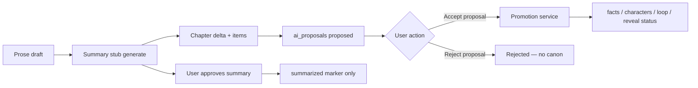
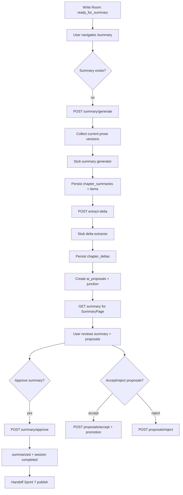

# 37 — Sprint 6 Chapter Summary, Chapter Delta & Canon Proposal Flow Implementation Plan

**Status:** Planning only — no migration, no API, no web integration yet  
**Date:** 8 Juni 2026  
**Repo:** `vibenovel-unified-blueprint`  
**Prerequisite docs:** `docs/35`, `docs/34`, `docs/36`, `docs/25`, `docs/17`, `docs/06`, `docs/07`, `docs/12`

Dokumen ini adalah **rencana implementasi detail** untuk Sprint 6. Bukan migration, bukan kode production. Agent dan developer manusia wajib membaca ini sebelum menulis schema, API, atau mengubah SummaryPage.

**Keputusan arsitektur Sprint 6 (user-approved direction):**

```txt
ready_for_summary dari Sprint 5 adalah gate wajib untuk summary generation.
Prose draft, chapter summary, dan chapter delta BUKAN canon otomatis.
Semua kandidat perubahan canon masuk ai_proposals — bukan langsung ke facts/characters/open_loops/reveals.
Summary approval ≠ auto-accept semua proposal.
Belum OpenRouter / AI production kecuali task eksplisit disetujui nanti.
Default boleh deterministic/stub extractor dari prose + beat metadata + outline slice.
```

**Handoff Sprint 5:** [`docs/35-sprint-5-verification-report.md`](35-sprint-5-verification-report.md) — `ready_for_summary` marker only; SummaryPage masih mock Sprint 1.

---

## 1. Sprint 6 Goal

Mengubah **halaman Ringkasan Bab** (`/projects/:id/summary`) dari mock Sprint 1 menjadi **workflow persistence nyata** yang menutup satu bab setelah Write Room — tanpa mempromosikan prose draft langsung ke canon.

### Hasil yang diharapkan di akhir Sprint 6

| Outcome | Keterangan |
|---|---|
| **Summary persistence** | `chapter_summaries` + `chapter_deltas` tersimpan per bab setelah generation |
| **Chapter summary** | Intisari bab dari prose draft + metadata beat/outline (stub deterministic MVP) |
| **Chapter delta** | Struktur perubahan bab: tokoh, relasi, fakta kandidat, open loop, reveal, hook, safety flags |
| **Canon proposals** | Kandidat fakta/perubahan masuk `ai_proposals` — **bukan** `facts` langsung |
| **Prose tetap non-canon** | `chapter_prose_versions` tidak mempromosikan canon; `summarized` hanya lifecycle marker |
| **User review** | SummaryPage menampilkan summary nyata (API mode); user approve summary |
| **Proposal review minimal** | User bisa accept/reject proposal individual — terpisah dari summary approve |
| **Handoff Sprint 7** | Bab `summarized` + summary approved → siap generate publish package (Sprint 7) |
| **Belum OpenRouter** | Stub extractor; tidak klaim kualitas AI production |

### Apa yang masih belum Sprint 6

- OpenRouter / model routing / AI generation production
- Full NLP/LLM chapter delta extractor
- Instruction Compliance Validator production penuh
- Publish package generation (Sprint 7)
- Credit deduction / ledger (Sprint 8)
- Full proposal merge UI advanced
- Automatic canon mutation dari prose atau summary approve
- Mass proposal auto-accept
- UI redesign total SummaryPage
- Remote deploy / remote migration push

---

## 2. Sprint 6 Scope

### In scope

| Area | Sprint 6 deliverable |
|---|---|
| **Database** | Migration `00005`: `chapter_summaries`, `chapter_deltas`, `chapter_summary_items`, junction `chapter_summary_proposals` |
| **Shared types** | `ChapterSummary`, `ChapterDelta`, item types, status enums, API contracts |
| **Summary generation API** | Stub dari prose + beats + outline — gate `ready_for_summary` |
| **Delta extraction API** | Structured delta + enqueue `ai_proposals` |
| **Approval workflow API** | Approve summary; accept/reject individual proposals; optional canon promotion on accept |
| **SummaryPage web** | API mode + mock fallback; minimal proposal review panel |
| **Safety tests** | API smoke: no canon mutation from summary gen; proposal boundary; regression Sprint 5 |
| **Verification** | Sprint 6 smoke + laporan penutupan (`docs/38` nanti) |

### Wajib bahas (functional scope)

| Capability | Sprint 6 treatment |
|---|---|
| **Chapter summaries** | Satu summary aktif per `(project_id, chapter_outline_id)` per generation batch; status workflow |
| **Chapter deltas** | 1:1 dengan summary generation; JSON terstruktur + normalized items |
| **Extracted facts/changes as proposals** | Kandidat `fact`, `character_update`, `relationship_update` → `ai_proposals` |
| **Open loop status update proposal** | Kandidat payoff/developed → proposal `open_loop_update` (enum baru) |
| **Reveal status proposal** | Kandidat armed/revealed → proposal `reveal_status_update`; high-risk tetap proposal |
| **Character change proposal** | Perubahan deskripsi/state tokoh existing → `character_update` proposal |
| **Relationship change proposal** | Perubahan dinamika relasi → `relationship_update` proposal (bukan speech rule otomatis) |
| **Summary approval workflow** | Approve summary → `chapter_writing_states.summarized`, session `completed`; **tidak** auto-accept proposals |
| **SummaryPage web integration** | Parity `mockChapterSummary` fields; `VITE_USE_MOCKS` fallback |
| **Handoff ke publish Sprint 7** | Summary `approved` + prose current versions = input publish stub nanti |

### Alignment dengan Sprint 5

| Sprint 5 asset | Sprint 6 treatment |
|---|---|
| `writing_sessions.status = ready_for_summary` | **Gate wajib** POST generate summary |
| `chapter_writing_states.status = ready_for_summary` | Gate + transisi ke `summarized` setelah summary approve |
| `chapter_prose_versions` (current per beat) | **Read-only input** extractor — tidak diubah oleh summary flow |
| `chapter_beats` | Metadata extractor (title, direction, must_include) |
| `chapter_outlines` | Outline promise: mini_victory, ending_hook, emotional_direction |
| `context_packet_logs` | Optional audit link di summary metadata — tidak diexpose ke UI |
| `ai_proposals` accept (Sprint 2) | Status-only → Sprint 6 Task 6.4 tambah **canon promotion** pada accept eksplisit |
| `mockChapterSummary` | Parity target UI fields |

---

## 3. Database Design Proposal

Migration disarankan: `supabase/migrations/00005_sprint6_chapter_summary_delta.sql`  
**Tidak mengubah** `00001`–`00004` destructive — hanya additive + enum extensions.

### 3.1 `chapter_summaries` (MVP)

Satu baris per **generation attempt** atau per bab (MVP: satu summary aktif per bab — regenerate membuat versi baru atau overwrite draft).

| Column | Type | Notes |
|---|---|---|
| `id` | uuid PK | |
| `project_id` | uuid FK → projects | Denormalized RLS |
| `chapter_outline_id` | uuid FK → chapter_outlines | Bab yang diringkas |
| `writing_session_id` | uuid FK → writing_sessions | Session sumber `ready_for_summary` |
| `chapter_number` | int | Denorm dari outline |
| `chapter_title` | text | Snapshot dari outline saat generate |
| `status` | enum | `draft`, `ready_for_review`, `approved`, `superseded` |
| `synopsis` | text | Intisari bab (user-facing) |
| `emotional_outcome` | text nullable | Hasil emosional bab |
| `ending_hook` | text nullable | Hook penutup |
| `continuity_notes` | text nullable | Catatan kontinuitas |
| `generator_version` | text | e.g. `summary_stub_v1` |
| `word_count_at_generation` | int | Snapshot dari `chapter_writing_states` |
| `approved_at` | timestamptz nullable | |
| `approved_by` | uuid nullable → profiles | Owner id |
| `metadata` | jsonb | Safety flags, stub markers, prose version ids used |
| `created_at` / `updated_at` | timestamptz | |

**Partial unique (MVP app rule):** satu summary `ready_for_review` atau `approved` per `(project_id, chapter_outline_id)` — regenerate draft boleh supersede.

**Relasi:**
- `chapter_outline_id` → planning row Bab N (read-only)
- `writing_session_id` → harus `ready_for_summary` atau `completed` saat generate

### 3.2 `chapter_deltas` (MVP)

Structured delta — companion 1:1 dengan summary generation.

| Column | Type | Notes |
|---|---|---|
| `id` | uuid PK | |
| `project_id` | uuid FK | |
| `chapter_summary_id` | uuid FK UNIQUE → chapter_summaries | 1:1 |
| `chapter_outline_id` | uuid FK | Denorm |
| `writing_session_id` | uuid FK nullable | |
| `delta_json` | jsonb | Full structured delta (lihat §5) |
| `safety_flags` | jsonb | Array flags: `possible_hallucination`, `reveal_risk`, `over_extraction`, dll. |
| `extractor_version` | text | e.g. `delta_stub_v1` |
| `created_at` | timestamptz | Append-only feel |

**Catatan:** `delta_json` boleh dibaca API untuk SummaryPage; **bukan** canon — hanya working artifact + proposal source.

### 3.3 `chapter_summary_items` (MVP)

Normalized line items untuk parity UI mock dan query/filter.

| Column | Type | Notes |
|---|---|---|
| `id` | uuid PK | |
| `project_id` | uuid FK | |
| `chapter_summary_id` | uuid FK → chapter_summaries | |
| `item_type` | enum | Lihat §3.3.1 |
| `sort_order` | int | |
| `label` | text nullable | Short label / emphasis |
| `body` | text | Main text |
| `character_id` | uuid FK nullable → characters | Untuk character_change |
| `character_name` | text nullable | Denorm display |
| `character_initial` | text nullable | UI avatar |
| `related_entity_type` | text nullable | `open_loop`, `planned_reveal`, `fact`, dll. |
| `related_entity_id` | uuid nullable | |
| `check_status` | enum nullable | `ok`, `warning` — untuk story_check items |
| `metadata` | jsonb | |
| `created_at` | timestamptz | |

#### 3.3.1 `chapter_summary_item_type` enum (MVP)

```txt
synopsis_fragment
new_fact_candidate
character_change
relationship_change
mini_victory
held_secret
open_loop_opened
open_loop_developed
open_loop_paid_candidate
reveal_occurred_candidate
emotional_outcome
ending_hook
continuity_note
story_check
safety_flag
```

**MVP vs storage:** Item `new_fact_candidate` di UI SummaryPage map ke section "Fakta Baru" dengan badge **"Usulan"** — bukan canon confirmed.

### 3.4 `chapter_summary_proposals` (MVP — junction)

Menghubungkan satu summary generation dengan proposal queue yang dihasilkan.

| Column | Type | Notes |
|---|---|---|
| `id` | uuid PK | |
| `project_id` | uuid FK | |
| `chapter_summary_id` | uuid FK → chapter_summaries | |
| `ai_proposal_id` | uuid FK → ai_proposals | |
| `item_type` | text | Mirror proposal category |
| `auto_linked` | boolean | true jika dibuat otomatis oleh extractor |
| `created_at` | timestamptz | |

**Unique:** `(chapter_summary_id, ai_proposal_id)`.

### 3.5 Reuse `ai_proposals` — bukan tabel `canon_change_proposals` terpisah

Sprint 2 sudah punya `ai_proposals` sebagai **single canon promotion queue**. Sprint 6 **reuse** — tidak membuat `canon_change_proposals` paralel.

**Enum extensions (migration `00005`):**

`ai_proposal_type` — tambah nilai:

```txt
open_loop_update
reveal_status_update
character_update
relationship_update
```

`ai_proposal_source` — tambah nilai:

```txt
summary_stub
chapter_delta_stub
```

**Proposal payload conventions (shared docs):**

| Type | Payload fields (MVP) |
|---|---|
| `fact` | `text`, `category`, `importance`, `evidenceSnippet`, `chapterNumber` |
| `character_update` | `characterId`, `changeDescription`, `evidenceSnippet` |
| `relationship_update` | `characterAId?`, `characterBId?`, `relationshipLabel`, `changeDescription` |
| `open_loop_update` | `openLoopId`, `suggestedStatus`, `evidenceSnippet` |
| `reveal_status_update` | `plannedRevealId`, `suggestedStatus`, `evidenceSnippet` |
| `reveal` | High-risk truth candidate — **tidak** promote `planning_truth` ke canon |
| `chapter_delta` | Meta proposal pointing to `chapter_delta_id` (optional rollup) |

### 3.6 `chapter_open_loop_updates` / `chapter_reveal_updates` — Deferred

| Approach | Sprint 6 |
|---|---|
| Tabel fisik terpisah | **Deferred** — gunakan `ai_proposals` + junction |
| Direct PATCH `open_loops` / `planned_reveals` dari summary gen | **Forbidden** — hanya via accepted proposal promotion (Task 6.4) |

**Alasan:** Satu jalur audit; menghindari dual-write; selaras Sprint 2 AI Proposal Queue.

### 3.7 Perubahan tabel existing (minimal)

| Table | Change | Notes |
|---|---|---|
| `projects` | extend `workflow_phase` enum | Tambah `summarizing` (opsional routing UI) |
| `writing_sessions` | no schema change | Transisi `ready_for_summary` → `completed` on summary approve |
| `chapter_writing_states` | no schema change | `summarized` status sudah ada di enum Sprint 5 |
| `chapter_outlines` | no schema change | Read-only |
| `facts`, `characters` | no schema change | Write hanya via promotion service |
| `open_loops`, `planned_reveals` | no schema change | Status update via promotion on proposal accept |

### 3.8 RLS (ringkas)

Semua tabel baru:

```txt
USING (is_project_owner(project_id))
WITH CHECK (is_project_owner(project_id))
```

- Browser tidak menulis langsung — semua via `apps/api` + service role.
- `chapter_deltas.delta_json` — boleh ke SummaryPage API; **tidak** masuk Context Packet writer path.
- `planned_reveals.planning_truth` — tetap tidak di SELECT writer/summary public responses.
- Cross-user access → 404 (reuse pola Sprint 5).

### 3.9 Seed update (Task 6.1 acceptance)

- **Tidak** seed `chapter_summaries` — dibuat runtime setelah smoke write flow + ready_for_summary.
- Dokumentasikan di `supabase/README.md` section migration `00005`.
- Demo project tetap parity Bab 1 mock setelah smoke Sprint 6.

### 3.10 MVP vs Full/Backlog summary

| Artifact | MVP Sprint 6 | Backlog |
|---|---|---|
| `chapter_summaries` | ✅ | Multi-version diff, AI regen |
| `chapter_deltas` | ✅ | LLM extractor, validator scores |
| `chapter_summary_items` | ✅ | Full-text search index |
| `chapter_summary_proposals` | ✅ | Batch accept UX |
| `ai_proposals` reuse | ✅ extend enum | Separate canon_change_proposals |
| `chapter_open_loop_updates` table | ❌ defer | Jika audit granular dibutuhkan |
| `chapter_reveal_updates` table | ❌ defer | Jika audit granular dibutuhkan |
| `validation_reports` | ❌ defer | Sprint 6+ / Sprint 11 |
| Canon promotion on accept | ✅ Task 6.4 | Full merge/dedup engine |
| OpenRouter summary | ❌ defer | Explicit task |

---

## 4. Canon Boundary

Bagian ini adalah **inti keamanan Sprint 6**. Pelanggaran di sini merusak trust produk (Problem 2.12, docs/25).

### 4.1 Hierarki kebenaran

```txt
Tier 1 — Confirmed canon (mutable hanya via explicit promotion):
  facts (canon_status=confirmed)
  characters (active, user/accepted_proposal source)
  relationship_speech_rules (active)
  open_loops / planned_reveals STATUS setelah accepted proposal

Tier 2 — Planning (planner boleh tahu masa depan):
  chapter_outlines, outline_plans, planned_reveals.planning_truth

Tier 3 — Draft / working (BUKAN canon):
  chapter_prose_versions
  chapter_summaries (until approved — and even then summary text is not a fact)
  chapter_deltas
  ai_proposals status=proposed

Tier 4 — Markers / lifecycle:
  writing_sessions.ready_for_summary
  chapter_writing_states.summarized
```

### 4.2 Aturan keras (MUST)

| Rule | Enforcement |
|---|---|
| **Prose draft bukan canon** | Summary services READ `chapter_prose_versions` only; no INSERT to `facts` |
| **Chapter summary bukan canon otomatis** | `chapter_summaries.synopsis` tidak INSERT ke `facts`; tidak masuk Context Packet `canon.facts` |
| **Chapter delta bukan canon otomatis** | `chapter_deltas.delta_json` tidak mempromosikan canon; hanya memicu proposals |
| **New facts dari prose → ai_proposals** | Extractor INSERT `ai_proposals` type `fact`; never direct `facts` INSERT |
| **Accepted proposal → promote** | Task 6.4: `acceptProposal` + promotion service → `facts` / `characters` / status updates |
| **Rejected proposal → tidak masuk canon** | Status `rejected`; no `result_fact_id`; smoke assert absent from canon queries |
| **Summary approval ≠ auto-accept proposals** | `POST .../approve` hanya update summary + writing state; proposals tetap `proposed` unless user acts |
| **High-risk reveal → proposal dulu** | `reveal_status_update` dengan `risk_level=high` tidak auto-set `planned_reveals.revealed` |
| **Open loop payoff → proposal dulu** | `open_loop_update` suggested `paid_off` requires review; match outline payoff plan warnings |
| **planning_truth tidak pernah ke UI/API summary** | Mapper redaction; smoke regex |
| **Summary gen tidak PATCH outline/foundation** | No imports to outline-lock / foundation PATCH from summary routes |

### 4.3 Alur promotion (Task 6.4 — explicit only)



**Summary approve (`J`) tidak memanggil `F`.**

### 4.4 Promotion matrix (MVP)

| Proposal type | On accept → | Service reuse |
|---|---|---|
| `fact` | INSERT `facts` source=`accepted_proposal` | Extend `foundation-lock.ts` pattern |
| `character` | INSERT `characters` | foundation-lock |
| `character_update` | PATCH `characters.description` (bounded) | New `canon-promotion.ts` |
| `relationship_update` | Optional note in metadata only MVP; speech rule defer | Proposal stored; full rule Sprint 11 |
| `relationship_speech_rule` | INSERT `relationship_speech_rules` | foundation-lock |
| `open_loop_update` | PATCH `open_loops.status` if low/medium risk | New promotion with risk gate |
| `reveal_status_update` | PATCH `planned_reveals.status` if allowed chapter + not high-risk auto | Risk gate + chapter number check |
| `reveal` / `secret` | High-risk: accept = proposal status only OR manual review flag | No `planning_truth` write to facts |
| `chapter_delta` | Meta only — no direct promotion | N/A |

### 4.5 Apa yang TIDAK BOLEH

| Terlarang | Alasan |
|---|---|
| Auto-INSERT facts saat generate summary | Prose hallucination menjadi canon |
| Auto-accept semua proposals saat summary approve | User kehilangan kontrol kreatif |
| Menulis `planning_truth` ke response summary API | Future leak ke writer path |
| Menggunakan summary text sebagai `canon.facts` di Context Packet | Tier 3 ≠ Tier 1 |
| PATCH `chapter_outlines` dari summary flow | Planning immutable dari writer/summary |
| OpenRouter calls tanpa task approval | Out of scope Sprint 6 |

### 4.6 Context Packet setelah Sprint 6

Writer Context Packet (Sprint 5) **tetap** hanya membaca:
- `facts` confirmed
- Outline summaries bab &lt; N (bukan prose penuh)

**Sprint 6+ enhancement (defer ke task eksplisit):** Setelah summary `approved`, bab N boleh menyumbang **approved synopsis** ke `continuity.previousChapterSummaries` — bukan draft prose. Task terpisah post-6.5; document di backlog.

---

## 5. Summary / Delta Content

### 5.1 `ChapterSummary` user-facing fields (parity mock)

Align `apps/web/src/types/summary.ts` + `mockChapterSummary`:

| Field | Source stub MVP |
|---|---|
| **Intisari bab** (`synopsis`) | Concat beat summaries + truncate; fallback `chapter_outlines.summary` |
| **Perubahan tokoh** | Heuristic: character names in prose ± canon diff → items + `character_update` proposals |
| **Perubahan relasi** | Keyword patterns (e.g. "jarak", "retak", "percaya") + outline markers |
| **Fakta baru kandidat** | Sentence heuristics / `must_include` beats → proposals, UI "Fakta Baru (Usulan)" |
| **Open loop dibuka** | Match prose questions to outline `open_loops` opened this chapter |
| **Open loop dibayar** | Candidate only → `open_loop_update` proposal if prose suggests resolution |
| **Reveal terjadi** | Match breadcrumbs; high-risk → proposal only, not status=revealed auto |
| **Mini victory** | From `chapter_outlines.mini_victory` + beat `must_include` |
| **Emotional outcome** | From `chapter_outlines.emotional_direction` |
| **Ending hook** | From last beat prose tail or `chapter_outlines.ending_hook` |
| **Continuity notes** | Stub: word count, beat count, prior chapter reference |
| **Safety flags** | `possible_hallucination`, `uncertain_extraction`, `reveal_risk`, `summary_prose_mismatch` |

### 5.2 `chapter_deltas.delta_json` schema (shared type)

```ts
ChapterDeltaContent {
  meta: {
    chapterOutlineId: string
    chapterNumber: number
    writingSessionId: string
    proseVersionIds: string[]      // current per beat at generation time
    generatorVersion: string
    generatedAt: string
  }
  synopsis: string
  emotionalOutcome: string | null
  endingHook: string | null
  continuityNotes: string | null
  miniVictories: DeltaLineItem[]
  characterChanges: DeltaCharacterChange[]
  relationshipChanges: DeltaLineItem[]
  newFactCandidates: DeltaFactCandidate[]
  openLoops: {
    opened: DeltaLineItem[]
    developed: DeltaLineItem[]
    paidOffCandidates: DeltaOpenLoopCandidate[]
  }
  reveals: {
    occurredCandidates: DeltaRevealCandidate[]
    heldSecrets: DeltaLineItem[]
  }
  storyCheckNotes: DeltaStoryCheck[]
  safetyFlags: DeltaSafetyFlag[]
}
```

**`DeltaFactCandidate`** selalu punya `proposalRequired: true` — tidak ada `autoPromote`.

### 5.3 Story check notes (stub MVP)

| Check | Stub logic |
|---|---|
| Cerita nyambung | beats have prose ≥ N chars |
| Rahasia belum bocor | no `planning_truth` tokens in prose; forbidden reveal labels absent |
| Format enak dibaca HP | avg paragraph length heuristic |
| Ending hook | last 200 chars non-empty OR warning |

Tidak klaim validator production — label plain-language only.

---

## 6. Deterministic Stub Strategy

Karena belum OpenRouter, Sprint 6 memakai **deterministic stub extractor** — selaras pola Sprint 3 foundation stub dan Sprint 4 outline generator.

### 6.1 Inputs

```txt
1. writing_session (status = ready_for_summary)
2. chapter_outline row (title, summary, mini_victory, ending_hook, emotional_direction)
3. chapter_beats (ordered)
4. chapter_prose_versions WHERE is_current = true per beat
5. Existing canon snapshot: characters, facts (confirmed), open_loops, planned_reveals (redacted)
```

### 6.2 Summary generator (`summary_stub_v1`)

```txt
synopsis =
  IF sum(prose word_count) > 100
    → first 2 sentences per beat + outline ending_hook snippet
  ELSE
    → chapter_outlines.summary (fallback)

emotional_outcome → outline.emotional_direction label map (ID plain text)
ending_hook → last beat prose last sentence OR outline.ending_hook
```

**Tidak** memanggil LLM. **Tidak** klaim kualitas AI.

### 6.3 Delta extractor (`delta_stub_v1`)

| Extraction | Rule |
|---|---|
| New fact candidates | Sentences containing character names + verb patterns; cap 5; skip if matches existing fact text |
| Character changes | If prose length > 200 and character name freq ↑ → generic change line + proposal |
| Open loop opened | `open_loops` where `opened_in_chapter_outline_id` = current → surface question |
| Reveal occurred | Only if `forbidden_before_chapter <= chapter_number` AND keyword in prose → proposal `reveal_status_update` risk=high |
| Uncertain | `safety_flags += uncertain_extraction` |

Semua uncertain extraction → `ai_proposals` dengan `risk_level` ≥ medium.

### 6.4 Idempotency

- `POST generate` jika summary `draft` exists → return existing atau `409` dengan hint GET
- Regenerate eksplisit: `?regenerate=true` → supersede old draft, **tidak** hapus proposals yang sudah reviewed

### 6.5 Service files (Task 6.2/6.3)

```txt
apps/api/src/services/chapter-summary-generator.ts   (stub)
apps/api/src/services/chapter-delta-extractor.ts     (stub)
apps/api/src/services/chapter-summary.ts           (orchestration, gates)
apps/api/src/services/canon-promotion.ts           (Task 6.4)
```

---

## 7. API Task Breakdown

Urutan implementasi disarankan. **Task 6.6 safety tests wajib PASS sebelum menutup Sprint 6.**

### Task 6.1 — Chapter Summary Data Model + Shared Types

- Migration `00005_sprint6_chapter_summary_delta.sql`
- Enums/types di `@vibenovel/shared`
- RLS + indexes
- Extend `AI_PROPOSAL_TYPES`, `AI_PROPOSAL_SOURCES`, `WORKFLOW_PHASES.summarizing`
- `supabase/README.md` section 00005
- **Acceptance:** `supabase db reset` PASS; row counts documented
- **Jangan mulai 6.2** sampai 6.1 approved

### Task 6.2 — Chapter Summary Generation Stub API

```txt
POST /api/projects/:id/summary/generate
  body: { writingSessionId } OR { chapterOutlineId }
  gate: session status = ready_for_summary
  returns: ChapterSummary + chapterSummaryId

GET  /api/projects/:id/summary/:summaryId
GET  /api/projects/:id/summary/by-chapter/:chapterOutlineId   # latest draft/approved
```

- Collect current prose versions; persist `chapter_summaries` + items
- **Acceptance:** 409 if not ready_for_summary; no fact INSERT

### Task 6.3 — Chapter Delta + Proposal Extraction API

```txt
POST /api/projects/:id/summary/:summaryId/extract-delta
  creates chapter_deltas + chapter_summary_items + ai_proposals + junction rows
  returns: ChapterDelta preview + proposalCount

GET  /api/projects/:id/summary/:summaryId/delta
GET  /api/projects/:id/summary/:summaryId/proposals
```

- **Acceptance:** fact count unchanged after extract; proposals status=proposed

### Task 6.4 — Summary Approval / Proposal Review Workflow

```txt
POST /api/projects/:id/summary/:summaryId/approve
  → summary.status=approved, writing_state=summarized, session=completed
  → does NOT accept proposals

POST /api/projects/:id/proposals/:proposalId/accept   # extend existing
  → status=accepted + canon promotion per type (NEW in Sprint 6)

POST /api/projects/:id/proposals/:proposalId/reject     # existing

POST /api/projects/:id/summary/:summaryId/proposals/accept-batch  # optional MVP: max 10, explicit IDs only
```

- Promotion service with risk gates for reveal/open loop
- Audit logs for summary approve + promotion
- **Acceptance:** approve summary without accept proposals → facts unchanged

### Task 6.5 — SummaryPage Web Integration

- `apps/web/src/services/summary.ts`
- `apps/web/src/hooks/useSummaryData.ts`
- Wire `SummaryPage.tsx` — API mode + mock fallback + `IntegrationNotice`
- Minimal `SummaryProposalPanel` — list proposals with accept/reject
- Badge "Usulan" on fact candidates
- `VITE_USE_MOCKS=true` unchanged
- **Acceptance:** mock parity; API mode loads real summary after smoke flow

### Task 6.6 — Safety / Regression Tests

- `scripts/sprint6-smoke-api.ps1` — extend or new script
- `scripts/sprint6-smoke-web.ps1` + `apps/web/e2e/sprint6-summary-flow.spec.ts`
- `npm run smoke:api:sprint5` regression MUST remain PASS
- **BLOCKER:** Task 6.7 tidak mulai sebelum 6.6 PASS

### Task 6.7 — Sprint 6 Verification Report

- Output: `docs/38-sprint-6-verification-report.md`
- `npm run typecheck` + build + `supabase db reset` + sprint6 smoke + sprint5 regression

### Task yang **sengaja tidak** masuk Sprint 6

| Item | Defer |
|---|---|
| OpenRouter summary/delta | Explicit task / Sprint 8+ |
| Publish package | Sprint 7 |
| Credit deduction | Sprint 8 |
| Full validator suite | Sprint 11 |
| Auto batch accept all proposals | Never MVP |
| `chapter_open_loop_updates` physical table | Backlog |

---

## 8. API Flow



### Step detail

| Step | Actor | Persistence | Canon? |
|---|---|---|---|
| Gate `ready_for_summary` | API | Read `writing_sessions` | No |
| Collect prose | API | Read `chapter_prose_versions` is_current | No |
| Generate summary | API stub | INSERT `chapter_summaries`, items | No |
| Extract delta | API stub | INSERT `chapter_deltas`, proposals | No |
| Review summary | User | Read only | No |
| Approve summary | User/API | UPDATE summary, writing_state, session | **Marker only** |
| Accept proposal | User/API | Promote per type | **Yes — explicit** |
| Reject proposal | User/API | status=rejected | No |

### Gate errors (API)

| Condition | HTTP | `details.missing` |
|---|---|---|
| Session not `ready_for_summary` | 409 | `["ready_for_summary"]` |
| No prose on any beat | 409 | `["prose"]` |
| Summary already approved | 409 | `["summary_approved"]` |
| Cross-user | 404 | — |
| Generate without outline lock | 409 | `["outline_locked"]` |

---

## 9. Web Scope

### Halaman disentuh

| Route | Component | Integration |
|---|---|---|
| `/projects/:id/summary` | `SummaryPage` | Summary load, approve, proposal panel |

### Komponen existing (reuse, no redesign)

```txt
SummaryPageHeader, SummarySynopsisCard, SummaryMiniVictoryBanner,
SummarySectionCard, SummaryBulletList, SummaryCharacterChanges,
SummaryOpenLoopsSection, SummaryStoryCheckNotes, SummaryActionFooter
```

### Perubahan minimal

| Component | Change |
|---|---|
| `SummaryPage` | `useSummaryData` instead of hardcoded `mockChapterSummary` |
| `SummaryActionFooter` | Approve CTA → API `POST approve` (bukan langsung navigate publish tanpa approve) |
| New `SummaryProposalPanel` | Minimal list: title, type, risk, accept/reject buttons |
| Fact sections | Label "(Usulan)" when `proposalId` present |

### Tidak disentuh

```txt
/write (except nav back), /publish (Sprint 7), /outline, /foundation, /intake
```

### Fallback & safety (reuse Sprint 5 pattern)

| Condition | Behavior |
|---|---|
| `VITE_USE_MOCKS=true` | `mockChapterSummary` penuh |
| API error / no auth | Mock + `IntegrationNotice` |
| Not `ready_for_summary` | Mock atau empty state + notice "Selesaikan bab di Ruang Tulis dulu" |
| No summary generated yet | CTA "Buat ringkasan" → API generate (API mode) |

### Batasan UI

- Jangan redesign total Stitch layout
- `VITE_USE_MOCKS` tetap dihormati
- No OpenRouter UI — no model picker
- No raw delta JSON / debug extractor output
- No `planningTruth` in DOM
- Approve summary dan accept proposal adalah aksi terpisah (dua langkah jelas)

---

## 10. Safety Tests

Script: `scripts/sprint6-smoke-api.ps1` — target **≥ 20 tests PASS**.  
Regression: `scripts/sprint5-smoke-api.ps1` **49/49 tetap PASS**.

### Wajib

| # | Test | Method |
|---|---|---|
| 1 | Summary generation requires `ready_for_summary` | POST generate before marker → 409 |
| 2 | Prose summary does not mutate `facts` | Count before/after generate + extract |
| 3 | Delta extraction creates proposals, not facts | proposals++ ; facts unchanged |
| 4 | Rejected proposal never appears in canon | Reject then GET facts — absent |
| 5 | High-risk reveal remains proposal | Extract with seed reveal → status not `revealed` until accept |
| 6 | `chapter_summaries` cross-user → 404 | Second user JWT |
| 7 | Approved summary marks `summarized` | writing_state status |
| 8 | Approved summary does NOT auto-accept proposals | proposals still `proposed` |
| 9 | Accept fact proposal promotes exactly one fact | Count +1, linked `accepted_from_proposal_id` |
| 10 | Summary response no `planningTruth` | JSON keys + regex |
| 11 | Summary response no raw prose dump | No full `prose_text` in summary GET |
| 12 | `open_loop_update` proposal does not PATCH loop until accept | Status unchanged pre-accept |
| 13 | Session `completed` after summary approve | writing_sessions.status |
| 14 | Sprint 5 leak tests regression | Run `sprint5-smoke-api.ps1` |
| 15 | Generate idempotent or guarded | Second generate behavior documented |
| 16 | Cross-user proposal accept → 404 | Security |
| 17 | `outline_locked` gate on summary routes | 409 if unlocked |
| 18 | `chapter_deltas` created on extract | Row count +1 |
| 19 | Junction `chapter_summary_proposals` links correct | Count match |
| 20 | No token / 401 on protected summary endpoints | Auth gate |

### Web E2E (Task 6.6)

| Test | Method |
|---|---|
| Mock `/summary` render parity | Playwright |
| API mode: generate → review → approve | `-IncludeApiMode` |
| No `planningTruth` in DOM | Regex |
| Proposal panel accept/reject visible | Role/button locators |
| `VITE_USE_MOCKS=true` unchanged | Default smoke |

### CI

- Local smoke only (GitHub Actions defer, sama Sprint 3–5)
- `npm run smoke:api` Sprint 2 regression tetap PASS

---

## 11. Out of Scope Sprint 6

Tegaskan — **tidak** dikerjakan di Sprint 6 kecuali task terpisah disetujui:

- OpenRouter production / model routing / AI generation production
- AI prose generation / beat writer
- Publish package production (Sprint 7)
- Credit deduction / ledger writes
- Full style learning / voice profiles
- Full Instruction Compliance Validator
- Full Reveal Gate breadcrumb compiler dari `planning_truth`
- Automatic canon mutation from prose or summary approve
- Mass proposal auto-accept
- `canon_change_proposals` tabel terpisah
- `chapter_open_loop_updates` / `chapter_reveal_updates` tabel fisik
- UI redesign SummaryPage
- Remote Cloudflare deploy / remote migration push
- Web E2E in GitHub Actions CI (optional local `smoke:web:summary`)
- Using approved summary in Context Packet (defer explicit task)

---

## 12. Acceptance Criteria Sprint 6

| Kriteria | Verifiable by |
|---|---|
| `ready_for_summary` required | API 409 + web notice |
| Chapter summary generated and persisted | POST generate → DB row + GET |
| Chapter delta generated and persisted | POST extract → `chapter_deltas` row |
| Proposal queue gets candidate facts/changes | `ai_proposals` count + junction |
| SummaryPage reads real summary in API mode | `useSummaryData` + E2E |
| User can approve summary | POST approve → `approved` + `summarized` |
| Canon unchanged unless explicit proposal accept | Smoke facts count + accept flow |
| Rejected proposals never in canon | Smoke reject flow |
| Sprint 5 smoke regression PASS | `smoke:api:sprint5` 49/49 |
| No planningTruth leak regression | Regex smoke |
| typecheck/build/smoke PASS | Local scripts |

---

## 13. Risks & Guardrails

| Risk | Guardrail |
|---|---|
| **Prose hallucination becoming canon** | Proposals only; no auto-promote; user accept required |
| **Over-extraction of facts** | Cap candidates (5); `uncertain_extraction` flag; medium+ risk default |
| **High-risk reveal promotion too early** | `reveal_status_update` risk gate; no auto `revealed`; chapter + forbidden_before check |
| **Summary mismatch with prose** | `summary_prose_mismatch` safety flag; stub uses prose when present |
| **User losing creative control** | Summary approve ≠ proposal accept; reject always available |
| **Proposal queue becoming noisy** | Cap per type; junction links; filter by summaryId |
| **Canonical state corruption** | Promotion service single entry; audit logs; transaction wrapper (P1 debt) |
| **Open loop payoff misclassification** | Payoff proposals require accept; compare `payoff_chapter_outline_id` |
| **Sprint 5 regression** | Task 6.6 runs sprint5 smoke mandatory |
| **Accept API still status-only** | Task 6.4 must implement promotion — document in 6.1 shared contracts |

---

## 14. Recommended First Coding Task

### **Task 6.1 — Chapter Summary Data Model + Shared Types**

Alasan:

1. Semua API tasks (6.2–6.5) bergantung pada schema dan `@vibenovel/shared` contracts.
2. Enum `chapter_summary_status`, `chapter_summary_item_type`, dan extension `ai_proposal_type` harus ada sebelum extractor ditulis.
3. Junction `chapter_summary_proposals` mendefinisikan hubungan summary↔proposal sebelum Task 6.3.
4. Pola Sprint 5.1 / 4.1 terbukti aman: migration-only task dengan `supabase db reset` gate.

**Deliverables Task 6.1:**

- `supabase/migrations/00005_sprint6_chapter_summary_delta.sql`
- `packages/shared` — `ChapterSummary`, `ChapterDelta`, item types, enums
- `supabase/README.md` — section migration 00005
- Work log: `.agent-logs/sprint-6/task-6.1-chapter-summary-data-model.md`

**Jangan mulai Task 6.2** sampai Task 6.1 di-approve.

**Jangan implement OpenRouter** di Sprint 6 kecuali task eksplisit disetujui.

---

## Related documents

- [`docs/35-sprint-5-verification-report.md`](35-sprint-5-verification-report.md)
- [`docs/34-sprint-5-safe-write-room-context-packet-implementation-plan.md`](34-sprint-5-safe-write-room-context-packet-implementation-plan.md)
- [`docs/36-non-blocking-technical-debt-and-deferred-items.md`](36-non-blocking-technical-debt-and-deferred-items.md)
- [`docs/25-problem-coverage-matrix.md`](25-problem-coverage-matrix.md)
- [`docs/06-reveal-gate-and-future-leak-prevention.md`](06-reveal-gate-and-future-leak-prevention.md)
- [`docs/07-context-packet-and-ai-writing-workflow.md`](07-context-packet-and-ai-writing-workflow.md)
- [`apps/web/src/mocks/summary.ts`](../apps/web/src/mocks/summary.ts)
- [`apps/api/src/services/ai-proposal.ts`](../apps/api/src/services/ai-proposal.ts)
- [`apps/api/src/services/write-session.ts`](../apps/api/src/services/write-session.ts)
- `.agent-logs/sprint-6/`