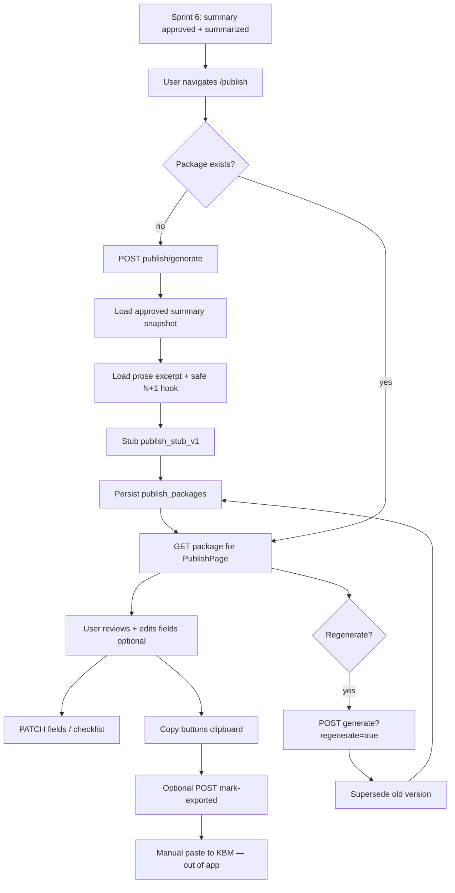

# 39 — Sprint 7 Publish Package / KBM Export Flow Implementation Plan

**Status:** Planning only — no migration, no API, no web integration yet  
**Date:** 8 Juni 2026  
**Repo:** `vibenovel-unified-blueprint`  
**Prerequisite docs:** `docs/38`, `docs/37`, `docs/36`, `docs/15`, `docs/13`, `docs/06`, `docs/07`

Dokumen ini adalah **rencana implementasi detail** untuk Sprint 7. Bukan migration, bukan kode production. Agent dan developer manusia wajib membaca ini sebelum menulis schema, API, atau mengubah PublishPage.

**Keputusan arsitektur Sprint 7 (user-approved direction):**

```txt
Publish package hanya boleh di-generate setelah chapter_summary status = approved.
Input utama: approved chapter_summary + current prose versions (excerpt only) + canon-safe metadata.
Output: copy-ready fields untuk KBM — bukan auto-post ke platform.
Publish package BUKAN canon — tidak menulis ke facts/characters/open_loops/reveals.
Belum OpenRouter / AI generation production — deterministic/stub generator MVP.
Regenerate membuat versi baru atau supersede draft — tidak mengubah summary/canon.
VITE_USE_MOCKS mock fallback tetap dihormati (parity mockPublishPackage).
```

**Handoff Sprint 6:** [`docs/38-sprint-6-verification-report.md`](38-sprint-6-verification-report.md) — summary approved + bab `summarized`; PublishPage masih mock Sprint 1.

---

## 1. Sprint 7 Goal

Mengubah **halaman Paket Publish** (`/projects/:id/publish`) dari mock Sprint 1 menjadi **workflow persistence nyata** yang menghasilkan aset publikasi siap salin untuk platform serial mobile (KBM-oriented) — tanpa integrasi auto-post.

### Hasil yang diharapkan di akhir Sprint 7

| Outcome | Keterangan |
|---|---|
| **Publish package persistence** | `publish_packages` tersimpan per bab setelah generation |
| **Copy-ready fields** | Judul bab, teaser, sinopsis pendek, caption, pertanyaan pembaca, teaser bab berikutnya, tags/genre |
| **Checklist & preview** | Checklist pra-publish + mobile preview excerpt — parity `mockPublishPackage` |
| **Regenerate** | User bisa regenerate paket (versi baru / supersede draft) tanpa mutasi canon |
| **Export/copy behavior** | Copy buttons browser clipboard; optional `exported` marker — **bukan** platform publish |
| **PublishPage API mode** | `usePublishData` + mock fallback; layout Sprint 1 tetap |
| **Belum KBM integration** | Tidak ada login platform, tidak ada auto-post |
| **Belum OpenRouter** | Stub generator; tidak klaim kualitas AI production |

### Apa yang masih belum Sprint 7

- KBM auto-post / platform login / OAuth platform
- OpenRouter / model routing / AI generation production
- Credit deduction / ledger (Sprint 8)
- Publish analytics / A/B caption testing
- Public landing page untuk cerita
- UI redesign total PublishPage
- Remote deploy / remote migration push
- Full LLM viral caption optimizer

---

## 2. Sprint 7 Scope

### In scope

| Area | Sprint 7 deliverable |
|---|---|
| **Database** | Migration `00006`: `publish_packages` (+ optional checklist storage strategy) |
| **Shared types** | `PublishPackage`, status enums, API contracts, safety flags |
| **Publish package generation API** | Stub dari approved summary + prose excerpt + safe next-chapter slice |
| **Field update / checklist API** | PATCH copy fields & checklist state sebelum user salin |
| **PublishPage web** | API mode + mock fallback; reuse komponen `components/publish/*` |
| **Safety tests** | API smoke: gate approved summary; no leak; no canon mutation |
| **Verification** | Sprint 7 smoke + laporan penutupan (`docs/40` nanti) |

### Wajib bahas (functional scope)

| Capability | Sprint 7 treatment |
|---|---|
| **Publish package generation** | POST generate setelah summary `approved`; stub `publish_stub_v1` |
| **Publish package versioning** | `package_version` + `is_current`; regenerate → supersede atau draft baru |
| **Copy-ready fields** | Kolom teks / typed JSON — semua field parity `PublishPackage` mock |
| **Tags / genre** | Dari `story_foundations.style_tags` + `genre`; cap 8 tags; bahasa Indonesia |
| **Checklist** | 5 item tetap (parity mock); state `checked` persisten; stub auto-check heuristics |
| **Mobile preview** | Excerpt ≤ 280 char dari prose beat pertama atau teaser — bukan full prose |
| **Regenerate package** | `?regenerate=true` → versi baru; summary tetap approved; tidak mutasi canon |
| **PublishPage web integration** | `usePublishData`; route `/projects/:id/publish`; chapter selector minimal (bab summarized) |
| **Mock fallback** | `VITE_USE_MOCKS=true` → `mockPublishPackage` penuh |
| **Export / copy behavior** | `CopyButton` clipboard browser; optional POST `mark-exported` — audit lokal saja |

### Alignment dengan Sprint 6

| Sprint 6 asset | Sprint 7 treatment |
|---|---|
| `chapter_summaries.status = approved` | **Gate wajib** POST generate publish package |
| `chapter_writing_states.status = summarized` | Gate tambahan — bab harus sudah ditutup di summary flow |
| `chapter_summary` fields (synopsis, ending_hook, mini_victory, emotional_outcome) | **Input utama** stub generator |
| `chapter_prose_versions` (current per beat) | **Read-only** — excerpt/preview only; tidak diexpose penuh |
| `chapter_outlines` (bab N+1) | **Slice safe** — hook / reader-facing teaser only untuk next chapter |
| `chapter_deltas` / `ai_proposals` | **Tidak dibaca** untuk publish MVP (hindari internal extraction leak) |
| `mockPublishPackage` | Parity target UI fields + `pageCopy` labels |
| `context_packet_logs` | **Tidak dibaca** — tidak di metadata response |

---

## 3. Database Design Proposal

Migration disarankan: `supabase/migrations/00006_sprint7_publish_package.sql`  
**Tidak mengubah** `00001`–`00005` destructive — hanya additive + enum baru.

### 3.1 Opsi schema — rekomendasi MVP

| Opsi | Tabel | Kelebihan | Kekurangan |
|---|---|---|---|
| **A (recommended MVP)** | `publish_packages` saja — kolom teks + `tags text[]` + `checklist_json` + `safety_flags` + `metadata` | Sederhana; parity API 1:1 mock; PATCH field mudah | Checklist tidak ter-normalize |
| B | `publish_packages` + `publish_package_fields` key/value | Fleksibel field dinamis | Over-engineering untuk field tetap mock |
| C | `publish_packages` + `publish_checklist_items` | PATCH checklist per baris | 2 tabel untuk 5 item statis |

**Rekomendasi Task 7.1:** Opsi **A** — satu tabel `publish_packages` dengan kolom eksplisit untuk copy fields. Checklist sebagai `jsonb` array tetap 5 item. Normalisasi `publish_package_fields` / `publish_checklist_items` → **deferred** kecuali Task 7.3 butuh query kompleks.

### 3.2 `publish_packages` (MVP)

Satu baris per **generation attempt**. Satu paket **current** per `(project_id, chapter_outline_id)`.

| Column | Type | Notes |
|---|---|---|
| `id` | uuid PK | |
| `project_id` | uuid FK → projects | Denormalized RLS |
| `chapter_outline_id` | uuid FK → chapter_outlines | Bab yang dipublish |
| `chapter_summary_id` | uuid FK → chapter_summaries | **Harus** `approved` saat generate |
| `chapter_number` | int | Denorm dari outline |
| `chapter_title` | text | Snapshot dari summary.title |
| `status` | enum | `draft`, `ready`, `exported`, `superseded` |
| `package_version` | int | Increment per regenerate |
| `is_current` | boolean | Satu `true` per bab |
| `display_title` | text | e.g. `Bab 1: Makan Malam yang Dingin` |
| `teaser` | text | Tanpa quote — UI menambah `"..."` |
| `short_synopsis` | text | Parity mock `blurb` |
| `caption` | text | Caption promosi |
| `reader_question` | text | Parity mock `commentBait` |
| `next_chapter_teaser` | text nullable | Safe slice bab N+1 |
| `tags` | text[] | Max 8 |
| `genre` | text nullable | Dari foundation/project |
| `mobile_preview_excerpt` | text | ≤ 280 char |
| `checklist_json` | jsonb | Array `{ id, label, checked }` |
| `safety_flags` | jsonb | Lihat §5 |
| `generator_version` | text | e.g. `publish_stub_v1` |
| `exported_at` | timestamptz nullable | Optional mark exported |
| `metadata` | jsonb | prose version ids used, stub markers — **no raw prose** |
| `created_at` / `updated_at` | timestamptz | |

**Partial unique (app rule MVP):** satu row `is_current = true` AND `status IN (draft, ready, exported)` per `(project_id, chapter_outline_id)`.

**Status semantics:**

| Status | Meaning |
|---|---|
| `draft` | Baru di-generate; belum user review checklist |
| `ready` | Semua checklist checked atau user explicitly mark ready (MVP: auto-ready setelah generate) |
| `exported` | User menandai sudah disalin / siap tayang manual |
| `superseded` | Digantikan regenerate |

**Relasi:**

```txt
publish_packages.project_id          → projects (RLS owner)
publish_packages.chapter_outline_id  → chapter_outlines (bab N)
publish_packages.chapter_summary_id  → chapter_summaries (approved, is_current)
```

**RLS:** `is_project_owner(project_id)` — sama pola `00005`.

### 3.3 Deferred tables

| Table | Defer reason |
|---|---|
| `publish_package_fields` | Field set tetap; kolom eksplisit cukup MVP |
| `publish_checklist_items` | 5 item statis; jsonb cukup |
| `publish_export_logs` | Analytics platform — Sprint 8+ |

### 3.4 Enum baru (shared + migration)

```ts
PUBLISH_PACKAGE_STATUSES = {
  draft: "draft",
  ready: "ready",
  exported: "exported",
  superseded: "superseded",
}
```

Extend `WORKFLOW_PHASES` (optional): `publishing` — atau tetap `summarized` sampai Sprint 8.

---

## 4. Source Boundary

### 4.1 Boleh dibaca (generator snapshot)

```txt
1. chapter_summaries WHERE status = approved AND is_current = true
   → title, synopsis, mini_victory, emotional_outcome, ending_hook, safety_flags
2. chapter_prose_versions WHERE is_current = true (per beat, ordered)
   → excerpt only: first sentence beat 1, total word_count — BUKAN full dump response
3. chapter_outlines (bab N)
   → title, hook (current chapter context only if needed)
4. chapter_outlines (bab N+1) IF exists
   → hook OR ending_hook OR first sentence summary — REDACTED safe teaser only
5. story_foundations
   → genre, style_tags, reader_promise (tone only — not planning_truth)
6. projects
   → title, genre
7. chapter_writing_states
   → status = summarized (gate)
```

### 4.2 Tidak boleh dibaca / expose

| Forbidden | Reason |
|---|---|
| `planning_truth` / `planningTruth` | Future plot leak |
| `context_packet_logs.packet_json` | Internal AI context |
| `chapter_deltas.delta_json` full | Internal extraction artifact |
| `ai_proposals.payload` | Internal proposal queue |
| Full prose text in API response | Leak + not copy-ready |
| Full outline plan dump (bab 2–10 summaries) | Future chapter leak |
| `planned_reveals` truth labels | Reveal gate violation |
| Open loops payoff details beyond reader_facing_hint | Spoiler risk |

### 4.3 Tidak boleh mutate

```txt
facts, characters, open_loops, reveals, chapter_summaries,
chapter_prose_versions, chapter_writing_states (except optional exported metadata in publish row only),
ai_proposals, story_foundations canon fields
```

Publish package adalah **artifact ekspor** — bukan sumber kebenaran cerita.

### 4.4 Next chapter teaser safety rule

```txt
IF chapter N+1 outline exists:
  nextChapterTeaser =
    IF N+1.hook present AND passes reveal gate (no forbidden labels)
      → truncate(hook, 200)
    ELSE IF N+1.ending_hook present AND safe
      → generic template "Bab berikutnya, [title] membawa [emotional_direction label]..."
    ELSE
      → fallback template tanpa plot detail
ELSE:
  → "Bab berikutnya akan segera hadir." (no future dump)
```

**Tidak** memakai `chapter_outlines.summary` penuh untuk bab N+1 — terlalu banyak spoiler.

---

## 5. Publish Package Content

### 5.1 Field mapping (mock parity → API → shared)

| Mock field (`PublishPackage`) | DB / shared field | Stub source MVP |
|---|---|---|
| `chapterTitle` | `chapter_title` | `chapter_summaries.title` |
| `title` | `display_title` | `` `Bab ${n}: ${chapter_title}` `` |
| `blurb` | `short_synopsis` | `chapter_summaries.synopsis` truncated 400 |
| `teaser` | `teaser` | `ending_hook` OR first sentence synopsis |
| `caption` | `caption` | `emotional_outcome` + `mini_victory` stub sentence |
| `commentBait` | `reader_question` | Template + character name from summary items OR generic |
| `nextChapterTeaser` | `next_chapter_teaser` | Safe N+1 hook slice (§4.4) |
| `tags` | `tags` | `foundation.style_tags` + genre keyword map |
| (implicit) | `genre` | `foundation.genre` OR `projects.genre` |
| `mobilePreview.excerpt` | `mobile_preview_excerpt` | First sentence prose beat 1 OR teaser |
| `checklist` | `checklist_json` | Fixed 5 labels parity mock + heuristic `checked` |
| — | `safety_flags` | See below |

### 5.2 Checklist items (fixed MVP — parity mock)

```json
[
  { "id": "chk-teaser", "label": "Teaser menggoda tanpa membuka rahasia besar", "checked": false },
  { "id": "chk-caption", "label": "Caption siap untuk sosial media", "checked": false },
  { "id": "chk-tags", "label": "Tag/genre sudah sesuai arah cerita", "checked": false },
  { "id": "chk-question", "label": "Pertanyaan pembaca sudah ada", "checked": false },
  { "id": "chk-preview", "label": "Preview terbaca nyaman di layar HP", "checked": false }
]
```

Stub auto-check: set `checked: true` when heuristic passes (teaser 40–200 char, caption non-empty, tags ≥ 3, reader_question ends with `?`, excerpt ≤ 280).

### 5.3 Safety flags (`PublishSafetyFlags`)

```ts
PublishSafetyFlags {
  possibleSpoilerInTeaser?: boolean
  possibleFutureLeakInNextTeaser?: boolean
  genericCaption?: boolean
  stubGenerated?: boolean          // always true MVP
  summaryProseMismatch?: boolean   // if excerpt diverges from synopsis
  overclaimUnlock?: boolean        // if text contains "dijamin viral" patterns
  revealRisk?: boolean
}
```

Reuse assertion helpers dari `summary-safety.ts` / `prose-draft.ts` `PROSE_LEAKAGE_MARKERS`.

### 5.4 `metadata` (internal only — not in web DOM)

```json
{
  "generatorVersion": "publish_stub_v1",
  "chapterSummaryId": "uuid",
  "proseVersionIds": ["uuid"],
  "generatedAt": "ISO",
  "stubMarker": true
}
```

---

## 6. Stub Strategy

Karena belum OpenRouter, Sprint 7 memakai **deterministic stub generator** — selaras pola `summary_stub_v1` dan `chapter_delta_v1_stub`.

### 6.1 Inputs

```txt
PublishGenerationSnapshot {
  approvedSummary: ChapterSummary
  beatProseExcerpts: { beatNumber, firstSentence, wordCount }[]  // not full text in response
  currentChapterOutline: ChapterOutline slice
  nextChapterOutline: { title, hook, endingHook } | null           // safe fields only
  foundation: { genre, styleTags, readerPromise }
  project: { title, genre }
}
```

### 6.2 Generator (`publish_stub_v1`)

| Output | Rule |
|---|---|
| `teaser` | `ending_hook` if len 40–300 else `firstSentence(synopsis)` |
| `short_synopsis` | `truncate(synopsis, 400)` |
| `caption` | `` `${emotional_outcome}. ${mini_victory}.` `` with fallback template |
| `reader_question` | `` `Kalau jadi [pov name], kamu akan ...?` `` or open-loop style template |
| `tags` | `style_tags.slice(0,5)` + genre slug humanized |
| `mobile_preview_excerpt` | `firstSentence(prose beat 1)` or teaser |

**Tidak** memanggil LLM. **Tidak** klaim kualitas AI. **Tidak** credit deduction.

### 6.3 Regenerate behavior

- `POST generate` tanpa `regenerate`: return existing `is_current` jika status `draft|ready|exported`
- `POST generate?regenerate=true`: mark old `is_current` → `superseded`; INSERT new version `package_version++`
- Summary tetap `approved` — tidak re-trigger summary flow

### 6.4 Service files (Task 7.2)

```txt
apps/api/src/services/publish-snapshot.ts        (load approved summary + safe sources)
apps/api/src/services/publish-package-generator.ts (stub)
apps/api/src/services/publish-package.ts         (orchestration, gates, persistence)
apps/api/src/routes/publish.ts                   (routes)
```

---

## 7. API Task Breakdown

Urutan implementasi disarankan. **Task 7.5 safety tests wajib PASS sebelum menutup Sprint 7.**

### Task 7.1 — Publish Package Data Model + Shared Types

- Migration `00006_sprint7_publish_package.sql`
- Enums/types di `@vibenovel/shared` — `PublishPackage`, `PublishChecklistItem`, `PUBLISH_PACKAGE_STATUSES`
- RLS + indexes
- `supabase/README.md` section 00006
- **Acceptance:** `supabase db reset` PASS
- **Jangan mulai 7.2** sampai 7.1 approved

### Task 7.2 — Publish Package Generation API

```txt
POST /api/projects/:id/publish/generate
  body: { chapterOutlineId } OR { chapterSummaryId }
  query: ?regenerate=true (optional)
  gate: summary approved + writing_state summarized
  returns: PublishPackageDetail (copy-ready fields, no raw prose)

GET  /api/projects/:id/publish/by-chapter/:chapterOutlineId   # current package
GET  /api/projects/:id/publish/:packageId
```

- Collect snapshot; run `publish_stub_v1`; persist `publish_packages`
- **Acceptance:** 409 if summary not approved; no fact INSERT; no full prose in JSON

### Task 7.3 — Publish Package Field Update / Checklist / Export Marker API

```txt
PATCH /api/projects/:id/publish/:packageId/fields
  body: partial { teaser, shortSynopsis, caption, readerQuestion, nextChapterTeaser, tags, ... }
  validate lengths + safety assertion on user edits

PATCH /api/projects/:id/publish/:packageId/checklist
  body: { items: [{ id, checked }] } OR single item update

POST /api/projects/:id/publish/:packageId/mark-exported
  → status=exported, exported_at=now()
  → NO platform API call
```

- **Acceptance:** user can edit caption before copy; checklist persists; mark-exported does not mutate canon

### Task 7.4 — PublishPage Web Integration

- `apps/web/src/services/publish.ts`
- `apps/web/src/hooks/usePublishData.ts`
- `apps/web/src/lib/publish-mappers.ts`
- Wire `PublishPage.tsx` — API mode + mock fallback + `IntegrationNotice`
- Gate UI: CTA generate jika belum ada package; notice jika summary belum approved
- `VITE_USE_MOCKS=true` unchanged
- **Acceptance:** mock parity; API mode loads real package after smoke flow

### Task 7.5 — Safety / Regression Tests

- `scripts/sprint7-smoke-api.ps1` — new script
- `scripts/sprint7-smoke-web.ps1` + `apps/web/e2e/sprint7-publish-flow.spec.ts`
- `npm run smoke:api:sprint6` regression MUST remain PASS
- **BLOCKER:** Task 7.6 tidak mulai sebelum 7.5 PASS

### Task 7.6 — Sprint 7 Verification Report

- Output: `docs/40-sprint-7-verification-report.md`
- `npm run typecheck` + build + `supabase db reset` + sprint7 smoke + sprint6 regression

### Task yang **sengaja tidak** masuk Sprint 7

| Item | Defer |
|---|---|
| OpenRouter publish copywriter | Sprint 8+ / explicit task |
| KBM auto-post | Never MVP without explicit scope |
| Credit deduction on regenerate | Sprint 8 |
| `publish_package_fields` normalized table | Backlog |
| Publish analytics dashboard | Post-MVP |

---

## 8. API Flow



### Step detail

| Step | Actor | Persistence | Canon? |
|---|---|---|---|
| Gate `summary approved` | API | Read `chapter_summaries` | No |
| Gate `summarized` | API | Read `chapter_writing_states` | No |
| Collect summary + excerpt | API | Read only | No |
| Generate package | API stub | INSERT `publish_packages` | No |
| Review / edit fields | User | PATCH publish row | No |
| Copy to clipboard | User/browser | None | No |
| Mark exported | User/API | UPDATE status, exported_at | No |
| Regenerate | User/API | Supersede + INSERT new version | No |

### Gate errors (API)

| Condition | HTTP | `details.missing` |
|---|---|---|
| Summary not `approved` | 409 | `["summary_approved"]` |
| Writing state not `summarized` | 409 | `["chapter_summarized"]` |
| No approved summary for chapter | 404 | — |
| Cross-user | 404 | — |
| Regenerate on exported (optional strict) | 409 | `["package_exported"]` (defer — MVP allow regenerate) |
| Field PATCH with leak markers | 400 | `["unsafe_content"]` |

---

## 9. Web Scope

### Halaman disentuh

| Route | Component | Integration |
|---|---|---|
| `/projects/:id/publish` | `PublishPage` | Package load, generate, edit optional, copy |

### Komponen existing (reuse, no redesign)

```txt
PublishPageHeader, PublishCopyFieldCard, PublishTagsCard,
PublishChecklistCard, PublishMobilePreview, PublishActionSection
```

### Perubahan minimal

| Component | Change |
|---|---|
| `PublishPage` | `usePublishData` instead of hardcoded `mockPublishPackage` |
| `PublishChecklistCard` | Optional: toggle checked via API (Task 7.3) — or read-only MVP with PATCH on footer action |
| `PublishActionSection` | Wire routes from API project id; optional "Generate ulang" CTA |
| New `PublishGenerateBanner` (minimal) | Shown when no package + summary approved |

### Tidak disentuh

```txt
/summary (except nav link), /write, /outline, /foundation, /intake
```

### Fallback & safety (reuse Sprint 6 pattern)

| Condition | Behavior |
|---|---|
| `VITE_USE_MOCKS=true` | `mockPublishPackage` penuh |
| API error / no auth | Mock + `IntegrationNotice` |
| Summary not approved | Empty state + notice "Setujui ringkasan bab dulu di halaman Ringkasan" |
| No package yet | CTA "Buat paket publish" → API generate (API mode) |
| Bab not summarized | Notice "Selesaikan alur ringkasan terlebih dahulu" |

### Batasan UI

- Jangan redesign total Stitch layout (`paket_publish_bab_kbm_optimized`)
- `VITE_USE_MOCKS` tetap dihormati
- No OpenRouter UI — no model picker
- No raw `metadata` / `prose_text` / `delta_json` in DOM
- No `planningTruth` in DOM
- Copy buttons tetap `CopyButton` browser clipboard — no platform publish button
- Teaser display tetap dengan quote wrapper di UI: `"${teaser}"`

---

## 10. Safety Tests

Script: `scripts/sprint7-smoke-api.ps1` — target **≥ 18 tests PASS**.  
Regression: `scripts/sprint6-smoke-api.ps1` **59/59 tetap PASS**.

### Wajib

| # | Test | Method |
|---|---|---|
| 1 | Generate requires `summary approved` | POST generate before approve → 409 |
| 2 | Generate requires `summarized` writing state | POST before approve flow → 409 |
| 3 | Publish generation does not mutate `facts` | Count before/after generate |
| 4 | Publish generation does not mutate `chapter_summaries` | Status unchanged |
| 5 | Response no `planningTruth` / `planning_truth` | JSON keys + regex |
| 6 | Response no `packet_json` / `context_packet` | JSON keys + regex |
| 7 | Response no raw `prose_text` full dump | Max excerpt length field only |
| 8 | Response no full `delta_json` | Absent from publish GET |
| 9 | Next chapter teaser does not contain N+2+ outline summary | Only N+1 safe hook |
| 10 | `publish_packages` cross-user → 404 | Second user JWT |
| 11 | Regenerate creates new version | `package_version` increment; old superseded |
| 12 | Regenerate does not change canon | facts count stable |
| 13 | PATCH field rejects leak markers | 400 on `packet_json` in caption |
| 14 | Mark exported does not call external platform | Local status only |
| 15 | GET by-chapter returns `is_current` package | Correct row |
| 16 | Tags array present and bounded | length ≤ 8 |
| 17 | Checklist items present (5) | Array count |
| 18 | Sprint 6 smoke regression | Run `sprint6-smoke-api.ps1` |
| 19 | No token / 401 on protected publish endpoints | Auth gate |
| 20 | `safety_flags.stubGenerated` true in stub mode | Metadata/schema check |

### Web E2E (Task 7.5)

| Test | Method |
|---|---|
| Mock `/publish` render parity | Playwright |
| API mode: generate → display fields | `-IncludeApiMode` |
| No `planningTruth` / `prose_text` / `packet_json` in DOM | Regex |
| Copy buttons present for all copy fields | Role/locator |
| `VITE_USE_MOCKS=true` unchanged | Default smoke |
| Checklist + mobile preview visible | Text locators |

### CI

- Local smoke only (GitHub Actions defer, sama Sprint 3–6)
- `npm run smoke:api` Sprint 2 regression tetap PASS

---

## 11. Out of Scope Sprint 7

Tegaskan — **tidak** dikerjakan di Sprint 7 kecuali task terpisah disetujui:

- KBM auto-post / platform login / OAuth KBM
- OpenRouter production / model routing / AI generation production
- AI caption optimizer / viral score predictor
- Credit deduction / ledger writes
- Publish analytics / impression tracking
- Public story landing page
- `publish_package_fields` tabel terpisah (kecuali refactor eksplisit)
- Automatic canon mutation dari publish package
- Publish package menjadi sumber canon untuk Context Packet
- UI redesign PublishPage
- Remote Cloudflare deploy / remote migration push
- Web E2E in GitHub Actions CI (optional local `smoke:web:publish`)
- Multi-chapter bulk publish export
- Scheduled / timed platform release

---

## 12. Acceptance Criteria Sprint 7

| Kriteria | Verifiable by |
|---|---|
| Approved summary required | API 409 + web notice |
| Chapter summarized required | API 409 |
| Publish package generated and persisted | POST generate → DB row + GET |
| Copy-ready fields returned | GET matches mock field set |
| PublishPage reads real package in API mode | `usePublishData` + E2E |
| Copy buttons still work | Playwright click + clipboard API or value attribute |
| Mock fallback preserved | `VITE_USE_MOCKS=true` smoke |
| User can edit fields before copy | PATCH fields smoke |
| Regenerate creates versioned package | version++ smoke |
| Canon unchanged by publish flow | facts/summary count smoke |
| Sprint 6 smoke regression PASS | `smoke:api:sprint6` 59/59 |
| No planningTruth / packet / prose leak | Regex smoke |
| typecheck/build/smoke PASS | Local scripts |

---

## 13. Risks & Guardrails

| Risk | Guardrail |
|---|---|
| **Overclaim viral / guaranteed unlock** | Stub templates avoid "dijamin viral", "pasti trending"; `overclaimUnlock` flag; user edits |
| **Spoiler in teaser** | Prefer `ending_hook` over full synopsis; `possibleSpoilerInTeaser` flag; checklist item |
| **Future reveal leak in next chapter teaser** | N+1 hook only; no full summary; reveal gate keyword block; fallback generic |
| **Generic caption** | Flag `genericCaption`; user PATCH encouraged; not hidden |
| **KBM formatting mismatch** | Plain text fields; no HTML in stub; user copy-paste control |
| **User losing control over final copy** | All fields PATCH-able; regenerate optional; no auto-post |
| **Publish package becoming canon accidentally** | No FK from canon tables to publish; no promotion service; documented non-canon |
| **Full prose leak in API** | Excerpt max 280; reuse `PROSE_LEAKAGE_MARKERS` |
| **Summary not approved bypass** | Hard gate 409; web empty state |
| **Sprint 6 regression** | Task 7.5 runs sprint6 smoke mandatory |

---

## 14. Recommended First Coding Task

### **Task 7.1 — Publish Package Data Model + Shared Types**

Alasan:

1. Semua API tasks (7.2–7.4) bergantung pada schema dan `@vibenovel/shared` contracts.
2. Enum `publish_package_status` harus ada sebelum generator ditulis.
3. Parity `PublishPackage` mock → shared domain type mendefinisikan kontrak web/API.
4. Pola Sprint 6.1 terbukti aman: migration-only task dengan `supabase db reset` gate.

**Deliverables Task 7.1:**

- `supabase/migrations/00006_sprint7_publish_package.sql`
- `packages/shared` — `PublishPackage`, checklist types, `PUBLISH_PACKAGE_STATUSES`, safety flags
- `supabase/README.md` — section migration 00006
- Work log: `.agent-logs/sprint-7/task-7.1-publish-package-data-model.md`

**Jangan mulai Task 7.2** sampai Task 7.1 di-approve.

**Jangan implement OpenRouter** di Sprint 7 kecuali task eksplisit disetujui.

---

## Related documents

- [`docs/38-sprint-6-verification-report.md`](38-sprint-6-verification-report.md)
- [`docs/37-sprint-6-chapter-summary-delta-canon-proposal-implementation-plan.md`](37-sprint-6-chapter-summary-delta-canon-proposal-implementation-plan.md)
- [`docs/36-non-blocking-technical-debt-and-deferred-items.md`](36-non-blocking-technical-debt-and-deferred-items.md)
- [`docs/15-publish-package-and-growth-tools.md`](15-publish-package-and-growth-tools.md)
- [`docs/06-reveal-gate-and-future-leak-prevention.md`](06-reveal-gate-and-future-leak-prevention.md)
- [`apps/web/src/mocks/publishPackage.ts`](../apps/web/src/mocks/publishPackage.ts)
- [`apps/web/src/pages/PublishPage.tsx`](../apps/web/src/pages/PublishPage.tsx)
- [`apps/api/src/services/chapter-summary.ts`](../apps/api/src/services/chapter-summary.ts)
- [`apps/api/src/services/prose-draft.ts`](../apps/api/src/services/prose-draft.ts)
- `.agent-logs/sprint-7/`