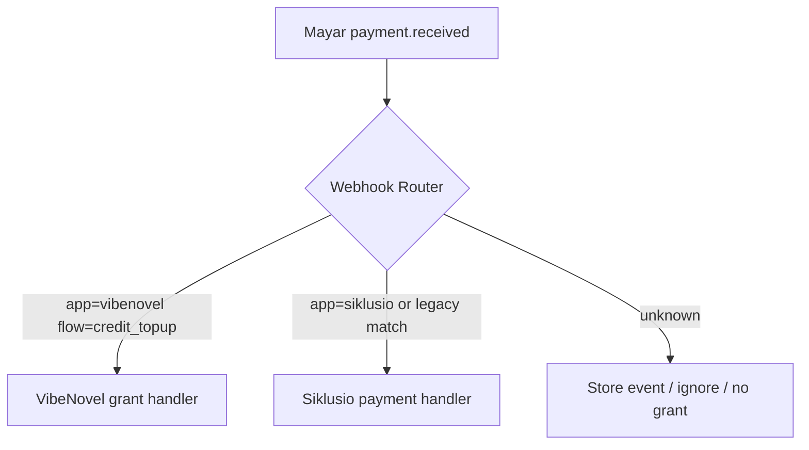

# 50 — Sprint 10 Production Readiness & Mayar Monetization Plan

**Sprint:** Sprint 10 — Production Readiness & Credit Topup (Mayar)  
**Status:** Closed (Task 10.7 — [`docs/53`](53-sprint-10-verification-report.md))  
**Date:** 8 Juni 2026  
**Repo:** `vibenovel-unified-blueprint`  
**Prerequisite:** [`docs/49-sprint-9-verification-report.md`](49-sprint-9-verification-report.md), [`docs/36-non-blocking-technical-debt-and-deferred-items.md`](36-non-blocking-technical-debt-and-deferred-items.md)

Dokumen ini adalah **rencana implementasi Sprint 10** untuk production readiness dan monetisasi kredit via **Mayar Headless API**. Task 10.0 tidak mengimplementasikan kode — hanya merancang arsitektur, data model, keamanan, smoke, dan urutan task.

**Mayar docs consulted (official):**

- [Introduction](https://docs.mayar.id/api-reference/introduction) — auth, sandbox, base URL
- [Create Invoice](https://docs.mayar.id/api-reference/invoice/create)
- [Get Invoice Detail / Status](https://docs.mayar.id/api-reference/invoice/detail)
- [Webhook integration](https://docs.mayar.id/integration/webhook)
- [Register Webhook URL](https://docs.mayar.id/api-reference/webhook/registerurlhook)

**Work log:** [`.agent-logs/sprint-10/task-10.0-production-readiness-mayar-monetization-plan.md`](../.agent-logs/sprint-10/task-10.0-production-readiness-mayar-monetization-plan.md)

---

## 1. Executive Summary

Sprint 2–9 telah menyelesaikan MVP end-to-end **ide → intake → foundation → outline → write → summary → publish**, plus **AI credit-gated generation** (prose beat, rewrite, publish copy) dengan debit/refund idempotent, audit, dan smoke matrix yang diverifikasi.

**Sprint 10** memfokuskan:

1. **Production readiness** — env/secrets, deploy checklist, monitoring, support playbook
2. **Monetisasi** — credit topup via **Mayar** invoice + webhook
3. **Keamanan pembayaran** — server-side product/amount, idempotent grant, tidak ada double-credit

Mayar dipilih sebagai payment provider karena Headless API (`POST /invoice/create`, `GET /invoice/{id}`), webhook JSON `POST application/json`, sandbox (`web.mayar.club`), dan registrasi webhook via dashboard atau `POST /webhook/register`.

**Prinsip keras:**

- Pembayaran sukses **tidak boleh** memberi kredit dua kali (webhook replay-safe).
- User **tidak pernah** memutasi `credit_balances` dari client.
- Payment flow **tidak** memicu AI generation atau mutasi canon.
- `MAYAR_API_KEY` server-only (Worker secret / `.dev.vars` gitignored).
- Topup **disabled by default** (`CREDIT_TOPUP_ENABLED=false`) sampai sandbox Go/No-Go.

---

## 2. Current State

### What exists

| Area | Status |
|---|---|
| Credit debit/refund (AI usage) | ✅ `credit-ledger.ts` — idempotent per `attemptId` + reason |
| `credit_balances` + `credit_ledger` | ✅ Migration `00008`; RLS owner read; service_role write |
| `credit_ledger_direction` enum | ✅ `debit`, `credit`, `refund` — **`credit` belum dipakai di service** |
| Credit cost policy | ✅ Fixed table: prose_beat 5/10/20; rewrite & publish_copy 3/6/12 |
| `GET /api/credits/balance` | ✅ Read-only; no mutation |
| WritePage credit UI | ✅ Balance + cost display; insufficient guard |
| AI generation | ✅ Mock + API-mode verified; **disabled default** |
| `smoke:all:local` | ✅ **13/13 PASS** (Task 9.9) |
| OpenRouter live prose beat | ✅ GO ([`docs/47`](47-live-openrouter-staging-smoke-report.md)) |
| Transaction-like compensation | ✅ `TransactionPlan` for debit/refund — **true DB RPC deferred** |

### What does not exist

| Gap | Notes |
|---|---|
| Credit topup / payment | No checkout, no Mayar integration |
| Payment tables | No `credit_topup_products`, orders, webhook log |
| `grantCreditsForPaymentSession` | No ledger `credit` direction writer |
| Admin / ops dashboard | No payment session inspect UI |
| Production deploy | Local Wrangler + Supabase only |
| Live rewrite/publish copy | NOT RUN (non-blocking) |

### Remaining non-blocking ([`docs/36`](36-non-blocking-technical-debt-and-deferred-items.md))

- True DB RPC for credit + payment grant atomicity (**P1 before production**)
- CI API-mode E2E
- Live rewrite/publish OpenRouter spot check
- Topup/payment — **Sprint 10 scope**
- Admin credit dashboard — minimal ops in 10.6
- Summary/delta AI, foundation AI — post-MVP

---

## 3. Monetization Model Proposal

> **Catatan:** Harga dan paket di bawah adalah **proposal bisnis awal**, bukan keputusan final. Validasi dengan early adopter KBM Indonesia sebelum production.

### Credit consumption reference (server-fixed)

| Generation | hemat | seimbang | terbaik |
|---|---|---|---|
| prose_beat | 5 | 10 | 20 |
| prose_rewrite | 3 | 6 | 12 |
| publish_copy | 3 | 6 | 12 |

### Estimated usage per chapter (rough)

| Persona | Typical credits/chapter |
|---|---|
| Hemat, minimal rewrite | ~11 (5 beat + 3 publish + 3 rewrite) |
| Seimbang, normal polish | ~22 (10 + 6 + 6) |
| Terbaik, heavy iteration | ~44+ (20 + 12 + 12, plus extra rewrites) |

### Proposed credit packages

| Slug | Nama | Kredit | Bonus | Harga IDR (proposal) | Indikatif chapter (hemat) |
|---|---|---:|---:|---:|---|
| `starter` | Paket Starter | 100 | 0 | Rp 39.000 | ~9 bab ringan |
| `creator` | Paket Creator | 300 | 20 | Rp 99.000 | ~27 bab |
| `pro` | Paket Pro | 700 | 50 | Rp 199.000 | ~63 bab |
| `studio` | Paket Studio | 1.500 | 150 | Rp 399.000 | ~136 bab |

**Positioning:** Early-adopter friendly — Creator sebagai paket default yang direkomendasikan di UI; Studio untuk penulis serial aktif.

### Free initial credits (proposal)

| Option | Credits | Guardrails (planned) |
|---|---:|---|
| A — conservative | 50 | One-time per `user_id`; flag `welcome_credit_granted_at` on profile or ledger reason `welcome_bonus` |
| B — generous | 100 | Same + require verified email before AI debit (future) |

**Abuse prevention (deferred detail, Task 10.1+):**

- Idempotent welcome grant per user (DB unique constraint on reason + user)
- Rate limit checkout creation per user/hour
- No welcome grant on duplicate signup patterns (ops review)
- Payment/topup still required for sustained usage

---

## 4. Mayar Integration Architecture

```
┌─────────────┐     A. pilih paket      ┌──────────────────┐
│  Web UI     │ ──────────────────────► │ POST /api/credits│
│  Topup page │                         │ /topup/checkout  │
└─────────────┘                         └────────┬─────────┘
       ▲                                         │ B. auth + validate product
       │                                         │ C. create credit_topup_order (pending)
       │                                         ▼
       │                                ┌──────────────────┐
       │ F. redirectUrl                 │ Mayar Client     │
       └────────────────────────────────│ POST /invoice/   │
                                        │ create           │
                                        └────────┬─────────┘
                                                 │ D. id, transactionId, link
                                                 ▼
                                        ┌──────────────────┐
                                        │ Store provider   │
                                        │ ids + payment_url│
                                        └────────┬─────────┘
       ┌────────────────────────────────────────┘
       │ E. return { paymentUrl }
       ▼
┌─────────────┐     pay on Mayar      ┌──────────────────┐
│ User browser│ ────────────────────► │ Mayar hosted     │
│             │ ◄── redirectUrl ─── │ invoice page     │
└─────────────┘                       └────────┬─────────┘
                                               │ G. payment.received webhook
                                               ▼
                                      ┌──────────────────┐
                                      │ POST /api/payments│
                                      │ /mayar/webhook   │
                                      └────────┬─────────┘
                                               │ H. verify + idempotent process
                                               │ I. grantCreditsForPaymentSession
                                               ▼
                                      ┌──────────────────┐
                                      │ credit_ledger    │
                                      │ direction=credit │
                                      │ credit_balances↑ │
                                      └──────────────────┘
                                               │
       ┌───────────────────────────────────────┘
       │ J. poll balance / order status
       ▼
┌─────────────┐
│ UI success/ │
│ pending page│
└─────────────┘
```

**Boundaries:**

- Frontend hanya memanggil checkout API dengan `productId` / `packageSlug` — **bukan** amount/credits.
- Mayar `link` / `paymentUrl` dibuka di browser user (redirect atau new tab).
- **Redirect alone does not grant credits** — grant hanya dari webhook (atau verified server poll + webhook lag handling).
- Tidak ada AI route, canon route, atau publish mutation dalam payment path.

---

## 5. Proposed Data Model

### Schema assessment

**Existing schema is insufficient** for payment topup. Migration **`00009_sprint10_payment_topup.sql`** (or `00010` if `00009` taken) **required**.

**`credit_ledger_direction`:** Enum sudah punya nilai `credit` (migration `00008`). **Tidak perlu** nilai enum baru `grant`/`topup` — gunakan `direction = credit` dengan `reason = credit_topup` (dan `welcome_bonus` terpisah). Konsisten dengan komentar migration: *"direction determines debit/refund/credit semantics"*.

**`credit_ledger.attempt_id`:** Nullable — untuk topup, `attempt_id = NULL`; referensi `credit_topup_order_id` di `metadata`.

### Table A: `credit_topup_products`

| Column | Type | Notes |
|---|---|---|
| `id` | uuid PK | |
| `slug` | text UNIQUE NOT NULL | e.g. `creator` |
| `name` | text NOT NULL | Display name |
| `price_idr` | integer NOT NULL | Server authority; CHECK > 0 |
| `credits` | integer NOT NULL | Base credits |
| `bonus_credits` | integer NOT NULL DEFAULT 0 | |
| `is_active` | boolean NOT NULL DEFAULT true | |
| `sort_order` | integer NOT NULL DEFAULT 0 | |
| `metadata` | jsonb DEFAULT `{}` | Marketing copy, badges — no secrets |
| `created_at` / `updated_at` | timestamptz | |

RLS: authenticated SELECT active products only; mutations service_role / admin.

Seed in migration: four packages from §3.

### Table B: `credit_topup_orders`

| Column | Type | Notes |
|---|---|---|
| `id` | uuid PK | Internal orderId → Mayar `extraData` |
| `user_id` | uuid FK profiles NOT NULL | |
| `product_id` | uuid FK credit_topup_products | |
| `provider` | text NOT NULL DEFAULT `mayar` | Future-proof |
| `provider_invoice_id` | text | Mayar `data.id` |
| `provider_transaction_id` | text | Mayar `data.transactionId` |
| `payment_url` | text | Mayar `data.link` |
| `amount_idr` | integer NOT NULL | Copied from product at checkout |
| `credits_to_grant` | integer NOT NULL | `credits + bonus_credits` at checkout |
| `status` | enum | `pending`, `paid`, `expired`, `failed`, `cancelled` |
| `idempotency_key` | text NOT NULL | Per checkout attempt; UNIQUE per user |
| `provider_payload_safe` | jsonb | Sanitized create response — no secrets |
| `paid_at` | timestamptz | |
| `expires_at` | timestamptz | Align Mayar invoice expiry |
| `created_at` / `updated_at` | timestamptz | |

Indexes: `(user_id, created_at DESC)`, `(provider_invoice_id)`, `(provider_transaction_id)`, UNIQUE `(idempotency_key)`.

### Table C: `payment_webhook_events`

| Column | Type | Notes |
|---|---|---|
| `id` | uuid PK | |
| `provider` | text NOT NULL DEFAULT `mayar` | |
| `provider_event_id` | text | `data.id` from webhook if present |
| `provider_transaction_id` | text | |
| `provider_invoice_id` | text | |
| `event_type` | text | e.g. `payment.received` |
| `payload_hash` | text NOT NULL | SHA-256 of raw body — replay detection |
| `payload_safe_json` | jsonb | Redacted copy |
| `processed_at` | timestamptz | |
| `processing_status` | enum | `received`, `processed`, `ignored`, `failed` |
| `error_message_safe` | text | |
| `created_at` | timestamptz NOT NULL DEFAULT now() | |

UNIQUE `(provider, payload_hash)` or `(provider, provider_event_id)` where available.

### `credit_ledger` extension (usage, not schema change)

New rows on successful topup:

```txt
direction: credit
reason: credit_topup
amount: credits_to_grant
project_id: NULL
attempt_id: NULL
metadata: { paymentSessionId, providerTransactionId, productSlug }
```

### Shared types / audit (migration additions)

- `credit_topup_order_status` enum
- `payment_webhook_processing_status` enum
- `AUDIT_ENTITY_TYPES`: `credit_topup_product`, `credit_topup_order`, `payment_webhook_event`
- `AUDIT_ACTIONS`: see §12
- Optional `CREDIT_BALANCE_SOURCES.topup` or keep `ledger` with metadata

---

## 6. Mayar Invoice Create Plan

### Proposed API (Task 10.2 — not implemented in 10.0)

```http
POST /api/credits/topup/checkout
Authorization: Bearer <supabase-jwt>
Content-Type: application/json

{ "productSlug": "creator" }
```

### Server behavior

1. Gate: `CREDIT_TOPUP_ENABLED=true` (else 503 `TOPUP_DISABLED`).
2. Auth required — `401` without token.
3. Load active product by slug — `404` if inactive/missing.
4. Load user profile — `name`, `email`; `mobile` from profile or fallback (see §18).
5. Generate `credit_topup_orders` row `status=pending`, `idempotency_key` (client header or server UUID).
6. Call Mayar `POST {MAYAR_BASE_URL}/invoice/create` with `Authorization: Bearer {MAYAR_API_KEY}`.

### Mayar request body (mapped)

| Mayar field | VibeNovel source |
|---|---|
| `name` | Profile display name |
| `email` | Auth email |
| `mobile` | Profile phone or fallback placeholder (sandbox) |
| `redirectUrl` | `{MAYAR_REDIRECT_BASE_URL}/credits/topup/return?orderId={uuid}` |
| `description` | `VibeNovel Credit Pack - {product.name}` |
| `expiredAt` | ISO 8601 UTC — e.g. now + 24h |
| `items[0].quantity` | `1` |
| `items[0].rate` | `product.price_idr` |
| `items[0].description` | `{product.name} - {credits} kredit` |
| `extraData.orderId` | Internal `credit_topup_orders.id` |
| `extraData.userId` | `user_id` (for webhook correlation) |
| `extraData.productSlug` | Product slug |
| `extraData.credits` | `credits_to_grant` (informational for ops) |
| `extraData.environment` | `sandbox` / `production` |

Mayar docs example also shows `extraData.noCustomer` and `extraData.idProd` — map `noCustomer` → `orderId`, `idProd` → `productSlug` for compatibility.

### Mayar response handling

Store from `data`: `id` → `provider_invoice_id`, `transactionId` → `provider_transaction_id`, `link` → `payment_url`, `expiredAt` → `expires_at`.

Return to frontend:

```json
{
  "orderId": "...",
  "paymentUrl": "https://....mayar.shop/invoices/...",
  "expiresAt": "...",
  "amountIdr": 99000,
  "creditsToGrant": 320
}
```

### Security

- Reject client-supplied `price_idr` / `credits`.
- Never log `MAYAR_API_KEY` or full provider Authorization header.
- Sanitize `provider_payload_safe` before persist (strip tokens).
- Rate limit checkout per user (e.g. 10/hour — implementation Task 10.2).

---

## 7. Mayar Webhook Plan

### Proposed API (Task 10.3)

```http
POST /api/payments/mayar/webhook
Content-Type: application/json
```

**No Supabase JWT** — public endpoint protected by validation + idempotency (signature TBD — see §18).

### Mayar contract (from official docs)

- Method: **POST**
- Content-Type: **application/json**
- Relevant event: **`payment.received`** — customer completed payment
- Other events: `payment.reminder`, membership events — **ignore** for credit topup v1
- Payload fields (per Mayar docs): `event` (type), `data.id`, `data.status` (boolean), `data.amount`, `data.customerEmail`, `data.productId`, `data.productName`, timestamps, etc.

> **Sandbox caveat:** Exact JSON shape must be **captured empirically** in Task 10.5 before production. Plan fail-safe: store raw event (hashed), process only when correlation + amount + status checks pass.

### Processing algorithm

```
1. Read raw body → compute payload_hash
2. INSERT payment_webhook_events (processing_status=received)
   ON CONFLICT (provider, payload_hash) → return 200 (replay)
3. Parse event_type
4. If event_type != payment.received → mark ignored, return 200
5. Resolve credit_topup_order:
   - extraData.orderId from invoice create (if echoed in webhook), OR
   - provider_invoice_id / provider_transaction_id / customerEmail+amount match
6. If no order → mark failed/ignored, log audit, return 200 (no grant)
7. If order.status == paid → return 200 no-op (idempotent)
8. Verify data.status indicates success (boolean true per docs)
9. Verify data.amount == order.amount_idr (tolerance 0 — exact match)
10. UPDATE order status=paid, paid_at=now()
11. grantCreditsForPaymentSession(orderId)
12. Mark webhook processed; audit payment_webhook_processed + credit_topup_granted
13. On grant failure: order stays paid, webhook failed, ops retry path (§10)
```

### Fail-safe rules

- Unrecognized invoice → **no grant** (log for manual review).
- Amount mismatch → **no grant**, flag `processing_status=failed`.
- Duplicate webhook → **200 OK**, no double grant.
- Never trust redirect URL query params alone for grant.

### Optional reconciliation

`GET /invoice/{id}` poll from ops or delayed job if webhook slow — **secondary** to webhook; not v1 user-facing grant trigger without idempotency guard.

---

## 8. Credit Granting Service

### Proposed function (Task 10.3)

```ts
grantCreditsForPaymentSession(bindings, { orderId: string }): CreditLedgerOperationResult
```

### Behavior

1. Load `credit_topup_orders` — must exist, `status=paid`, `credits_to_grant > 0`.
2. Idempotency: lookup existing `credit_ledger` where `user_id`, `reason=credit_topup`, `metadata.paymentSessionId=orderId`, `direction=credit`.
3. If exists → return replay result (`idempotentReplay: true`).
4. Load `credit_balances` — create row if missing (decision Task 10.1).
5. **Preferred production path:** Postgres RPC `grant_credit_topup(order_id)` — atomic ledger insert + balance update (addresses P1 RPC debt).
6. **Staging acceptable:** extend `TransactionPlan` pattern from `credit-ledger.ts` (ledger insert → balance update with compensation).
7. Audit: `credit_topup_granted` on success; `credit_topup_grant_failed` on failure.
8. Update `credit_balances.source` → `ledger` if was `seed`.

### Access control

- **Not** exposed as public route.
- Callable only from webhook handler and internal ops retry (service role).

### Relation to existing debit/refund

| Path | direction | reason |
|---|---|---|
| AI debit | debit | generation_debit |
| AI refund | refund | generation_refund |
| Topup grant | **credit** | credit_topup |
| Welcome bonus | **credit** | welcome_bonus |

---

## 9. UI Plan (Task 10.4 — design only)

### Pages / components

| Surface | Purpose |
|---|---|
| `/credits` or `/settings/credits` | Credit & Topup hub |
| `CreditBalanceCard` | Saldo saat ini + link topup |
| `CreditPackageGrid` | Kartu paket Starter/Creator/Pro/Studio |
| `TopupCheckoutButton` | Calls checkout API → `window.location.href = paymentUrl` |
| `/credits/topup/return` | Post-redirect pending/success |
| `PaymentHistoryList` | Minimal: date, paket, status, amount — optional v1 |

### User flow

1. User sees balance on WritePage / Credits page.
2. Pilih paket → **Beli Kredit** → loading → redirect ke Mayar `paymentUrl`.
3. Setelah bayar, Mayar redirect ke `redirectUrl`.
4. UI shows:
   - **Sukses menunggu verifikasi** jika webhook belum processed (poll `GET /api/credits/topup/orders/:id` every 3s, max 2 min).
   - **Kredit ditambahkan** when order `status=paid` and balance increased.
5. **No fake activation** — mock mode (`PAYMENT_PROVIDER_MOCK`) only in dev smoke.

### API additions (planned)

- `GET /api/credits/topup/products` — list active packages
- `GET /api/credits/topup/orders/:id` — owner read order status
- `GET /api/credits/topup/orders` — owner history (paginated, optional)

---

## 10. Admin / Ops Plan

### Minimal v1 (Task 10.6)

| Capability | Implementation option |
|---|---|
| List payment sessions | SQL view or internal admin route (service role) |
| Filter pending/paid/failed | Query `credit_topup_orders` |
| Inspect webhook safe payload | `payment_webhook_events.payload_safe_json` |
| Retry grant | Internal script: `grantCreditsForPaymentSession` if `paid` + no ledger row |
| Manual balance edit | **Forbidden** default; superadmin only with audit (out of scope v1) |

### Support checklist: "User paid, no credits"

1. Find order by email + approximate time.
2. Check `credit_topup_orders.status`.
3. Check `payment_webhook_events` for matching `provider_transaction_id`.
4. If Mayar shows paid but order pending → `GET /invoice/{id}` reconcile.
5. If order `paid` but no ledger → run grant retry once (idempotent).
6. If amount mismatch flagged → manual review, no auto-grant.
7. Document resolution in ops log (not user PII in git).

---

## 11. Security / Compliance Plan

| Control | Requirement |
|---|---|
| `MAYAR_API_KEY` | Worker secret + `.dev.vars` gitignored; Read & Write key for invoice create |
| Frontend | Never receives Mayar key |
| Webhook | Public URL; validate event + idempotency; signature if Mayar provides (TBD) |
| Amount | Server product `price_idr` only |
| Credits | Server `credits_to_grant` only |
| Grant trigger | Webhook (or idempotent ops retry) — **not** client redirect |
| Logging | No API keys, no raw JWT, sanitized webhook payload |
| Rate limits | Checkout creation + webhook endpoint (Cloudflare) |
| RLS | Users read own orders only |
| PCI | No card data touches VibeNovel — Mayar hosted checkout |

---

## 12. Audit Plan

### New audit actions (migration required)

| Action | When |
|---|---|
| `credit_topup_checkout_created` | Order row + Mayar invoice created |
| `payment_invoice_created` | Mayar API success (can merge with above) |
| `payment_webhook_received` | Webhook stored |
| `payment_webhook_processed` | Successful processing |
| `payment_webhook_failed` | Validation/grant failure |
| `credit_topup_granted` | Ledger credit row + balance update |
| `credit_topup_grant_failed` | Grant error after paid mark |

### Entity types

- `credit_topup_product`
- `credit_topup_order`
- `payment_webhook_event`

Align with [`docs/42`](42-audit-action-enum-and-coverage-plan.md) naming conventions.

---

## 13. Smoke / Test Plan

### API smoke (`sprint10-smoke-api.ps1` — Task 10.6)

| Step | Expect |
|---|---|
| `GET /api/credits/topup/products` | 200, active packages, no secrets |
| `POST /api/credits/topup/checkout` no token | 401 |
| `POST checkout` valid | pending order + mock `paymentUrl` when `PAYMENT_PROVIDER_MOCK=true` |
| Client sends wrong price in body | ignored; server price wins |
| Webhook unknown invoice | 200, no grant |
| Webhook paid (mock) | credits granted once |
| Duplicate webhook same hash | 200, no double grant |
| Webhook failed status | no grant, order failed/expired |
| Amount mismatch | no grant, event failed |
| `GET /api/credits/balance` | balance increased correctly |
| Ledger row | `direction=credit`, `reason=credit_topup` |
| Leak guard | no Mayar key, no raw webhook secrets in response |

### Web E2E (`sprint10-smoke-web.ps1`)

| Step | Expect |
|---|---|
| Topup page renders | package cards visible |
| Mock checkout | redirect URL or mock modal |
| Pending page | "Pembayaran sedang diverifikasi" copy |
| After mock webhook | balance updates in UI |

### Mayar sandbox (Task 10.5)

1. `MAYAR_ENV=sandbox`, `MAYAR_BASE_URL=https://api.mayar.club/hl/v1`
2. Create real invoice via API
3. Complete test payment if sandbox supports
4. Capture webhook payload to fixture file (redacted, in `.agent-logs` not git secrets)
5. Replay webhook POST — verify idempotency
6. **Go/No-Go** before `CREDIT_TOPUP_ENABLED=true` in production

---

## 14. Environment Plan

| Variable | Purpose | Default |
|---|---|---|
| `MAYAR_API_KEY` | Server-only Bearer token | unset |
| `MAYAR_BASE_URL` | `https://api.mayar.club/hl/v1` (sandbox) or `https://api.mayar.id/hl/v1` (prod) | sandbox URL in dev |
| `MAYAR_ENV` | `sandbox` \| `production` | `sandbox` |
| `MAYAR_REDIRECT_BASE_URL` | Web origin for `redirectUrl` | `http://localhost:5173` |
| `MAYAR_WEBHOOK_SECRET` | If Mayar documents verification | unset until discovered |
| `CREDIT_TOPUP_ENABLED` | Master gate for checkout API | **`false`** |
| `PAYMENT_PROVIDER_MOCK` | Local smoke without Mayar network | **`true`** in dev smoke |

Add to `apps/api/src/env.ts` presence flags (names only in docs): `hasMayarApiKey`, `creditTopupEnabled`, `paymentProviderMock`.

**Never commit** `.dev.vars` values. Document variable names in `apps/api/README.md` during Task 10.2.

---

## 15. Task Breakdown Sprint 10

| Task | Scope | Deliverable |
|---|---|---|
| **10.1** | Data model + shared types | Migration `00009`: products, orders, webhook events; audit enums; seed packages; `credit` ledger reason constants |
| **10.2** | Provider abstraction + invoice create | `mayar-client.ts`, `mock-payment-provider.ts`, `POST /api/credits/topup/checkout`, `GET products` — **no webhook grant** |
| **10.3** | Webhook + grant | `POST /api/payments/mayar/webhook`, `grantCreditsForPaymentSession`, idempotency |
| **10.4** | Credit topup UI | Package cards, checkout redirect, pending/success pages, balance poll |
| **10.5** | Mayar sandbox verification | Live sandbox invoice + webhook capture + replay Go/No-Go report |
| **10.6** | Ops minimal + safety regression | Payment inspect SQL/checklist, `sprint10-smoke-api.ps1`, web smoke, extend orchestrator optional |
| **10.7** | Sprint 10 verification report | `docs/51` closure doc |

**Safe sequence:** 10.1 → 10.2 → 10.3 → 10.4 → 10.5 (sandbox) → 10.6 → 10.7.

**Parallelizable after 10.1:** 10.2 (API) and 10.4 UI mock can proceed with `PAYMENT_PROVIDER_MOCK` before live Mayar.

---

## 16. Production Readiness Checklist

| Item | Owner / notes |
|---|---|
| Cloudflare Worker deploy + secrets | `MAYAR_API_KEY`, Supabase keys, `CREDIT_TOPUP_ENABLED` |
| Supabase remote migration | `00009+` applied in order; backup before |
| Mayar webhook URL | Production: `https://api.{domain}/api/payments/mayar/webhook` via dashboard or `/webhook/register` |
| Mayar redirect URL | Production web origin `/credits/topup/return` |
| CORS / `ALLOWED_ORIGINS` | Include production Vite origin |
| Domain + TLS | Required for webhook + redirect |
| Monitoring | Worker logs: checkout errors, webhook failures, grant failures |
| Alerting | Spike in `payment_webhook_failed` or grant retry |
| Rollback | `CREDIT_TOPUP_ENABLED=false` instant kill switch |
| Rate limits | Cloudflare + per-user checkout cap |
| Support runbook | §10 checklist |
| Legal | Terms, refund policy, pricing disclaimer ("harga dapat berubah") |
| AI default | Keep `AI_GENERATION_ENABLED=false` until ops ready |

---

## 17. Risks & Guardrails

| Risk | Guardrail |
|---|---|
| Duplicate webhook grants | `payload_hash` unique + order `paid` idempotency + ledger idempotency |
| Webhook payload mismatch | Sandbox capture first; fail-safe no grant |
| User paid, webhook delayed | Pending UI + poll; ops reconcile via `GET /invoice/{id}` |
| Amount mismatch attack | Server price only; webhook amount must match order |
| Mayar API outage | Graceful error on checkout; no partial grant |
| Secret leak | Server-only key; sanitized logs |
| Free credit abuse | One welcome grant per user; monitoring |
| Chargeback/refund | v1: manual ops; no auto clawback (document limitation) |
| Support burden | Pending state copy + ops SQL checklist |

---

## 18. Open Questions

| # | Question | Resolution path |
|---|---|---|
| 1 | Exact Mayar webhook JSON for `payment.received`? | Task 10.5 sandbox capture |
| 2 | Does Mayar sign webhooks (HMAC/secret)? | Not in current docs — verify with Mayar support or sandbox |
| 3 | Sandbox simulated payment flow? | Test in 10.5 on `web.mayar.club` |
| 4 | Invoice `status` values from `GET /invoice/{id}` — map to paid? | Docs show `unpaid`; need paid value |
| 5 | Refund/chargeback webhook events? | Out of v1; legal + ops |
| 6 | `payment.reminder` — ignore or mark order? | Likely ignore for credit topup |
| 7 | `mobile` required — profile field exists? | Check `profiles`; fallback `08100000000` sandbox only? |
| 8 | Tax/fee (`isAdminFeeBorneByCustomer`) — include in amount check? | Clarify whether `data.amount` is gross |
| 9 | Final IDR pricing? | Business decision post early adopter |
| 10 | Welcome bonus 50 vs 100? | Product decision Task 10.1 |
| 11 | True RPC vs TransactionPlan for grant? | **RPC before production** per docs/36 P1 |

---

## 19. Acceptance Criteria — Task 10.0

| Criterion | Status |
|---|---|
| `docs/50` exists with sections 1–18 | ✅ This document |
| Work log exists | ✅ `.agent-logs/sprint-10/task-10.0-...` |
| Mayar official docs referenced | ✅ § header + sections 6–7 |
| Sprint 10 task breakdown 10.1–10.7 | ✅ §15 |
| Security + idempotency strategy documented | ✅ §7, §8, §11, §17 |
| No code changes | ✅ |
| No secrets committed | ✅ |
| Next task recommended | ✅ Task 10.1 |

---

## 20. Next Recommended Task

**Task 10.7 — Sprint 10 verification report**

Task 10.6 ops runbook complete — see [`docs/52`](52-sprint-10-payment-ops-and-safety-regression.md). Production remains **NOT PRODUCTION READY** until Task 10.5 live gates complete.

---

## 21. Implementation Status — Task 10.1 (2026-06-08)

| Deliverable | Status |
|---|---|
| `00009_sprint10_payment_topup.sql` | ✅ 3 tables, 2 enums, audit extend, seed 4 packages |
| Shared enums/types (`@vibenovel/shared`) | ✅ |
| Checkout / webhook / grant service | Checkout shell ✅ (10.2); webhook/grant ✅ (10.3) |
| Mayar HTTP | Invoice create client ✅ (10.2); webhook receiver ✅ (10.3); live sandbox **10.5** |

Work log: [`.agent-logs/sprint-10/task-10.1-mayar-payment-data-model-shared-types.md`](../.agent-logs/sprint-10/task-10.1-mayar-payment-data-model-shared-types.md)

---

## 22. Implementation Status — Task 10.2 (2026-06-08)

| Deliverable | Status |
|---|---|
| Env bindings (`CREDIT_TOPUP_ENABLED`, `PAYMENT_PROVIDER_MOCK`, Mayar vars) | ✅ |
| `payment-provider.ts` + types + mock + `mayar-client.ts` | ✅ |
| `credit-topup.ts` service | ✅ |
| `GET /api/credits/topup/products` | ✅ |
| `POST /api/credits/topup/checkout` | ✅ — pending order + invoice metadata; no grant |
| Audit writers (checkout + invoice) | ✅ |
| `scripts/sprint10-smoke-api.ps1` | ✅ |
| Webhook / grant / UI | Webhook + grant ✅ (10.3); UI ✅ (10.4) |

Work log: [`.agent-logs/sprint-10/task-10.2-payment-provider-mayar-invoice-create-shell.md`](../.agent-logs/sprint-10/task-10.2-payment-provider-mayar-invoice-create-shell.md)

---

## 23. Implementation Status — Task 10.3 (2026-06-08)

| Deliverable | Status |
|---|---|
| `POST /api/payments/mayar/webhook` | ✅ public; `TOPUP_DISABLED` when checkout disabled |
| `mayar-webhook.ts` parser | ✅ tolerant `payment.received` + mock shape |
| `payment-webhook-event.ts` persistence | ✅ `payload_hash` idempotency + audit |
| `credit-topup-grant.ts` | ✅ `grantCreditsForPaymentSession` — ledger `credit` + balance + order `paid` |
| `process-mayar-payment-webhook.ts` orchestrator | ✅ |
| `scripts/sprint10-smoke-api.ps1` webhook cases | ✅ grant, duplicate, unknown order, amount mismatch, non-paid ignored |
| UI / admin / live Mayar sandbox | UI ✅ (10.4); admin **not started**; live sandbox **10.5** |
| Webhook signature verification | **Deferred** — pending Mayar docs/sandbox |
| True DB RPC grant atomicity | **Deferred** — compensation runner documented |

Work log: [`.agent-logs/sprint-10/task-10.3-mayar-webhook-idempotent-credit-grant.md`](../.agent-logs/sprint-10/task-10.3-mayar-webhook-idempotent-credit-grant.md)

---

---

## 24. Mayar Multi-App Webhook Router Strategy (Task 10.3b addendum — 2026-06-08)

### Context

Mayar merchant account appears to support **one active webhook URL**. Siklusio production already registers:

- `POST https://api.siklusio.web.id/api/payment/webhook`
- Auth: `X-Callback-Token` = `MAYAR_WEBHOOK_TOKEN` (fail-closed)
- Handles: premium registration, `checkout_sessions`, `ai_credit_topups`, Meta CAPI Purchase, WhatsApp autoresponder

VibeNovel adds `POST /api/payments/mayar/webhook` (no shared token yet; topup gated by `CREDIT_TOPUP_ENABLED`).

**Risk if dashboard switched to VibeNovel now:** Siklusio payments stop activating users / topups / CAPI / WhatsApp.

### Siklusio audit summary (repo: `D:\Coding\remix_-siklusio`)

| Item | Finding |
|---|---|
| Endpoint | `POST /api/payment/webhook` (+ `GET` verify) |
| Auth | `X-Callback-Token` required; 401 if missing/invalid |
| Paid events | `payment.received`, `payment.success`, `payment`, `purchase`, or `data.status=paid` |
| Matching | `mayar_transaction_id` → `ai_credit_topups` OR `checkout_sessions`; fallback `email` + pending session |
| extraData on invoice create | `{ noCustomer: email, idProd, productName }` — **no `app`/`flow`** |
| Idempotency | Topup paid skip; session paid + CAPI sent skip; affiliate conversion unique |
| Side effects | Auth activate, checkout `paid`, premium AI credits, Meta CAPI Purchase, Fonnte WhatsApp |

Legacy PWA repo `D:\Coding\siklusio` is stub-only (dummy checkout) — **not** production webhook.

### VibeNovel 10.3b patches (minimal)

- Checkout `extraData`: `app=vibenovel`, `flow=credit_topup` (+ existing `orderId`, etc.)
- Parser extracts `app`/`flow`; `resolveMayarWebhookRoute()` gate
- `app≠vibenovel` → `ignored` (`foreign_app_payload`) — **no grant**
- Legacy payloads without `app` and no VibeNovel order → `ignored` (`legacy_no_vibenovel_order`)
- Grant path unchanged when `app=vibenovel` + order match

### Target router diagram



### Option comparison

| Option | Description | Pros | Cons | Recommendation |
|---|---|---|---|---|
| **A** | Mayar → VibeNovel; forward Siklusio | Single new URL for VibeNovel | **Siklusio depends on VibeNovel uptime** | ❌ Not for short-term |
| **B** | Mayar stays Siklusio; forward `app=vibenovel` to VibeNovel | **No Siklusio production break** | VibeNovel depends on Siklusio forwarder | ✅ **Short-term (10.3c)** |
| **C** | Dedicated `payments-router` worker | Clean multi-app, isolated blast radius | New deploy surface | ✅ **Long-term production** |

### Immediate actions (no production change)

1. **Keep** Mayar dashboard webhook on Siklusio URL.
2. VibeNovel invoices already tag `app`/`flow` for future routing.
3. Task **10.3c**: Siklusio forwarder OR dedicated router + dual-app smoke.
4. Optional Siklusio patch: add `extraData.app=siklusio`, `flow=membership_purchase|ai_credit_topup` on invoice create.
5. Task **10.4 Topup UI** deferred until 10.3c router safe.

Work log: [`.agent-logs/sprint-10/task-10.3b-mayar-internal-webhook-router-compatibility.md`](../.agent-logs/sprint-10/task-10.3b-mayar-internal-webhook-router-compatibility.md)

---

## 25. Implementation Status — Task 10.3c (2026-06-08)

| Deliverable | Status |
|---|---|
| Siklusio early router gate (`app=vibenovel`, `flow=credit_topup`) | ✅ `mayarWebhookRouter.ts` + controller hook |
| Forwarder service | ✅ `vibenovelWebhookForwarder.ts` — POST, 15s timeout, safe headers/logs |
| Fail-closed on forward error | ✅ HTTP 502 — no Siklusio DB/CAPI/WA/affiliate |
| Env vars | ✅ `MAYAR_MULTI_APP_ROUTER_ENABLED` (default false), `VIBENOVEL_MAYAR_WEBHOOK_URL`, optional forward token |
| Siklusio invoice `extraData.app`/`flow` | ✅ `app=siklusio`, `flow=membership_purchase|ai_credit_topup` |
| Mayar dashboard URL | ✅ Unchanged — still Siklusio |
| Siklusio unit tests | ✅ `vibenovelWebhookForward.test.ts` (forward, fail-closed, legacy, unknown app) |
| Cross-repo E2E Siklusio → VibeNovel grant | ✅ Local PASS — Task 10.3d |

Work log: [`.agent-logs/sprint-10/task-10.3c-siklusio-mayar-forwarder-vibenovel.md`](../.agent-logs/sprint-10/task-10.3c-siklusio-mayar-forwarder-vibenovel.md)

---

## 26. Implementation Status — Task 10.3d (2026-06-08)

| Deliverable | Status |
|---|---|
| Cross-repo smoke script | ✅ `scripts/sprint10-dual-app-smoke.ps1` — `npm run smoke:api:sprint10:dual-app` |
| Siklusio forward `routed=vibenovel` | ✅ HTTP 200 |
| VibeNovel grant exactly once | ✅ balance +100, ledger `credit_topup` ×1, order `paid` |
| Duplicate webhook idempotent | ✅ balance/ledger unchanged on replay |
| Non-vibenovel payloads | ✅ not forwarded; VibeNovel events/ledger unchanged |
| Forward failure 502 live test | **NOT RUN** — covered by 10.3c `vibenovelWebhookForward.test.ts` |
| `X-VibeNovel-Forward-Token` validation on VibeNovel | **Deferred** — documented limitation |
| Mayar dashboard URL | ✅ Unchanged |

Work log: [`.agent-logs/sprint-10/task-10.3d-dual-app-staging-smoke-siklusio-router-vibenovel-grant.md`](../.agent-logs/sprint-10/task-10.3d-dual-app-staging-smoke-siklusio-router-vibenovel-grant.md)

---

## 27. Implementation Status — Task 10.4 (2026-06-08)

| Deliverable | Status |
|---|---|
| `apps/web/src/services/credits.ts` | ✅ `fetchCreditTopupProducts`, `createCreditTopupCheckout`, `fetchCreditBalance`, `fetchApiHealthFlags`, safe error mapping |
| `CreditTopupPage` `/credits/topup` | ✅ Package cards, balance card, checkout redirect, disabled/mock/login states |
| `CreditTopupReturnPage` `/credits/topup/mock-return` + `/return` | ✅ Pending copy, Refresh Saldo — **no** client grant |
| WritePage credit card link | ✅ Top up kredit when `creditTopupEnabled`; mock/disabled explanatory text |
| `e2e/sprint10-topup-flow.spec.ts` | ✅ Mock fallback, API disabled, checkout redirect, webhook grant via test-only POST |
| `scripts/sprint10-smoke-web.ps1` | ✅ `smoke:web:topup`, `smoke:web:sprint10` |
| Frontend credit grant | ❌ **Never** — balance changes only after server webhook |
| Admin dashboard | ❌ Not in scope |
| Live Mayar sandbox | ❌ Deferred Task 10.5 |

Work log: [`.agent-logs/sprint-10/task-10.4-credit-topup-ui.md`](../.agent-logs/sprint-10/task-10.4-credit-topup-ui.md)

---

## 28. Implementation Status — Task 10.5 (2026-06-08)

| Deliverable | Status |
|---|---|
| `docs/51-mayar-sandbox-live-smoke-report.md` | ✅ PARTIAL GO report |
| `scripts/sprint10-mayar-live-smoke.ps1` | ✅ `smoke:api:sprint10:mayar-live` |
| Parser hardening (`mayar-webhook.ts`) | ✅ `data.id` not invoice; `payment.received` implicit paid |
| Docs-shaped webhook regression | ✅ PASS in `smoke:api:sprint10` |
| Live sandbox invoice create | **NOT RUN** — `hasMayarApiKey=false` locally |
| Real network webhook capture | **NOT RUN** — no staging/tunnel |
| Siklusio router live staging | **NOT RUN** |
| Signature/HMAC | **Not in Mayar public docs** — idempotency + amount/order validation |

Work log: [`.agent-logs/sprint-10/task-10.5-mayar-sandbox-live-smoke.md`](../.agent-logs/sprint-10/task-10.5-mayar-sandbox-live-smoke.md)

---

## 29. Implementation Status — Task 10.6 (2026-06-08)

| Deliverable | Status |
|---|---|
| `docs/52-sprint-10-payment-ops-and-safety-regression.md` | ✅ Runbook A–D, support checklist, smoke matrix, safety assertions |
| `scripts/smoke-all-local.ps1` | ✅ Phase 14 — `sprint10-smoke-web.ps1` (mock only) |
| `GET /api/credits/topup/orders/:id` | **Deferred** — return page uses balance refresh |
| Admin dashboard | **Not built** |
| Production Mayar enable | **Blocked** — PARTIAL GO unchanged |

Work log: [`.agent-logs/sprint-10/task-10.6-ops-minimal-payment-safety-regression.md`](../.agent-logs/sprint-10/task-10.6-ops-minimal-payment-safety-regression.md)

---

## 30. Implementation Status — Task 10.7 (2026-06-08)

| Deliverable | Status |
|---|---|
| `docs/53-sprint-10-verification-report.md` | ✅ Official Sprint 10 closure report |
| Sprint 10 closure decision | ✅ **YES** — no blockers for sprint closure |
| Production payment status | **PARTIAL GO / NOT PRODUCTION READY** (unchanged) |
| Smoke results | Cited from Task 10.6 — not re-run |
| Next recommended task | **Task 10.8** — Mayar staging live execution |

Work log: [`.agent-logs/sprint-10/task-10.7-sprint-10-verification-report.md`](../.agent-logs/sprint-10/task-10.7-sprint-10-verification-report.md)

---

## 31. Implementation Status — Task 10.8 (2026-06-08)

| Deliverable | Status |
|---|---|
| `docs/54-mayar-staging-live-execution-report.md` | ✅ BLOCKED report |
| Live sandbox invoice create | **NOT RUN** — `hasMayarApiKey=false`, `PAYMENT_PROVIDER_MOCK=true` |
| GET invoice detail | **NOT RUN** |
| Real `payment.received` webhook capture | **NOT RUN** — no public webhook URL |
| Live grant + duplicate replay | **NOT RUN** |
| Siklusio staging router replay | **NOT RUN** |
| Mock/dual-app regression | **PASS** — sprint10 25/25, dual-app 13/13 |
| Go/No-Go | **BLOCKED** — operator prerequisites missing |
| Production payment | **NOT PRODUCTION READY** (unchanged) |

Work log: [`.agent-logs/sprint-10/task-10.8-mayar-staging-live-execution.md`](../.agent-logs/sprint-10/task-10.8-mayar-staging-live-execution.md)

---

## 32. Feasibility Status — Task 10.9 (2026-06-08)

| Deliverable | Status |
|---|---|
| `docs/55-duitku-provider-spike-and-migration-feasibility.md` | ✅ Duitku feasibility spike |
| Integration recommendation | **Duitku POP** (quickest MVP topup) |
| Schema migration needed | **No** — `provider text` supports `duitku` |
| Mayar code removal | **No** — retained |
| Siklusio router for VibeNovel topup | **Not needed** if Duitku chosen |
| Production payment | **NOT READY** |

Work log: [`.agent-logs/sprint-10/task-10.9-duitku-provider-spike-feasibility.md`](../.agent-logs/sprint-10/task-10.9-duitku-provider-spike-feasibility.md)

---

## 33. Implementation Status — Task 10.10 (2026-06-08)

| Deliverable | Status |
|---|---|
| `duitku-pop-client.ts` | ✅ POP createInvoice + HMAC signature |
| `PAYMENT_PROVIDER` selector | ✅ mock \| mayar \| duitku |
| Duitku env + health booleans | ✅ |
| Callback/grant | **Deferred** Task 10.12 |
| `smoke:api:sprint10:duitku` | ✅ Precheck PASS |
| Mayar/mock regression | ✅ |

Work log: [`.agent-logs/sprint-10/task-10.10-duitku-pop-provider-env-adapter-shell.md`](../.agent-logs/sprint-10/task-10.10-duitku-pop-provider-env-adapter-shell.md)

---

## 34. Implementation Status — Task 10.13 (2026-06-09)

| Deliverable | Status |
|---|---|
| Duitku sandbox live smoke report | ✅ [`docs/59`](59-duitku-sandbox-live-smoke-report.md) |
| LiveCreate / payment / callback | **BLOCKED** — no credentials, no public callback URL |
| Health `hasDuitkuCallbackUrl` / `duitkuCallbackUrlIsPublic` | ✅ |
| Fixture callback regression | ✅ PASS 15/15 |
| Production Duitku | **NOT READY** |

Work log: [`.agent-logs/sprint-10/task-10.13-duitku-sandbox-live-smoke.md`](../.agent-logs/sprint-10/task-10.13-duitku-sandbox-live-smoke.md)

---

*Plan authored Task 10.0 — 8 Juni 2026. Task 10.13 Duitku sandbox live BLOCKED. Production payment NOT READY.*