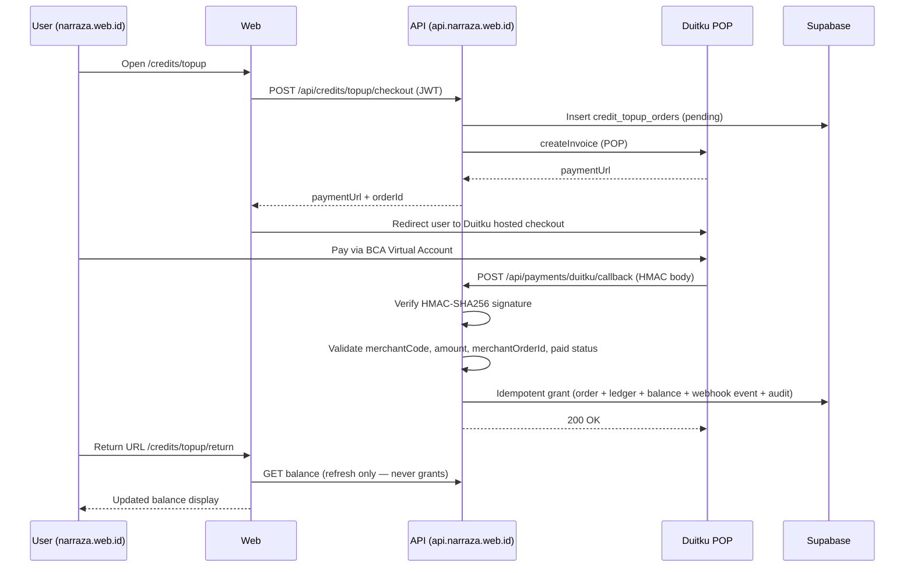

# 73 — Duitku Production Payment Enable Plan (Task 10.15)

**Date:** 2026-06-10  
**Status:** Closed — **GO** (plan only; **production NOT enabled**)  
**Brand:** **Narraza** — *Build long fiction without losing the plot.*  
**Related:** [`docs/72`](72-payment-provider-decision-report.md), [`docs/70`](70-duitku-mode-b-live-sandbox-callback-report.md), [`docs/71`](71-duitku-real-callback-signature-debug-report.md), [`docs/52`](52-sprint-10-payment-ops-and-safety-regression.md), [`.agent-logs/sprint-10/task-10.15-duitku-production-payment-enable-plan.md`](../.agent-logs/sprint-10/task-10.15-duitku-production-payment-enable-plan.md)

Docs-only gated plan for **Narraza** production payment enablement using **Duitku POP, BCA VA-first**. This document does **not** enable production payment, deploy production, register production callbacks, or use production credentials.

**Decision source:** Task 10.14 **GO** — Duitku recommended for MVP; Mayar secondary/backlog ([`docs/72`](72-payment-provider-decision-report.md)).

**Staging (current — Mode A safe):** `https://api-staging.narraza.web.id` — `creditTopupEnabled=false`, `paymentProviderMock=true`, `paymentProvider=mock`, `aiGenerationEnabled=false`.

**Production foundation plan (Task 10.20):** [`docs/78`](78-production-environment-foundation-plan.md) — topology, Supabase/DNS checklists, env matrix, Phases 0–9. **No production deployed.** Prerequisite for Task 10.19 unblock and §7 execution.

**Production Supabase baseline (Task 10.21):** [`docs/79`](79-production-supabase-baseline-setup-report.md) — **GO** — prod baseline `00001`–`00009` applied; `00010` deferred to Task 10.19.

**Production API/web/DNS Mode A plan (Task 10.22):** [`docs/80`](80-production-api-web-dns-mode-a-preflight-report.md) — **GO** — execution Phases 3–7 gated; payment still **OFF**; Duitku callback **not registered**.

**Production launch domain (Task 10.23):** Current infra target is **`narraza.web.id`** / **`api.narraza.web.id`**. **`narraza.id`** reserved for future migration — update Duitku callback/return URLs at payment enablement if domain changes.

**Production API/web deploy (Task 10.23):** [`docs/81`](81-production-api-web-mode-a-deploy-report.md) — **PARTIAL GO** — Pages web deployed; production API EC2/DNS pending; payment OFF.

---

## 1. Current payment status summary

| Item | Status |
|---|---|
| MVP provider | **Duitku POP, BCA VA-first** |
| Mayar | **Secondary / backlog** — no live staging callback proof |
| Staging BCA VA path | **GO** — Tasks 10.13b/10.13c ([`docs/70`](70-duitku-mode-b-live-sandbox-callback-report.md), [`docs/71`](71-duitku-real-callback-signature-debug-report.md)) |
| Fixture callback + grant | **PASS** — Task 10.12 ([`docs/58`](58-duitku-callback-idempotent-grant-report.md)) |
| Real callback signature | **64-hex HMAC-SHA256** — `HMAC_SHA256(merchantCode+amount+merchantOrderId, merchantKey)`; validator also supports 32-hex MD5 fixtures |
| ShopeePay/SP | **Not retested** post-HMAC — optional backlog; not required for BCA VA-first MVP |
| All Duitku channels | **NOT CLAIMED** — only BCA VA verified live |
| Production payment | **NOT READY / NOT ENABLED** |
| Production enablement | Requires **separate founder approval** — this plan is prerequisite only |

---

## 2. Production architecture plan

### 2.1 End-to-end flow (BCA VA-first)



### 2.2 Grant invariants (non-negotiable)

| Rule | Requirement |
|---|---|
| **Callback-only grant** | Credits granted **only** via `POST /api/payments/duitku/callback` — never redirect/return URL |
| **Return page** | `/credits/topup/return` refreshes balance/status only; **must never grant** |
| **Duplicate callback** | Same payload / replay → **no double grant** (idempotent `payment_webhook_events` + ledger guard) |
| **Invalid signature** | Reject → **no grant** |
| **Amount mismatch** | Order amount ≠ callback amount → **no grant** |
| **Unknown order** | `merchantOrderId` not found → **no grant** |
| **Non-paid status** | `resultCode` ≠ paid success → **no grant** |
| **Kill switch** | `CREDIT_TOPUP_ENABLED=false` → checkout blocked; callback endpoint remains safe |

**Evidence:** Staging Mode B proved these invariants for BCA VA ([`docs/70`](70-duitku-mode-b-live-sandbox-callback-report.md), [`docs/71`](71-duitku-real-callback-signature-debug-report.md)). Production must re-verify with low-value live transaction.

### 2.3 Key endpoints

| Endpoint | Role |
|---|---|
| `POST /api/credits/topup/checkout` | Create pending order + Duitku invoice |
| `POST /api/payments/duitku/callback` | **Only grant source** |
| `GET /api/me` / credit balance read | Return page refresh |
| `GET /api/health` | Safe flags verification (no secrets in response) |

---

## 3. Production environment variables

**Do not set these values now.** Names only — values go in server secret store after founder Go.

### 3.1 Required

| Variable | Purpose | Expected when approved (do not apply yet) |
|---|---|---|
| `APP_ENV` | Runtime environment | `production` |
| `CREDIT_TOPUP_ENABLED` | Topup kill switch | `true` **only after founder Go** |
| `PAYMENT_PROVIDER` | Active provider | `duitku` |
| `PAYMENT_PROVIDER_MOCK` | Mock bypass | `false` |
| `DUITKU_ENV` | Duitku environment | `production` |
| `DUITKU_MERCHANT_CODE` | Production merchant code | From Duitku production dashboard |
| `DUITKU_MERCHANT_KEY` | Production merchant key | From Duitku production dashboard — **never repo/logs** |
| `DUITKU_CALLBACK_URL` | Registered callback | `https://api.narraza.web.id/api/payments/duitku/callback` (or founder-approved final URL) |
| `SUPABASE_URL` | Production Supabase | Production project URL |
| `SUPABASE_ANON_KEY` | Client JWT validation | Production anon key |
| `SUPABASE_SERVICE_ROLE_KEY` | Server-side DB writes | Production service role — **never client/logs** |
| `ALLOWED_ORIGINS` | CORS | `https://narraza.web.id` (+ approved admin origins if any) |

### 3.2 Recommended / related

| Variable | Purpose | Notes |
|---|---|---|
| `DUITKU_RETURN_URL` | Post-payment redirect | `https://narraza.web.id/credits/topup/return` |
| `DUITKU_BASE_URL` | POP API base | Defaults to `https://api-prod.duitku.com` when `DUITKU_ENV=production` |
| `PAYMENT_RETURN_BASE_URL` | Generic return override | Optional; prefer `DUITKU_RETURN_URL` |
| `AI_GENERATION_ENABLED` | AI kill switch | Independent of payment; keep `false` unless separate AI Go |
| `AI_PROVIDER_MOCK` | AI mock mode | `true` until live AI approved |
| `DUITKU_TIMEOUT_MS` | HTTP timeout | Optional tuning |
| `PORT` | Node listen | Internal; reverse proxy terminates TLS |

### 3.3 Must NOT be set in production until Go

```txt
CREDIT_TOPUP_ENABLED=true          # blocked until founder Go
PAYMENT_PROVIDER=duitku            # blocked until founder Go
PAYMENT_PROVIDER_MOCK=false        # blocked until founder Go
DUITKU_SMOKE_CALLBACK_FIXTURE=true # development only — never production
```

### 3.4 Secret hygiene

- Store secrets in **server env / secret manager only** (EC2 env file, Docker secrets, or approved host).
- **Never** commit `.env.production`, `.dev.vars`, or Duitku keys to git.
- Health endpoint exposes **boolean flags only** (`hasDuitkuMerchantCode`, not values).
- Operator scripts must not log merchant key, service role, or JWT.

**Reference templates (names only):** [`.env.staging.example`](../.env.staging.example), [`.env.staging.duitku.example`](../.env.staging.duitku.example), [`apps/api/.dev.vars.example`](../apps/api/.dev.vars.example).

---

## 4. Final domain and callback plan

### 4.1 Target production surfaces

| Surface | Planned URL | Status |
|---|---|---|
| **Web** | `https://narraza.web.id` | **TBD** — domain/DNS not final in repo evidence |
| **API** | `https://api.narraza.web.id` | **TBD** — production host not deployed |
| **Duitku callback** | `https://api.narraza.web.id/api/payments/duitku/callback` | **TBD** — register only after founder Go |
| **Return URL** | `https://narraza.web.id/credits/topup/return` | **TBD** — web build must point `VITE_API_URL` to prod API |

**Staging (temporary):** `narraza.web.id` / `api-staging.narraza.web.id` — not production.

### 4.2 Callback registration rules

1. Callback URL must be **HTTPS** with valid certificate.
2. Register in **Duitku production dashboard** only after:
   - Production API deployed and health PASS
   - Founder explicit Go for Phase 4 (§7)
3. **Do not** register production callback during Task 10.15 or before founder approval.
4. Callback URL must match `DUITKU_CALLBACK_URL` env exactly (no trailing slash mismatch).

### 4.3 Blockers

- `narraza.id` DNS, TLS, and production API host **not confirmed** in repo.
- Production Supabase project + migrations push require separate founder approval.
- Production Duitku merchant account approval status unknown — operator must confirm.

---

## 5. Production readiness checklist

**Verdict: NOT READY** — all unchecked items must PASS before public payment enable.

### A. Business / account

| # | Gate | Status |
|---|---|---|
| A1 | Duitku **production** merchant approved for Narraza | ⬜ |
| A2 | Settlement bank account verified | ⬜ |
| A3 | Production merchant code + key issued (stored securely) | ⬜ |
| A4 | **BCA VA** payment method enabled in production dashboard | ⬜ |
| A5 | Fee / settlement terms understood and documented | ⬜ |
| A6 | Legal terms, privacy, payment/refund copy on `narraza.id` | ⬜ |
| A7 | Founder written Go/No-Go recorded | ⬜ |

### B. Infrastructure

| # | Gate | Status |
|---|---|---|
| B1 | Production API domain live (`api.narraza.web.id` or approved) | ⬜ |
| B2 | Production web domain live (`narraza.id`) | ⬜ |
| B3 | HTTPS valid on API + web | ⬜ |
| B4 | Secrets in server/secret manager only — none in repo | ⬜ |
| B5 | `GET /api/health` safe (no secret leakage) | ⬜ |
| B6 | Rollback procedure documented and operator-trained (§8) | ⬜ |
| B7 | Backup / monitoring baseline ready | ⬜ |

### C. Database

| # | Gate | Status |
|---|---|---|
| C1 | Production migrations applied (`00009+` payment schema) | ⬜ |
| C2 | `credit_topup_orders` ready | ⬜ |
| C3 | `payment_webhook_events` ready | ⬜ |
| C4 | `credit_ledger` ready | ⬜ |
| C5 | `credit_balances` ready | ⬜ |
| C6 | `audit_logs` ready | ⬜ |
| C7 | **Atomic grant DB RPC** (§6) | Staging **done** (10.16–10.18); production `00010` **BLOCKED** — Task 10.19 preflight ([`docs/77`](77-production-payment-preflight-migration-approval-gate.md)): prod Supabase not linked, approval not received |
| C8 | Backup + restore plan tested | ⬜ |

### D. Application

| # | Gate | Status |
|---|---|---|
| D1 | `PAYMENT_PROVIDER=duitku`, `PAYMENT_PROVIDER_MOCK=false` | ⬜ Blocked until Go |
| D2 | HMAC-SHA256 callback validation active (64-hex real path) | ✅ Proven staging; repeat prod |
| D3 | Idempotency enforced (`payment_webhook_events`, ledger reason guard) | ✅ Proven staging |
| D4 | Amount mismatch rejected | ✅ Proven staging |
| D5 | Unknown order rejected | ✅ Proven staging |
| D6 | Non-paid status ignored | ✅ Proven staging |
| D7 | Duplicate callback — no double grant | ✅ Proven staging |
| D8 | Return page does not grant | ✅ By design ([`docs/52`](52-sprint-10-payment-ops-and-safety-regression.md)) |
| D9 | `CREDIT_TOPUP_ENABLED` kill switch tested | ✅ Staging rollback |

### E. Operations

| # | Gate | Status |
|---|---|---|
| E1 | Admin/manual reconciliation SOP (§9) | ✅ Draft in this doc |
| E2 | Refund/chargeback SOP (§10) | ✅ Draft — pending final founder approval |
| E3 | Failed callback triage SOP | ✅ §9 |
| E4 | Alerting / log monitoring (no secrets in logs) | ⬜ |
| E5 | Founder emergency rollback path (§8) | ✅ Documented |
| E6 | Support / customer message templates | ⬜ |

### F. Testing (production)

| # | Gate | Status |
|---|---|---|
| F1 | Low-value BCA VA production transaction (founder-only) | ⬜ |
| F2 | Real callback → grant exactly once | ⬜ |
| F3 | Duplicate callback replay — no double grant | ⬜ |
| F4 | Invalid signature rejected | ⬜ (staging ✅) |
| F5 | Amount mismatch rejected | ⬜ (staging ✅) |
| F6 | Unknown order rejected | ⬜ (staging ✅) |
| F7 | Rollback to disabled — health PASS | ⬜ |
| F8 | Post-rollback: no unintended public checkout | ⬜ |

---

## 6. Atomic grant / DB hardening — **Addressed Task 10.16**

> **Update (2026-06-10):** Implemented as `grant_paid_credit_topup_atomic` in migration `00010`. See [`docs/74`](74-atomic-grant-db-rpc-report.md). Apply migration on hosted staging/production Supabase before production payment Go.

### Original recommendation (10.15)

### Why

Payment callback success mutates multiple tables in sequence:

| Table / store | Mutation |
|---|---|
| `credit_topup_orders` | Status → `paid`, provider refs |
| `payment_webhook_events` | Idempotency record |
| `credit_ledger` | Credit grant entry |
| `credit_balances` | Balance increment |
| `audit_logs` | `credit_topup_granted` / failure events |

**Current state:** Task 7.8.3 compensation runner + idempotency guards are **good for MVP staging** ([`docs/41`](41-pre-ai-hardening-audit-transactions-ci-plan.md), [`docs/58`](58-duitku-callback-idempotent-grant-report.md)). A partial failure mid-grant (e.g. ledger written but balance update fails) creates **reconciliation debt** that is unacceptable at production payment scale.

### Scope (future task)

- Single RPC: `grant_credit_topup_from_callback(...)` with idempotency key
- Roll back entire grant on any step failure
- Keep callback HTTP handler thin — delegate to RPC
- Add smoke assertion for simulated mid-failure (if feasible)

**Status:** ✅ **Implemented Task 10.16** — local + fixture smoke PASS. ✅ **Hosted staging migration applied Task 10.17** ([`docs/75`](75-apply-migration-00010-hosted-staging-report.md)). ✅ **Staging API E2E RPC path verified Task 10.18** ([`docs/76`](76-redeploy-staging-api-rpc-grant-integration-report.md)). ⛔ **Production migration preflight Task 10.19 BLOCKED** ([`docs/77`](77-production-payment-preflight-migration-approval-gate.md)) — prod project not identified; explicit approval required before `supabase db push` on production.

---

## 7. Staged production enable sequence

Execute **only** after founder reads this plan and explicitly approves Phase 0. If any critical check fails, **rollback immediately** (§8). Do **not** open payment UI to public users before founder Go.

| Phase | Action | Owner | Notes |
|---|---|---|---|
| **0** | Founder reads docs/72 + docs/73; records Go/No-Go | Founder | No-Go = stop |
| **1** | Set production secrets **only** on server (names §3) | Operator | `CREDIT_TOPUP_ENABLED=false` initially |
| **2** | Deploy production API + web with payment **disabled** | Operator | `PAYMENT_PROVIDER=mock` or `duitku` with `CREDIT_TOPUP_ENABLED=false` |
| **3** | Health check — verify safe flags | Operator | `creditTopupEnabled=false` until Phase 5 |
| **4** | Register callback in Duitku **production** dashboard | Operator | URL §4.1 — **only after Phase 3 PASS** |
| **5** | Temporarily enable payment for **founder-only** low-value test | Founder + Operator | `CREDIT_TOPUP_ENABLED=true`, `PAYMENT_PROVIDER=duitku`, `PAYMENT_PROVIDER_MOCK=false` |
| **6** | Create invoice (smallest package / custom low IDR) | Founder | BCA VA channel |
| **7** | Complete BCA VA payment in Duitku UI | Founder | Real money — low value only |
| **8** | Verify real callback + grant exactly once | Operator | Check `payment_webhook_events`, `credit_ledger`, balance |
| **9** | Duplicate / negative checks if possible | Operator | Replay callback; invalid sig via controlled test |
| **10** | Founder decides: keep enabled or rollback | Founder | Default conservative: rollback until launch date |
| **11** | Write closure report (`docs/74` or next) | Agent/Operator | Sanitized evidence only |

### Go/No-Go ceremony (Phase 0)

Founder must confirm in writing (issue comment, doc sign-off, or ops log):

- [ ] Business/account gates (§5A) understood
- [ ] Atomic grant RPC scheduled or accepted risk documented
- [ ] Refund SOP draft acceptable for MVP
- [ ] Low-value test budget approved
- [ ] Rollback operator identified
- [ ] **Explicit authorization** to proceed past Phase 4

**Without Phase 0 Go:** remain at `CREDIT_TOPUP_ENABLED=false`.

---

## 8. Rollback plan

### 8.1 Environment rollback (immediate kill switch)

Set on production server and restart API:

```txt
CREDIT_TOPUP_ENABLED=false
PAYMENT_PROVIDER=mock
PAYMENT_PROVIDER_MOCK=true
AI_GENERATION_ENABLED=false   # if payment test also enabled AI
```

Verify:

```txt
GET https://api.narraza.web.id/api/health
→ creditTopupEnabled=false, paymentProviderMock=true, paymentProvider=mock
```

**Staging reference:** `operator:aws:duitku:gate -Mode rollback` pattern ([`docs/70`](70-duitku-mode-b-live-sandbox-callback-report.md)) — adapt for production host when it exists.

### 8.2 Operational rollback

| Step | Action |
|---|---|
| 1 | Disable topup CTA in web if needed (feature flag or deploy) |
| 2 | Keep callback endpoint up but safe — rejects/grants per disabled policy |
| 3 | Health check PASS |
| 4 | Query pending `credit_topup_orders` — reconcile (§9) |
| 5 | Notify founder + document incident |

**Do not** delete `credit_topup_orders`, `payment_webhook_events`, or `credit_ledger` rows during rollback.

### 8.3 Emergency procedures

| Scenario | Action |
|---|---|
| Merchant key leaked | Rotate key in Duitku dashboard + update server secret; review logs |
| Callback abuse / flood | Disable callback URL in Duitku dashboard; `CREDIT_TOPUP_ENABLED=false` |
| Suspected double grant | Stop enablement; reconcile ledger vs orders; founder approval before manual fix |
| User reports paid, no credit | §9 triage — do not manual balance edit |

---

## 9. Admin / reconciliation SOP (manual)

No admin payment dashboard exists yet. Use Supabase SQL editor or approved read-only tooling.

### 9.1 Find an order

```sql
-- By internal order id (merchantOrderId = credit_topup_orders.id)
SELECT id, user_id, status, amount_idr, credits_to_grant,
       provider, provider_invoice_id, provider_transaction_id,
       created_at, paid_at
FROM credit_topup_orders
WHERE id = '<merchantOrderId>';

-- By Duitku reference
SELECT * FROM credit_topup_orders
WHERE provider_invoice_id = '<duitkuReference>' OR provider_transaction_id = '<duitkuReference>';
```

### 9.2 Check webhook events

```sql
SELECT id, provider, event_type, payload_hash, processed_at, created_at
FROM payment_webhook_events
WHERE provider = 'duitku'
ORDER BY created_at DESC
LIMIT 20;

-- Correlate by payload or order metadata in event body (sanitized storage)
```

### 9.3 Compare ledger and balance

```sql
SELECT * FROM credit_ledger
WHERE user_id = '<user_id>' AND reason = 'credit_topup'
ORDER BY created_at DESC;

SELECT balance FROM credit_balances WHERE user_id = '<user_id>';
```

Expected: one `credit_topup` ledger row per paid order; balance reflects sum of grants minus debits.

### 9.4 Scenarios

| Scenario | Steps |
|---|---|
| **Paid at Duitku, no grant** | 1) Confirm order `pending` in DB 2) Check `payment_webhook_events` for callback 3) Check API logs for signature/amount errors 4) If callback never arrived: Duitku dashboard payment proof 5) If callback failed validation: fix root cause, **replay** only via safe operator path — never hand-edit balance 6) Escalate to founder |
| **Duplicate callback** | 1) Confirm two webhook rows or duplicate `payload_hash` 2) Verify ledger has **one** grant 3) If double grant: stop enablement, founder-led reversal plan (§10) |
| **User claims paid, balance stale** | 1) Ask for order id / payment time 2) Run queries above 3) If paid + granted: instruct user to refresh 4) If paid + not granted: triage as above 5) Use support template: "Kredit masuk otomatis setelah konfirmasi pembayaran; refresh saldo" |

### 9.5 What NOT to do

- **Do not** manually `UPDATE credit_balances` without matching `credit_ledger` entry.
- **Do not** mark order `paid` without payment evidence.
- **Do not** grant credits without order + callback/webhook proof.
- **Do not** expose merchant key or service role in support tickets.

---

## 10. Refund / chargeback SOP (draft)

**Status:** Draft — requires founder final approval before production. Automated refund tooling **not built**.

### 10.1 Intake

1. User contacts support with order id, payment date, amount, reason.
2. Operator verifies identity (account email matches order `user_id`).

### 10.2 Verification

| Check | Source |
|---|---|
| Order exists and was `paid` | `credit_topup_orders` |
| Payment confirmed | Duitku production dashboard |
| Credits granted | `credit_ledger` |
| Credits consumed? | Sum debits after grant — if fully consumed, refund may be partial/denied per policy |

### 10.3 Eligibility (founder policy — fill at Go)

| Case | Default draft policy |
|---|---|
| Duplicate charge | Full refund + ledger reversal |
| Payment succeeded, grant failed (proven) | Grant OR refund — prefer grant if user wants credits |
| User regret after unused credits | Founder discretion — MVP may deny |
| Chargeback from bank | Follow bank process; suspend account pending review |

### 10.4 Execution (current limitation)

**No automated refund API in Narraza MVP.**

| Step | Action |
|---|---|
| 1 | Founder approves refund in writing |
| 2 | Process refund via **Duitku dashboard / manual transfer** per Duitku policy |
| 3 | Record reversal in `credit_ledger` (future: `reason=credit_topup_refund`) — **manual SQL only with founder approval** |
| 4 | Adjust `credit_balances` only with matching ledger row |
| 5 | Mark order note / audit entry |

### 10.5 Future tooling (deferred)

- `POST /admin/credits/refund` with audit trail
- Idempotent refund linked to `credit_topup_orders.id`
- User-facing refund request UI

---

## 11. Founder Go/No-Go criteria

**Production payment Go** requires **all**:

1. Checklist §5 — sections A, B, C, D, E, F complete (or explicit accepted risk for C7 atomic RPC documented).
2. Phase 0–8 production test PASS.
3. Refund SOP draft approved by founder.
4. Reconciliation SOP operator trained.
5. No open P0 security issues on callback endpoint.
6. Legal/payment copy live on web.

**No-Go triggers (any one):**

- Production Duitku merchant not approved
- `narraza.id` / `api.narraza.web.id` not ready
- Atomic grant RPC deferred **and** founder unwilling to accept compensation-only risk
- Failed production callback test
- Missing refund/reconciliation operator

---

## 12. Security notes

- Never commit or document secret **values**.
- Callback endpoint is public — security relies on **HMAC-SHA256**, amount/order validation, and idempotency.
- Rate-limit / monitor callback endpoint for abuse (ops task).
- `DUITKU_SMOKE_CALLBACK_FIXTURE` must never be `true` in production.
- Return URL must not accept grant parameters from client.
- Rotate keys if exposure suspected.

---

## 13. Go / Partial / Blocked / No-Go (this task)

| Level | Verdict |
|---|---|
| **GO** | Plan complete; production gated; no code/deploy/production touch |
| **PARTIAL GO** | N/A |
| **BLOCKED** | N/A |
| **NO-GO** | N/A — no overclaim, no secrets |

---

## 14. Next recommended tasks

| Priority | Task | Notes |
|---|---|---|
| **Operator** | Apply migration `00010` on hosted Supabase | Before production payment ([`docs/74`](74-atomic-grant-db-rpc-report.md)) |
| **Founder-led** | Execute §7 Phases 0–11 | Only after explicit approval; produces closure report |
| **Infrastructure** | Production deploy plan (`narraza.id` + `api.narraza.web.id`) | Separate from this doc; DNS/host TBD |
| **Optional backlog** | ShopeePay/SP retest post-HMAC | Not required for BCA VA-first |
| **Optional backlog** | Mayar live proof (10.8b) | Secondary provider |

**Do not** proceed to production enablement, credential setup, callback registration, or code changes without founder approval.

---

## Final summary

```txt
Task 10.15 — Duitku Production Payment Enable Plan
Status: GO (plan only)

Summary:
Gated operator plan for Narraza production payment via Duitku POP BCA VA-first.
Staging proof exists; production remains NOT ENABLED. Founder approval required
before any Phase 1+ execution.

Production readiness: NOT READY
Reason: Business account, production domains, DB RPC hardening, ops gates,
and production live test all pending.

Provider: Duitku POP, BCA VA-first

Blockers before production:
- Duitku production merchant + narraza.id infrastructure
- Founder Go/No-Go
- Hosted Supabase migration `00010` apply (operator)
- Production BCA VA live test
- Final refund SOP approval

Next recommended task:
Apply 00010 on hosted Supabase + docs/73 §7 with founder approval
```