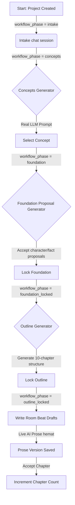

# Task 10.30 — Structural Repo Audit: Mock Leakage, Real Workflow Boundary, and Repair Plan

## Status
**GO** (Audit & Repair Plan completed; Phase 0/Task 10.30a implemented and deployed to production)

---

## Executive Summary

Narraza is a production-grade application running on live infrastructure (homepage, app, API, Supabase) with real authentication and project persistence. However, the browser flow still feels like a mock or technical demo. 

This audit reveals that while the backend database schema and API routes are mostly real, **the frontend React hooks initialize state with Sprint 1 mock data**. This causes a "flash of mock content" on load, which is exacerbated when API errors trigger silent mock fallbacks. Furthermore, the credit indicator in the header is completely hardcoded, and backend generation endpoints (concepts, outline) rely on deterministic stubs (Nadira/Arman/Siska template story) rather than live LLMs.

This report documents the exact leakage points, maps the route-level data flow, audits backend and DB readiness, and outlines a multi-phase repair plan to transition Narraza into a fully real, honest post-intake pipeline.

---

## Why Production Still Feels Mock

1. **Flash of Mock Content (Severe):** All major hooks (`useDashboardData`, `useIntakeData`, `useConceptsData`, `useFoundationData`, `useOutlineData`, `useWriteRoomData`, `useSummaryData`, `usePublishData`, `useSettingsData`) initialize their React states with mock objects (e.g., `mockConcepts`, `mockStoryFoundation`, `mockOutline`). When a page loads in API mode, the user briefly sees the completed Sprint 1 dummy data before the API fetch completes and overwrites it.
2. **Hardcoded Header Credits:** The `CreditIndicator` component called in `AppShell` and `MobileHeader` defaults to `SHELL_MOCK.credits` (`1.250`). It does not fetch or display the logged-in user's real balance from Supabase.
3. **Deterministic Backend Stubs:** The API routes for concept, foundation, outline, and summary generation return hardcoded, deterministic Indonesian story templates. Every project, no matter what seed idea is entered during intake, receives the exact same character names, plot points, and chapter outlines.
4. **CTA Route Mismatch:** The dashboard CTA button always links to `project.writeRoute` (the Write Room) instead of routing the user to the correct active phase (e.g., `/intake` or `/concepts`), leading them to locked screen messages.

---

## Full Mock Inventory

| File | Symbol/String | Route/Feature | Runtime Condition | Production Risk | Remove/Fix/Keep |
|---|---|---|---|---|---|
| `CreditIndicator.tsx` | `SHELL_MOCK.credits` (`1250`) | Global Header / Navbar | Initial render & default prop | Display debt; user always sees "1.250" | **Fix:** Bind to real user credit hook |
| `useDashboardData.ts` | `mockDashboardActiveProject` / `mockDashboardRecentProjects` | `/dashboard` | Initial state before load / fallback on error | Flash of mock card; fakes recent projects | **Fix:** Initialize state to `null` / `[]` |
| `useIntakeData.ts` | `mockIntakeSession` | `/projects/:id/intake` | Initial state / fallback on error | Flash of mock chat messages | **Fix:** Initialize to empty session state |
| `useConceptsData.ts` | `mockConcepts` | `/projects/:id/concepts` | Initial state / fallback on error | Flash of mock concept choices | **Fix:** Initialize to `[]` |
| `useFoundationData.ts` | `mockStoryFoundation` | `/projects/:id/foundation` | Initial state / fallback on error | Flash of mock characters & facts | **Fix:** Initialize to empty foundation shell |
| `useOutlineData.ts` | `mockOutline` | `/projects/:id/outline` | Initial state / fallback on error | Flash of mock 10-chapter schedule | **Fix:** Initialize to empty outline shell |
| `useWriteRoomData.ts` | `mockChapterDraft` | `/projects/:id/write` | Initial state | Flash of mock scenes and prose beats | **Fix:** Initialize to empty draft shell |
| `useSummaryData.ts` | `mockChapterSummary` | `/projects/:id/summary` | Initial state / fallback on error | Flash of mock delta proposal | **Fix:** Initialize to empty summary shell |
| `usePublishData.ts` | `mockPublishPackage` | `/projects/:id/publish` | Initial state / fallback on error | Flash of mock checklists & preview | **Fix:** Initialize to empty publish package |
| `useSettingsData.ts` | `mockSettings` | `/settings` | Initial state / fallback on error | Flash of fake profile metadata | **Fix:** Initialize to `null` & fetch |
| `useActiveProject.ts` | `MOCK_SIDEBAR_PROJECT` | Layout / Sidebar | `VITE_USE_MOCKS=true` or unauthed | Safe in mock mode, but leaks into prod sidebar | **Keep:** Only for explicit mock mode |

---

## Route Data-Source Audit

| Route | UI Page | Hook | API Endpoint | DB Table | Realness | Mock Risk | Fix Needed |
|---|---|---|---|---|---|---|---|
| `/dashboard` | `DashboardPage` | `useDashboardData` | `GET /api/projects`<br>`GET /api/credits/balance` | `projects`<br>`credit_balances` | **REAL PARTIAL** | High (initial flash of mock cards, mock usage on error) | Initialize with `null`; fetch API; no mock error fallback |
| `/start` | `StartProjectPage` | `useActiveProject` | `POST /api/projects` | `projects` | **REAL READY** | Low | None |
| `/projects/:id/intake` | `IntakePage` | `useIntakeData` | `GET /api/projects/:id/intake`<br>`POST /api/projects/:id/intake/messages` | `intake_sessions`<br>`intake_messages`<br>`detected_signals` | **REAL PARTIAL** | Medium (assistant uses deterministic stub response) | Initialize to empty session state; wire to OpenRouter assistant in Phase 3 |
| `/projects/:id/concepts` | `ConceptsPage` | `useConceptsData` | `GET /api/projects/:id/concepts`<br>`POST /api/projects/:id/concepts/generate` | `story_concepts`<br>`projects` | **REAL PARTIAL** | Medium (concept generator is deterministic stub in backend) | Initialize state to `[]`; wire generator to OpenRouter in Phase 2 |
| `/projects/:id/foundation` | `StoryFoundationPage` | `useFoundationData`<br>`useFoundationFlow` | `GET /api/projects/:id/foundation/bundle`<br>`POST /api/projects/:id/proposals/accept` | `story_foundations`<br>`characters`<br>`facts`<br>`ai_proposals` | **REAL PARTIAL** | Medium (proposals are deterministic stub) | Initialize to empty shell; wire proposal generator to OpenRouter |
| `/projects/:id/outline` | `OutlinePage` | `useOutlineData` | `GET /api/projects/:id/outline/bundle`<br>`POST /api/projects/:id/outline/generate`<br>`POST /api/projects/:id/outline/lock` | `outline_plans`<br>`chapter_outlines`<br>`open_loops`<br>`planned_reveals` | **REAL PARTIAL** | Medium (outline is stub; locks properly) | Initialize to empty; wire generator to OpenRouter in Phase 2 |
| `/projects/:id/write` | `WritePage` | `useWriteRoomData` | `GET /api/projects/:id/writing-session`<br>`GET /api/projects/:id/beats`<br>`POST /api/projects/:id/ai/generate-prose` | `writing_sessions`<br>`chapter_beats`<br>`chapter_prose_versions`<br>`generation_attempts` | **REAL READY** | Low (locked if outline not locked; AI is real LLM) | Initialize to empty; remove default mock draft |
| `/projects/:id/summary` | `SummaryPage` | `useSummaryData` | `GET /api/projects/:id/summary` | `chapter_summaries`<br>`chapter_deltas`<br>`chapter_summary_proposals` | **LOCKED IN PROD** | Medium (stub generator; locked by phase) | Initialize to empty; wire to OpenRouter in Phase 5 |
| `/projects/:id/publish` | `PublishPage` | `usePublishData` | `GET /api/projects/:id/publish` | `publish_packages` | **LOCKED IN PROD** | Low (locked by phase) | None |
| `/settings` | `SettingsPage` | `useSettingsData` | `GET /api/credits/balance`<br>`GET /api/me/profile`<br>`PATCH /api/projects/:id/settings` | `credit_balances`<br>`profiles`<br>`project_settings` | **REAL PARTIAL** | Low (starts with mock, then overwrites) | Initialize with `null`; fetch profile |

---

## Backend Endpoint Truth Audit

| Endpoint | Method | Status | Uses DB? | Uses LLM? | Used by UI? | Problem | Next Fix |
|---|---|---|---|---|---|---|---|
| `GET /api/health` | GET | REAL_PERSISTED | No | No | Yes | None | None |
| `GET /api/me/profile` | GET | REAL_PERSISTED | Yes | No | Yes | None | None |
| `GET /api/projects` | GET | REAL_PERSISTED | Yes | No | Yes | None | None |
| `POST /api/projects` | POST | REAL_PERSISTED | Yes | No | Yes | None | None |
| `GET /api/projects/:id/intake` | GET | REAL_PERSISTED | Yes | No | Yes | None | None |
| `POST /api/projects/:id/intake/messages` | POST | PARTIAL | Yes | No | Yes | Assistant response is template stub | Wire to live OpenRouter chat |
| `GET /api/projects/:id/concepts` | GET | REAL_PERSISTED | Yes | No | Yes | None | None |
| `POST /api/projects/:id/concepts/generate` | POST | PARTIAL | Yes | No | Yes | Generates deterministic stub concepts | Wire to OpenRouter concept generator |
| `POST /api/projects/:id/concepts/:conceptId/select` | POST | REAL_PERSISTED | Yes | No | Yes | None | None |
| `GET /api/projects/:id/foundation/bundle` | GET | REAL_PERSISTED | Yes | No | Yes | None | None |
| `POST /api/projects/:id/foundation/proposals/accept` | POST | REAL_PERSISTED | Yes | No | Yes | None | None |
| `POST /api/projects/:id/foundation/lock` | POST | REAL_PERSISTED | Yes | No | Yes | None | None |
| `GET /api/projects/:id/outline/bundle` | GET | REAL_PERSISTED | Yes | No | Yes | None | None |
| `POST /api/projects/:id/outline/generate` | POST | PARTIAL | Yes | No | Yes | Generates 10 hardcoded mock chapters | Wire to OpenRouter outline generator |
| `POST /api/projects/:id/outline/lock` | POST | REAL_PERSISTED | Yes | No | Yes | None | None |
| `GET /api/projects/:id/writing-session` | GET | REAL_PERSISTED | Yes | No | Yes | None | None |
| `GET /api/projects/:id/beats` | GET | REAL_PERSISTED | Yes | No | Yes | None | None |
| `POST /api/projects/:id/ai/generate-prose` | POST | REAL_LLM | Yes | Yes | Yes | None | None |
| `POST /api/projects/:id/ai/rewrite-prose` | POST | REAL_LLM | Yes | Yes | Yes (disabled) | None | Enable rewrite UI |
| `POST /api/projects/:id/ai/improve-publish-copy` | POST | REAL_LLM | Yes | Yes | Yes (disabled) | None | Enable copy UI |
| `GET /api/credits/balance` | GET | REAL_PERSISTED | Yes | No | Yes | None | None |
| `POST /api/credits/topup/checkout` | POST | DISABLED | Yes | No | Yes (disabled) | Returns 503 topup disabled | Enable in production topup phase |
| `POST /api/payments/duitku/callback` | POST | REAL_PERSISTED | Yes | No | No (inactive) | Inactive in production env | Setup Duitku live credentials |

---

## Database Support Audit

| Workflow Stage | Table(s) | Exists | API Write | UI Read | Production Ready? | Gap |
|---|---|---|---|---|---|---|
| **projects** | `projects`, `project_settings` | Yes | Yes | Yes | Yes | None |
| **intake** | `intake_sessions`, `intake_messages`, `detected_signals` | Yes | Yes | Yes | Yes | None |
| **concepts** | `story_concepts` | Yes | Yes | Yes | Yes | Concepts generated in API are stubs, not real LLM |
| **foundation** | `story_foundations`, `characters`, `facts`, `ai_proposals` | Yes | Yes | Yes | Yes | Proposal generator is stub |
| **outline** | `outline_plans`, `chapter_outlines`, `open_loops`, `planned_reveals` | Yes | Yes | Yes | Yes | Outline generator is stub |
| **write** | `writing_sessions`, `chapter_beats`, `chapter_prose_versions`, `generation_attempts` | Yes | Yes | Yes | Yes | None |
| **summary** | `chapter_summaries`, `chapter_deltas`, `chapter_summary_proposals` | Yes | Yes | Yes | Yes | Summary generator is stub |
| **publish** | `publish_packages` | Yes | Yes | Yes | No | Locked by UI phase in beta |
| **credits** | `credit_balances`, `credit_ledger` | Yes | Yes | Yes | Yes | `CreditIndicator` header component is hardcoded |
| **payments** | `credit_topup_products`, `credit_topup_orders`, `payment_webhook_events` | Yes | Yes | Yes | No | `00010` migration not applied on prod; variables mock |

---

## Workflow Phase Audit

Workflow phases represent sequential story development status:
1. `intake`
2. `concepts`
3. `foundation`
4. `foundation_locked`
5. `outline`
6. `outline_locked`
7. `writing`

| Phase | Current Source | Correct Source | Current Bug | Fix Plan |
|---|---|---|---|---|
| **new_project** | Set to `intake` at creation | `projects.workflow_phase` | None | None |
| **intake_started** | `projects.workflow_phase = intake` | `projects.workflow_phase` | None | None |
| **intake_ready_for_concepts** | Inferred via messages count in UI | derived `workflow_phase = concepts` | UI checks signal list rather than database status | Shift phase to `concepts` when generator succeeds |
| **concepts_generated** | `projects.workflow_phase = concepts` | `projects.workflow_phase` | None | None |
| **concept_selected** | `projects.workflow_phase = foundation` | `projects.workflow_phase` | None | None |
| **foundation_draft** | `projects.workflow_phase = foundation` | `projects.workflow_phase` | UI displays template characters if empty | Enforce honest label "Belum diisi" if table empty |
| **foundation_locked** | `projects.workflow_phase = foundation_locked` | `projects.workflow_phase` | None | None |
| **outline_draft** | `projects.workflow_phase = outline` | `projects.workflow_phase` | UI fakes plan badge to "Rencana dibuat" | Map `outlinePlan.status` directly |
| **outline_locked** | `projects.workflow_phase = outline_locked` | `projects.workflow_phase` | Outlines can lock even if requirements fail | Enforce API constraints on lock request |
| **write_ready** | `projects.workflow_phase = outline_locked` | `projects.workflow_phase` | None | None |
| **prose_generated** | `projects.workflow_phase = writing` | `projects.workflow_phase` | Phase transitions to writing on first beat draft | Verify phase state syncs properly |
| **chapter_accepted** | Derived in UI from chapter count | `projects.current_chapter` increment | None | None |
| **publish_ready** | Locked in Beta | `projects.current_chapter` threshold | None | Keep locked |

---

## Frontend Mock Boundary Design

To eliminate faked workflow behaviors, we must design a strict structural boundary in the frontend code.

### Guidelines
1. **Mock Data Forbidden in Production Hooks:**
   No hook should initialize state with raw mock data when `isApiMode` is active. Instead of `useState(mockStoryFoundation)`, initialize to `null` or empty formats (`[]`, empty shell).
2. **Strict Mode Separation:**
   A single helper `isDemoMode()` derived from `VITE_USE_MOCKS` acts as the exclusive gate.
3. **Explicit Loading and Locked States:**
   While the API is loading, return `{ loading: true, project: null }`. Pages must render skeletons/spinners instead of showing mock cards during the load duration.
4. **Clean Hook Return Format:**
   Hooks must return:
   - `loading`: boolean
   - `error`: string | null
   - `source`: `"api"` | `"mock"` | `"locked"` | `"error"`
   - `data`: real API model or null

```typescript
// Proposed Hook Structure Pattern
export function useConceptsData() {
  const isApiMode = !shouldUseMocks() && token;
  const [concepts, setConcepts] = useState<StoryConcept[]>([]); // Starts empty, not mockConcepts
  const [loading, setLoading] = useState(isApiMode);
  
  useEffect(() => {
    if (!isApiMode) {
      setConcepts(mockConcepts); // Mock mode only
      return;
    }
    // Fetch concepts...
  }, [isApiMode]);
}
```

---

## Real Workflow Architecture

Below is the design plan for a minimum meaningful Post-Intake pipeline running entirely on real LLM-backed generation:



### Dependency Mapping by Stage

1. **Intake to Concepts:**
   - *Prerequisite:* Real intake messages logged in DB.
   - *API Action:* `POST /api/projects/:id/concepts/generate` triggers OpenRouter concept extraction.
2. **Concepts to Foundation:**
   - *Prerequisite:* Story concept row selected.
   - *API Action:* `POST /api/projects/:id/concepts/:conceptId/select` transitions phase to `foundation`.
3. **Foundation Proposals:**
   - *Prerequisite:* Proposal generator generates character names/rules from concept.
   - *API Action:* `POST /api/projects/:id/foundation/proposals/accept` inserts records into `characters` and `facts` tables.
4. **Outline Generation:**
   - *Prerequisite:* Foundation locked.
   - *API Action:* `POST /api/projects/:id/outline/generate` extracts loops/reveals based on locked facts.
5. **Prose Generation:**
   - *Prerequisite:* Outline locked.
   - *API Action:* `POST /api/projects/:id/ai/generate-prose` consumes credits, returns LLM prose, saves to `chapter_prose_versions`.

---

## Root Causes

Ranked from highest severity to lowest:

1. **State Initialization with Mock Data (Severe):** Hooks default to mock data arrays and objects. Users experience a jarring "flash" of fake story cards before their real API project loads.
2. **Hardcoded Credits Indicator (Medium-High):** The header layout component relies on `SHELL_MOCK` instead of fetching real credit balance from Supabase.
3. **Active Project Route Mismatch (Medium):** The dashboard Active Project Card CTA is hardcoded to `project.writeRoute` instead of dynamic phase routing (`resolveHonestProjectRoute`), leading users to locked write pages instead of their current active steps.
4. **Deterministic Backend Stubs (Medium):** Outline and concept generation endpoints return hardcoded strings instead of triggering LLM templates.
5. **No Production-Gated Public AI Routing (Low-Medium):** GENERAL users bypass OpenRouter prompts due to stub routing, keeping the app behavior static.

---

## Test Coverage Gaps

| Risk | Existing Test? | Missing Test | Proposed Test |
|---|---|---|---|
| Hook returns mock data in API mode | No | Mock data module loaded in authed flow | Playwright E2E: Verify concept page is `[]` or loads API when logged in |
| Header credits hardcoded | No | Credit balance not reflecting API | E2E: Admin grants 50 credits; verify indicator displays `50` |
| Write room bypass lock | Yes | Attempting to access `/write` when outline draft | Verify Playwright redirects to `/outline` or locked component |
| Out-of-sync active project ID | No | Active project ID mismatch in layout | E2E: Create two projects; verify sidebar route navigates to correct active ID |

---

## Repair Roadmap

### Phase 0 — Stop Misleading Production States
* **Task ID:** `10.30a`
* **Scope:**
  - Remove initial mock state values from all frontend hooks. States default to `null` or `[]` in API mode.
  - Wire header `CreditIndicator` to fetch real credit balance using `useSettingsData`.
  - Fix ActiveProjectCard CTA button route mapping to use `resolveHonestProjectRoute`.
  - Add regression testing to assert no mock data appears in the HTML bundle under authed production runs.
* **Acceptance:** Dashboard loads skeletons; faking balance resolved; CTA route behaves honestly; Playwright passes.
* **Files Touched:** `apps/web/src/hooks/*Data.ts`, `CreditIndicator.tsx`, `ActiveProjectCard.tsx`, `api-mappers.ts`.
* **Risk:** Visual layout shifts as state resolves. Mitigation: add loading placeholder skeletons.
* **Rollback:** Revert hook state assignments to mock constants.

### Phase 1 — Real Workflow State Machine
* **Task ID:** `10.30b`
* **Scope:**
  - Standardize phase transitions across API endpoints.
  - Ensure outline locking automatically transitions project to `outline_locked` state.
* **Acceptance:** Locking outline sets DB `workflow_phase` to `outline_locked`.
* **Files Touched:** `apps/api/src/services/outline-lock.ts`, `apps/api/src/routes/outline.ts`.
* **Risk:** DB enum constraints. Mitigation: verify migration schemas.
* **Rollback:** Revert API phase updates.

### Phase 2 — Real Concept / Foundation / Outline Pipeline
* **Task ID:** `10.31`
* **Scope:**
  - Remove deterministic backend stubs from concept, proposal, and outline generation.
  - Integrate OpenRouter API calls using the `google/gemini-2.5-flash` model.
  - Retain credit-safety debit rules on generation.
* **Acceptance:** Generator API calls trigger live OpenRouter completions and save unique details to DB.
* **Files Touched:** `apps/api/src/services/{concept,foundation-proposal,outline-generator}.ts`.
* **Risk:** Higher token costs during testing. Mitigation: enforce strict maximum limits on generation attempt records.
* **Rollback:** Switch model config to `mock` in server settings.

---

## Immediate Next Task Recommendation

**Task 10.30a — Remove Initial Mock Hook States + Wire Credit Indicator + Route Alignment**

### Rationale
This task targets the visual leakage that makes Narraza look like a mock. Removing the initial mock states from hooks resolves the "flash of mock content," wiring the header ensures the credit indicator reflects reality, and aligning the dashboard route prevents routing mismatches. Addressing these issues immediately builds founder confidence in the real post-intake pipeline.

---

## Retained Safety Gates
- **Payment Topup:** Remains **OFF** (`creditTopupEnabled=false`).
- **Duitku Production:** **Unconfigured** (remains mock).
- **Migration 00010:** **Not applied** on production database.
- **Production Environment:** Synced to EC2 only; no secret values written to logs or repository.

---
*Audit Report finalized on 2026-06-10 by Antigravity AI.*
