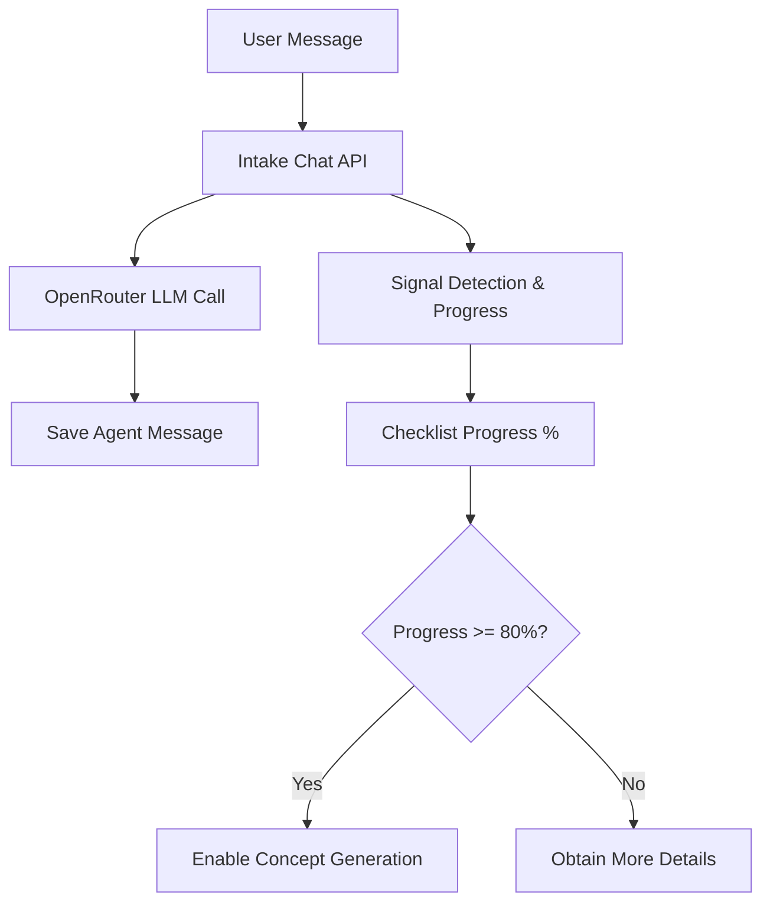

# Technical Report: Real Intake Assistant & Concept Generator Pipeline (Sprint 10.31a)

## 1. System Architecture & Flow

The intake pipeline represents the initial stage of the novel creation workspace. It transitions the raw ideas provided by the user into structural parameters:



## 2. Safety Bounds & Database Workaround

To work around the database constraint without applying migration `00010`, we map billing operations to the existing `publish_copy` billing type, using specific metadata attributes:

```json
{
  "actualGenerationType": "intake_assistant", // or "concept_generation"
  "billingAlias": "publish_copy",
  "task": "10.31a"
}
```

* **Intake Assistant Responses:** Debits **1 credit** prior to the OpenRouter call. If the request fails, the credit is refunded.
* **Concept Generation:** Debits **3 credits** prior to generating 3 concepts. If the request fails, all 3 credits are refunded.

## 3. Dynamic Signal Verification

The system tracks 7 core signals:
1. `genre`
2. `protagonist`
3. `core_conflict`
4. `reader_promise`
5. `target_reader`
6. `secret_candidate`
7. `tone`

Progress percentage is computed as `(detected_active_signals / 7) * 100`. The UI dynamically updates the sidebar checkboxes and descriptions using [api-mappers.ts](file:///d:/Coding/vibenovel-unified-blueprint/apps/web/src/lib/api-mappers.ts) depending on active signals.

## 4. Test Strategy

We maintain two test suites in [sprint10b-real-intake-concept-pipeline.spec.ts](file:///d:/Coding/vibenovel-unified-blueprint/apps/web/e2e/sprint10b-real-intake-concept-pipeline.spec.ts):
* **Mock-mode:** Mocks API calls via Playwright `page.route` to ensure UI stability.
* **AI-mode contract tests:** Hits the actual `/api/health` endpoint. If `TEST_REAL_AI` is set, it executes live LLM integration checks to ensure unique non-stub output format matches.
