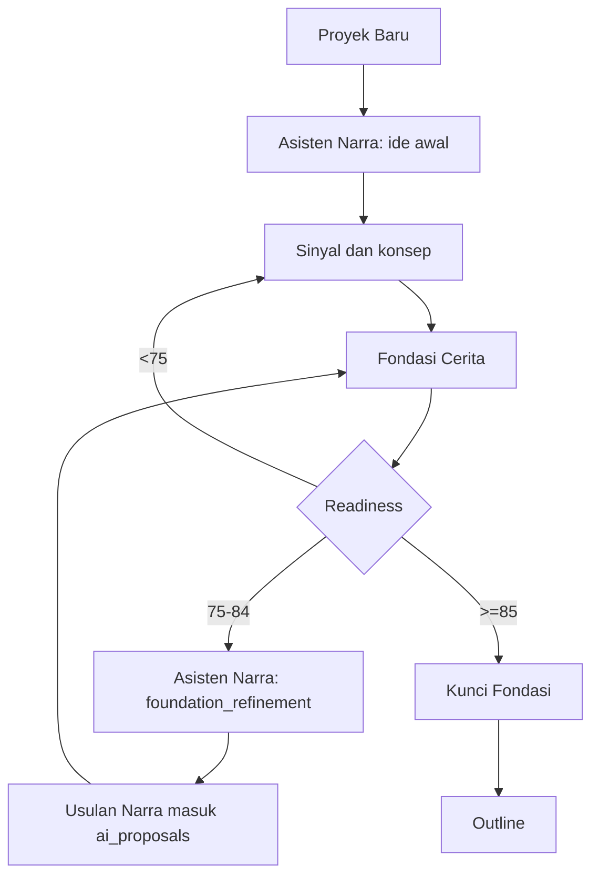

# Asisten Narra Unified Agent Implementation Plan

> **For agentic workers:** REQUIRED SUB-SKILL: Use superpowers:subagent-driven-development (recommended) or superpowers:executing-plans to implement this plan task-by-task. Steps use checkbox (`- [ ]`) syntax for tracking.

**Goal:** Convert the old "Mulai Proyek" intake-only experience into a continuous phase-aware `Asisten Narra` chat that starts projects and later matures Foundation to >=85 before lock.

**Architecture:** Reuse `intake_sessions` and `intake_messages` as the single conversation history. Add a `foundation_refinement` phase, richer readiness scoring, and a Narra foundation-patch generator that creates reviewable `ai_proposals` instead of writing canon directly. The Foundation page sends writers back into the same Narra chat with foundation context, then refreshes proposals/readiness after Narra creates suggestions.

**Tech Stack:** React/Vite, Hono on Cloudflare Workers, Supabase Postgres, `@vibenovel/shared`, OpenRouter via `model-router`, TypeScript contract tests, Playwright smoke tests.

---

## Source Spec

- `docs/superpowers/specs/2026-06-16-foundation-coach-design.md`

## File Structure

- Modify `packages/shared/src/enums.ts`: add readiness bands, thresholds, and `INTAKE_PHASES.foundation_refinement`; remove the partial separate Foundation Coach enums.
- Modify `packages/shared/src/domain.ts`: keep `IntakeSession.phase` as the continuity field and expose richer readiness fields.
- Create `supabase/migrations/00019_asisten_narra_phase_readiness.sql`: add DB enum values for readiness and intake phase.
- Modify `apps/api/src/services/foundation-readiness.ts`: split score into core completeness and maturity; require 85 for lock.
- Create `apps/api/src/services/story-agent-context.ts`: build phase-aware Narra context from selected concept, foundation, readiness, proposals, characters, facts, and recent chat.
- Modify `apps/api/src/services/intake.ts`: accept optional message phase/entrypoint, rename prompt persona to Narra, include foundation context when phase is `foundation_refinement`.
- Create `apps/api/src/services/asisten-narra-foundation-patch.ts`: generate deterministic/AI foundation patch drafts and insert `ai_proposals` marked `asisten_narra_foundation_patch`.
- Modify `apps/api/src/routes/intake.ts`: keep the same chat endpoint but pass phase metadata.
- Modify `apps/api/src/routes/foundation.ts`: add `POST /api/projects/:id/foundation/proposals/generate-from-narra`.
- Create `apps/api/scripts/sprint19-asisten-narra-contracts.test.mts`: contract tests for phase continuity, readiness, and proposal-first patch generation.
- Modify `apps/api/package.json`: add `test:sprint19-asisten-narra`.
- Modify `apps/web/src/utils/navigation.ts`: rename active project nav to `Asisten Narra` and point it to the active project chat.
- Modify `apps/web/src/routes/paths.ts`: add `ROUTES.project.narra(id)` alias that resolves to `/projects/:id/intake` for MVP compatibility.
- Modify `apps/web/src/lib/api-mappers.ts`: update user-facing copy and readiness labels.
- Modify `apps/web/src/types/intake.ts`: add phase/context fields needed by Narra UI.
- Modify `apps/web/src/services/intake.ts`: send optional phase/entrypoint with messages.
- Modify `apps/web/src/services/foundation-flow.ts`: add `generateFoundationProposalsFromNarra`.
- Modify `apps/web/src/hooks/useIntakeData.ts`: detect `?mode=foundation`, load same session, and send phase-aware messages.
- Modify `apps/web/src/hooks/useFoundationFlow.ts`: expose `matangkanDenganNarraRoute` and refresh proposals after Narra-generated patches.
- Modify `apps/web/src/pages/IntakePage.tsx`: keep component layout but present it as Asisten Narra.
- Modify `apps/web/src/pages/FoundationPage.tsx`: add `Matangkan dengan Narra` CTA in the readiness section.
- Modify `apps/web/src/components/foundation/FoundationReadinessCard.tsx`: render the Narra CTA and clearer lock status.
- Create `apps/web/e2e/sprint19-asisten-narra.spec.ts`: smoke the sidebar rename, Foundation CTA, and proposal refresh path.

## Product Flow Target



## Task 1: Normalize Shared Contracts

**Files:**
- Modify: `packages/shared/src/enums.ts`
- Modify: `packages/shared/src/domain.ts`
- Create: `supabase/migrations/00019_asisten_narra_phase_readiness.sql`

- [ ] **Step 1: Write the failing enum contract**

Create `apps/api/scripts/sprint19-asisten-narra-contracts.test.mts` with this initial content:

```ts
import assert from "node:assert/strict";
import {
  FOUNDATION_READINESS_LEVELS,
  INTAKE_PHASES,
  LOCK_READINESS_MIN_SCORE,
  REFINE_READINESS_MIN_SCORE,
} from "@vibenovel/shared";

assert.equal(INTAKE_PHASES.foundation_refinement, "foundation_refinement");
assert.equal(FOUNDATION_READINESS_LEVELS.siap_dimatangkan, "siap_dimatangkan");
assert.equal(FOUNDATION_READINESS_LEVELS.sangat_siap, "sangat_siap");
assert.equal(REFINE_READINESS_MIN_SCORE, 75);
assert.equal(LOCK_READINESS_MIN_SCORE, 85);

console.log("PASS Sprint 19 Asisten Narra contracts");
```

- [ ] **Step 2: Run the test and confirm it fails**

Run: `npm run build -w @vibenovel/shared && npx tsx apps/api/scripts/sprint19-asisten-narra-contracts.test.mts`

Expected: FAIL because `foundation_refinement`, `LOCK_READINESS_MIN_SCORE`, or `REFINE_READINESS_MIN_SCORE` is missing or duplicated.

- [ ] **Step 3: Replace the readiness and intake enum blocks**

In `packages/shared/src/enums.ts`, make the story foundation readiness block exactly:

```ts
/** User-facing readiness bands (Kesiapan Fondasi). */
export const FOUNDATION_READINESS_LEVELS = {
  belum_siap: "belum_siap",
  bisa_lanjut: "bisa_lanjut",
  siap_dimatangkan: "siap_dimatangkan",
  siap_dikunci: "siap_dikunci",
  sangat_siap: "sangat_siap",
} as const;
export type FoundationReadinessLevel =
  (typeof FOUNDATION_READINESS_LEVELS)[keyof typeof FOUNDATION_READINESS_LEVELS];

export const REFINE_READINESS_MIN_SCORE = 75;
export const LOCK_READINESS_MIN_SCORE = 85;
```

Remove `FOUNDATION_REFINEMENT_SESSION_STATUSES`, `FoundationRefinementSessionStatus`, `FOUNDATION_REFINEMENT_MESSAGE_ROLES`, and `FoundationRefinementMessageRole`. The unified design does not use separate foundation chat tables.

In the `INTAKE_PHASES` block, make it exactly:

```ts
export const INTAKE_PHASES = {
  idea_collection: "idea_collection",
  signal_detection: "signal_detection",
  concept_generation: "concept_generation",
  foundation_preparation: "foundation_preparation",
  foundation_refinement: "foundation_refinement",
} as const;
export type IntakePhase = (typeof INTAKE_PHASES)[keyof typeof INTAKE_PHASES];
```

- [ ] **Step 4: Add the additive migration**

Create `supabase/migrations/00019_asisten_narra_phase_readiness.sql`:

```sql
-- Sprint 19: Asisten Narra unified agent phase and readiness bands.
-- Additive only. Existing sessions remain valid.

ALTER TYPE public.intake_phase ADD VALUE IF NOT EXISTS 'foundation_refinement';

ALTER TYPE public.foundation_readiness_level ADD VALUE IF NOT EXISTS 'siap_dimatangkan';
ALTER TYPE public.foundation_readiness_level ADD VALUE IF NOT EXISTS 'sangat_siap';
```

- [ ] **Step 5: Run shared checks**

Run: `npm run build -w @vibenovel/shared && npx tsx apps/api/scripts/sprint19-asisten-narra-contracts.test.mts`

Expected: PASS with `PASS Sprint 19 Asisten Narra contracts`.

- [ ] **Step 6: Commit**

```bash
git add packages/shared/src/enums.ts packages/shared/src/domain.ts supabase/migrations/00019_asisten_narra_phase_readiness.sql apps/api/scripts/sprint19-asisten-narra-contracts.test.mts
git commit -m "feat: add asisten narra shared contracts"
```

## Task 2: Add Foundation Readiness Maturity Gate

**Files:**
- Modify: `apps/api/src/services/foundation-readiness.ts`
- Modify: `apps/api/scripts/sprint19-asisten-narra-contracts.test.mts`
- Modify: `apps/web/src/services/foundation-flow.ts`
- Modify: `apps/web/src/lib/api-mappers.ts`

- [ ] **Step 1: Extend the failing contract test**

Append this to `apps/api/scripts/sprint19-asisten-narra-contracts.test.mts`:

```ts
import { AI_PROPOSAL_STATUSES, AI_PROPOSAL_TYPES } from "@vibenovel/shared";
import { computeFoundationReadiness } from "../src/services/foundation-readiness.ts";

const matureConcept = {
  id: "concept-19",
  project_id: "project-19",
  title: "Meja Makan yang Selalu Genap",
  short_pitch:
    "Rani menjaga rumah tetap terlihat utuh saat suaminya menyembunyikan kehilangan kerja dan utang keluarga.",
  reader_promise:
    "Pembaca mengikuti bongkar kebohongan rumah tangga yang pelan, emosional, dan dekat dengan realitas keluarga urban.",
  core_conflict:
    "Rani harus memilih antara menjaga rumah tetap rapi atau membongkar kebohongan finansial Bima dan campur tangan mertuanya.",
  genre: "Drama rumah tangga",
  tone: "Emosional, realistis, tegang pelan",
  target_reader: "hp_serial",
  status: "selected",
  source: "system",
  score: 90,
  payload: {},
  created_at: "2026-06-16T00:00:00.000Z",
  updated_at: "2026-06-16T00:00:00.000Z",
} as Parameters<typeof computeFoundationReadiness>[1];

const acceptedRows = [
  {
    id: "proposal-foundation",
    project_id: "project-19",
    proposal_type: AI_PROPOSAL_TYPES.foundation,
    status: AI_PROPOSAL_STATUSES.accepted,
    risk_level: "low",
    source: "ai_import",
    title: "Fondasi Rani",
    payload: {
      premise: matureConcept.short_pitch,
      mainConflict: matureConcept.core_conflict,
      readerPromise: matureConcept.reader_promise,
      genre: matureConcept.genre,
      tone: matureConcept.tone,
      targetReader: matureConcept.target_reader,
    },
    review_note: null,
    reviewed_at: null,
    reviewed_by: null,
    merged_into_id: null,
    result_fact_id: null,
    result_character_id: null,
    created_at: "2026-06-16T00:00:00.000Z",
    updated_at: "2026-06-16T00:00:00.000Z",
  },
  {
    id: "proposal-protagonist",
    project_id: "project-19",
    proposal_type: AI_PROPOSAL_TYPES.character,
    status: AI_PROPOSAL_STATUSES.accepted,
    risk_level: "low",
    source: "ai_import",
    title: "Tokoh Utama - Rani",
    payload: {
      name: "Rani Pradipta",
      role: "protagonist",
      description: "Pemilik katering rumahan yang menahan perasaan demi rumah tetap terlihat baik-baik saja.",
      motivation: "Melindungi anaknya tanpa terus menjadi penyangga kebohongan suaminya.",
    },
    review_note: null,
    reviewed_at: null,
    reviewed_by: null,
    merged_into_id: null,
    result_fact_id: null,
    result_character_id: null,
    created_at: "2026-06-16T00:00:00.000Z",
    updated_at: "2026-06-16T00:00:00.000Z",
  },
  {
    id: "proposal-fact-1",
    project_id: "project-19",
    proposal_type: AI_PROPOSAL_TYPES.fact,
    status: AI_PROPOSAL_STATUSES.accepted,
    risk_level: "medium",
    source: "ai_import",
    title: "Fakta: Bima kehilangan pekerjaan",
    payload: {
      content: "Bima kehilangan pekerjaan enam bulan lalu dan menutupinya dari Rani.",
      category: "event",
      importance: "core",
    },
    review_note: null,
    reviewed_at: null,
    reviewed_by: null,
    merged_into_id: null,
    result_fact_id: null,
    result_character_id: null,
    created_at: "2026-06-16T00:00:00.000Z",
    updated_at: "2026-06-16T00:00:00.000Z",
  },
  {
    id: "proposal-fact-2",
    project_id: "project-19",
    proposal_type: AI_PROPOSAL_TYPES.fact,
    status: AI_PROPOSAL_STATUSES.accepted,
    risk_level: "medium",
    source: "ai_import",
    title: "Fakta: Tabungan berkurang",
    payload: {
      content: "Tabungan keluarga Rani berkurang karena utang yang Bima sembunyikan.",
      category: "event",
      importance: "major",
    },
    review_note: null,
    reviewed_at: null,
    reviewed_by: null,
    merged_into_id: null,
    result_fact_id: null,
    result_character_id: null,
    created_at: "2026-06-16T00:00:00.000Z",
    updated_at: "2026-06-16T00:00:00.000Z",
  },
] as Parameters<typeof computeFoundationReadiness>[2];

const readyToRefine = computeFoundationReadiness(
  null,
  matureConcept,
  acceptedRows,
  [],
  [],
  [],
  false,
  {
    activeStatuses: new Set(["accepted"]),
    acceptedCountsAsReady: true,
    persist: false,
  },
);

assert.equal(readyToRefine.readinessScore >= 75, true);
assert.equal(readyToRefine.canLock, false);
assert.equal(readyToRefine.canRefine, true);
assert.equal(readyToRefine.readinessLevel, FOUNDATION_READINESS_LEVELS.siap_dimatangkan);
```

- [ ] **Step 2: Run and confirm failure**

Run: `npm run build -w @vibenovel/shared && npx tsx apps/api/scripts/sprint19-asisten-narra-contracts.test.mts`

Expected: FAIL because `canRefine` does not exist and 75 still locks.

- [ ] **Step 3: Update readiness result type and score bands**

In `apps/api/src/services/foundation-readiness.ts`, update imports:

```ts
import {
  FOUNDATION_READINESS_LEVELS,
  LOCK_READINESS_MIN_SCORE,
  REFINE_READINESS_MIN_SCORE,
  STORY_CONCEPT_STATUSES,
  type FoundationReadinessLevel,
} from "@vibenovel/shared";
```

Update `FoundationReadinessResult`:

```ts
export interface FoundationReadinessResult {
  readinessScore: number;
  readinessLevel: FoundationReadinessLevel;
  canLock: boolean;
  canRefine: boolean;
  checks: ReadinessCheckItem[];
  missing: string[];
}
```

Replace `levelFromScore` with:

```ts
function levelFromScore(score: number): FoundationReadinessLevel {
  if (score >= 95) return FOUNDATION_READINESS_LEVELS.sangat_siap;
  if (score >= LOCK_READINESS_MIN_SCORE) return FOUNDATION_READINESS_LEVELS.siap_dikunci;
  if (score >= REFINE_READINESS_MIN_SCORE) return FOUNDATION_READINESS_LEVELS.siap_dimatangkan;
  if (score >= 45) return FOUNDATION_READINESS_LEVELS.bisa_lanjut;
  return FOUNDATION_READINESS_LEVELS.belum_siap;
}
```

- [ ] **Step 4: Add maturity checks**

Inside `computeFoundationReadiness`, after the existing `secret_guard` check and before clamping score, add:

```ts
  const maturityChecks: ReadinessCheckItem[] = [];

  const joinedFoundationText = [
    foundation?.premise,
    foundation?.main_conflict,
    foundation?.reader_promise,
    foundation?.tone,
    foundation?.genre,
    concept?.short_pitch,
    concept?.core_conflict,
    concept?.reader_promise,
    ...activeProposals.map((proposal) => {
      const payload = parsePayload(proposal.payload);
      return [
        payload.premise,
        payload.mainConflict,
        payload.readerPromise,
        payload.description,
        payload.motivation,
        payload.content,
        payload.reason,
      ]
        .filter((value): value is string => typeof value === "string")
        .join(" ");
    }),
  ]
    .filter((value): value is string => typeof value === "string")
    .join(" ")
    .toLowerCase();

  function maturityCheck(key: string, label: string, pattern: RegExp, reasonPass: string, reasonMissing: string): void {
    const pass = pattern.test(joinedFoundationText);
    maturityChecks.push({
      key,
      label,
      status: pass ? "pass" : "missing",
      reason: pass ? reasonPass : reasonMissing,
    });
    if (pass) score += 5;
  }

  maturityCheck(
    "motivation_specific",
    "Motivasi tokoh spesifik",
    /motivasi|ingin|butuh|takut|melindungi|membuktikan|menebus|menjaga|mencari/,
    "Motivasi atau luka tokoh terbaca.",
    "Motivasi atau luka tokoh utama masih generik.",
  );
  maturityCheck(
    "opposing_force",
    "Tekanan lawan jelas",
    /melawan|menekan|menghalangi|mertua|utang|rahasia|antagonis|ancaman|konflik/,
    "Tekanan luar atau lawan cerita jelas.",
    "Tekanan luar belum cukup jelas.",
  );
  maturityCheck(
    "stakes_consequence",
    "Konsekuensi terasa",
    /kehilangan|hancur|utang|terbongkar|gagal|anak|keluarga|karier|nyawa|rumah/,
    "Konsekuensi kegagalan terasa konkret.",
    "Konsekuensi kegagalan belum konkret.",
  );
  maturityCheck(
    "serial_momentum",
    "Momentum serial",
    /bab|serial|pelan|terungkap|misteri|cliff|lanjut|pembaca|demi bab/,
    "Janji serial punya dorongan lanjut baca.",
    "Janji pembaca belum cukup serial.",
  );
  maturityCheck(
    "style_specific",
    "Gaya dan format spesifik",
    /hp|kbm|sinematik|realistis|witty|hangat|tegang|emosional|bab pendek/,
    "Gaya atau format sudah memberi arah generasi.",
    "Gaya cerita masih terlalu umum.",
  );
```

Then replace the final `canLock` section with:

```ts
  const canRefine =
    score >= REFINE_READINESS_MIN_SCORE &&
    score < LOCK_READINESS_MIN_SCORE &&
    coreComplete &&
    conceptSelected &&
    !foundation?.is_locked;

  const canLock =
    score >= LOCK_READINESS_MIN_SCORE &&
    coreComplete &&
    conceptSelected &&
    !foundation?.is_locked;

  const missing = [...checks, ...maturityChecks]
    .filter((c) => c.status === "missing")
    .map((c) => c.label);

  return {
    readinessScore: score,
    readinessLevel,
    canLock,
    canRefine,
    checks: [...checks, ...maturityChecks],
    missing,
  };
```

- [ ] **Step 5: Update web response types and labels**

In `apps/web/src/services/foundation-flow.ts`, add `canRefine`:

```ts
export interface FoundationReadinessResponse {
  readinessScore: number;
  readinessLevel: string;
  canLock: boolean;
  canRefine: boolean;
  checks: Array<{
    key: string;
    label: string;
    status: string;
    reason: string;
  }>;
  missing: string[];
}
```

In `apps/web/src/lib/api-mappers.ts`, replace `READINESS_LABELS`:

```ts
const READINESS_LABELS: Record<string, string> = {
  belum_siap: "Belum siap",
  bisa_lanjut: "Perlu dilengkapi",
  siap_dimatangkan: "Siap dimatangkan",
  siap_dikunci: "Siap dikunci",
  sangat_siap: "Sangat siap",
};
```

- [ ] **Step 6: Run checks**

Run:

```bash
npm run build -w @vibenovel/shared
npx tsx apps/api/scripts/sprint19-asisten-narra-contracts.test.mts
npm run typecheck:api
npm run typecheck:web
```

Expected: all pass.

- [ ] **Step 7: Commit**

```bash
git add apps/api/src/services/foundation-readiness.ts apps/api/scripts/sprint19-asisten-narra-contracts.test.mts apps/web/src/services/foundation-flow.ts apps/web/src/lib/api-mappers.ts
git commit -m "feat: gate foundation lock behind maturity readiness"
```

## Task 3: Build Phase-Aware Narra Context

**Files:**
- Create: `apps/api/src/services/story-agent-context.ts`
- Modify: `apps/api/scripts/sprint19-asisten-narra-contracts.test.mts`

- [ ] **Step 1: Add context contract tests**

Append:

```ts
import {
  buildNarraSystemPrompt,
  resolveNarraPhase,
} from "../src/services/story-agent-context.ts";

assert.equal(resolveNarraPhase({ requestedPhase: undefined, entrypoint: undefined }), "idea_collection");
assert.equal(
  resolveNarraPhase({ requestedPhase: "foundation_refinement", entrypoint: "foundation" }),
  "foundation_refinement",
);

const narraPrompt = buildNarraSystemPrompt({
  phase: "foundation_refinement",
  projectTitle: "Meja Makan yang Selalu Genap",
  foundationSummary:
    "Rani menghadapi kebohongan finansial Bima dan tekanan Bu Ratna.",
  readinessSummary: "75%, siap dimatangkan, missing: Stakes and serial momentum",
});
assert.match(narraPrompt, /Asisten Narra/);
assert.match(narraPrompt, /foundation/i);
assert.match(narraPrompt, /proposal/i);
assert.doesNotMatch(narraPrompt, /AWS|Mayar|Duitku|OpenRouter API key/i);
```

- [ ] **Step 2: Run and confirm failure**

Run: `npx tsx apps/api/scripts/sprint19-asisten-narra-contracts.test.mts`

Expected: FAIL because `story-agent-context.ts` does not exist.

- [ ] **Step 3: Create the context service**

Create `apps/api/src/services/story-agent-context.ts`:

```ts
import { INTAKE_PHASES, type IntakePhase } from "@vibenovel/shared";

export type NarraPhase = IntakePhase;

export interface ResolveNarraPhaseInput {
  requestedPhase?: string;
  entrypoint?: string;
}

export interface NarraPromptContext {
  phase: NarraPhase;
  projectTitle: string;
  foundationSummary?: string;
  readinessSummary?: string;
}

export function resolveNarraPhase(input: ResolveNarraPhaseInput): NarraPhase {
  if (
    input.requestedPhase === INTAKE_PHASES.foundation_refinement ||
    input.entrypoint === "foundation"
  ) {
    return INTAKE_PHASES.foundation_refinement;
  }
  if (input.requestedPhase === INTAKE_PHASES.concept_generation) {
    return INTAKE_PHASES.concept_generation;
  }
  if (input.requestedPhase === INTAKE_PHASES.signal_detection) {
    return INTAKE_PHASES.signal_detection;
  }
  if (input.requestedPhase === INTAKE_PHASES.foundation_preparation) {
    return INTAKE_PHASES.foundation_preparation;
  }
  return INTAKE_PHASES.idea_collection;
}

export function buildNarraSystemPrompt(ctx: NarraPromptContext): string {
  const base =
    "Kamu adalah Asisten Narra, rekan cerita untuk penulis serial Indonesia. " +
    "Jawab hangat, ringkas, spesifik, dan tidak robotik. " +
    "Ajukan satu pertanyaan berguna saja setiap giliran. " +
    "Jangan membuat fakta canon diam-diam. Semua perubahan cerita harus menjadi proposal yang bisa ditinjau penulis.";

  if (ctx.phase === INTAKE_PHASES.foundation_refinement) {
    return [
      base,
      "Mode saat ini: foundation refinement.",
      `Judul proyek: ${ctx.projectTitle}`,
      `Ringkasan fondasi: ${ctx.foundationSummary ?? "(belum tersedia)"}`,
      `Kesiapan fondasi: ${ctx.readinessSummary ?? "(belum dihitung)"}`,
      "Tugasmu: bantu penulis mematangkan motivasi tokoh, tekanan lawan, stakes, janji pembaca, dan gaya serial.",
      "Jangan ulangi detail yang sudah jelas. Jika informasi sudah cukup, arahkan penulis untuk membuat Usulan Narra.",
    ].join("\n");
  }

  return [
    base,
    "Mode saat ini: idea intake.",
    `Judul proyek: ${ctx.projectTitle}`,
    "Tugasmu: bantu penulis mengumpulkan ide, tokoh, konflik, genre, tone, target pembaca, dan rahasia yang perlu ditahan.",
  ].join("\n");
}
```

- [ ] **Step 4: Run contract**

Run: `npx tsx apps/api/scripts/sprint19-asisten-narra-contracts.test.mts`

Expected: PASS for the new context assertions.

- [ ] **Step 5: Commit**

```bash
git add apps/api/src/services/story-agent-context.ts apps/api/scripts/sprint19-asisten-narra-contracts.test.mts
git commit -m "feat: add phase-aware narra context"
```

## Task 4: Extend Intake Chat Without Splitting History

**Files:**
- Modify: `apps/api/src/services/intake.ts`
- Modify: `apps/api/src/routes/intake.ts`
- Modify: `apps/api/scripts/sprint19-asisten-narra-contracts.test.mts`

- [ ] **Step 1: Add static contract checks**

Append:

```ts
import { readFileSync } from "node:fs";

const intakeServiceSql = readFileSync("src/services/intake.ts", "utf8");
assert.match(intakeServiceSql, /buildNarraSystemPrompt/);
assert.match(intakeServiceSql, /resolveNarraPhase/);
assert.match(intakeServiceSql, /foundation_refinement/);
assert.doesNotMatch(intakeServiceSql, /foundation_refinement_messages/);
assert.doesNotMatch(intakeServiceSql, /foundation_refinement_sessions/);
```

- [ ] **Step 2: Run and confirm failure**

Run from `apps/api`: `npm run test:sprint19-asisten-narra`

Expected: FAIL until package script exists or service imports are added.

- [ ] **Step 3: Add package script**

In `apps/api/package.json`, add:

```json
"test:sprint19-asisten-narra": "npm run build -w @vibenovel/shared && tsx scripts/sprint19-asisten-narra-contracts.test.mts"
```

- [ ] **Step 4: Wire phase into intake service**

In `apps/api/src/services/intake.ts`, import the new helpers:

```ts
import {
  buildNarraSystemPrompt,
  resolveNarraPhase,
} from "./story-agent-context.js";
import { getFoundationBundleForOwner } from "./foundation.js";
import { getFoundationReadinessForOwner } from "./foundation-readiness.js";
```

In `appendUserMessageForOwner`, after `const content = assertMessageContent(body.content);`, add:

```ts
  const requestedPhase =
    typeof body.phase === "string" ? body.phase : undefined;
  const entrypoint =
    typeof body.entrypoint === "string" ? body.entrypoint : undefined;
  const narraPhase = resolveNarraPhase({ requestedPhase, entrypoint });
```

Replace the ownership check:

```ts
  await getOwnedProjectRow(bindings, ownerId, projectId);
```

with:

```ts
  const projectRow = await getOwnedProjectRow(bindings, ownerId, projectId);
```

Change the user message insert metadata to:

```ts
      metadata: { source: "api", phase: narraPhase, entrypoint: entrypoint ?? null },
```

Before the AI prompt is built, update the active session phase:

```ts
  await admin
    .from("intake_sessions")
    .update({
      phase: narraPhase,
      metadata: {
        ...parseJsonObject(sessionRow.metadata),
        lastEntrypoint: entrypoint ?? null,
        assistantName: "Asisten Narra",
      },
    })
    .eq("id", sessionRow.id)
    .eq("project_id", projectId);
```

Replace the old `systemPrompt` assignment with:

```ts
    let foundationSummary: string | undefined;
    let readinessSummary: string | undefined;

    if (narraPhase === INTAKE_PHASES.foundation_refinement) {
      const [foundationBundle, readiness] = await Promise.all([
        getFoundationBundleForOwner(bindings, ownerId, projectId),
        getFoundationReadinessForOwner(bindings, ownerId, projectId),
      ]);

      const f = foundationBundle.foundation;
      const characterNames = foundationBundle.characters
        .map((character) => character.name)
        .slice(0, 6)
        .join(", ");
      const factSummary = foundationBundle.facts
        .map((fact) => fact.text)
        .slice(0, 5)
        .join(" | ");

      foundationSummary = [
        `Premise: ${f.premise || "(belum diisi)"}`,
        `Konflik: ${f.mainConflict || "(belum diisi)"}`,
        `Janji pembaca: ${f.readerPromise || "(belum diisi)"}`,
        `Genre/Tone: ${[f.genre, f.tone].filter(Boolean).join(" / ") || "(belum diisi)"}`,
        `Tokoh: ${characterNames || "(belum ada)"}`,
        `Fakta: ${factSummary || "(belum ada)"}`,
      ].join("\n");

      readinessSummary =
        `${readiness.readinessScore}%, ${readiness.readinessLevel}, missing: ${readiness.missing.join(", ") || "tidak ada"}`;
    }

    const systemPrompt = buildNarraSystemPrompt({
      phase: narraPhase,
      projectTitle: projectRow.title,
      foundationSummary,
      readinessSummary,
    });
```

- [ ] **Step 5: Prevent progress extraction from overwriting refinement phase**

In `extractSignalsAndProgressInternal`, replace:

```ts
  const nextPhase = progressPercent >= 80 ? INTAKE_PHASES.concept_generation : INTAKE_PHASES.signal_detection;
```

with:

```ts
  const { data: currentSession } = await admin
    .from("intake_sessions")
    .select("phase")
    .eq("id", sessionId)
    .eq("project_id", projectId)
    .maybeSingle();

  const currentPhase = typeof currentSession?.phase === "string" ? currentSession.phase : "";
  const nextPhase =
    currentPhase === INTAKE_PHASES.foundation_refinement
      ? INTAKE_PHASES.foundation_refinement
      : progressPercent >= 80
        ? INTAKE_PHASES.concept_generation
        : INTAKE_PHASES.signal_detection;
```

- [ ] **Step 6: Run checks**

Run:

```bash
npm run test:sprint19-asisten-narra -w @vibenovel/api
npm run typecheck:api
```

Expected: PASS.

- [ ] **Step 7: Commit**

```bash
git add apps/api/src/services/intake.ts apps/api/src/routes/intake.ts apps/api/package.json apps/api/scripts/sprint19-asisten-narra-contracts.test.mts
git commit -m "feat: continue narra chat across foundation phase"
```

## Task 5: Create Narra Foundation Patch Generator

**Files:**
- Create: `apps/api/src/services/asisten-narra-foundation-patch.ts`
- Modify: `apps/api/src/routes/foundation.ts`
- Modify: `apps/api/scripts/sprint19-asisten-narra-contracts.test.mts`

- [ ] **Step 1: Add proposal-first contract tests**

Append:

```ts
const foundationRoutesSql = readFileSync("src/routes/foundation.ts", "utf8");
assert.match(
  foundationRoutesSql,
  /\/api\/projects\/:id\/foundation\/proposals\/generate-from-narra/,
);

const narraPatchServiceSql = readFileSync(
  "src/services/asisten-narra-foundation-patch.ts",
  "utf8",
);
assert.match(narraPatchServiceSql, /asisten_narra_foundation_patch/);
assert.match(narraPatchServiceSql, /\.from\("ai_proposals"\)\.insert/);
assert.doesNotMatch(
  narraPatchServiceSql,
  /\.from\("facts"\)\s*[\s\S]*\.insert/,
  "Narra patch must not insert canon facts directly",
);
assert.doesNotMatch(
  narraPatchServiceSql,
  /\.from\("story_foundations"\)\s*[\s\S]*\.update/,
  "Narra patch must not mutate foundation directly",
);
```

- [ ] **Step 2: Run and confirm failure**

Run: `npm run test:sprint19-asisten-narra -w @vibenovel/api`

Expected: FAIL because route/service do not exist.

- [ ] **Step 3: Create patch service skeleton**

Create `apps/api/src/services/asisten-narra-foundation-patch.ts`:

```ts
import {
  AI_PROPOSAL_RISK_LEVELS,
  AI_PROPOSAL_SOURCES,
  AI_PROPOSAL_STATUSES,
  AI_PROPOSAL_TYPES,
  GENERATION_TYPES,
  WRITER_QUALITY_MODES,
  type AiProposalRiskLevel,
  type AiProposalType,
  type JsonObject,
} from "@vibenovel/shared";
import { isAiGenerationEnabled, isAiProviderMock, type AppBindings } from "../env.js";
import { AppError } from "../errors.js";
import { type AiProposalRow, mapAiProposalResponse, type AiProposalResponse } from "../lib/mappers.js";
import { createServiceRoleClient } from "../lib/supabase.js";
import { generateWithModelRouter } from "./model-router.js";
import { getOwnedProjectRow } from "./project.js";
import { getFoundationReadinessForOwner } from "./foundation-readiness.js";
import { listIntakeMessagesForOwner } from "./intake.js";
import { computePromptHashFromMessages } from "./prose-generation-prompt.js";
import { getCreditCostForGeneration } from "./ai-credit-policy.js";
import {
  CREDIT_LEDGER_REASONS,
  debitCreditsForAttempt,
  refundCreditsForAttempt,
} from "./credit-ledger.js";
import {
  createGenerationAttempt,
  markGenerationAttemptFailed,
  markGenerationAttemptRunning,
  markGenerationAttemptSucceeded,
} from "./generation-attempt.js";
import { generateCorrelationId } from "./audit-snapshot.js";

const PROPOSAL_SELECT =
  "id, project_id, proposal_type, status, risk_level, source, title, payload, review_note, reviewed_at, reviewed_by, merged_into_id, result_fact_id, result_character_id, created_at, updated_at";

const GENERATOR_MARKER = "asisten_narra_foundation_patch";

interface ProposalDraft {
  proposalType: AiProposalType;
  title: string;
  riskLevel: AiProposalRiskLevel;
  payload: JsonObject;
}

function buildDeterministicPatchDrafts(input: {
  projectId: string;
  sessionId: string | null;
  readinessBefore: number;
  missing: string[];
}): ProposalDraft[] {
  const base = {
    generator: GENERATOR_MARKER,
    sessionId: input.sessionId,
    phase: "foundation_refinement",
    readinessBefore: input.readinessBefore,
    targetReadiness: 85,
  };

  return [
    {
      proposalType: AI_PROPOSAL_TYPES.foundation,
      title: "Usulan Narra: pertegas konflik dan janji pembaca",
      riskLevel: AI_PROPOSAL_RISK_LEVELS.low,
      payload: {
        ...base,
        premise:
          "Tokoh utama dipaksa menghadapi kebohongan yang selama ini menjaga rumah tampak utuh, lalu memilih kebenaran yang menyakitkan agar hidupnya tidak terus dikendalikan orang lain.",
        mainConflict:
          "Konflik utama bertumpu pada pilihan antara menjaga citra keluarga atau membongkar kebohongan yang merusak kepercayaan.",
        readerPromise:
          "Pembaca mendapat drama emosional yang pelan, dekat, dan memuaskan saat satu demi satu kebohongan rumah tangga terungkap.",
        reason: `Narra mematangkan bagian: ${input.missing.join(", ") || "motivasi, stakes, dan janji serial"}.`,
      },
    },
    {
      proposalType: AI_PROPOSAL_TYPES.fact,
      title: "Usulan Narra: konsekuensi emosional tokoh utama",
      riskLevel: AI_PROPOSAL_RISK_LEVELS.medium,
      payload: {
        ...base,
        content:
          "Tokoh utama paling takut anak atau orang terdekatnya ikut menanggung akibat dari kebohongan yang ia biarkan terlalu lama.",
        category: "motive",
        importance: "major",
        reason: "Menambah stakes emosional tanpa menulis rahasia high-risk.",
      },
    },
    {
      proposalType: AI_PROPOSAL_TYPES.style,
      title: "Usulan Narra: gaya serial HP",
      riskLevel: AI_PROPOSAL_RISK_LEVELS.low,
      payload: {
        ...base,
        tone: "Emosional, realistis, tegang pelan",
        styleTags: ["Drama domestik", "Bab pendek", "Tegangan pelan", "Dialog natural"],
        outputStyle: "warm_emotional",
        reason: "Membuat arah generasi lebih spesifik untuk pembaca serial mobile.",
      },
    },
  ];
}

function stripJsonFences(text: string): string {
  let value = text.trim();
  if (value.startsWith("```json")) value = value.slice(7);
  else if (value.startsWith("```")) value = value.slice(3);
  if (value.endsWith("```")) value = value.slice(0, -3);
  return value.trim();
}

function stringValue(value: unknown, fallback = ""): string {
  return typeof value === "string" && value.trim() ? value.trim() : fallback;
}

function stringArray(value: unknown): string[] {
  return Array.isArray(value)
    ? value.filter((item): item is string => typeof item === "string" && item.trim().length > 0)
    : [];
}

function buildDraftsFromAiJson(input: {
  parsed: Record<string, unknown>;
  sessionId: string | null;
  readinessBefore: number;
}): ProposalDraft[] {
  const parsed = input.parsed;
  const base = {
    generator: GENERATOR_MARKER,
    sessionId: input.sessionId,
    phase: "foundation_refinement",
    readinessBefore: input.readinessBefore,
    targetReadiness: 85,
  };

  const foundation =
    parsed.foundation && typeof parsed.foundation === "object" && !Array.isArray(parsed.foundation)
      ? (parsed.foundation as Record<string, unknown>)
      : parsed;
  const character =
    parsed.character && typeof parsed.character === "object" && !Array.isArray(parsed.character)
      ? (parsed.character as Record<string, unknown>)
      : {};
  const safeFacts = Array.isArray(parsed.facts) ? parsed.facts.slice(0, 4) : [];

  const drafts: ProposalDraft[] = [
    {
      proposalType: AI_PROPOSAL_TYPES.foundation,
      title: stringValue(parsed.title, "Usulan Narra: matangkan fondasi"),
      riskLevel: AI_PROPOSAL_RISK_LEVELS.low,
      payload: {
        ...base,
        premise: stringValue(foundation.premise),
        mainConflict: stringValue(foundation.mainConflict),
        readerPromise: stringValue(foundation.readerPromise),
        genre: stringValue(foundation.genre),
        tone: stringValue(foundation.tone),
        targetReader: stringValue(foundation.targetReader, "hp_serial"),
        styleTags: stringArray(foundation.styleTags).slice(0, 6),
        reason: stringValue(parsed.reason, "Diturunkan dari obrolan Asisten Narra."),
      },
    },
  ];

  const characterName = stringValue(character.name);
  if (characterName) {
    drafts.push({
      proposalType: AI_PROPOSAL_TYPES.character,
      title: `Usulan Narra: ${characterName}`,
      riskLevel: AI_PROPOSAL_RISK_LEVELS.low,
      payload: {
        ...base,
        name: characterName,
        role: stringValue(character.role, "protagonist"),
        description: stringValue(character.description),
        motivation: stringValue(character.motivation),
      },
    });
  }

  for (const raw of safeFacts) {
    if (!raw || typeof raw !== "object" || Array.isArray(raw)) continue;
    const fact = raw as Record<string, unknown>;
    const content = stringValue(fact.content);
    if (!content) continue;
    drafts.push({
      proposalType: AI_PROPOSAL_TYPES.fact,
      title: `Usulan Narra: ${content.slice(0, 60)}`,
      riskLevel: AI_PROPOSAL_RISK_LEVELS.medium,
      payload: {
        ...base,
        content: content.slice(0, 300),
        category: stringValue(fact.category, "motive"),
        importance: stringValue(fact.importance, "major"),
        reason: stringValue(fact.reason, "Mematangkan fondasi dari jawaban penulis."),
      },
    });
  }

  const styleTags = stringArray(foundation.styleTags);
  if (styleTags.length > 0 || stringValue(foundation.tone)) {
    drafts.push({
      proposalType: AI_PROPOSAL_TYPES.style,
      title: "Usulan Narra: gaya cerita",
      riskLevel: AI_PROPOSAL_RISK_LEVELS.low,
      payload: {
        ...base,
        tone: stringValue(foundation.tone),
        styleTags: styleTags.slice(0, 6),
        outputStyle: "warm_emotional",
        reason: "Memperjelas gaya dan format serial.",
      },
    });
  }

  return drafts.filter((draft) => {
    if (draft.proposalType !== AI_PROPOSAL_TYPES.foundation) return true;
    return Boolean(
      draft.payload.premise ||
        draft.payload.mainConflict ||
        draft.payload.readerPromise ||
        draft.payload.genre ||
        draft.payload.tone,
    );
  });
}

async function generateAiPatchDrafts(input: {
  bindings: AppBindings;
  ownerId: string;
  projectId: string;
  sessionId: string | null;
  readinessBefore: number;
  missing: string[];
  chatText: string;
}): Promise<ProposalDraft[]> {
  const promptMessages = [
    {
      role: "system" as const,
      content:
        "Kamu adalah Asisten Narra. Buat JSON valid untuk mematangkan fondasi cerita. " +
        "Jangan menulis canon langsung. Output harus object dengan keys: foundation, character, facts, reason. " +
        "foundation berisi premise, mainConflict, readerPromise, genre, tone, targetReader, styleTags. " +
        "facts hanya fakta aman, bukan rahasia high-risk. Jangan kembalikan teks selain JSON.",
    },
    {
      role: "user" as const,
      content:
        `Kesiapan: ${input.readinessBefore}. Missing: ${input.missing.join(", ") || "tidak ada"}.\n` +
        `Riwayat chat Asisten Narra:\n${input.chatText || "(belum ada jawaban)"}`,
    },
  ];

  const generationType = GENERATION_TYPES.foundation_proposal;
  const qualityMode = WRITER_QUALITY_MODES.hemat;
  const creditCost = getCreditCostForGeneration({ generationType, qualityMode });
  const promptHash = await computePromptHashFromMessages(promptMessages);
  const idempotencyKey = `asisten-narra-foundation-${input.projectId}-${crypto.randomUUID()}`;
  const correlationId = generateCorrelationId();

  let attempt = await createGenerationAttempt(input.bindings, {
    projectId: input.projectId,
    userId: input.ownerId,
    generationType,
    idempotencyKey,
    creditCost,
    promptHash,
    correlationId,
    qualityMode,
    metadata: {
      task: "sprint19_asisten_narra_foundation_patch",
      generator: GENERATOR_MARKER,
    },
  });

  try {
    await debitCreditsForAttempt(input.bindings, {
      userId: input.ownerId,
      projectId: input.projectId,
      attemptId: attempt.id,
      amount: creditCost,
      reason: CREDIT_LEDGER_REASONS.generationDebit,
      generationType,
      idempotencyKey,
      correlationId,
    });
  } catch (err) {
    await markGenerationAttemptFailed(input.bindings, {
      attemptId: attempt.id,
      userId: input.ownerId,
      projectId: input.projectId,
      errorCode: err instanceof AppError ? err.code : "DEBIT_FAILED",
      errorMessage: err instanceof Error ? err.message : "Credit debit failed",
      correlationId,
    });
    throw err;
  }

  attempt = await markGenerationAttemptRunning(input.bindings, attempt.id);

  try {
    const routerResult = await generateWithModelRouter(input.bindings, {
      generationType,
      qualityMode,
      promptHash,
      promptMessages,
      temperature: 0.4,
    });

    const parsed = JSON.parse(stripJsonFences(routerResult.text));
    if (!parsed || typeof parsed !== "object" || Array.isArray(parsed)) {
      throw new AppError("GENERATION_FAILED", "Narra returned invalid foundation patch JSON", 502);
    }

    const drafts = buildDraftsFromAiJson({
      parsed: parsed as Record<string, unknown>,
      sessionId: input.sessionId,
      readinessBefore: input.readinessBefore,
    });

    await markGenerationAttemptSucceeded(input.bindings, {
      attemptId: attempt.id,
      userId: input.ownerId,
      projectId: input.projectId,
      provider: routerResult.provider,
      model: routerResult.model,
      inputTokens: routerResult.inputTokens,
      outputTokens: routerResult.outputTokens,
      outputEntityId: "00000000-0000-0000-0000-000000000000",
      outputEntityType: "ai_proposal",
      correlationId,
    });

    return drafts.length > 0
      ? drafts
      : buildDeterministicPatchDrafts({
          projectId: input.projectId,
          sessionId: input.sessionId,
          readinessBefore: input.readinessBefore,
          missing: input.missing,
        });
  } catch (err) {
    try {
      await refundCreditsForAttempt(input.bindings, {
        userId: input.ownerId,
        projectId: input.projectId,
        attemptId: attempt.id,
        amount: creditCost,
        reason: CREDIT_LEDGER_REASONS.generationRefund,
        generationType,
        idempotencyKey,
        correlationId,
      });
    } catch (refundErr) {
      console.error("credit refund failed:", refundErr);
    }

    await markGenerationAttemptFailed(input.bindings, {
      attemptId: attempt.id,
      userId: input.ownerId,
      projectId: input.projectId,
      errorCode: err instanceof AppError ? err.code : "AI_FAILED",
      errorMessage: err instanceof Error ? err.message : "AI Narra patch failed",
      correlationId,
    });
    throw err;
  }
}

async function insertDrafts(
  bindings: AppBindings,
  projectId: string,
  drafts: ProposalDraft[],
): Promise<AiProposalResponse[]> {
  const admin = createServiceRoleClient(bindings);
  const rows = drafts.map((draft) => ({
    project_id: projectId,
    proposal_type: draft.proposalType,
    status: AI_PROPOSAL_STATUSES.proposed,
    risk_level: draft.riskLevel,
    source: AI_PROPOSAL_SOURCES.ai_foundation,
    title: draft.title,
    payload: draft.payload,
  }));

  const { data, error } = await admin.from("ai_proposals").insert(rows).select(PROPOSAL_SELECT);
  if (error || !data) {
    console.error("ai_proposals insert Narra patch failed");
    throw AppError.internal("Failed to create Narra proposals");
  }
  return (data as AiProposalRow[]).map(mapAiProposalResponse);
}

export async function generateFoundationProposalsFromNarraForOwner(
  bindings: AppBindings,
  ownerId: string,
  projectId: string,
): Promise<{ proposals: AiProposalResponse[]; created: true; generator: string }> {
  await getOwnedProjectRow(bindings, ownerId, projectId);
  const readiness = await getFoundationReadinessForOwner(bindings, ownerId, projectId);
  const intake = await listIntakeMessagesForOwner(bindings, ownerId, projectId);
  const chatText = intake.messages.map((m) => `${m.role}: ${m.content}`).join("\n");

  const drafts =
    isAiGenerationEnabled(bindings) && !isAiProviderMock(bindings)
      ? await generateAiPatchDrafts({
          bindings,
          ownerId,
          projectId,
          sessionId: intake.sessionId,
          readinessBefore: readiness.readinessScore,
          missing: readiness.missing,
          chatText,
        })
      : buildDeterministicPatchDrafts({
          projectId,
          sessionId: intake.sessionId,
          readinessBefore: readiness.readinessScore,
          missing: readiness.missing,
        });

  const proposals = await insertDrafts(bindings, projectId, drafts);
  return { proposals, created: true, generator: GENERATOR_MARKER };
}
```

- [ ] **Step 4: Add route**

In `apps/api/src/routes/foundation.ts`, import:

```ts
import { generateFoundationProposalsFromNarraForOwner } from "../services/asisten-narra-foundation-patch.js";
```

Add before the generic proposal listing route:

```ts
  app.post("/api/projects/:id/foundation/proposals/generate-from-narra", authMiddleware, async (c) => {
    const ownerId = c.get("userId");
    const projectId = c.req.param("id");
    const result = await generateFoundationProposalsFromNarraForOwner(c.env, ownerId, projectId);
    return jsonSuccess(c, result, 201);
  });
```

- [ ] **Step 5: Run checks**

Run:

```bash
npm run test:sprint19-asisten-narra -w @vibenovel/api
npm run typecheck:api
```

Expected: PASS.

- [ ] **Step 6: Commit**

```bash
git add apps/api/src/services/asisten-narra-foundation-patch.ts apps/api/src/routes/foundation.ts apps/api/scripts/sprint19-asisten-narra-contracts.test.mts
git commit -m "feat: generate narra foundation proposals"
```

## Task 6: Rename Navigation to Asisten Narra

**Files:**
- Modify: `apps/web/src/utils/navigation.ts`
- Modify: `apps/web/src/routes/paths.ts`
- Modify: `apps/web/src/lib/workflow-truth.ts`

- [ ] **Step 1: Add a lightweight source check**

Append to `apps/api/scripts/sprint19-asisten-narra-contracts.test.mts`:

```ts
const navigationSql = readFileSync("../web/src/utils/navigation.ts", "utf8");
assert.match(navigationSql, /Asisten Narra/);
assert.doesNotMatch(navigationSql, /label:\s*"Mulai Proyek"/);
```

- [ ] **Step 2: Run and confirm failure**

Run: `npm run test:sprint19-asisten-narra -w @vibenovel/api`

Expected: FAIL until nav label changes.

- [ ] **Step 3: Add route alias**

In `apps/web/src/routes/paths.ts`, update project routes:

```ts
    narra: (id: string) => `/projects/${id}/intake`,
    intake: (id: string) => `/projects/${id}/intake`,
```

Update the route label for intake:

```ts
  { path: ROUTES.project.intake(":id"), label: "Asisten Narra", stitch: "beri_tahu_ide_ceritamu_refined" },
```

- [ ] **Step 4: Rename nav item**

In `apps/web/src/utils/navigation.ts`, replace the `start` item with:

```ts
    {
      id: "narra",
      label: "Asisten Narra",
      icon: "auto_awesome",
      to: projectId ? ROUTES.project.narra(projectId) : ROUTES.start,
    },
```

Update active matching:

```ts
  if ((itemPath === ROUTES.start || itemPath.includes("/intake")) && pathname.startsWith("/projects/")) {
    const pathSection = pathname.split("/")[3];
    return pathSection === "intake" || pathSection === "concepts";
  }
```

- [ ] **Step 5: Update workflow copy**

In `apps/web/src/lib/workflow-truth.ts`, replace user-facing "intake" continuation copy with:

```ts
"Lanjutkan obrolan dengan Asisten Narra untuk mengumpulkan arah cerita."
```

Keep internal enum names as-is.

- [ ] **Step 6: Run checks**

Run:

```bash
npm run test:sprint19-asisten-narra -w @vibenovel/api
npm run typecheck:web
```

Expected: PASS.

- [ ] **Step 7: Commit**

```bash
git add apps/web/src/utils/navigation.ts apps/web/src/routes/paths.ts apps/web/src/lib/workflow-truth.ts apps/api/scripts/sprint19-asisten-narra-contracts.test.mts
git commit -m "feat: rename story assistant navigation"
```

## Task 7: Make Web Intake Page Phase-Aware

**Files:**
- Modify: `apps/web/src/types/intake.ts`
- Modify: `apps/web/src/services/intake.ts`
- Modify: `apps/web/src/lib/api-mappers.ts`
- Modify: `apps/web/src/hooks/useIntakeData.ts`
- Modify: `apps/web/src/pages/IntakePage.tsx`

- [ ] **Step 1: Update UI types**

In `apps/web/src/types/intake.ts`, add:

```ts
export type IntakeUiPhase =
  | "idea_collection"
  | "signal_detection"
  | "concept_generation"
  | "foundation_preparation"
  | "foundation_refinement";
```

Add to `IntakeSession`:

```ts
  phase: IntakeUiPhase;
  modeLabel: string;
```

- [ ] **Step 2: Extend intake service request**

In `apps/web/src/services/intake.ts`, change `sendIntakeMessage`:

```ts
export async function sendIntakeMessage(
  projectId: string,
  content: string,
  token?: string | null,
  options: { phase?: string; entrypoint?: string } = {},
): Promise<SendIntakeMessageResponse> {
  return apiRequest<SendIntakeMessageResponse>(`/api/projects/${projectId}/intake/messages`, {
    method: "POST",
    body: { content, ...options },
    token,
  });
}
```

- [ ] **Step 3: Update mapper copy**

In `mapIntakeBundleToUi`, derive phase:

```ts
  const phase = (session.phase ?? "idea_collection") as IntakeSession["phase"];
  const foundationMode = phase === "foundation_refinement";
```

Then use this copy:

```ts
    pageTitle: useDemoCopy ? fallback.pageTitle : "Asisten Narra",
    introTitle: useDemoCopy
      ? fallback.introTitle
      : foundationMode
        ? "Matangkan fondasi"
        : "Ceritakan arah ceritamu",
    introSubtitle: useDemoCopy
      ? fallback.introSubtitle
      : foundationMode
        ? "Narra memakai fondasi yang sudah ada untuk menajamkan motivasi, konflik, stakes, dan janji pembaca."
        : "Tulis ide, konflik, draft, atau suasana yang ingin kamu bangun.",
    phase,
    modeLabel: foundationMode ? "Matangkan Fondasi" : "Ide dan Konsep",
```

Change input copy and helper tip:

```ts
    inputPlaceholder: useDemoCopy
      ? fallback.inputPlaceholder
      : foundationMode
        ? "Jawab pertanyaan Narra atau tulis bagian fondasi yang ingin dipertajam..."
        : "Tulis ide cerita kamu di sini...",
    inputTip: isApiModeEnabled() ? "Asisten Narra memakai AI dan menyimpan obrolan ke proyek ini." : fallback.inputTip,
```

- [ ] **Step 4: Detect foundation mode in hook**

In `apps/web/src/hooks/useIntakeData.ts`, import:

```ts
import { useSearchParams } from "react-router-dom";
```

Inside `useIntakeData`, add:

```ts
  const [searchParams] = useSearchParams();
  const foundationMode = searchParams.get("mode") === "foundation";
```

When calling `sendIntakeMessage`, change:

```ts
        const result = await sendIntakeMessage(projectId, text, token);
```

to:

```ts
        const result = await sendIntakeMessage(projectId, text, token, foundationMode
          ? { phase: "foundation_refinement", entrypoint: "foundation" }
          : {});
```

- [ ] **Step 5: Update page loading copy**

In `apps/web/src/pages/IntakePage.tsx`, replace:

```tsx
Memuat sesi intake...
```

with:

```tsx
Memuat Asisten Narra...
```

- [ ] **Step 6: Run checks**

Run:

```bash
npm run typecheck:web
npm run build:web
```

Expected: PASS.

- [ ] **Step 7: Commit**

```bash
git add apps/web/src/types/intake.ts apps/web/src/services/intake.ts apps/web/src/lib/api-mappers.ts apps/web/src/hooks/useIntakeData.ts apps/web/src/pages/IntakePage.tsx
git commit -m "feat: make narra chat phase aware"
```

## Task 8: Add Foundation CTA and Narra Proposal Generation

**Files:**
- Modify: `apps/web/src/services/foundation-flow.ts`
- Modify: `apps/web/src/hooks/useFoundationFlow.ts`
- Modify: `apps/web/src/components/foundation/FoundationReadinessCard.tsx`
- Modify: `apps/web/src/pages/FoundationPage.tsx`

- [ ] **Step 1: Add service call**

In `apps/web/src/services/foundation-flow.ts`, add:

```ts
export async function generateFoundationProposalsFromNarra(
  projectId: string,
  token?: string | null,
): Promise<GenerateFoundationProposalsResponse> {
  return apiRequest<GenerateFoundationProposalsResponse>(
    `/api/projects/${projectId}/foundation/proposals/generate-from-narra`,
    { method: "POST", token },
  );
}
```

- [ ] **Step 2: Extend hook result**

In `apps/web/src/hooks/useFoundationFlow.ts`, add imports:

```ts
import { ROUTES } from "@/routes/paths";
import { generateFoundationProposalsFromNarra } from "@/services/foundation-flow";
```

Add fields to `FoundationFlowData`:

```ts
  matangkanDenganNarraRoute: string | null;
  generatingNarra: boolean;
  generateNarraProposals: () => Promise<void>;
```

Add state:

```ts
  const [generatingNarra, setGeneratingNarra] = useState(false);
```

Add route:

```ts
  const matangkanDenganNarraRoute = projectId
    ? `${ROUTES.project.narra(projectId)}?mode=foundation`
    : null;
```

Add action:

```ts
  const generateNarraProposals = useCallback(async () => {
    if (!apiMode || !token || !projectId) return;

    setGeneratingNarra(true);
    setNotice(null);
    try {
      await generateFoundationProposalsFromNarra(projectId, token);
      const [proposalRows, readiness, bundle] = await Promise.all([
        fetchFoundationProposals(projectId, token, true),
        fetchFoundationReadiness(projectId, token),
        fetchFoundationBundle(projectId, token),
      ]);
      setProposals(proposalRows.map(mapProposalToUi));
      const ui = mapFoundationBundleToUi(projectId, bundle.foundation, bundle.characters, bundle.facts);
      ui.readiness = mapReadinessApiToUi(readiness);
      setFoundation((prev) => ({ ...prev, ...ui, pageCopy: prev.pageCopy }));
    } catch (error) {
      setNotice(
        error instanceof ApiClientError
          ? `Gagal membuat Usulan Narra (${error.message}).`
          : "Gagal membuat Usulan Narra.",
      );
    } finally {
      setGeneratingNarra(false);
    }
  }, [apiMode, projectId, token]);
```

Return the three new values from `useMemo`.

- [ ] **Step 3: Extend readiness card props**

In `FoundationReadinessCard.tsx`, add:

```ts
  matangkanRoute?: string | null;
  onGenerateNarra?: () => Promise<void>;
  generatingNarra?: boolean;
```

Render this after missing items:

```tsx
      {readiness.percent >= 75 && readiness.percent < 85 && matangkanRoute ? (
        <div className="mt-5 flex flex-wrap gap-3">
          <a
            href={matangkanRoute}
            className="inline-flex min-h-11 items-center justify-center rounded-full bg-primary px-5 font-label-md text-label-md text-on-primary"
          >
            Matangkan dengan Narra
          </a>
          {onGenerateNarra ? (
            <button
              type="button"
              onClick={() => void onGenerateNarra()}
              disabled={generatingNarra}
              className="inline-flex min-h-11 items-center justify-center rounded-full bg-primary-soft px-5 font-label-md text-label-md text-primary disabled:opacity-60"
            >
              {generatingNarra ? "Membuat Usulan Narra..." : "Buat Usulan Narra"}
            </button>
          ) : null}
        </div>
      ) : null}
```

- [ ] **Step 4: Wire Foundation page**

In `FoundationPage.tsx`, destructure:

```ts
    matangkanDenganNarraRoute,
    generatingNarra,
    generateNarraProposals,
```

Pass to card:

```tsx
      <FoundationReadinessCard
        readiness={foundation.readiness}
        matangkanRoute={matangkanDenganNarraRoute}
        generatingNarra={generatingNarra}
        onGenerateNarra={apiMode ? generateNarraProposals : undefined}
      />
```

- [ ] **Step 5: Run checks**

Run:

```bash
npm run typecheck:web
npm run build:web
```

Expected: PASS.

- [ ] **Step 6: Commit**

```bash
git add apps/web/src/services/foundation-flow.ts apps/web/src/hooks/useFoundationFlow.ts apps/web/src/components/foundation/FoundationReadinessCard.tsx apps/web/src/pages/FoundationPage.tsx
git commit -m "feat: connect foundation to asisten narra"
```

## Task 9: Web Smoke Test for Flow and Copy

**Files:**
- Create: `apps/web/e2e/sprint19-asisten-narra.spec.ts`
- Modify: `apps/web/package.json`

- [ ] **Step 1: Add Playwright spec**

Create `apps/web/e2e/sprint19-asisten-narra.spec.ts`:

```ts
import { expect, test } from "@playwright/test";

test("sidebar uses Asisten Narra instead of Mulai Proyek for active project nav", async ({ page }) => {
  await page.goto("/dashboard");
  await expect(page.getByText("Asisten Narra")).toBeVisible();
  await expect(page.locator("nav").getByText("Mulai Proyek")).toHaveCount(0);
});

test("foundation page offers Narra maturation before lock", async ({ page }) => {
  await page.goto("/projects/demo-project-001/foundation");
  await expect(page.getByText("Kesiapan Fondasi")).toBeVisible();
  const narraCta = page.getByText("Matangkan dengan Narra");
  if (await narraCta.count()) {
    await expect(narraCta).toBeVisible();
  }
});
```

- [ ] **Step 2: Add package script**

In `apps/web/package.json`, add:

```json
"test:e2e:sprint19": "playwright test e2e/sprint19-asisten-narra.spec.ts"
```

- [ ] **Step 3: Run local smoke**

Run in one terminal:

```bash
npm run dev:web
```

Run in another terminal:

```bash
npm run test:e2e:sprint19 -w @vibenovel/web
```

Expected: PASS. If auth-only production data makes `/dashboard` redirect, run with the same local env that prior Sprint web smokes use and record the exact redirect in the final implementation note.

- [ ] **Step 4: Commit**

```bash
git add apps/web/e2e/sprint19-asisten-narra.spec.ts apps/web/package.json
git commit -m "test: cover asisten narra flow"
```

## Task 10: Full Verification

**Files:**
- No source files unless a verification failure requires a scoped fix.

- [ ] **Step 1: Run focused API contracts**

Run:

```bash
npm run test:sprint18-import-rag -w @vibenovel/api
npm run test:sprint19-asisten-narra -w @vibenovel/api
```

Expected:

```text
PASS Sprint 18 import/RAG foundation contracts
PASS Sprint 19 Asisten Narra contracts
```

- [ ] **Step 2: Run typechecks**

Run:

```bash
npm run typecheck
```

Expected: no TypeScript errors.

- [ ] **Step 3: Run builds**

Run:

```bash
npm run build:api
npm run build:web
```

Expected: both builds complete.

- [ ] **Step 4: Manual browser smoke**

Start:

```bash
npm run dev:web
```

Open:

```text
http://127.0.0.1:5173/dashboard
```

Verify:

- Sidebar active project item says `Asisten Narra`.
- `Proyek Baru` still exists as the creation button.
- Foundation page at 75-84 shows `Matangkan dengan Narra`.
- Clicking `Matangkan dengan Narra` opens `/projects/:id/intake?mode=foundation`.
- Asisten Narra page title says `Asisten Narra`.
- Sending a message in foundation mode does not create a separate chat history.

- [ ] **Step 5: Final commit if fixes were needed**

```bash
git status --short
git add <only-files-changed-for-verification-fix>
git commit -m "fix: stabilize asisten narra verification"
```

Skip this commit when Step 1-4 pass without source changes.

## Task 11: Deploy and Production Smoke

**Files:**
- No source files unless deployment reveals a production-only issue.

- [ ] **Step 1: Deploy API**

Run:

```bash
npm run deploy:api:production
```

Expected: Cloudflare Worker deploy succeeds and health still reports:

```json
{
  "ok": true,
  "data": {
    "env": {
      "hasOpenRouterApiKey": true,
      "creditTopupEnabled": true,
      "paymentProvider": "duitku",
      "paymentProviderMock": false
    }
  }
}
```

- [ ] **Step 2: Deploy web**

Run:

```bash
npm run deploy:web:production
```

Expected: Cloudflare Pages deployment prints a production preview URL and completes without build errors.

- [ ] **Step 3: Smoke production**

Open:

```text
https://app.narraza.web.id/dashboard
```

Verify:

- Sidebar label is `Asisten Narra`.
- Existing project Foundation page loads.
- A 75-84 foundation shows `Matangkan dengan Narra`.
- Generating `Usulan Narra` creates proposal cards and does not directly fill facts/foundation without acceptance.
- Health endpoint remains OK: `https://api.narraza.web.id/api/health`.

- [ ] **Step 4: Push branch**

```bash
git status --short
git push origin codex/narraza-audit-recovery-sprint-0
```

Expected: push succeeds.

## Risks and Guardrails

- The current worktree may contain a partial edit in `packages/shared/src/enums.ts` from an older Foundation Coach direction. Task 1 replaces that block with the unified Asisten Narra contract.
- Do not create `foundation_refinement_sessions` or `foundation_refinement_messages` in MVP.
- Do not rename the database tables away from `intake_*`; product naming can improve without a risky migration.
- Do not let Narra patch write directly to `facts`, `characters`, or `story_foundations`.
- Keep `/projects/:id/intake` working. Add the `narra` route alias only at the web route helper level for now.
- Keep the top-level `Proyek Baru` button unchanged.

## Self-Review Notes

- Spec coverage: the plan covers unified chat, `Asisten Narra` naming, readiness 75/85 behavior, proposal-first patching, Foundation CTA, and overall navigation structure.
- Type consistency: `foundation_refinement` is added as an `INTAKE_PHASES` value and reused by API and web as a string phase.
- Rollout safety: the plan keeps DB changes additive and keeps the existing foundation proposal acceptance endpoint as the only canon promotion path.
