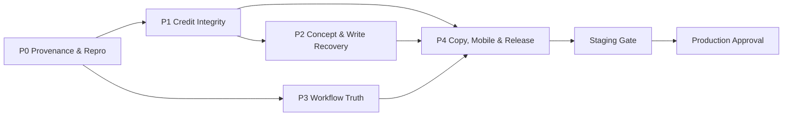

# Narraza Public Beta UX Hardening Implementation Plan

> **For agentic workers:** REQUIRED SUB-SKILL: use `superpowers:subagent-driven-development` (recommended) or `superpowers:executing-plans` to execute this plan task-by-task. Track progress by changing each checkbox from `- [ ]` to `- [x]` only after its verification command passes.

**Goal:** Menutup blocker kepercayaan pengguna pemula agar alur akun baru → ide → konsep → fondasi → outline → daftar adegan → mulai menulis dapat diselesaikan tanpa kehilangan proyek, kehilangan kredit, status palsu, atau pesan teknis.

**Architecture:** Kerjakan sebagai lima paket perubahan terintegrasi, bukan sebelas branch yang saling bertabrakan. Mulai dari provenance produksi dan reproduksi deterministik, lalu bangun lifecycle generasi dan kredit yang idempoten tanpa menahan transaksi database selama panggilan AI. Setelah fondasi itu stabil, perbaiki alur menulis, workflow truth, copy/error, mobile, signup, dan release gate.

**Tech Stack:** TypeScript, React 18, React Router 6, Hono, Supabase/Postgres, Cloudflare Workers/Node runtime, OpenRouter, Playwright, PowerShell smoke scripts.

---

## 0. Status dokumen dan sumber kebenaran

Dokumen ini menggantikan versi lama `narraza-ux-fix-plan.md` sebagai rencana eksekusi UX public-beta hardening.

Sumber temuan:

- `narraza-ux-review-gabungan.md`
- observasi black-box produksi tanggal 22 Juni 2026;
- source branch aktif saat plan ini disusun;
- migration dan test yang benar-benar ada di repository.

Urutan sumber kebenaran saat implementasi:

```text
1. Commit SHA dan environment yang benar-benar terdeploy
2. Migration yang benar-benar terpasang pada database target
3. Source pada release base yang disepakati
4. Contract/integration/E2E test pada release base tersebut
5. Dokumen audit dan sprint historis
```

### 0.1 Temuan drift yang wajib dihormati

Review produksi dan source branch saat ini tidak sepenuhnya sama:

- produksi menampilkan biaya konsep `1.000 kredit`, sedangkan `apps/api/src/services/concept.ts` pada source saat plan ini disusun memakai biaya `3`;
- produksi gagal membuat daftar adegan dengan pesan format AI, sedangkan `apps/api/src/services/chapter-beat.ts` pada source saat ini membuat beat deterministik;
- source saat ini sudah mencoba debit/refund, tetapi produksi tetap memperlihatkan gejala saldo berkurang setelah kegagalan;
- source saat ini memiliki hardening long-fiction yang belum tentu sudah masuk release produksi.

Konsekuensinya:

> Agen dilarang memulai perubahan bisnis sebelum membuktikan commit, konfigurasi, migration, dan jalur runtime yang menghasilkan bug. “Source saat ini terlihat benar” bukan bukti bahwa produksi benar.

### 0.2 Batas scope

Termasuk:

- integritas kredit dan idempotensi generasi;
- konsep, daftar adegan, dan entry ke Ruang Tulis;
- sinkronisasi saldo;
- visibilitas proyek intake;
- workflow status dan penguncian;
- copy internal, jargon, error/404;
- signup dan mobile 390×844;
- release gate produksi.

Tidak termasuk:

- mengubah harga atau jumlah kredit aksi;
- membuat sistem billing baru;
- mengubah arsitektur long-fiction, RAG, validator, atau reveal system yang tidak diperlukan untuk menutup temuan UX;
- membuka outline/fondasi lama secara destruktif;
- mengarang kebijakan privasi tanpa persetujuan owner.

---

## 1. Definisi keberhasilan pengguna

Release dianggap berhasil bila pengguna baru dapat:

1. membuat akun dan masuk;
2. memilih “Aku punya ide kasar”;
3. membuat proyek yang langsung menjadi proyek aktif;
4. mengirim intake dan memahami kapan informasi sudah cukup;
5. membuat tiga konsep tanpa double-charge atau saldo hilang saat gagal;
6. kembali ke dashboard dan menemukan proyek tersebut;
7. memilih konsep, meninjau fondasi, dan memahami konsekuensi penguncian;
8. meninjau serta mengunci outline melalui dialog konfirmasi;
9. membuka Ruang Tulis yang menjelaskan bab aktif dan tindakan berikutnya;
10. membuat daftar adegan dengan jalur yang reliabel;
11. mulai menulis atau meminta AI menulis dengan biaya yang terlihat sebelum aksi;
12. melihat saldo yang sama di header, Settings, dan panel aksi;
13. melakukan seluruh alur pada desktop dan viewport 390×844.

Tidak boleh ada:

- artefak berhasil dibuat tetapi tidak dapat ditemukan;
- debit ganda untuk idempotency key yang sama;
- saldo berkurang permanen untuk generasi gagal;
- retry yang ambigu apakah berbayar;
- teks `Sprint`, `stub`, `planner-only`, `via API`, `display-only`, `billing`, nama model, prompt, atau metadata internal pada UI produksi;
- label “sedang ditulis” sebelum ada isi tulisan;
- penguncian final tanpa konfirmasi.

---

## 2. Strategi branch, PR, dan dependensi

Jangan membuat satu branch per temuan. Gunakan satu release base dan lima paket PR.

### 2.1 Menetapkan release base

Pada awal eksekusi:

```powershell
git status --short
git rev-parse --abbrev-ref HEAD
git rev-parse HEAD
git log -5 --oneline --decorate
```

Catat hasilnya di `docs/ux-hardening/00-baseline-and-provenance.md`.

Release owner harus memilih satu base yang sudah memuat hardening yang memang akan ikut rilis. Jika `codex/long-fiction-hardening-v2` belum masuk `main`, jangan otomatis membuat semua branch dari `main`.

### 2.2 Paket PR

| Paket | Branch yang disarankan | Isi | Dependensi |
|---|---|---|---|
| P0 | `codex/ux-baseline-provenance` | provenance, reproduksi, test merah, evidence awal | release base |
| P1 | `codex/ux-credit-generation-integrity` | reservation/capture/release, idempotensi, saldo tunggal | P0 |
| P2 | `codex/ux-write-concept-recovery` | konsep, daftar adegan, empty/error/loading state | P1 |
| P3 | `codex/ux-workflow-truth` | proyek aktif, dashboard, fondasi, locking | P0; dapat paralel dengan P1/P2 |
| P4 | `codex/ux-copy-mobile-release` | internal copy, 404, jargon, privacy gate, mobile/signup, release gate | P1–P3 |

Aturan:

- Setiap paket boleh berisi beberapa commit kecil, tetapi hanya satu tanggung jawab utama.
- Jangan deploy produksi per commit.
- Merge ke integration branch setelah test paket lulus.
- Deploy staging hanya setelah P1–P4 terintegrasi.
- Deploy produksi memerlukan release evidence dan approval owner.



---

## 3. P0 — Provenance, environment parity, dan reproduksi

**Tujuan:** memastikan agen memperbaiki jalur yang benar dan memiliki test yang gagal sebelum mengubah implementasi.

### Task P0.1 — Tambahkan release provenance yang aman

**Files:**

- Modify: `apps/api/src/env.ts`
- Modify: `apps/api/src/node-bindings.ts`
- Modify: `apps/api/src/routes/health.ts`
- Modify: `apps/api/wrangler.toml`
- Modify: `scripts/build-production-web.ps1`
- Modify: `scripts/operator-production-api-web-deploy.ps1`
- Create: `apps/api/scripts/release-provenance-contract.test.mts`
- Create: `docs/ux-hardening/00-baseline-and-provenance.md`

- [ ] Tambahkan safe fields berikut ke `/api/health`:

```ts
release: {
  commitSha: string;
  builtAt: string;
  schemaTarget: string;
}
```

- [ ] Nilai berasal dari environment deploy, bukan hardcoded.
- [ ] Jangan mengekspos branch name, secret, URL database, API key, atau service-role key.
- [ ] Tambahkan commit SHA web ke build metadata agar screenshot/log dapat dikaitkan dengan artefak web.
- [ ] Jalankan contract test:

```powershell
npx tsx apps/api/scripts/release-provenance-contract.test.mts
```

Expected: PASS; field release hadir dan tidak mengandung key sensitif.

- [ ] Jalankan:

```powershell
npm run typecheck
npm run build:api
npm run build:web
```

Expected: seluruh command exit code 0.

### Task P0.2 — Verifikasi target produksi yang direview

**Files:**

- Create: `scripts/ux-public-beta-provenance.ps1`
- Modify: `docs/ux-hardening/00-baseline-and-provenance.md`

- [ ] Script membaca:
  - `/api/health`;
  - versi web yang sedang dilayani;
  - daftar migration target yang diharapkan;
  - safe AI flags;
  - safe credit flags.
- [ ] Script tidak mencetak token, cookie, email, atau payload cerita.
- [ ] Catat apakah commit produksi sama dengan release base.
- [ ] Jika tidak sama, reproduksi dilakukan pada commit produksi dan fix dilakukan pada release base dengan regression test yang sama.

Run:

```powershell
powershell -ExecutionPolicy Bypass -File scripts/ux-public-beta-provenance.ps1
```

Expected: laporan eksplisit `MATCH` atau `DRIFT`; bukan asumsi.

### Task P0.3 — Buat akun dan proyek uji terisolasi

**Files:**

- Create: `scripts/ux-public-beta-seed-test-user.ps1`
- Create: `docs/ux-hardening/01-reproduction.md`

- [ ] Jangan memakai akun founder bersama untuk reproduksi.
- [ ] Gunakan akun uji khusus environment.
- [ ] Gunakan `scripts/grant-credits-operator.ps1` untuk kredit awal; jangan mengubah saldo langsung dari browser.
- [ ] Catat saldo awal, project ID, commit SHA, environment, dan waktu reproduksi.
- [ ] Hapus atau arsipkan proyek uji setelah evidence dikumpulkan; jangan menghapus data produksi pengguna lain.

### Task P0.4 — Reproduksi tiga blocker sebagai test merah

**Files:**

- Create: `apps/api/scripts/ux-generation-credit-regression.test.mts`
- Create: `apps/web/e2e/ux-concept-credit-integrity.spec.ts`
- Create: `apps/web/e2e/ux-write-entry.spec.ts`
- Modify: `docs/ux-hardening/01-reproduction.md`

Test wajib:

1. model timeout;
2. output model invalid;
3. persist output gagal;
4. refresh saat request berjalan;
5. dua request dengan idempotency key sama;
6. dua request berbeda secara bersamaan;
7. konsep gagal tidak meninggalkan tiga kartu parsial;
8. daftar adegan gagal tidak mengubah dashboard menjadi “sedang ditulis”;
9. saldo header sama dengan endpoint balance setelah setiap kondisi.

Run:

```powershell
npx tsx apps/api/scripts/ux-generation-credit-regression.test.mts
npm --workspace apps/web run test:e2e -- e2e/ux-concept-credit-integrity.spec.ts
npm --workspace apps/web run test:e2e -- e2e/ux-write-entry.spec.ts
```

Expected sebelum fix: minimal satu assertion gagal untuk setiap blocker yang direproduksi.

### Exit gate P0

P0 selesai hanya jika:

- commit produksi diketahui;
- drift source/production tercatat;
- jalur debit dan refund yang benar telah diidentifikasi;
- kedua mode kegagalan Ruang Tulis telah dipetakan ke service yang benar;
- regression test merah tersedia;
- tidak ada perubahan harga.

---

## 4. P1 — Integritas lifecycle generasi dan kredit

**Tujuan:** tidak ada double-charge, debit permanen pada kegagalan, atau saldo UI yang berbeda-beda.

### 4.1 Keputusan arsitektur kredit

Jangan menjalankan panggilan AI di dalam transaksi database.

Gunakan state machine:

```text
attempt pending
  → credit reserved
  → attempt running
  → provider/model call
  → output validated
  → output persisted
  → reservation captured
  → attempt succeeded

setiap kegagalan sebelum capture
  → reservation released
  → attempt failed
```

Definisi saldo:

```text
ledger balance   = kredit yang benar-benar dimiliki
reserved credits = kredit untuk request aktif dan belum ditagih
available balance = ledger balance - reserved credits
```

UI boleh menampilkan “sedang diproses”, tetapi tidak boleh menyebut kredit “terpakai” sebelum capture.

### Task P1.1 — Tambahkan reservation schema dan RPC atomik

**Files:**

- Create: `supabase/migrations/00025_generation_credit_reservations.sql`
- Modify: `packages/shared/src/enums.ts`
- Modify: `packages/shared/src/domain.ts`
- Modify: `packages/shared/src/api.ts`
- Create: `apps/api/scripts/generation-credit-reservation-contract.test.mts`

Schema minimum:

```text
credit_reservations
  id
  user_id
  project_id
  attempt_id
  idempotency_key
  amount
  status: reserved | captured | released | expired
  expires_at
  captured_at
  released_at
  release_reason
  created_at
  updated_at
```

Constraints:

- unique `(user_id, idempotency_key)`;
- unique `attempt_id`;
- amount > 0;
- hanya service role yang dapat mutate;
- user hanya dapat membaca reservasi miliknya jika endpoint memang memerlukannya;
- reservation expired tidak mengurangi available balance;
- ledger tetap append-only.

Tambahkan `generation_attempt_id` nullable pada artefak AI yang dapat dibuat sebelum capture:

```text
intake_messages
story_concepts
ai_proposals
outline_plans
chapter_prose_versions
publish_packages
```

Aturan visibilitas:

- row lama dengan `generation_attempt_id IS NULL` tetap terbaca untuk compatibility;
- row baru yang memiliki attempt hanya boleh tampil di endpoint pengguna setelah attempt `succeeded`;
- output dari attempt `running`, `failed`, atau `finalization_pending` tidak boleh muncul sebagai hasil jadi;
- cleanup row tersembunyi boleh asynchronous, tetapi tidak boleh menjadi syarat agar saldo pulih.

RPC yang harus atomik:

```text
reserve_generation_credit
capture_generation_credit
release_generation_credit
```

Perilaku:

- `reserve` mengunci row balance dan menolak bila available balance tidak cukup;
- replay key yang sama mengembalikan reservation yang sama;
- `capture` mengurangi balance, menambah monthly_used, menulis satu debit ledger, lalu menandai captured;
- `release` tidak mengubah balance dan aman dipanggil berulang;
- capture/release kedua tidak menciptakan ledger tambahan;
- reservation expired tidak dapat di-capture tanpa recovery eksplisit.

Run:

```powershell
npx tsx apps/api/scripts/generation-credit-reservation-contract.test.mts
```

Expected: seluruh lifecycle, concurrency, dan replay assertion PASS.

### Task P1.2 — Buat orchestrator generasi bersama

**Files:**

- Create: `apps/api/src/services/generation-orchestrator.ts`
- Modify: `apps/api/src/services/generation-attempt.ts`
- Modify: `apps/api/src/services/credit-ledger.ts`
- Modify: `apps/api/src/services/credit.ts`
- Create: `apps/api/scripts/generation-orchestrator-contract.test.mts`

Kontrak service:

```ts
type GenerationExecutionResult<T> = {
  output: T;
  attempt: GenerationAttempt;
  creditBalance: CreditBalance;
  idempotentReplay: boolean;
};
```

Orchestrator harus:

- menerima idempotency key dari caller;
- membuat atau me-replay `generation_attempt`;
- membuat reservation sebelum provider call;
- menjalankan provider di luar transaksi DB;
- memvalidasi output sebelum persist;
- persist output dalam state tersembunyi yang terhubung ke attempt;
- capture hanya setelah persist tersembunyi berhasil;
- menandai attempt succeeded sebelum output dianggap visible;
- release pada timeout, invalid output, provider error, dan persist error;
- menyimpan hanya `errorMessageSafe`;
- mengembalikan correlation ID pada response header/log;
- tidak menghapus row ledger sebagai compensation.

Error code publik:

```text
GENERATION_TIMEOUT
GENERATION_INVALID_OUTPUT
GENERATION_BUSY
GENERATION_FAILED
GENERATION_FINALIZATION_PENDING
INSUFFICIENT_CREDIT
```

Pesan provider, nama model, stack trace, prompt, dan raw output tidak boleh masuk response.

Jika persist berhasil tetapi capture gagal:

- attempt tetap tidak sukses;
- output tetap tersembunyi;
- response memakai `GENERATION_FINALIZATION_PENDING`;
- retry dengan idempotency key sama hanya mencoba finalization, bukan memanggil model lagi;
- operator alert dibuat untuk capture failure;
- pengguna tidak diminta membayar atau memulai generasi baru.

Run:

```powershell
npx tsx apps/api/scripts/generation-orchestrator-contract.test.mts
```

Expected: PASS untuk success, timeout, invalid output, persist failure, replay, concurrency, dan release.

### Task P1.3 — Migrasikan semua jalur generasi berbayar

**Files:**

- Modify: `apps/api/src/services/intake.ts`
- Modify: `apps/api/src/services/concept.ts`
- Modify: `apps/api/src/services/foundation-proposal.ts`
- Modify: `apps/api/src/services/outline-generator.ts`
- Modify: `apps/api/src/services/prose-beat-generation.ts`
- Modify: `apps/api/src/services/prose-rewrite-generation.ts`
- Modify: `apps/api/src/services/publish-copy-ai-generation.ts`
- Modify: `apps/api/src/services/ai-credit-policy.ts`
- Modify: `apps/api/src/routes/concepts.ts`
- Modify: `apps/api/src/routes/ai.ts`

Rules:

- Harga tetap dibaca dari policy server yang sudah disetujui owner.
- Jangan hardcode harga baru di UI atau service.
- Hentikan alias generation type yang menyesatkan bila migration target sudah mendukung tipe yang benar.
- Backend-generated random idempotency key tidak boleh dipakai untuk aksi yang harus survive refresh.
- Response sukses menyertakan balance terbaru.
- Response gagal sebelum capture menyertakan safe status bahwa kredit tidak terpakai.

Test:

```powershell
npx tsx apps/api/scripts/ux-generation-credit-regression.test.mts
npm run smoke:api:sprint8
npm run smoke:api:sprint9
```

Expected: seluruh test PASS; ledger debit hanya muncul pada output sukses.

### Task P1.4 — Satu sumber kebenaran saldo di web

**Files:**

- Create: `apps/web/src/context/CreditBalanceContext.tsx`
- Modify: `apps/web/src/App.tsx`
- Modify: `apps/web/src/hooks/useCreditBalance.ts`
- Modify: `apps/web/src/components/layout/CreditIndicator.tsx`
- Modify: `apps/web/src/hooks/useDashboardData.ts`
- Modify: `apps/web/src/hooks/useSettingsData.ts`
- Modify: `apps/web/src/hooks/useWriteRoomData.ts`
- Modify: `apps/web/src/hooks/usePublishData.ts`
- Modify: `apps/web/src/services/credits.ts`
- Create: `apps/web/e2e/ux-credit-sync.spec.ts`

Provider minimum:

```ts
interface CreditBalanceContextValue {
  creditBalance: CreditBalance | null;
  availableBalance: number | null;
  reservedCredits: number;
  loading: boolean;
  error: string | null;
  refresh: () => Promise<void>;
  applyServerBalance: (balance: CreditBalance) => void;
}
```

Rules:

- Header, dashboard, Settings, Write, dan Publish membaca provider yang sama.
- API balance mengembalikan `balance`, `reservedCredits`, dan `availableBalance`.
- Guard aksi baru memakai `availableBalance`, bukan ledger balance mentah.
- Response generasi sukses memanggil `applyServerBalance`.
- Response error/finalization memanggil `refresh`.
- Jangan menghitung saldo lokal dengan `balance - cost` bila server balance tidak tersedia.
- Hilangkan fallback mock pada build produksi.
- “Pemakaian Bulan Ini” hanya tampil bila backend mengembalikan angka yang benar.

Run:

```powershell
npm --workspace apps/web run test:e2e -- e2e/ux-credit-sync.spec.ts
npm run smoke:web:credit-ui
```

Expected: header, dashboard, dan Settings selalu sama tanpa reload manual.

### Exit gate P1

- Semua regression test P0 hijau.
- Tidak ada debit pada output gagal.
- Idempotency replay tidak membuat output/debit kedua.
- Saldo sinkron di seluruh UI.
- Reservation yang expired tidak mengunci kredit selamanya.
- Tidak ada transaksi DB yang terbuka selama provider call.

---

## 5. P2 — Pemulihan alur konsep dan Ruang Tulis

**Tujuan:** pengguna selalu mendapat state yang dapat dipahami dan dapat mencapai editor.

### 5.1 Keputusan produk untuk daftar adegan beta

Untuk public beta hardening:

> “Buat Daftar Adegan” adalah langkah perencanaan deterministik dan gratis yang diturunkan dari outline terkunci. AI berbayar dimulai ketika pengguna memilih “Tulis Adegan dengan AI” atau aksi AI lain yang memang memiliki credit policy.

Alasan:

- source saat ini sudah memiliki jalur deterministik di `chapter-beat.ts`;
- daftar adegan adalah prasyarat agar pengguna dapat masuk editor;
- kegagalan model pada prasyarat ini memblokir seluruh core loop;
- biaya dan retry menjadi lebih mudah dipahami.

Jangan menambahkan kembali AI scene-list generation dalam paket P2. AI scene refinement dapat dirancang sebagai fitur terpisah setelah beta stabil.

### Task P2.1 — Concepts state machine yang tahan refresh

**Files:**

- Modify: `apps/web/src/services/concepts.ts`
- Modify: `apps/web/src/hooks/useConceptsData.ts`
- Modify: `apps/web/src/pages/ConceptsPage.tsx`
- Create: `apps/web/src/lib/generation-request-key.ts`
- Modify: `apps/api/src/routes/concepts.ts`
- Modify: `apps/api/src/services/concept.ts`
- Modify: `apps/web/e2e/ux-concept-credit-integrity.spec.ts`

UI states:

```text
empty
submitting
processing
success
recoverable_error
finalization_pending
```

Rules:

- idempotency key dibuat sekali per aksi dan disimpan di `sessionStorage` per project/action;
- refresh saat processing me-replay key yang sama;
- tombol tidak kembali menjadi aksi berbayar sampai status attempt diketahui;
- loading menampilkan waktu tunggu normal, bukan progress palsu;
- setelah timeout/invalid output, tampil:
  - pesan manusia;
  - “Kredit tidak terpakai” bila reservation sudah released;
  - tombol “Coba lagi” yang membuat attempt baru;
- konsep sukses langsung muncul tanpa refresh.

Copy minimum:

```text
Sedang menyiapkan 3 arah cerita. Biasanya membutuhkan kurang dari 1 menit.
Anda boleh tetap di halaman ini.
```

Error:

```text
Konsep belum berhasil dibuat. Kredit Anda tidak terpakai.
[Coba lagi] [Kembali ke obrolan]
```

Run:

```powershell
npm --workspace apps/web run test:e2e -- e2e/ux-concept-credit-integrity.spec.ts
```

Expected: success, timeout, refresh, retry, dan replay PASS.

### Task P2.2 — Ganti beat stub generik dengan planner deterministik berbasis outline

**Files:**

- Modify: `apps/api/src/services/chapter-beat.ts`
- Modify: `apps/api/src/services/write-session.ts`
- Modify: `apps/api/src/services/write-snapshot.ts`
- Create: `apps/api/scripts/chapter-beat-planner-contract.test.mts`

Planner menggunakan:

- judul bab;
- ringkasan;
- fungsi bab;
- arah emosi;
- hook akhir;
- mini victory bila ada.

Output:

- 3–5 adegan;
- urutan stabil;
- setiap adegan punya tujuan, ringkasan, arah emosi, dan target kata;
- tidak memakai model AI;
- tidak menulis credit ledger;
- tidak menyimpan marker `stub`, `deterministic`, atau sprint note yang dapat tampil di UI.

Run:

```powershell
npx tsx apps/api/scripts/chapter-beat-planner-contract.test.mts
```

Expected: output relevan terhadap outline, stabil, dan tidak berbayar.

### Task P2.3 — Empty state Ruang Tulis yang terpandu

**Files:**

- Modify: `apps/web/src/pages/WritePage.tsx`
- Modify: `apps/web/src/hooks/useWriteRoomData.ts`
- Modify: `apps/web/src/components/writer/WriterMobileLayout.tsx`
- Modify: `apps/web/src/components/writer/WriterAssistantPanel.tsx`
- Modify: `apps/web/e2e/ux-write-entry.spec.ts`

Empty state harus menunjukkan:

- `Bab 1: <judul>`;
- tujuan/ringkasan bab;
- penjelasan “Daftar Adegan membagi bab menjadi beberapa bagian kecil yang bisa Anda tulis satu per satu”;
- label `Gratis — tidak memakai kredit`;
- informasi hasil dapat diedit;
- satu CTA utama `Buat Daftar Adegan`;
- link sekunder `Kembali tinjau outline`.

Loading:

```text
Menyiapkan daftar adegan…
```

Success:

```text
Daftar adegan siap. Pilih adegan pertama untuk mulai menulis.
```

Error:

```text
Daftar adegan belum berhasil dibuat. Tidak ada kredit yang terpakai.
[Coba lagi] [Kembali ke outline]
```

Jangan tampilkan `beat`, format schema, provider error, atau metadata.

Run:

```powershell
npm --workspace apps/web run test:e2e -- e2e/ux-write-entry.spec.ts
npm run smoke:web:write
npm run smoke:web:write-ai
```

Expected: pengguna mencapai editor dan dapat memilih adegan pertama.

### Task P2.4 — Bedakan “rencana adegan” dan “tulis dengan AI”

**Files:**

- Modify: `apps/web/src/components/writer/WriterAssistantPanel.tsx`
- Modify: `apps/web/src/components/writer/WriterMobileCheckSheet.tsx`
- Modify: `apps/web/src/services/ai.ts`
- Modify: `apps/web/src/hooks/useWriteRoomData.ts`

Rules:

- `Buat Daftar Adegan`: gratis, deterministic.
- `Tulis Adegan dengan AI`: berbayar, harga terlihat sebelum klik.
- `Perbaiki dengan AI`: berbayar, harga terlihat sebelum klik.
- `Simpan tulisan`: gratis.
- setiap CTA menjelaskan hasilnya dapat diedit.

### Exit gate P2

- Konsep sukses tampil tanpa refresh.
- Konsep gagal dapat di-retry tanpa debit gagal.
- Daftar adegan selalu dapat dibuat dari outline valid tanpa provider AI.
- Ruang Tulis tidak pernah kosong tanpa konteks.
- Happy path mencapai editor dalam E2E.

---

## 6. P3 — Workflow truth, proyek aktif, dan penguncian aman

**Tujuan:** status dan navigasi selalu mencerminkan kondisi nyata.

### Task P3.1 — Proyek baru langsung aktif dan selalu dapat ditemukan

**Files:**

- Create: `supabase/migrations/00026_project_activation_and_progress.sql`
- Modify: `apps/api/src/services/project.ts`
- Modify: `apps/web/src/pages/StartProjectPage.tsx`
- Modify: `apps/web/src/services/projects.ts`
- Modify: `apps/web/src/hooks/useActiveProject.ts`
- Modify: `apps/web/src/hooks/useDashboardData.ts`
- Create: `apps/web/e2e/ux-project-visibility.spec.ts`

Perilaku:

- membuat proyek baru menonaktifkan proyek aktif sebelumnya dan mengaktifkan proyek baru secara atomik;
- route project baru, sidebar, dan dashboard menunjuk project ID yang sama;
- proyek intake tampil di daftar dengan label `Tahap: Obrolan ide`;
- CTA proyek intake adalah `Lanjutkan obrolan`;
- proyek tidak hilang hanya karena belum punya konsep/fondasi.

Jangan mengubah soft-archive menjadi hard delete.

Run:

```powershell
npm --workspace apps/web run test:e2e -- e2e/ux-project-visibility.spec.ts
```

Expected: create → dashboard → reopen project PASS.

### Task P3.2 — Definisikan status bab dari artefak nyata

**Files:**

- Create: `apps/api/src/services/project-progress.ts`
- Modify: `apps/api/src/services/project.ts`
- Modify: `packages/shared/src/domain.ts`
- Modify: `apps/web/src/lib/workflow-truth.ts`
- Modify: `apps/web/src/lib/api-mappers.ts`
- Create: `apps/api/scripts/project-progress-contract.test.mts`
- Create: `apps/web/e2e/ux-dashboard-status.spec.ts`

Status:

```text
outline_locked + belum ada session  → Siap mulai Bab 1
session ada + belum ada beats       → Menyiapkan rencana Bab 1
beats ada + belum ada prose         → Rencana Bab 1 siap
prose word count > 0                → Bab 1 sedang ditulis
summary approved                    → Bab 1 selesai
```

Jangan menggunakan `currentChapter > 0` sebagai bukti bahwa tulisan sudah ada.

Run:

```powershell
npx tsx apps/api/scripts/project-progress-contract.test.mts
npm --workspace apps/web run test:e2e -- e2e/ux-dashboard-status.spec.ts
```

Expected: setiap fixture menghasilkan satu label yang benar.

### Task P3.3 — Rekonsiliasi status Fondasi

**Files:**

- Modify: `apps/api/src/services/foundation-readiness.ts`
- Modify: `apps/api/src/services/foundation-lock.ts`
- Modify: `apps/web/src/hooks/useFoundationFlow.ts`
- Modify: `apps/web/src/pages/FoundationPage.tsx`
- Modify: `apps/web/src/lib/api-mappers.ts`
- Create: `apps/web/e2e/ux-foundation-truth.spec.ts`

Rules:

- sebelum data selesai load, tampil skeleton; jangan render 0%;
- bila load gagal, tampil error + retry; jangan render fondasi kosong seolah data nyata;
- bila fondasi terkunci, `isLocked` adalah status utama;
- bagian opsional boleh kosong, tetapi tidak boleh disertai copy “lengkapi sebelum mengunci” setelah terkunci;
- `canLock`, `missing`, dan readiness berasal dari backend;
- proposal duplikat didedupe berdasarkan ID dan semantic key yang stabil.

### Task P3.4 — Dialog konfirmasi penguncian

**Files:**

- Create: `apps/web/src/components/ui/ConfirmDialog.tsx`
- Modify: `apps/web/src/components/ui/index.ts`
- Modify: `apps/web/src/components/outline/OutlineWorkflowActions.tsx`
- Modify: `apps/web/src/components/foundation/FoundationLockCta.tsx`
- Modify: `apps/web/src/hooks/useOutlineData.ts`
- Modify: `apps/web/src/hooks/useFoundationFlow.ts`
- Modify: `apps/web/e2e/sprint4-outline-flow.spec.ts`
- Create: `apps/web/e2e/ux-lock-confirmation.spec.ts`

Dialog outline:

```text
Kunci rencana bab?
Setelah dikunci, rencana bab ini tidak bisa diedit dari alur saat ini.
Pastikan judul, urutan, dan arah konflik sudah sesuai.

[Kembali meninjau] [Ya, kunci outline]
```

Dialog fondasi:

```text
Kunci fondasi cerita?
Fondasi akan menjadi acuan karakter, konflik, dan outline.
Periksa kembali bagian penting sebelum melanjutkan.

[Kembali meninjau] [Ya, kunci fondasi]
```

Rules:

- fokus keyboard masuk ke dialog;
- `Escape` dan tombol batal menutup dialog;
- aksi final tidak berjalan sebelum konfirmasi;
- setelah sukses, CTA dan navigasi berubah tanpa reload;
- tombol `Setujui` dan `Kunci` tidak tampil sebagai dua aksi setara pada saat yang sama;
- jangan implementasikan destructive unlock dalam paket ini.

Jika revisi fondasi/outline terkunci diperlukan, desain versioning terpisah. Jangan mengubah artefak yang sudah menjadi dasar bab secara in-place.

### Task P3.5 — Intake memberi sinyal “cukup untuk lanjut”

**Files:**

- Modify: `apps/api/src/services/intake.ts`
- Modify: `packages/shared/src/domain.ts`
- Modify: `apps/web/src/hooks/useIntakeData.ts`
- Modify: `apps/web/src/components/intake/IntakeProgressCard.tsx`
- Modify: `apps/web/src/components/intake/DetectedSignalsPanel.tsx`
- Create: `apps/web/e2e/ux-intake-readiness.spec.ts`

Backend response harus menyediakan:

```ts
{
  progressPercent: number;
  canAdvance: boolean;
  missingSignals: string[];
}
```

UI:

- sebelum cukup: jelaskan satu informasi berikutnya yang paling berguna;
- setelah cukup: tampil `Ide Anda sudah cukup untuk membuat pilihan konsep`;
- CTA utama menjadi lebih menonjol;
- chip terdeteksi dan daftar detail tidak boleh saling bertentangan;
- pengguna tetap boleh lanjut lebih awal setelah acknowledgement, tetapi UI menjelaskan kemungkinan hasil kurang spesifik.

### Exit gate P3

- Project intake dapat ditemukan kembali.
- Sidebar, dashboard, dan route menunjuk proyek yang sama.
- Dashboard tidak mengklaim tulisan ada sebelum prose ada.
- Fondasi tidak flash 0% atau memberi instruksi kontradiktif.
- Semua penguncian membutuhkan konfirmasi.

---

## 7. P4 — Copy, error, privacy gate, mobile, signup, dan release

**Tujuan:** menghilangkan bahasa internal dan membuktikan alur pada pengguna baru serta mobile.

### Task P4.1 — Hapus seluruh copy internal

**Files:**

- Modify: `apps/api/src/services/outline-generator.ts`
- Modify: `apps/web/src/lib/api-mappers.ts`
- Modify: `apps/web/src/mocks/settings.ts`
- Modify: `apps/web/src/pages/SettingsPage.tsx`
- Create: `apps/api/scripts/no-user-facing-internal-copy.test.mts`
- Create: `apps/web/e2e/ux-no-internal-copy.spec.ts`

Scan minimum:

```text
Sprint
stub
deterministic
planner-only
not prose
via API
display-only
billing
development placeholder marker
mock
OpenRouter
prompt
token
credit_ledger
generation_attempt
```

Catatan:

- beberapa kata boleh tetap ada dalam source/log/test;
- test harus memeriksa response publik dan DOM produksi, bukan melarang seluruh repository;
- field internal tetap boleh ada di backend telemetry bila tidak dikirim ke browser.

Run:

```powershell
npx tsx apps/api/scripts/no-user-facing-internal-copy.test.mts
npm --workspace apps/web run test:e2e -- e2e/ux-no-internal-copy.spec.ts
```

### Task P4.2 — Bahasa pemula, bukan glossary besar

**Files:**

- Modify: `apps/homepage/index.html`
- Modify: `apps/web/src/components/outline/OutlineChapterBadge.tsx`
- Modify: `apps/web/src/components/outline/OutlineChapterCard.tsx`
- Modify: `apps/web/src/components/outline/OutlinePageHeader.tsx`
- Modify: `apps/web/src/components/outline/OutlineTrackingPanels.tsx`
- Modify: `apps/web/src/components/writer/WriterAssistantPanel.tsx`
- Modify: `apps/web/src/components/writer/WriterBeatList.tsx`
- Modify: `apps/web/src/components/writer/WriterMobileCheckSheet.tsx`
- Modify: `apps/web/src/components/writer/WriterMobileLayout.tsx`
- Modify: `apps/web/src/components/foundation/FoundationPageHeader.tsx`
- Modify: `apps/web/src/components/foundation/FoundationReadinessCard.tsx`
- Modify: `apps/web/src/components/foundation/FoundationSectionCard.tsx`
- Modify: `apps/web/src/mocks/concepts.ts`
- Modify: `apps/web/src/mocks/intake.ts`
- Modify: `apps/web/src/mocks/outline.ts`
- Modify: `apps/web/src/mocks/settings.ts`
- Modify: `apps/web/src/mocks/storyFoundation.ts`
- Create: `apps/web/src/components/ui/TermHelp.tsx`

Gunakan penggantian langsung pada mode Simple:

| Istilah lama | Mode Simple |
|---|---|
| Kanon | Fakta cerita yang dikunci |
| Arc | Babak cerita |
| Beat | Adegan |
| Open Loop | Pertanyaan yang masih menggantung |
| Hook | Pemikat akhir bab |
| POV | Sudut pandang tokoh |
| Paket konteks | Ingatan cerita untuk adegan ini |
| Token | Jangan ditampilkan |

`TermHelp` hanya dipakai untuk istilah yang tetap harus dipertahankan. Jangan menambahkan tooltip pada setiap label.

### Task P4.3 — Error boundary dan 404 berbranding

**Files:**

- Create: `apps/web/src/pages/RouteErrorPage.tsx`
- Modify: `apps/web/src/routes/index.tsx`
- Create: `apps/web/e2e/ux-route-errors.spec.ts`

Page wajib:

- brand Narraza;
- pesan manusia;
- tombol `Kembali ke Dashboard`;
- tombol `Coba muat ulang` untuk error yang recoverable;
- tidak menampilkan stack trace atau “Unexpected Application Error”.

Tambahkan `errorElement` dan wildcard route.

### Task P4.4 — Privacy copy approval gate

**Files:**

- Create: `docs/ux-hardening/02-privacy-copy-approval.md`
- Modify setelah approval: `apps/homepage/index.html`

Owner harus memberi jawaban eksplisit untuk:

1. Apakah cerita digunakan untuk melatih model?
2. Siapa yang dapat mengakses cerita untuk support/operasional?
3. Bagaimana pengguna menghapus akun dan data cerita?
4. Bagaimana pengguna mengekspor naskah dan data cerita?
5. Berapa lama data/log generasi disimpan?

Agen tidak boleh mengarang jawaban. Sampai owner menyetujui wording:

- jangan menambahkan klaim absolut;
- gunakan copy faktual yang sudah dapat dibuktikan;
- tandai privacy FAQ sebagai release blocker bila marketing mengklaim hal yang belum disetujui.

### Task P4.5 — Tambahkan project Playwright mobile 390×844

**Files:**

- Modify: `apps/web/playwright.config.ts`
- Create: `apps/web/e2e/ux-mobile-core-flow.spec.ts`
- Create: `apps/web/e2e/ux-mobile-write.spec.ts`
- Create: `apps/web/e2e/ux-signup-login.spec.ts`

Project:

```ts
{
  name: "mobile-390x844",
  use: {
    ...devices["Pixel 7"],
    viewport: { width: 390, height: 844 },
  },
}
```

Mobile assertions:

- tidak ada horizontal overflow;
- CTA utama terlihat tanpa tertutup sticky element;
- sidebar dapat dibuka dan ditutup;
- textarea intake tetap dapat digunakan saat virtual-keyboard-like viewport diperkecil;
- error dan loading tidak menutupi input;
- daftar adegan dapat discroll;
- tombol AI menampilkan biaya;
- tap target utama minimal 44×44;
- heading dan body text tidak terpotong.

Signup assertions:

- daftar akun baru;
- state email-confirmation dijelaskan bila aktif;
- login berhasil;
- redirect kembali ke intended route;
- logout tidak meninggalkan data akun sebelumnya di UI;
- akun baru melihat empty dashboard yang benar.

Run:

```powershell
npm --workspace apps/web run test:e2e -- --project=mobile-390x844 e2e/ux-mobile-core-flow.spec.ts e2e/ux-mobile-write.spec.ts
npm --workspace apps/web run test:e2e -- e2e/ux-signup-login.spec.ts
```

### Task P4.6 — Release gate otomatis

**Files:**

- Create: `scripts/narraza-ux-public-beta-release-gate.ps1`
- Create: `docs/ux-hardening/RELEASE-EVIDENCE.md`
- Modify: root `package.json`

Tambahkan script:

```json
{
  "ux:release-gate": "powershell -ExecutionPolicy Bypass -File scripts/narraza-ux-public-beta-release-gate.ps1"
}
```

Gate menjalankan:

```text
npm run typecheck
npm run lint
npm run build:api
npm run build:web
API credit lifecycle contracts
API beat planner contracts
desktop UX E2E
mobile 390×844 UX E2E
signup/login E2E
no-internal-copy tests
workflow truth tests
```

Gate gagal bila test diskip karena environment wajib tidak tersedia. `SKIP` bukan `PASS`.

### Task P4.7 — Staging black-box acceptance

**Files:**

- Modify: `docs/ux-hardening/RELEASE-EVIDENCE.md`

Gunakan akun baru bersih dan ide cerita dari review awal.

Catat:

- commit SHA API dan web;
- schema target;
- saldo sebelum/sesudah setiap aksi;
- project ID;
- correlation ID untuk generasi;
- durasi konsep;
- durasi daftar adegan;
- screenshot desktop dan mobile;
- hasil refresh/retry;
- hasil kembali ke dashboard.

Acceptance:

- tidak ada kredit hilang pada request gagal;
- tidak ada proyek hilang;
- tidak ada teks internal;
- dashboard akurat;
- core flow selesai desktop dan mobile.

### Exit gate P4

- seluruh release gate hijau;
- privacy copy disetujui atau klaim yang belum disetujui tidak dipublikasikan;
- staging black-box acceptance lulus;
- provenance staging cocok dengan release candidate;
- owner menyetujui deploy produksi.

---

## 8. Matriks temuan → task

| Temuan | Task |
|---|---|
| C1 konsep gagal + kredit | P0.4, P1.1–P1.3, P2.1 |
| C2 saldo kontradiktif | P1.4 |
| C3 Ruang Tulis kosong/gagal | P2.2–P2.4 |
| C4 teks internal | P4.1 |
| C5 status fondasi kontradiktif | P3.3 |
| C6 dashboard salah | P3.2 |
| C7 jargon | P4.2 |
| C8 intake tanpa “cukup” | P3.5 |
| X1 penguncian satu klik | P3.4 |
| X2 header ≠ Settings | P1.4 |
| X3 FAQ privasi | P4.4 |
| Y1 proyek hilang | P3.1 |
| Y2 404 telanjang | P4.3 |
| Y3 fondasi flash 0% | P3.3 |
| Y4 proposal duplikat | P3.3 |
| Y5 janji refund tidak terbukti | P1.1–P1.3 |
| Mobile belum teruji | P4.5, P4.7 |
| Signup belum teruji | P4.5, P4.7 |
| Drift produksi/source | P0.1–P0.2 |

---

## 9. Verification commands per paket

### P0

```powershell
npx tsx apps/api/scripts/release-provenance-contract.test.mts
npx tsx apps/api/scripts/ux-generation-credit-regression.test.mts
npm --workspace apps/web run test:e2e -- e2e/ux-concept-credit-integrity.spec.ts e2e/ux-write-entry.spec.ts
```

### P1

```powershell
npx tsx apps/api/scripts/generation-credit-reservation-contract.test.mts
npx tsx apps/api/scripts/generation-orchestrator-contract.test.mts
npx tsx apps/api/scripts/ux-generation-credit-regression.test.mts
npm --workspace apps/web run test:e2e -- e2e/ux-credit-sync.spec.ts
```

### P2

```powershell
npx tsx apps/api/scripts/chapter-beat-planner-contract.test.mts
npm --workspace apps/web run test:e2e -- e2e/ux-concept-credit-integrity.spec.ts e2e/ux-write-entry.spec.ts
npm run smoke:web:write
npm run smoke:web:write-ai
```

### P3

```powershell
npx tsx apps/api/scripts/project-progress-contract.test.mts
npm --workspace apps/web run test:e2e -- e2e/ux-project-visibility.spec.ts e2e/ux-dashboard-status.spec.ts e2e/ux-foundation-truth.spec.ts e2e/ux-lock-confirmation.spec.ts e2e/ux-intake-readiness.spec.ts
```

### P4

```powershell
npx tsx apps/api/scripts/no-user-facing-internal-copy.test.mts
npm --workspace apps/web run test:e2e -- e2e/ux-no-internal-copy.spec.ts e2e/ux-route-errors.spec.ts e2e/ux-signup-login.spec.ts
npm --workspace apps/web run test:e2e -- --project=mobile-390x844 e2e/ux-mobile-core-flow.spec.ts e2e/ux-mobile-write.spec.ts
npm run ux:release-gate
```

### Global

```powershell
npm run typecheck
npm run lint
npm run build:api
npm run build:web
```

Expected: exit code 0; tidak ada test wajib yang skipped.

---

## 10. Definition of Done

- [ ] Provenance API/web tersedia dan release candidate dapat diidentifikasi.
- [ ] Production/source drift telah direkonsiliasi.
- [ ] Semua generasi berbayar memakai idempotency key caller dan lifecycle bersama.
- [ ] Provider call tidak berjalan di dalam transaksi database.
- [ ] Kegagalan sebelum capture tidak mengurangi ledger balance.
- [ ] Replay key sama tidak membuat output atau debit kedua.
- [ ] Saldo header, dashboard, Settings, Write, dan Publish sama.
- [ ] Proyek baru langsung aktif dan dapat ditemukan kembali.
- [ ] Concepts mempunyai loading, recovery, dan refresh behavior yang jujur.
- [ ] Daftar adegan gratis, deterministik, relevan terhadap outline, dan reliabel.
- [ ] Ruang Tulis menjelaskan bab aktif, hasil aksi, kemampuan edit, dan biaya.
- [ ] Dashboard hanya menulis “sedang ditulis” bila prose benar-benar ada.
- [ ] Fondasi tidak menampilkan status kontradiktif atau flash 0%.
- [ ] Penguncian outline/fondasi membutuhkan konfirmasi eksplisit.
- [ ] Tidak ada teks internal pada response publik atau DOM produksi.
- [ ] 404 dan route error berbranding serta memiliki jalan kembali.
- [ ] Privacy copy telah disetujui owner atau klaim yang belum disetujui tidak diterbitkan.
- [ ] Signup/login lulus dengan akun baru.
- [ ] Core flow lulus pada desktop dan 390×844.
- [ ] Staging black-box acceptance lulus dengan release SHA yang tercatat.
- [ ] `npm run ux:release-gate` exit code 0.
- [ ] Production deployment mendapat approval owner dan memiliki rollback target.

---

## 11. Rollback dan observability

Sebelum deploy produksi:

- catat previous API deploy/version;
- catat previous web deployment;
- catat migration yang additive;
- jangan membuat rollback bergantung pada down migration destruktif.

Monitor minimum setelah deploy:

```text
generation success rate per action
generation timeout rate
reservation release rate
capture failure count
orphan/expired reservation count
concept generation latency p50/p95
write entry success rate
credit balance mismatch reports
404/error boundary rate
```

Rollback segera bila:

- capture gagal berulang;
- saldo negatif atau double debit ditemukan;
- konsep/Write happy path turun dibanding staging;
- proyek baru tidak dapat ditemukan;
- error teknis kembali tampil kepada pengguna.

---

## 12. Handoff untuk agen pelaksana

Urutan kerja yang direkomendasikan:

1. jalankan P0 dan jangan menyentuh bisnis logic sebelum drift diketahui;
2. implementasikan P1 dengan TDD;
3. jalankan P2 setelah lifecycle kredit stabil;
4. jalankan P3 paralel setelah P0 bila tidak menyentuh file yang sama;
5. integrasikan P1–P3;
6. jalankan P4 dan release gate;
7. deploy staging;
8. lakukan black-box acceptance;
9. minta approval produksi.

Setiap agen wajib meninggalkan:

- commit kecil yang dapat direvert;
- test yang membuktikan bug lama dan perilaku baru;
- update checkbox plan;
- ringkasan file yang berubah;
- command dan output verifikasi;
- risiko tersisa yang faktual, bukan “seharusnya aman”.
