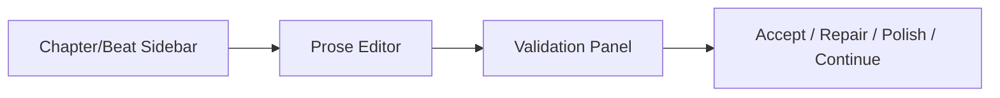

# UI_UX_FULL.md

Status: Full UI/UX product vision  
Relationship to MVP: MVP UI can be simple, but should not conflict with this direction.

---

## 1. UX Principles

1. Beginner first.
2. No prompt engineering required.
3. Plain language over technical jargon.
4. Mobile-first writing format.
5. Show progress, not complexity.
6. Advanced controls opt-in.
7. Warnings should be actionable.

---

## 2. Main Navigation

Full app navigation:

```txt
Dashboard
Project
  ├── Chat Story Agent
  ├── Fondasi Cerita
  ├── Karakter & Fakta
  ├── Jadwal Rahasia
  ├── Outline
  ├── Tulis Bab
  ├── Cek Cerita
  ├── Potensi Unlock
  ├── Publish Package
  └── Advanced Control
Usage/Billing
Settings
```

---

## 3. User-Facing Labels

| Internal | User-facing |
|---|---|
| Story Bible | Fondasi Cerita |
| Fact Registry | Fakta yang Dikunci |
| Reveal Gate | Jadwal Rahasia |
| Character Knowledge | Pengetahuan Tokoh |
| Context Packet | Bahan Aman untuk AI |
| Beat Contract | Arahan Adegan |
| Validator | Cek Otomatis |
| Canon Hallucination | Fakta Baru yang Belum Disetujui |
| Unlockability | Potensi Unlock |
| Suffering Fatigue | Tokoh Terlalu Lama Tertekan |

---

## 4. Full Screen List

### Dashboard
- Project list.
- Continue writing button.
- Usage/cost summary.
- Last edited.

### Story Intake
- Chat interface.
- Progress sidebar.
- 3 concept cards.
- Generate Story Bible button.

### Story Bible
- Simple cards.
- Lock foundation.
- Edit mode.
- Version history.

### Character & Facts
- Character cards.
- Fact list.
- Proposed facts.
- Approve/reject fact.

### Reveal Schedule
- Secret list.
- Reveal chapter.
- Safe breadcrumbs.
- Forbidden before chapter.

### Outline
- Season roadmap.
- Mini arc cards.
- Chapter list.
- Beat list.

### Writer
- Beat panel.
- Prose editor.
- Model tier selector.
- Validation panel.
- Accept/edit/repair buttons.

### Retention
- Open loops.
- Mini victories.
- Payoff schedule.
- Filler warnings.
- Unlockability score.

### Publish Package
- Title.
- Teaser.
- Caption.
- Comment bait.
- Tags.
- Next chapter teaser.

### Advanced Control
- Context Inspector.
- Pinned context.
- Prompt version.
- Model info.
- Validator override.

---

## 5. Writer Screen Layout



---

## 6. Warning UX

Use plain-language warnings.

### Blocking
```txt
Rahasia cerita bocor terlalu cepat.
```

Action:
- repair,
- remove reveal,
- update reveal schedule.

### Warning
```txt
Ending bab ini masih kurang membuat pembaca penasaran.
```

Action:
- strengthen ending,
- add clue,
- add mini victory.

### Info
```txt
Beberapa paragraf agak panjang untuk dibaca dari HP.
```

Action:
- format for mobile.

---

## 7. Model Tier UX

Show:

```txt
Hemat — draft cepat dan murah.
Seimbang — rekomendasi utama.
Terbaik — untuk bab penting.
```

Do not show raw model IDs to beginner.

Advanced can see model ID.

---

## 8. Mobile Preview

Full product should include mobile preview:
- paragraph spacing,
- scroll readability,
- chapter title,
- teaser preview.

---

## TODO
- TODO: create wireframes.
- TODO: define design system.
- TODO: choose component library.
