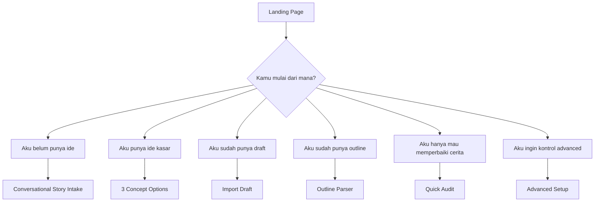
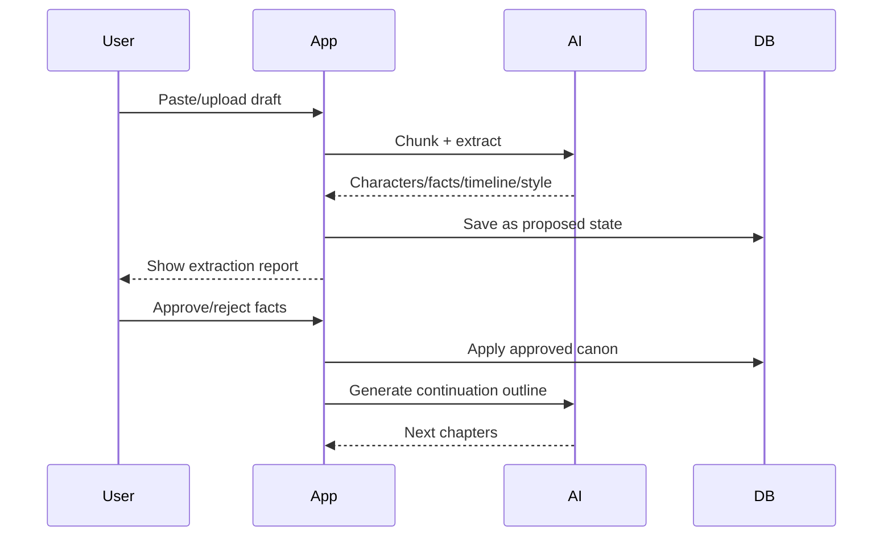

# USER_FLOWS_FULL.md

Status: Full product user flows  
Relationship to MVP: Use MVP flow first. Add these flows over time.

---

## 1. Entry Point Flow



---

## 2. Beginner Full Flow

```txt
Landing
→ Aku belum punya ide
→ AI asks simple emotional questions
→ AI detects genre/trope/conflict
→ AI creates 3 concept options
→ User selects concept
→ AI creates Story Bible
→ User reviews simple cards
→ Lock Foundation
→ AI creates season direction
→ AI creates 10-chapter outline
→ User starts Chapter 1
→ Beat Writer guides each scene
→ Validators show simple labels
→ User accepts/edits
→ Chapter closes
→ Publish package generated
```

---

## 3. Idea Owner Flow

```txt
Landing
→ Aku punya ide kasar
→ Paste idea
→ AI extracts story signals
→ AI creates 3 versions:
   1. more melodrama
   2. more romance
   3. more revenge/mystery
→ User chooses
→ Story Bible
→ Reveal Schedule
→ 10-Chapter Outline
→ Write
```

---

## 4. Existing Draft Flow



---

## 5. Advanced Writer Flow

```txt
Dashboard
→ Create project
→ Choose Advanced Mode
→ Manual Story Bible editor
→ Manual Reveal Schedule editor
→ Character Knowledge editor
→ Context Inspector
→ Pin context / override
→ Generate beat
→ Read QA report
→ Accept, repair, or override
→ Version history
```

---

## 6. Retention Optimization Flow

```txt
Chapter completed
→ Retention system analyzes chapter
→ Shows:
   - open loop strength
   - mini victory status
   - suffering fatigue
   - filler risk
   - ending hook strength
→ User clicks:
   - strengthen ending
   - add mini victory
   - add clue
   - increase tension
→ Repair Agent suggests revision
```

---

## 7. Paid SaaS Flow

```txt
User signs up
→ Gets trial credits
→ Generates Story Bible/Outline
→ Uses credits for writing
→ Credits low warning
→ User buys package/subscription
→ Payment webhook adds credits
→ Usage dashboard shows spend
```

---

## 8. Error Flows

### AI quota error
User sees:
```txt
Model sedang mencapai batas pemakaian. Coba lagi, gunakan mode Hemat, atau lanjut nanti.
```

### Reveal leak warning
User sees:
```txt
Rahasia cerita mungkin terbuka terlalu cepat. Sebaiknya ubah menjadi petunjuk kecil.
```

### Canon hallucination warning
User sees:
```txt
AI menambahkan fakta baru yang belum dikunci. Setujui sebagai fakta baru atau hapus dari teks.
```

---

## 9. Mode Switching

Beginner → Creator:
- allowed after user opens detailed editor.

Creator → Advanced:
- requires warning:
```txt
Mode Advanced memberi kontrol lebih besar, tapi perubahan bisa memengaruhi konsistensi cerita.
```

Advanced → Beginner:
- hide technical panels, preserve data.

---

## TODO
- TODO: design actual UI screens.
- TODO: create onboarding copy.
- TODO: add mobile wireframes.
